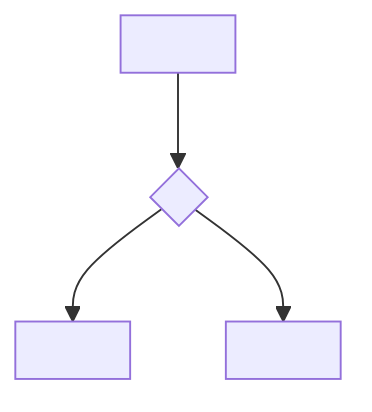

<!-- rt-kit v0.26.0 · templates/rule.md · 8a59601860bf · правится надстройкой, не здесь -->

# <What the law is about> — by which technique

Rule under the law `docs/constitution/<law>.md`. The law says what must be true; here — by which
technique it is done. What it is called in this tree and where it lies — `implementation.md`
next to it: the rule moves between repositories, the names do not.

**Cold part:** `pitfalls.md` next to it — <pitfalls and behaviour from analyses, if the rule has
them>. The line stands only at a rule that started such a file: the rest have none at all.

## What it is called here

<A table "in the law — here": the law speaks without names, the tree names its own. The edit by
which the rule is recognised stands in its `description`: the gate calls the rule by this sign.>

## Where it lives

In this tree — the table in `implementation.md` next to it. Paths live there, not here: the rule
moves between repositories, the layout does not, and a path named in the rule lies in the first
tree that holds its code differently.

## Flow

The graph shows the same course as the prose below describes: where the executor starts, where
the fork is and how each branch ends. Nodes name steps and conditions, not files: addresses live
in `implementation.md` next to it, and the graph of a portable text has no place for them.

It is edited by the same change as the prose: having diverged, both sides stay readable as
current, and the first to notice is whoever followed the graph.

## How the law applies here

Every item starts with a bold article, and every article has a line in `implementation.md` next
to it. A statement that found no place in the code is not put here: it goes as prose into the
"Pitfalls" or as an article into the law.

- **<The article in one sentence.>** <What breaks otherwise — at most two sentences.>

## What of the law is not here

<What the law demands and this tree checks with nothing. The section is read by eye and audited
by nothing — a stale untruth lives in it as long as it likes, so it is reread in full at every
edit of the rule.>

## Patterns

- `<rule-name>-<what>` — <when to use>.

There are no pitfalls here: they live in the cold part — `pitfalls.md` next to it, by the sample
of the cold part. The rule ends with the patterns.
