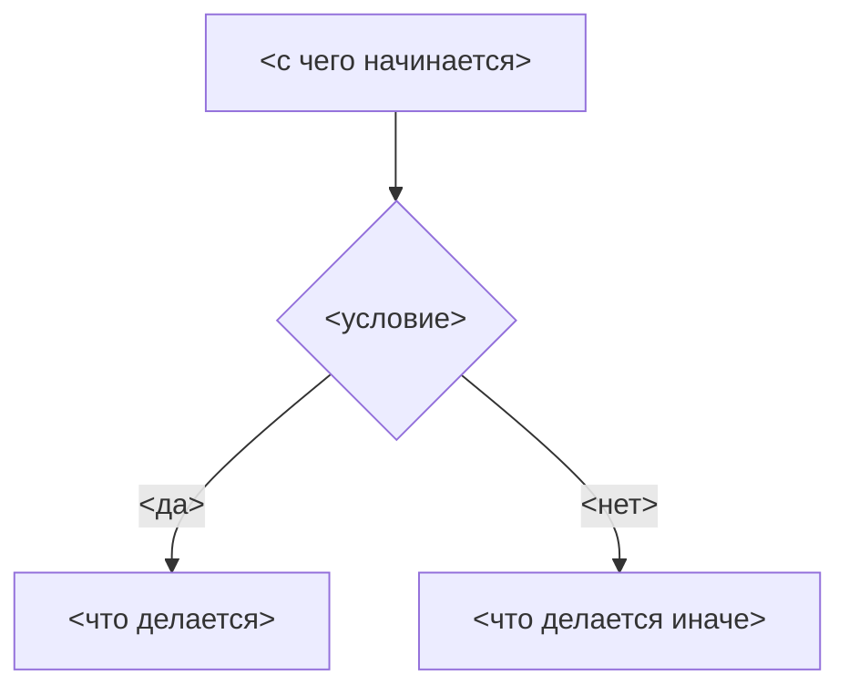

<!-- rt-kit v0.16.1 · templates/rule.md · 1fa13dac52f8 · правится надстройкой, не здесь -->

# <О чём закон> — каким приёмом

Правило под закон `docs/constitution/<закон>.md`. Закон говорит, что должно быть верно; здесь — каким
приёмом это делается. Чем это названо в этом дереве и где лежит — `implementation.md` рядом:
правило переносится между репозиториями, имена — нет.

**Холодная часть:** `pitfalls.md` рядом — <ловушки и поведение по разборам, если они у правила
есть>. Строка стоит только у правила, которое такой файл завело: у остального её нет вовсе.

## Как это называется здесь

<Таблица «в законе — здесь»: закон говорит без имён, дерево называет свои. Правка, по которой
правило узнаётся, стоит в его `description`: гейт зовёт правило по этому признаку.>

## Где это лежит

В этом дереве — таблица в `implementation.md` рядом. Пути живут там, а не здесь: правило
переносится между репозиториями, раскладка — нет, и путь, названный в правиле, врёт в первом
же дереве, которое держит код иначе.

## Ход

Граф изображает тот же ход, что описан прозой ниже: с чего исполнитель начинает, где развилка и
чем каждая ветка кончается. Узлы называют шаги и условия, а не файлы: адреса живут в
`implementation.md` рядом, и в графе переносимого текста им места нет.

Правится он тем же изменением, что и проза: разойдясь, обе стороны остаются читаемыми как
действующие, и первым это замечает тот, кто пошёл по графу.

## Как закон применяется здесь

Каждый пункт начинается жирной статьёй, и у каждой статьи есть строка в `implementation.md`
рядом. Утверждение, которому места в коде не нашлось, сюда не ставится: оно уходит прозой в
«Ловушки» или статьёй в закон.

- **<Статья одной фразой.>** <Что сломается иначе — не больше двух предложений.>

## Чего из закона здесь нет

<Что закон требует, а это дерево не проверяет ничем. Раздел читается глазами и не сверяется
ничем — устаревшая неправда живёт в нём сколько угодно, поэтому перечитывается он целиком при
каждой правке правила.>

## Паттерны

- `<имя-правила>-<что>` — <когда брать>.

Ловушек здесь нет: они живут в холодной части — `pitfalls.md` рядом, по образцу холодной
части. Правило кончается паттернами.
