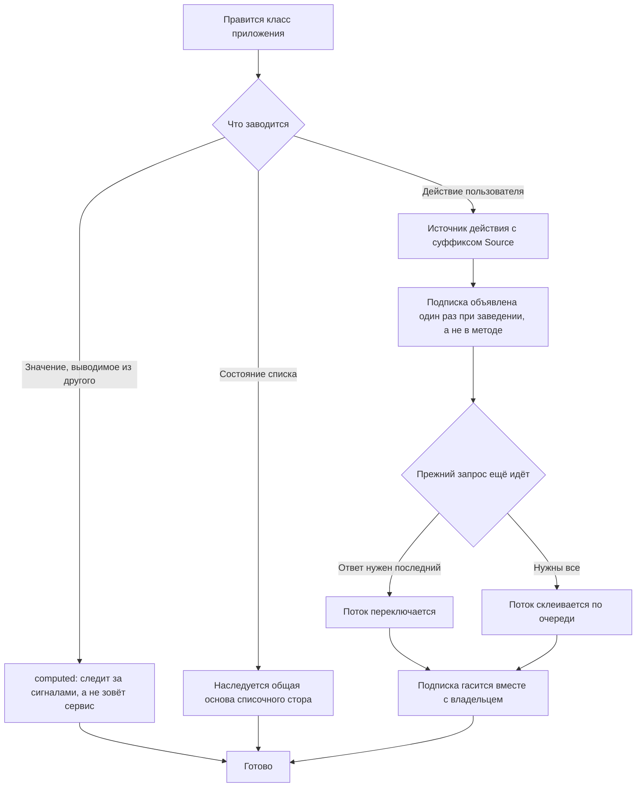

<!-- rt-kit v0.13.0 · rules/angular-patterns.md · 909964eb2fe0 · правится надстройкой, не здесь -->

# Реактивность экрана — как это устроено здесь

Правило под закон `docs/constitution/frontend-application.md`. Закон говорит, что должно быть
верно; здесь — на чём это стоит в этом дереве. Раскладка файла компонента —
`component-structure`, стили — `styling-bem`, окружение браузера — `platform-access`, слой
обращения к серверу — `api-layer`. Все пять под одним законом.

Правило про фронт: `libs/api/**` и `apps/api/**` — это NestJS, там своя среда, и ничего из
перечисленного не применяется.

## Как это называется здесь

| В законе                                | Здесь                                                                                              |
| --------------------------------------- | -------------------------------------------------------------------------------------------------- |
| состояние, которое пересчитывается само | `signal()` и `computed()`; Angular без Zone.js (`provideZonelessChangeDetection()`)                |
| вход и выход компонента                 | `input()`, `input.required()`, `output()`; `viewChild()`, `contentChild()` и их множественные пары |
| перерисовка по требованию               | `ChangeDetectionStrategy.OnPush` — на каждом компоненте                                            |
| владелец подписки                       | `takeUntilDestroyed(this.#destroyRef)`                                                             |
| источник действия                       | `Subject` с суффиксом `Source` в имени поля                                                        |

## Где это лежит

В этом дереве — таблица в `implementation.md` рядом. Пути живут там, а не здесь: правило
переносится между репозиториями, раскладка — нет, и путь, названный в правиле, врёт в первом
же дереве, которое держит код иначе.

## Ход

Ход правки класса приложения: с чего исполнитель начинает, где развилка между производным
значением и действием, и чем кончается каждая ветка.

## Как закон применяется здесь

- **Подписка объявляется один раз, а не в методе действия.** Метод толкает значение в
  источник, а долгоживущая подписка со `switchMap`, `exhaustMap` или `concatMap` объявляется в
  конструкторе, в `ngOnInit` или в инициализаторе поля.
- **Подписка гасится вместе с владельцем.** `takeUntilDestroyed` ставится в тот же поток, где
  объявлена подписка.
- **Источник действия носит суффикс `Source` в имени.** Иначе поток и значение в коде
  неотличимы, и `next` уходит не туда.
- **Вызов сервиса внутри `computed` зависимостью не становится.** Производное значение следит
  только за прочитанными сигналами, а обычный метод сигналом не является: значение остаётся
  таким, каким было в момент первого счёта. Текущий язык, текущее владение, текущий признак
  среды читаются сигналом службы — тогда производное пересобирается вместе с их сменой. Ни
  сборка, ни линтер этого не видят.
- **Списочный стор наследует общую основу.** Записи, страница, порядок, условия отбора, строка
  поиска и конфиг выборки уже там, и наследнику остаются четыре строки.

## Чего из закона здесь нет

Ни `OnPush`, ни сигнальный API входов, ни отсутствие геттеров в компонентах не проверяет
ничто: `@Input()` и геттер компилируются и работают, а расхождение видно только чтением.
Обращение к окружению браузера тоже не проверяется — это `Q-FA-1` в законе.

## Паттерны

- `angular-patterns-state` — сигналы, производные значения, состояние сервиса, подписка.

## Ловушки

- **Производное значение считается `computed`, а не эффектом.** `effect`, кладущий значение в
  сигнал, — это ручной пересчёт, и он рано или поздно отстаёт от источника.
- **Геттеров в компонентах нет.** Геттер пересчитывается на каждой перерисовке, и цена его не
  видна ни в одном месте кода.
- **Статический атрибут без значения задаёт входу пустую строку, а не умолчание.**
  `<ng-template someControl>` даёт `''`, и вход с осмысленным умолчанием молча его теряет;
  сигнальный вход с алиасом здесь ничем не отличается от `@Input()`. Вход, у которого умолчание
  что-то значит, приводит пустую строку к нему сам — `transform` или проверка в `computed`.
- **Подписка на каждый вызов метода не даёт выбрать, что делать с предыдущим запросом.**
  Быстрые нажатия дают гонку ответов, и побеждает тот, что вернулся последним, а не тот, что
  нажали последним.
- Запрет подписки в методе идёт по имени `subscribe`, а не по типу: вызов с таким именем у
  чего угодно считается подпиской, а `const fn = stream$.subscribe` без вызова — нет.
  Разрешены конструктор, `ngOnInit`, инициализатор поля и всё, что объявлено вне класса;
  запрещены остальные методы, включая приватные с `#`, геттеры и `ngAfterViewInit`.
- Инициализация DOM после первой отрисовки — `afterNextRender()`, а не `ngAfterViewInit`:
  сайт отдаётся сервером, и DOM там появляется позже.
- `viewChild` на поле с `#` Angular не принимает — поле объявляется `protected`.
