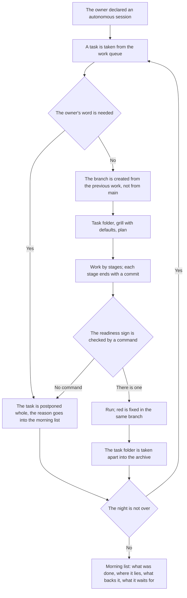

<!-- rt-kit v0.25.0 · rules/autonomous-work.md · a951fa775566 · правится надстройкой, не здесь -->

# Autonomous work — how it works here

Rule under the law `docs/constitution/autonomous-work.md`. The law says what must be true when the
owner is not around; here — what it is called in the tree and what changes in the ordinary course of
work. The course of work itself — rule `task-flow`, the end of a turn — `turn-conduct`, delivery —
`git-workflow`: an autonomous session does not cancel them, it narrows them.

## What it is called here

| In the law | Here |
| --- | --- |
| an autonomous session | the owner's request to work without them, stated in words and with a time boundary |
| a default instead of a question | a "Decisions" line in the grill: what was taken, the reason and the cost of a mistake |
| work visible from outside | pushing a branch, opening a PR, merging, publishing the package, sending cargo |
| a chain | the branch of each next piece of work is created from the branch of the previous one |
| the morning list | the last message of the session: the work, the branch, what backs it, what it waits for |
| postponed work | a task that needs the owner's word: its state on the board does not move |

## Where it lives

In this tree — the table in `implementation.md` next to it: how an autonomous session is declared,
where the morning list is kept and what key the chain's tasks have. Paths live there, not here: the
rule travels between repositories, and each tree has its own layout.

## Flow

## How the law applies here

- **The branch of the next work is created from the previous one, not from main.** The first — from
  main, each next — from the tip of the previous: `git checkout -b <ключ>-<номер>-<slug> <прошлая
  ветка>`. The owner merges them in turn from the bottom up, and each PR stands on the previous one.
- **Nothing goes outside during the night.** No push, no PR, no merge, no publishing, no sending
  cargo to the intake: all of it is visible to others, and a person cancels it. Cargo marks that
  need a merge wait too — they assert what is not yet in main.
- **A task that needs the owner's word is not taken at all.** Its state on the board does not move:
  a task taken and postponed looks begun, and the next session skips it.
- **A default is written where the owner's answer would have been written.** As a line in the grill:
  what was taken, why and what a mistake will cost. A silent default cannot be told from knowledge.
- **The readiness sign is named as a command before the stage begins.** The executor's look confirms
  nothing in an autonomous session: there is nobody to check it until morning.
- **A red run is fixed in the same branch, not postponed.** Postponed, it reaches the owner together
  with a branch that cannot be merged.
- **A guard's refusal is a work step, not the end of the session.** It names what was skipped; the
  skipped is done, and the work goes on. Bypassing a guard stays forbidden in an autonomous session
  too.
- **The morning list is written along the way, not recalled at the end.** Each closed piece of work
  appends its line: the night is longer than the window, and there is nothing to recall it whole by
  in the morning.

## What of the law is not here

Nothing checks the session's time boundary: the session ends when the work is over or the owner said
a word. Keeping the ban on what is visible from outside is held the same way — by the rule, not by a
guard: the push command is no different from the one made by day.

## Patterns

- `autonomous-work-run` — the ready-made night cycle: the chain of branches, writing a default, the
  morning list, handling a guard's refusal.

## Pitfalls

- **A branch created from main by habit breaks the chain.** This shows only to the owner and only at
  the second merge; it is fixed by re-creating the branch while the work has not gone far.
- **A task postponed without a line in the list is lost.** In the morning it is seen neither on the
  board nor in the branches: it looks simply not taken.
- **A default written in the commit body does not reach the owner.** They read the list and the task
  folder, not the branch history.
