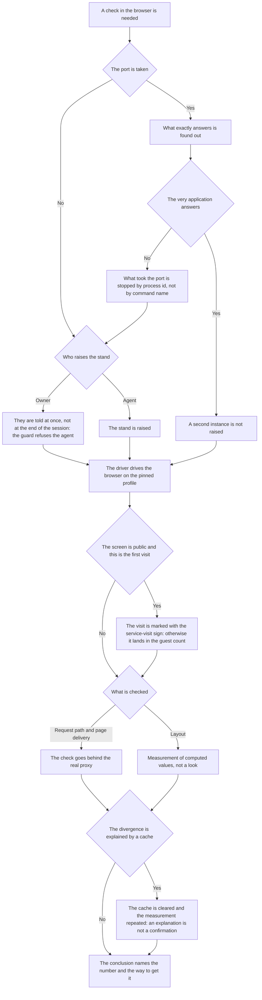

<!-- rt-kit v0.27.0 · rules/browser-verification.md · 7017b99bedee · правится надстройкой, не здесь -->

# Checking the running application — how it works here

Rule under the law `docs/constitution/verifiability.md`. The law says what counts as confirmation;
here — where the applications live, what on them can be trusted and what to measure with. Tests
under the same law — rule `testing`.

## What it is called here

| In the law                       | Here                                                                                             |
| -------------------------------- | ------------------------------------------------------------------------------------------------ |
| the running application          | what is up in this tree; the list and the ports — in `implementation.md` next to it              |
| the place where the user sees it | the production build behind the tree's real proxy, not the dev server                            |
| measurement                      | `getComputedStyle`, `getBoundingClientRect`, contrast, matching centres, landing in the viewport |
| browser driver                   | `claude-in-chrome` on the pinned profile of this tree                                            |

## Where it lives

In this tree — the table in `implementation.md` next to it. Paths live there, not here: the rule
travels between repositories, the layout does not, and a path named in the rule lies in the first
tree that keeps its code differently.

## Flow

The flow of a check through the browser: what is found out before the first request, where the fork
is between an application that is up and one that is not, and what backs the conclusion.

## How the law applies here

- **A second instance of an application that is already up is not raised.** Before the first request
  it is found out who answers on the port. An instance raised anew answers with its own build, not
  the one under check. Who raises the stand — the owner or the agent — is said in the tree's names.
  A taken port discovered late means the stand already exists: what was started on top of it is
  stopped by process id, not by command name — both instances share the same one.
- **The browser is driven by one driver on the pinned profile.** The other doors — a second driver,
  `open`, `osascript`, launching the binary — do not ask the pinned profile at all.
- **A browser raised by a library from inside a script is the same door as launching the binary.**
  The command line does not show it at all. There stand the interpreter name and a file path, and
  the driving lies inside the file itself. So what is judged is the content of the file being run,
  and the code passed as an argument instead of a file. A rule that judged one command line promised
  more than it checked, and the profile was bypassed through this door twice in one session.
- **The browser choice goes stale and needs a repeated call.** A choice made at the start of the
  session does not hold: after a pause the next call opens a tab in another profile silently.
- **A refused profile choice ends the work with the browser; it does not start a search for a
  workaround.** The profile is not among the connected ones — so there is nobody to drive. The tab
  list, the navigation and the screenshot will go to whichever browser the extension counts as
  active, and which one that is nobody knows. The state is named to the owner in words, and work
  through the browser stands until their answer.
- **The profile is not picked from the list and not asked from the owner.** The list gives unstable
  names that identify nothing, and a pick from it leads to a profile without a sign-in.
- **An unconfigured guard is a reason to stop, not a permission to go on.** The guard lets the
  action through when the helper is silent, so that a broken harness does not stall the work. It
  does not count as permission to work past the profile. An executor who got empty output from the
  helper names that to the owner and does not drive the browser: the tab would open in the profile
  the extension took for active, and which profile that is nobody knows.
- **A screen behind sign-in is checked on a stand with a substituted sign-in answer, not with a live
  account.** The application gets the sign-in as a person gives it, through the form, and the stand
  answers it. The sign that closes the screen arrives with the substituted profile. Asking a person
  to do a step of the check — type a password, open a tab, press a button — means a wrongly chosen
  path, not a lack of rights on the executor's side.
- **Changing the number of elements in a container is a layout edit.** It touches no styles, so it
  reads as a markup edit, and the check shrinks to response codes. The pages answer in every locale,
  and the document is already twice the viewport width. It is closed by a measurement — document
  width against viewport width on a narrow screen — not by a look at a screenshot: a screenshot
  shows what fit into the frame. A row with no wrapping and no narrow layout, grown from four
  elements to eight, held a horizontal scrollbar on every page of the site for forty-four minutes of
  production.
- **A measurement is taken on the longest value, not on the sample one.** Overlap, overflow past the
  edge and clipping without a sign show only where the content does not fit its place. On a short
  value all three look fine. The value for measurement is the extreme one — what the node can get
  from a real consumer, not what stands in the example.
- **A ready-made kit piece taken for values of another size is measured, not looked at.** A
  component that lived where values are short gets a value four times longer in its new place. It
  behaves differently while staying the same code. The test does not see this at all: clipping by
  the browser is not reflected in the markup, and the text comes out of it whole.
- **The stand proxy supplies what the application recognises the request's tenant by.** A tree that
  keeps several organisations behind one application tells them apart by a header. The rendering
  server puts its own host there, and the application answers every call with a refusal. From
  outside that is a "not found" page — it looks like a code defect, not a stand defect. The
  measurement is three headers on one stand: own host with port — refusal, own host without port —
  refusal, the tenant name — the page. What tells one from the other is substituting the header, not
  reading the code.
- **The production configuration is checked only behind the real proxy.** A bare page-serving server
  knows nothing about caching, redirects and headers.
- **What is shown to a person is built from the work under discussion.** The stand is built from the
  branch of this edit, not from the one the executor is standing on. A build from another branch
  shows the tree without the edit, and the person reads that as "not done". What is said about the
  shown names the branch it was built from. One such showing cost two turns: the owner repeated a
  remark whose edit had long been made, and the executor set about explaining a defect already
  fixed.
- **The work branch keeps the tip of main merged in the whole time, not only before delivery.** A
  branch that has fallen behind builds into a stand with neither others' edits nor one's own
  neighbouring ones. What is shown on it describes a tree nobody has. The tip is pulled in when its
  movement became known, not when the work ended.
- **The first visit to a public screen is marked with the service-visit sign.** The driver drives an
  ordinary browser, and the visit counter does not tell a check from a guest. Its
  `navigator.webdriver` is `false`, its `User-Agent` string is a live browser's. What marks the
  visit is said in the tree's names; a sign that lives in browser storage is written once per
  profile, not for every address.

- **A screen whose data never exists in the development database is measured with the component's
  real styles.** The markup is inserted into an already open screen with its own scope attribute.
  The styling rules apply to it the same as they would to a live row. This is a technique, not a
  workaround: the same computed values are measured, and only the row content is invented. A
  workaround would be measuring another screen and calling that a measurement of the needed one.

- **A measurement that will have to be repeated is taken by an end-to-end test, not by the driver.**
  Window width, node position and content going sideways are read there by the same computed values.
  The viewport is set for the whole suite, and the number agrees on every run — while a manual
  measurement lives one session and leaves with it. The driver stays where an unfamiliar screen is
  looked at: it answers "what is going on here", it does not confirm a known number. The conclusion
  "there is nothing to measure with", reached at a closed sign-in, most often means the search used
  the wrong tool.

- **A measurement is taken before the work is shown to the owner, not after their remark.** Shown
  without a measurement is a request for a check, not a check. On a screenshot cards stuck tight
  together read as one with long content, a clipped shadow as no shadow, a zero gap as dense layout.
  Each such defect is visible by one measurement command. Numbers taken from the reference in
  advance are checked against the implementation the same way: work done by retelling the reference
  in words diverges from it unnoticed.

- **Work that carries a look over from a sample is accepted by a frame of one's own screen next to
  the sample's frame.** Names carried into the markup are the technique, not the result: a green
  build, linters and tests say nothing about a field clipped mid-line. Every remade screen is
  looked at by the executor and shown to the owner; a screen not opened since the edit counts as
  unchecked. A measurement set assembled by the author under their own edit confirms nothing
  either — it holds what was fixed in that hour; the set is taken from what the work is accepted
  by and is written before the edit.

A conclusion about layout is backed by a number: "looks fine" is never a check result. Nothing
guards this — how to measure is covered in pattern `browser-verification-measure`.

## What of the law is not here

There is no check for direct access to the browser environment — that is `Q-FA-1` in the
frontend-application law: such access compiles and fails only when the page is served by the server.

## Patterns

- `browser-verification-stand` — an honest stand from the production build, signing in to a closed
  application, sorting out a port.
- `browser-verification-measure` — measurement instead of a look, pitfalls of the `computer` tool.

## Pitfalls

- **First find out what answers on the port:** `lsof -nP -iTCP:<port> -sTCP:LISTEN` before the first
  request. A built artifact from a past session regularly hangs on the application port. It answers
  200 with old code, and the handler created in the branch it does not have at all, so a 404 reads
  as a registration defect. There may be several such processes; killing by command pattern hits
  none of them — kill by PID from `lsof`, each one.
- **A command-name pattern is no good either to hit or to spare.** Two instances of one stand — the
  one already up and the one just started — cannot be told apart by command text. It is the same for
  both. Killing by pattern takes both, and there is nothing to sort it out with afterwards: what
  gets killed is exactly the stand everything was started for. Own and foreign are told apart only
  by the process id taken by sorting out the port; that is what stops them, one by one. The reverse
  miss is the same in nature — the shell starts the process under a name the pattern lacks, and the
  kill hits nothing.
- **Killing a process may be refused, and then the stand is raised alongside, not instead.** The
  runtime environment may refuse it — even for one's own stand from a past session. Neither a
  permission for the command nor rewording helps here. There is one move from here: a free port for
  the new stand, and the list of what was left is named to the owner at the end of the session —
  only they can kill those. Not named so, stands pile up across sessions and hold connections to the
  storage.
- **A measurement is also taken by an end-to-end test, not only by the browser driver.** Window
  width, node position and the document going sideways are read there by the same computed values.
  The viewport is set for the test suite, and the result repeats on every run — unlike a manual
  measurement, which lives exactly one session. The driver stays where an unfamiliar screen is
  looked at, not where a known number is confirmed.
- **A statement about the production build is made from the build itself, not from the branch.**
  Between the branch and what is served to the reader stands the image build. It substitutes
  environment values, cuts out the unused and renames symbols. "The build holds this" is checked by
  a search over the served file — all the more when the matter is exactly the value the build
  substitutes.
- An incremental build goes stale piece by piece: the markup may already be new while the client
  chunk is from a compilation before the edit. The sign of a dev build is bundle names without a
  hash (`main.js`). A divergence between `curl` and the page after hydration is a reason to rebuild,
  not to look for a defect in the code. Nor can "there is no such route" be concluded from here:
  check against the route declaration.
- **A cache explains a divergence but does not confirm it.** `.angular/cache/…/vite/deps` holds only
  packages from `node_modules`, none of the repository code. The conclusion "no defect, it is the
  cache" closes the investigation, so it is accepted only after a check on a clean build. Three
  rounds went on a stuck event feed panel while the defect lay in the outlet teardown.
- **A caching build step without declared outputs serves the past silently.** The cache hit happens,
  and there is nothing to restore: the builder does not run, and the build directory keeps what lay
  there from last time. The stand raises that build, and the application behaves like code that is
  not in the tree. The pitfall above is about another cache: that one explains a divergence, this
  one creates it, and the builder's output is green with it. Before looking for a defect in the
  screen, the build step is asked for its declared outputs; that is checked by removing the build
  directory and calling again — after a cache hit it must restore itself.
- The message `Angular debugging APIs are not available` in the console belongs to the Chrome
  extension, not to the application: the production build does not publish `window.ng`. No code edit
  is needed to cure it — `window.ng` in production is a map of the internals in the hands of anyone
  who opens the console.
- Router behaviour is reproduced by clicks: substituting the address and entering by a direct link
  raise the application anew, and it has no accumulated state.
- A measurement answers only the question asked. The rows of the profile popup matched the reference
  by padding, font size and rounding, while the reference paints no hover background there at all —
  a full-width highlight held on for two rounds with correct numbers.
- **When the version of the package that draws the layout changed, the screens are walked by hand.**
  Tests click by `qa-dataid` and stay green even when a gap shifted, a size vanished and a row got a
  different height. They check transitions, not looks. A pair of screenshots is too little here too
  — every screen this package draws is looked at in turn.
- **There are three launch paths here, and they are checked separately:** the local command, the
  image `deploy/api.Dockerfile` and the composition `docker-compose.prod.yml`. A variable set in the
  check command says nothing about the image: the production composition has it, while a manual run
  of the same image goes without it. The paths are listed before the check, not after one of them
  matched.
- **The sign is taken from the owner's question, not from the subject of the edit.** A server-served
  page answers "did it build", and it never answers "is it visible". The display lives after
  hydration, and the picture after a request to an external service. The signs for the second
  question are their own — the image's `naturalWidth` above zero, the display node appeared on the
  raised page — and they are taken by the driver, not by a request to the address.
- **A refusal from an external service is never a diagnosis of a setting.** A `403` names the state
  of the project at the provider and says nothing about what value lies in the tree's setting. Read
  as a diagnosis, it leads to fixing what is intact — while the value itself is read by one command
  on one's own side. All the less is it requested from the owner: the session already has it.
- **The previous behaviour is read from the code of that version:** `git show <commit before the
  edit>:<file>`. A commit body names what the edit changed and is silent about what was true before
  it. A display condition with one more mandatory value appended switches off what was shown before,
  and in the edit itself it looks like a refinement. An edit from a neighbouring task rolled out the
  same day enters the production check alongside one's own: the branch answers for what left
  together with it.
