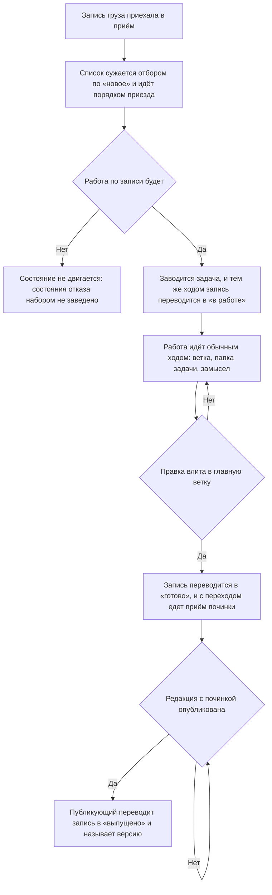

<!-- rt-kit v0.10.0 · rules/cargo-triage.md · 9ae771802d9a · правится надстройкой, не здесь -->

# Разбор приехавшего груза — как это устроено здесь

Правило под закон `docs/constitution/work-conduct.md`. Закон говорит, что работа ведётся так,
чтобы её состояние переживало заход; здесь — как это держится для чужой работы, приехавшей
грузом. Своя работа идёт правилом `task-flow` под тем же законом, и одно продолжает другое:
взятие отчёта в работу заводит задачу, а с задачи начинается тот ход.

## Как это называется здесь

| В законе                               | Здесь                                                                        |
| -------------------------------------- | ---------------------------------------------------------------------------- |
| работа, о которой сказал кто-то другой | груз: разбор происшествия и предложение, приехавшие в приём от дерева        |
| состояние работы, пережившее заход     | состояние записи груза: новое, в работе, готово, выпущено                   |
| отметка о сделанном                    | вызов команды отметки — она переводит записи и пишет приём починки и версию |
| место, где состояние читают            | админка приёма: столбец состояния, отбор по нему и панель записи            |
| ответ на «чем исправлено»              | приём починки: статья правила, гард, проверка, правка кода                  |
| ответ на «где искать фикс»             | версия выпуска: строка, которой дерево назвало выпуск                       |

## Где это лежит

В этом дереве — таблица в `implementation.md` рядом: адрес приёма, чем зовётся команда отметки
и как называются состояния в её доводах. Пути живут там, а не здесь: правило переносится между
репозиториями, а адрес приёма и имя команды у каждого дерева свои.

## Ход

Ход одной записи груза от приезда до выпуска: где ставится каждая отметка и что делается
раньше неё.

## Как закон применяется здесь

- **Груз читается админкой приёма, а не очередью работ.** Сводка говорит о рабочих привычках
  команды, и в открытой очереди работ это выложено всему свету. Записи, заведённые прежним
  порядком, из очереди никуда не денутся, но новых там не заводят.
- **Разбор начинается с неразобранного.** Список сужается отбором по состоянию «новое» и идёт
  порядком приезда. Без отбора разобранное и нетронутое стоят вперемешку — то самое состояние,
  ради ухода от которого состояния и заведены.
- **Что уже разобрано, спрашивается у приёма, а не вспоминается.** Состояние переживает заход,
  память исполнителя — нет: разобрав груз сегодня, завтра начинают с нуля.
- **Взять отчёт в работу — значит завести по нему задачу.** Отметка «в работе» без задачи
  говорит, что запись кто-то взял, и молчит о том, где эта работа идёт; задача без отметки
  оставляет запись среди неразобранных, и следующий заход разбирает её заново.
- **Задача и отметка идут одним ходом.** Отложенная отметка не ставится: между заведением
  задачи и следующим шагом проходит день, и к этому дню исполнитель помнит задачу, а не запись
  груза.
- **Одна правка — одна задача, сколько бы записей груза её ни вызвало.** Записи, чинящиеся
  вместе, отмечаются одной пачкой и одной задачей: делится то, что придётся откатывать порознь.
- **«Готово» ставится, когда правка влита в главную ветку.** Не когда заявка открыта и не когда
  прогон зелёный: до слияния правки в дереве нет, а отметка утверждает, что она есть.
- **С переходом в «готово» едет приём починки.** Он отвечает на «чем», а не на «где»: статья
  правила, гард, проверка, правка кода. Ссылка на задачу отвечает на «где», и приёмом починки
  её не считают. Без текста переход отбивается построчно — список снова показал бы состояние,
  у которого нет ответа на «чем».
- **«Выпущено» ставится тем, кто публикует редакцию, и тем же движением, что и публикация.**
  У него версия под рукой; отложенный до следующего захода выпуск отмечается по памяти или не
  отмечается вовсе.
- **Между «готово» и «выпущено» стоит редакция.** Потребитель получает фикс только после
  раскладки у себя, и два состояния разведены ровно поэтому.
- **Отметка ставится командой, а не рукой человека в админке.** Правка закрыта токеном дерева:
  человек груз читает, а разбирает его тот, кто по нему работает.
- **Записи всего разбора едут одной пачкой.** Команда принимает несколько записей за вызов, и
  вызов на каждую стоил бы столько же, сколько сам разбор.
- **Ответ команды читается, а не подразумевается.** Он называет, сколько записей переведено,
  сколько уже стояло в названном состоянии и какие строки отбиты. Отбитая строка означает, что
  запись осталась там, где была, и разбирается она причиной отбоя, а не повтором того же
  вызова.
- **Разбор груза и сведение предложений — два разных шага.** Сведение делит пришедшее на
  повторившееся и разовое и решает, что становится правкой; разбор груза отмечает состояние
  каждой записи. Сведение зовут раз в несколько дней по отрезку, разбор — всякий раз, когда
  работу берут.

## Чего из закона здесь нет

Ничего из перечисленного не проверяет машина, и проверки на это не будет: разбор груза
исполняет агент, и признака «прочитал и решил» у него нет. Гард видел бы только вызов команды,
а вызов без разбора ничем не отличается от вызова после него.

Держится правило двумя вещами, и обе видны в самом приёме. Первая — запись, у которой правка
влита, а состояние прежнее: она называет пропущенный шаг сама, как только на список посмотрят
отбором. Вторая — число записей в «новом»: растущее означает, что разбор не идёт вовсе.

Запись, по которой работы не будет, отметить нечем: состояния отказа набор не знает. «Новое»
оставляет её среди неразобранных навсегда, «в работе» лжёт. Это открытый вопрос договорённости,
а не умолчание правила: разбирается такая запись каждый раз заново, пока владелец не решил.

## Паттерны

- `cargo-triage-mark` — готовые вызовы: сухой прогон, отметка пачкой, приём починки и версия
  выпуска, разбор отбитой строки.

## Ловушки

- **Отметка, отложенная «на потом», не ставится.** Между решением и следующим ходом проходит
  день, и запись груза к этому дню помнит только приём. Отмечают тем же ходом, которым решили.
- **Сухой прогон отметкой не считается.** Он показывает, что уехало бы, и следа наружу не
  оставляет: запись остаётся в прежнем состоянии, а исполнитель уходит с ощущением сделанного.
- **«Готово» по открытой заявке — отметка о том, чего в дереве нет.** Между открытием и
  слиянием проходит день и больше, а заявку ещё и закрывают без слияния.
- **Приём починки, написанный пересказом разбора, отвечает не на тот вопрос.** Запись груза уже
  несёт то, что было не так; отметка говорит, что с этим сделали, — и читают её как раз затем,
  чтобы понять, стоит ли чинить у себя.
- **Ответ команды с нулём переведённых читается как отказ, а не как успех.** Строка «переведено
  0, уже стояло 3» означает, что этот разбор не двинул ничего: либо записи отмечены раньше,
  либо ключи названы не те.
