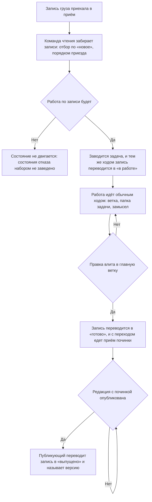

# Разбор приехавшего груза — как это устроено здесь

Правило под закон `docs/constitution/work-conduct.md`. Закон говорит, что работа ведётся так,
чтобы её состояние переживало заход; здесь — как это держится для чужой работы, приехавшей
грузом. Своя работа идёт правилом `task-flow` под тем же законом, и одно продолжает другое:
взятие отчёта в работу заводит задачу, а с задачи начинается тот ход.

**Требует:** `.claude/hooks/cargo-mark-guard.sh`

## Как это называется здесь

| В законе                               | Здесь                                                                       |
| -------------------------------------- | --------------------------------------------------------------------------- |
| работа, о которой сказал кто-то другой | груз: разбор происшествия и предложение, приехавшие в приём от дерева       |
| состояние работы, пережившее заход     | состояние записи груза: новое, в работе, готово, выпущено                   |
| отметка о сделанном                    | вызов команды отметки — она переводит записи и пишет приём починки и версию |
| чем груз забирают                      | вызов команды чтения — она входит парой службы и отдаёт записи с их ключами |
| место, где состояние читают            | ответ команды чтения; человеку то же показывает админка приёма             |
| ответ на «чем исправлено»              | приём починки: статья правила, гард, проверка, правка кода                  |
| ответ на «где искать фикс»             | версия выпуска: строка, которой дерево назвало выпуск                       |

## Где это лежит

В этом дереве — таблица в `implementation.md` рядом: адрес приёма, чем зовётся команда отметки
и как называются состояния в её доводах. Пути живут там, а не здесь: правило переносится между
репозиториями, а адрес приёма и имя команды у каждого дерева свои.

## Ход

Ход одной записи груза от приезда до выпуска: где ставится каждая отметка и что делается
раньше неё.

## Как закон применяется здесь

- **Груз забирается из приёма командой, а не глазами в админке.** Разбирает груз исполнитель, и
  то, чего он не может прочитать, он не разбирает: пока чтение было открыто одному человеку, две
  с лишним сотни записей простояли новыми, и отметить их было нечем — команда отметки знала
  только то, что ещё лежало у дерева на диске. Админка остаётся человеку и отвечает на другой
  вопрос: как груз выглядит в целом.
- **В очереди работ груз не заводится.** Сводка говорит о рабочих привычках команды, и в
  открытой очереди работ это выложено всему свету. Записи, заведённые прежним порядком, из
  очереди никуда не денутся, но новых там не заводят.
- **Груз, стоящий в очереди с прежних времён, задачей не судится.** Заголовка с номером,
  исполнителя и места на борде у него нет и не будет: сверка очереди печатала на каждую такую
  запись по три строки — восемнадцать строк на семь записей, — и настоящее расхождение среди
  них не читалось. Узнаётся груз меткой, которую называет само дерево: у каждого она своя, а
  выдуманное умолчание не совпало бы ни с чем и молча выключило бы отсев. Отсеянное сверка
  называет числом — молчаливый отсев неотличим от сверки, у которой метка названа с опечаткой.
- **Разбор начинается с неразобранного.** Список сужается отбором по состоянию «новое» и идёт
  порядком приезда. Без отбора разобранное и нетронутое стоят вперемешку — то самое состояние,
  ради ухода от которого состояния и заведены.
- **Что уже разобрано, спрашивается у приёма, а не вспоминается.** Состояние переживает заход,
  память исполнителя — нет: разобрав груз сегодня, завтра начинают с нуля. Спрашивается оно тем
  же чтением, которым груз забирают, — вторым вызовом с другим отбором, а не запросом к
  хранилищу.
- **Взять отчёт в работу — значит завести по нему задачу.** Отметка «в работе» без задачи
  говорит, что запись кто-то взял, и молчит о том, где эта работа идёт; задача без отметки
  оставляет запись среди неразобранных, и следующий заход разбирает её заново.
- **Задача и отметка идут одним ходом.** Отложенная отметка не ставится: между заведением
  задачи и следующим шагом проходит день, и к этому дню исполнитель помнит задачу, а не запись
  груза.
- **Одна правка — одна задача, сколько бы записей груза её ни вызвало.** Записи, чинящиеся
  вместе, отмечаются одной пачкой и одной задачей: делится то, что придётся откатывать порознь.
- **«Готово» ставится, когда правка влита в главную ветку.** Не когда заявка открыта и не когда
  прогон зелёный: до слияния правки в дереве нет, а отметка утверждает, что она есть.
- **Переход в «готово» идёт шагом состояния `влито`, а не памятью исполнителя.** Это
  единственное состояние работы, где слияние уже случилось, а ход о задаче ещё идёт: закрытие
  стоит раньше слияния, и отметка там утверждала бы то, чего в главной ветке нет, а после хода
  о задаче не помнит никто. За один разбор так зависли сорок шесть записей — правки в главной
  ветке, состояние прежнее.
- **С переходом в «готово» едет приём починки.** Он отвечает на «чем», а не на «где»: статья
  правила, гард, проверка, правка кода. Ссылка на задачу отвечает на «где», и приёмом починки
  её не считают. Без текста переход отбивается построчно — список снова показал бы состояние,
  у которого нет ответа на «чем».
- **Запись соседнего дерева закрывает издатель редакции, а не её отправитель.** Отправитель о
  выпуске не знает: правка входит в пакет не у него, а токеном соседа никто не владеет — и без
  второго пути чужие записи стоят в «новом» и тогда, когда давно лежат в редакции. Ходит этот
  путь только вперёд и только по двум последним шагам: «в работе» означает взятую дереву работу,
  и ставит его дерево. Запись при закрытии называется признаком из чтения, а не ключом
  отправителя: ключ уникален у своего дерева, а не в приёме.
- **«Выпущено» ставится тем, кто публикует редакцию, и тем же движением, что и публикация.**
  У него версия под рукой; отложенный до следующего захода выпуск отмечается по памяти или не
  отмечается вовсе.
- **Между «готово» и «выпущено» стоит редакция.** Потребитель получает фикс только после
  раскладки у себя, и два состояния разведены ровно поэтому.
- **Обе стороны разбора идут командами, и закрыты они по-разному.** Чтение — входом учётной
  записи службы: разбирать приходится весь груз о ресурсах, а шлют его несколько деревьев.
  Отметка — токеном своего дерева: двигать состояния соседа не вправе никто, и утёкший токен
  по-прежнему не открывает ничьего чтения.
- **Пара учётной записи службы лежит вне репозитория.** Тем же приёмом, что и токен дерева:
  положенная в дерево, она уезжает в историю и в каждую его копию, а отозвать её оттуда нечем.
- **Ключ записывается полным и уезжает в описание прошлого вместе с разбором просьбы.** Папка
  задачи разбирается до открытия заявки, а отметка ставится после слияния: к этой минуте ключ
  живёт только в архиве. Записанный восемью знаками, он там и остаётся — команда отметки
  принимает полный и на короткий отвечает «такой записи у дерева нет», а восстанавливать его
  приходится сличением с чтением приёма.
- **Ключ отметки берётся из того же чтения, а не считается по файлу на диске.** Посчитанный по
  своему диску, он находит только то, что там ещё лежит: удалённый файл разбора и переписанный
  текст предложения не отмечаются никогда, и запись о них висит новой, пока её кто-нибудь не
  заметит глазами.
- **Записи всего разбора едут одной пачкой.** Команда принимает несколько записей за вызов, и
  вызов на каждую стоил бы столько же, сколько сам разбор.
- **Ответ команды читается, а не подразумевается.** Он называет, сколько записей переведено,
  сколько уже стояло в названном состоянии и какие строки отбиты. Отбитая строка означает, что
  запись осталась там, где была, и разбирается она причиной отбоя, а не повтором того же
  вызова.
- **Версия выпуска называется одним номером, без имени пакета.** Колонка называет версию того
  же пакета, что и сама запись, — второй раз повторённое имя в ней ничего не добавляет, а формы
  этого повтора расходятся молча: `rt-agent-kit@0.17.0` и `@rt-tools/agent-kit 0.17.0` стояли в
  приёме рядом и обе означали один выпуск. Отбить это приём не может — форму версии выбирает
  каждое дерево своей, и общий запрет отбивал бы записи соседа; держится статья примером в
  паттерне, откуда строку и берут.
- **Разбор груза и сведение предложений — два разных шага.** Сведение делит пришедшее на
  повторившееся и разовое и решает, что становится правкой; разбор груза отмечает состояние
  каждой записи. Сведение зовут раз в несколько дней по отрезку, разбор — всякий раз, когда
  работу берут.

## Чего из закона здесь нет

Что груз разобран, машине не видно, и проверки на это не будет: признака «прочитал и решил» у
исполнителя не существует. Решение «работы по записи не будет» следа не оставляет вовсе, а вызов
чтения без разбора ничем не отличается от вызова после него.

**Отдача работы — другое дело, и её судит гард.** След у неё есть, и он машиночитаемый: образец
папки задачи требует называть ключи записей груза в разборе просьбы полностью. Гард отметки груза
читает их оттуда и не выпускает ход, который отдал работу по записи, пока состояние записи в
приёме не переведено. Судится один момент, а не всякий ход: гард, спрашивающий отметку на каждом
ходу, отбивал бы саму работу. Сухой прогон отметкой не считается — он следа наружу не оставляет.

Взятия в работу гард не судит, и это не послабление: состояние «в работе» ставит своей записи то
дерево, которому она принадлежит, а чужую запись двигает только закрытие издателем — оно
принимает «готово» и «выпущено», потому что «в работе» говорит о работе, которую ведёт дерево.
Груз приезжает от соседей, и требование отметить взятие чужой записи было бы требованием сделать
невозможное. У отдачи работы такой развилки нет: оба пути ведут в «готово».

Держится остальное двумя вещами, и обе видны в самом приёме. Первая — запись, у которой правка
влита, а состояние прежнее: она называет пропущенный шаг сама, как только на список посмотрят
отбором. Вторая — число записей в «новом»: растущее означает, что разбор не идёт вовсе.

Запись, по которой работы не будет, отметить нечем: состояния отказа набор не знает. «Новое»
оставляет её среди неразобранных навсегда, «в работе» лжёт. Это открытый вопрос договорённости,
а не умолчание правила: разбирается такая запись каждый раз заново, пока владелец не решил.

## Паттерны

- `cargo-triage-mark` — готовые вызовы: сухой прогон, отметка пачкой, приём починки и версия
  выпуска, разбор отбитой строки.

## Ловушки

- **Отметка, отложенная «на потом», не ставится.** Между решением и следующим ходом проходит
  день, и запись груза к этому дню помнит только приём. Отмечают тем же ходом, которым решили.
- **Сухой прогон отметкой не считается.** Он показывает, что уехало бы, и следа наружу не
  оставляет: запись остаётся в прежнем состоянии, а исполнитель уходит с ощущением сделанного.
- **«Готово» по открытой заявке — отметка о том, чего в дереве нет.** Между открытием и
  слиянием проходит день и больше, а заявку ещё и закрывают без слияния.
- **Приём починки, написанный пересказом разбора, отвечает не на тот вопрос.** Запись груза уже
  несёт то, что было не так; отметка говорит, что с этим сделали, — и читают её как раз затем,
  чтобы понять, стоит ли чинить у себя.
- **Ответ команды с нулём переведённых читается как отказ, а не как успех.** Строка «переведено
  0, уже стояло 3» означает, что этот разбор не двинул ничего: либо записи отмечены раньше,
  либо ключи названы не те.
