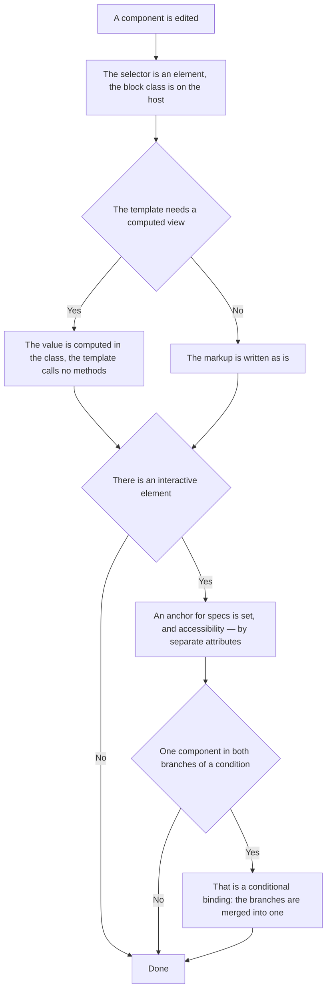

<!-- rt-kit v0.25.0 · rules/component-structure.md · 2007154d46af · правится надстройкой, не здесь -->

# Component file — how it works here

Rule under the law `docs/constitution/frontend-application.md`. The law says what must be true; here
— how the component file itself and its template are arranged. State and streams —
`angular-patterns`, styles — `styling-bem`, the browser environment — `platform-access`, the server
access layer — `api-layer`. All five under one law.

## What it is called here

| In the law                                       | Here                                                                        |
| ------------------------------------------------ | --------------------------------------------------------------------------- |
| component                                        | `<prefix>-<name>` — one prefix for all applications of the tree             |
| a ready value, not a computation in the template | `computed()`; where the value comes from the template context — a pure pipe |
| an anchor for a check                            | the `qa-dataid` attribute in kebab-case by the meaning of the element       |
| markup root                                      | `:host` with the block class from `host: { class: '<prefix>-<name>' }`      |

## Where it lives

In this tree — the table in `implementation.md` next to it. Paths live there, not here: the rule
travels between repositories, the layout does not, and a path named in the rule lies in the first
tree that keeps its code differently.

## Flow

The flow of editing a component: where the markup is decided, where the binding is, and what is put
on every interactive element.

## How the law applies here

- **The template calls no methods.** The linter rule bans `{{ getTotal() }}` and `@if
  (computeFlag())`, signal reads it does not touch.
- **Every interactive element carries `qa-dataid`.** It is the only anchor of the specs: BEM classes
  change with the layout, and a search by role and text breaks on translation locales.
- **A component is allowed only an element selector.** The linter rule demands from a component an
  element with the tree prefix and a hyphenated name, from a directive — an attribute and a one-word
  name. A technique that hangs on a foreign tag is written as a directive from the start: with a
  component on an attribute selector the lint turns red only after all three files and the styles
  are written.
- **The block class hangs on the host, not on a wrapper inside the template.** An extra wrapper
  around all the children is layout, and its place is on `:host`.

## What of the law is not here

The order of decorator properties, import grouping and self-closing tags are checked by nothing —
they are held by reading the neighbouring file. There is no check for a direct call to the browser
environment either — that is `Q-FA-1` in the law.

## Patterns

- `component-structure-new` — a ready-made component file and the template conventions.

## Pitfalls

- **`href="#id"` in markup does not work.** The build is one for all locales, the markup holds
  `<base href="/">`, and the browser resolves the fragment against the base: instead of a scroll you
  get a full navigation with a reload. Scrolling — through the router: `<a [routerLink]="[]"
  fragment="booking">`.
- **The same component in both branches of an `@if` is a conditional binding.** Two branches with
  different inputs recreate the component and lose its state.
- **A kit that draws in an overlay is not addressed from the caller's host:** its markup lies
  outside the host, and `[qa-dataid="x"] button` does not reach the buttons. Such buttons carry
  their own anchors right in the kit template, and the guard does not check the dependency
  catalogue.
- **`qa-dataid` does not replace `aria-label` and roles:** accessibility separately, the anchor
  separately. And it is not removed when the layout is edited — the specs hang on it.
- What the kit has ready is not written anew: own markup with `role="alert"`, `<table>`,
  `role="dialog"`, `role="tablist"` or `role="tooltip"` means that `<prefix>-message`,
  `<prefix>-table`, `<prefix>-dialog`, `<prefix>-tabs` or `<prefix>-tooltip` were bypassed. The rule
  whole — `reuse-first`.

## Присланное содержимое строится узлами

Текст, приехавший со стороны, показывается деревом узлов, которое построил разбор, а не
строкой, вклеенной в разметку. Обхода у этого нет: строка, отданная странице, — это исполнение
присланного в браузере того, кто смотрит.

- **Разбор присланного текста живёт чистой функцией, а компонент рисует её узлы.** Решение о
  том, что в тексте разметка, а что — видимые знаки, проверяется вызовом; компонент остаётся
  тонким и своего ветвления не заводит.
- **Перечень понимаемой разметки закрыт и зашит в компоненте.** Вход у такого компонента один —
  сам текст: настраивать нечего, значит нечем и ослабить. Забытый вход тихо открывал бы больше,
  чем задумано.
- **Незнакомое разбору остаётся видимым текстом, а не вычищается.** Вычистка — обещание,
  которое держится настройкой; узел, которого разбор не строит, в страницу не попадает и без
  неё. Сырой HTML, картинки и адреса чужих схем поэтому видны знаками, как приехали.
- **Ссылка ведёт наружу только знакомой схемой.** Адрес схемы, исполняющей код, выглядит
  ссылкой и срабатывает нажатием: схемы отбираются перечнем, а не отсеиваются по опасности.
- **Показ присланного текста собирается один раз на все разделы, которые его показывают.**
  Собранные порознь, они расходятся видом по одному, и замечает это читатель, а не проверка.
