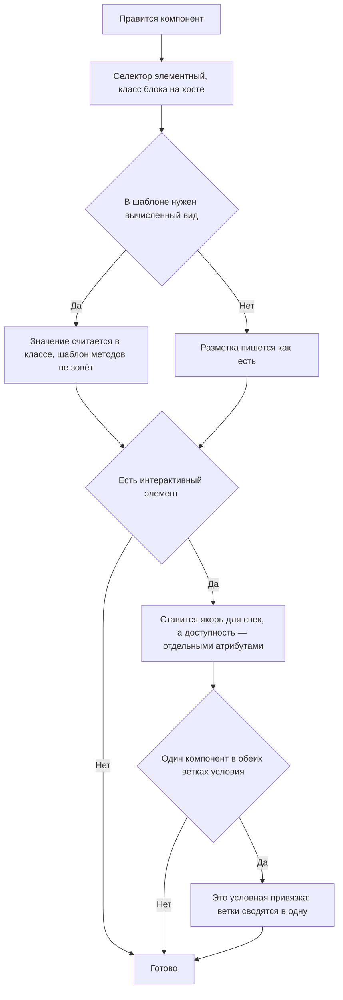

<!-- rt-kit v0.24.0 · rules/component-structure.md · df2ddfed5dc0 · правится надстройкой, не здесь -->

# Файл компонента — как это устроено здесь

Правило под закон `docs/constitution/frontend-application.md`. Закон говорит, что должно быть
верно; здесь — как устроен сам файл компонента и его шаблон. Состояние и потоки —
`angular-patterns`, стили — `styling-bem`, окружение браузера — `platform-access`, слой
обращения к серверу — `api-layer`. Все пять под одним законом.

## Как это называется здесь

| В законе                           | Здесь                                                                        |
| ---------------------------------- | ---------------------------------------------------------------------------- |
| компонент                          | `<префикс>-<имя>` — префикс один на все приложения дерева                    |
| готовое, а не вычисление в шаблоне | `computed()`; там, где значение приходит из контекста шаблона, — чистый пайп |
| якорь для проверки                 | атрибут `qa-dataid` в kebab-case по смыслу элемента                          |
| корень разметки                    | `:host` с классом блока от `host: { class: '<префикс>-<имя>' }`              |

## Где это лежит

В этом дереве — таблица в `implementation.md` рядом. Пути живут там, а не здесь: правило
переносится между репозиториями, раскладка — нет, и путь, названный в правиле, врёт в первом
же дереве, которое держит код иначе.

## Ход

Ход правки компонента: где решается разметка, где — привязка, и что ставится на каждый
интерактивный элемент.

## Как закон применяется здесь

- **Шаблон не зовёт методов.** Правило линтера банит `{{ getTotal() }}` и `@if
(computeFlag())`, чтения сигналов не трогает.
- **Каждый интерактивный элемент несёт `qa-dataid`.** Это единственный якорь спек: классы BEM
  меняются вместе с вёрсткой, а поиск по роли и тексту ломается на локалях перевода.
- **Компоненту разрешён только элементный селектор.** Правило линтера требует у компонента
  элемент с приставкой дерева и именем через дефис, у директивы — атрибут и имя одним словом.
  Приём, который вешается на чужой тег, пишется директивой с самого начала: у компонента с
  селектором-атрибутом линт краснеет уже после того, как написаны все три файла и стили.
- **Класс блока висит на хосте, а не на обёртке внутри шаблона.** Лишняя обёртка вокруг всех
  детей — это раскладка, и ей место на `:host`.

## Чего из закона здесь нет

Порядок свойств декоратора, группировку импортов и самозакрывающиеся теги не проверяет ничто —
они держатся чтением соседнего файла. Проверки на прямое обращение к окружению браузера тоже
нет — это `Q-FA-1` в законе.

## Паттерны

- `component-structure-new` — готовый файл компонента и договорённости шаблона.

## Ловушки

- **`href="#id"` в разметке не работает.** Сборка одна на все локали, в разметке стоит
  `<base href="/">`, и браузер разрешает фрагмент относительно базы: вместо прокрутки
  получается полная навигация с перезагрузкой. Прокрутка — через роутер:
  `<a [routerLink]="[]" fragment="booking">`.
- **Один и тот же компонент в обеих ветках `@if` — это условная привязка.** Две ветки с
  разными входами пересоздают компонент и теряют его состояние.
- **Кит, который рисуется в оверлее, из хоста вызывающего не адресуется:** его разметка лежит
  вне хоста, и `[qa-dataid="x"] button` до кнопок не дотянется. Такие кнопки носят собственные
  якоря прямо в шаблоне кита, а гард каталог зависимостей не проверяет.
- **`qa-dataid` не заменяет `aria-label` и роли:** доступность отдельно, якорь отдельно. И не
  снимается при правке вёрстки — на него завязаны спеки.
- Готовое из кита не пишется заново: своя разметка с `role="alert"`, `<table>`,
  `role="dialog"`, `role="tablist"` или `role="tooltip"` означает, что мимо `<префикс>-message`,
  `<префикс>-table`, `<префикс>-dialog`, `<префикс>-tabs` или `<префикс>-tooltip` прошли. Правило целиком — `reuse-first`.

## Присланное содержимое строится узлами

Текст, приехавший со стороны, показывается деревом узлов, которое построил разбор, а не
строкой, вклеенной в разметку. Обхода у этого нет: строка, отданная странице, — это исполнение
присланного в браузере того, кто смотрит.

- **Разбор присланного текста живёт чистой функцией, а компонент рисует её узлы.** Решение о
  том, что в тексте разметка, а что — видимые знаки, проверяется вызовом; компонент остаётся
  тонким и своего ветвления не заводит.
- **Перечень понимаемой разметки закрыт и зашит в компоненте.** Вход у такого компонента один —
  сам текст: настраивать нечего, значит нечем и ослабить. Забытый вход тихо открывал бы больше,
  чем задумано.
- **Незнакомое разбору остаётся видимым текстом, а не вычищается.** Вычистка — обещание,
  которое держится настройкой; узел, которого разбор не строит, в страницу не попадает и без
  неё. Сырой HTML, картинки и адреса чужих схем поэтому видны знаками, как приехали.
- **Ссылка ведёт наружу только знакомой схемой.** Адрес схемы, исполняющей код, выглядит
  ссылкой и срабатывает нажатием: схемы отбираются перечнем, а не отсеиваются по опасности.
- **Показ присланного текста собирается один раз на все разделы, которые его показывают.**
  Собранные порознь, они расходятся видом по одному, и замечает это читатель, а не проверка.
