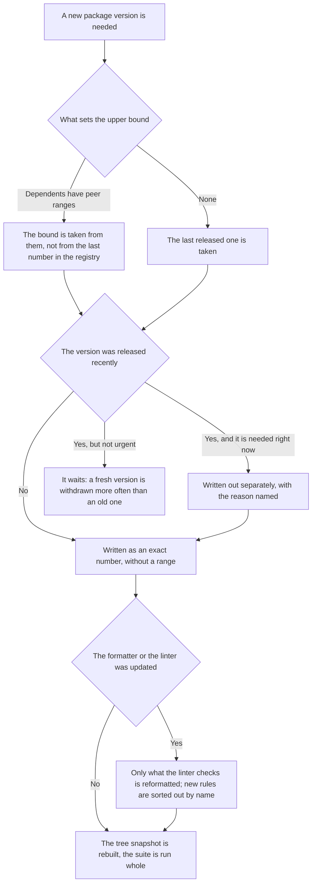

<!-- rt-kit v0.26.0 · rules/dependencies.md · 01ebf036354d · правится надстройкой, не здесь -->

# Dependencies — how it works here

Rule under the law `docs/constitution/delivery.md`. The law says what must be true; here — what it
is called in this tree, where it lives and what of the law does not apply here. Branch, commit and
rollout under the same law — rule `git-workflow`.

## What it is called here

| In the law                        | Here                                                                                                         |
| --------------------------------- | ------------------------------------------------------------------------------------------------------------ |
| a dependency declaration          | an exact number in `package.json` — `"prettier": "3.9.6"`; `^` and `~` do not occur in the file once         |
| snapshot of the installed tree    | `pnpm-lock.yaml`; goes in the same commit as the declaration                                                 |
| substitution of a foreign version | `overrides` in `pnpm-workspace.yaml` — the substituted transitive dependencies lie there                     |
| waiting period of a new version   | `minimumReleaseAge`; a package needed before the term is written out by number in `minimumReleaseAgeExclude` |
| package manager                   | pnpm: `npm run` calls the scripts, installation is done by `pnpm install`                                    |

## Where it lives

In this tree — the table in `implementation.md` next to it. Paths live there, not here: the rule
travels between repositories, the layout does not, and a path named in the rule lies in the first
tree that keeps its code differently.

## Flow

The flow of raising a version: where the version itself is decided, where the reformatting boundary
lies, and what the work ends with.

## How the law applies here

- **A package version is written as an exact number.** From a range, today and a week later
  different things get installed, and reverting the edit does not fix that.
- **Substituted versions of foreign dependencies are gathered in one list, and it is revisited at
  every update.** A substitution left in the list after the main package was raised silently rolls
  its dependency back.
- **A fresh version waits first, and one needed before the term is written out separately.**
  Otherwise a release its author managed to withdraw lands in the snapshot.
- **Only what the linter checks the formatting of gets reformatted.** An updated formatter changes
  every file it reaches, and `.md` and `.json` are checked by nobody here: an edit in them is just
  noise that has to be read by eye.
- **A package that carries styling is raised by a task of its own.** The look breaks silently:
  neither the linter, nor the build, nor the tests read styling properties, and the person at the
  screen sees the breakage. Gone into a shared update, such a raise is reverted only together with
  the others, and tying the breakage to it costs a separate investigation; its own branch is
  reverted alone.

## What of the law is not here

Nobody checks that the declared versions match the snapshot: `--frozen-lockfile` stands only in the
rollout, and it goes from a push to the main branch, that is, after the merge. Ranges are not
checked either: one `^` in `package.json` passes every check of the tree.

## Patterns

- `dependencies-upgrade` — raising versions, choosing the upper bound, sorting out the consequences
  of an update.

## Pitfalls

- **A range lets through a version that is not in the registry.** `^0.2.0` was written into the kit
  declaration, and the snapshot stayed on the previous version: the declaration looked right, but
  everything was built on 0.1.0, where the component has no such size at all, and the main branch
  stopped building. This was found two weeks later — when a tree was needed for comparison, and
  there turned out to be nothing to compare with.
- **The upper bound is set by peer ranges, not by the last number in the registry.** TypeScript
  stayed on 6.0.3 with the seventh version out, because Angular declares `>=6.0 <6.1`. `pnpm
  install` does not catch such a mistake: `autoInstallPeers` silently delivers what is missing.
- **After a linter plugin update, rules appear that were not there yesterday.** eslint 10 added
  `no-useless-assignment`, `eslint-plugin-playwright` 2 — three rules at once. The findings come on
  files the edit did not touch and look like its consequences.
- A test run after an update — rule `testing`: after a Playwright version change the browser has to
  be installed anew, and that is not a regression.
