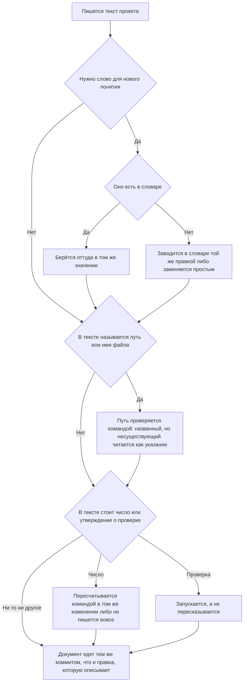

<!-- rt-kit v0.9.0 · rules/doc-style.md · 6c611f8974a2 · правится надстройкой, не здесь -->

# Тексты проекта — как это устроено здесь

Правило под закон `docs/constitution/project-documentation.md`. Закон говорит, что должно
быть верно про тексты; здесь — чем это проверяется в этом дереве и что остаётся за автором.
Устройство спеков и слоёв документации — правило `spec-driven` под тем же законом; здесь
только формулировки.

## Как это называется здесь

| В законе                           | Здесь                                                                                                              |
| ---------------------------------- | ------------------------------------------------------------------------------------------------------------------ |
| документ                           | любой `.md` вне `docs/archive/`, плюс комментарии в коде, тела коммитов и описания PR                              |
| путь, названный в документе        | строка с расширением в обратных кавычках — её и ищет проверка                                                      |
| правка, которую документ описывает | пара из `docs-guard`: правило и его зеркало, `.proto` и спек, хук и его сценарии, переезд файла и README обеих либ |
| описание прошлого                  | `docs/archive/` — из проверки путей выведено целиком                                                               |

## Где это лежит

В этом дереве — таблица в `implementation.md` рядом. Пути живут там, а не здесь: правило
переносится между репозиториями, раскладка — нет, и путь, названный в правиле, врёт в первом
же дереве, которое держит код иначе.

## Ход

Ход правки текста: что проверяется до записи, где развилка между новым словом и уже занятым, и
что делается со снятым именем.



## Как закон применяется здесь

- **Путь, названный в документе, существует.** Ссылка на переехавший файл читается как
  действующее указание, и следующий читатель заводит снятое заново. Судятся документы,
  которые едут в репозиторий: личный черновик, закрытый `.gitignore` или
  `.git/info/exclude`, проверка не читает — мёртвая ссылка в нём держала гейт пуша, хотя ни
  в одну ветку этот файл не попадёт.
- **Голое имя и каталог судятся наравне с полным путём.** Имя без каталога ищется по всему
  дереву, каталог — среди каталогов; дерево спрашивается у системы контроля версий, иначе
  каталоги, начинающиеся с точки, не видны и всё, что в них лежит, читалось бы как
  несуществующее. Половина строк в таблицах «Где это лежит» — как раз каталоги.
- **Описание прошлого из проверки путей выведено целиком.** Архив по устройству называет
  файлы, которых уже нет, и правкой это не лечится. Папка задачи выведена по той же причине:
  раздел находок в ходе работы перечисляет ровно то, чего в дереве нет.
- **Переносимый текст из сверки адресов выведен, как архив.** Закон, правило и паттерн написаны
  для любого дерева этого класса, и адреса в них принадлежат тому дереву, куда текст ложится:
  `libs/common/util` там, где корни зовутся иначе, — пример, а не мёртвая ссылка. Разложенную
  копию проверка узнаёт по шапке раскладки, исходник — по каталогу, названному в настройке; без
  этого сверка краснеет на полторы сотни строк, ни одна из которых не чинится здесь.
- **Указатель каталога сверяется с его содержимым обеими сторонами.** Записи каталог набирает
  быстрее, чем читают его указатель, и промах не виден ни в сборке, ни в браузере: запись,
  приехавшая слиянием соседней ветки, просто не попадает в таблицу. Сверенный руками указатель
  расходится снова через сутки.
- **Имя, названное затем, чтобы сказать «его нет», стоит в списке исключений поимённо.**
  Отличить такое упоминание от ссылки машине нечем, а текст без него теряет смысл: правило и
  замысел предупреждают именно о снятом. Туда же — то, что появляется только после сборки,
  имена веток и правила линтеров: выглядят адресом, адресом не являются.
- **Документ едет в том же коммите, что и правка, которую он описывает.** Обход — строка
  `Docs-skip: <причина>` в теле коммита; пустая причина не принимается.
- **Документ не длиннее предела длины.** Текст, который не влезает на экран целиком, дописывают
  в конец, не перечитав начала, — так в одном документе и оказываются два ответа на один вопрос.
  Предел тот же, что у кода, и считается так же — все строки; выросший спек делится на
  поддомены, а не переносит границу. Описание прошлого из счёта выведено: архив по устройству
  перечисляет то, чего в дереве уже нет, а папка задачи умирает со слиянием.
- **Файл, уезжающий в описание прошлого, называет в шапке свой прежний адрес.** Записи архива
  ссылались на него, пока он был живым, и после переезда эти ссылки ведут в пустоту: проверка
  путей архив не читает вовсе, поэтому промах не краснеет никогда. Найти переехавшее нечем —
  имя записи архива с прежним адресом не совпадает, и поиск по нему её не показывает. Одна
  строка в шапке дешевле правки всех ссылающихся записей и прошлого не трогает.
- **Текст, называющий состояние машины, устаревает без единой правки в дереве.** Ловушка о том,
  что на машине установлено, верна в день, когда её пишут, и становится неправдой сама собой —
  ни одна сверка этого не видит: они читают дерево, а состарилась машина. Утверждение о машине
  пишется способом её спросить: команда и то, с чем сверять ответ, вместо снимка ответа.

## Чего из закона здесь нет

Ни одна из формулировочных договорённостей не проверяется: одна фраза на правило, простые
слова, отсутствие утверждений о будущем, свежесть числа в тексте. Две последние закон прямо
оставляет автору: открытый вопрос пишется теми же словами, что и обещание, а дата и номер —
такие же числа, как то, что пересчитывают.

На комментарии в коде правило распространяется, но гейтом не требуется: он зовёт его только
на `.md`. Расширять требование на каждый `.ts` значило бы шуметь на каждой правке, поэтому
здесь оно держится памятью автора — и цена этого видна: слова из левой колонки словаря живут
в комментариях хуков и `tools/*.mjs` десятками строк, включая текст отказа, который гард
печатает агенту.

## Паттерны

- `doc-style-write` — как формулировать: примеры «так» и «не так», правила для комментариев.
- `doc-style-sweep` — разбор документа, накопившего список работ, на действующее и закрытое.
- `doc-style-trace` — обратный проход: закрытые задачи против текстов, поиск того, чего не
  написали.

## Скилы дерева

Здесь дерево перечисляет свои скилы о документах — строка на скил: как он называется и какие
документы ведёт. У пакета этот раздел пуст: свои документы бывают только у дерева.

Раздел заведён затем, чтобы такому списку было куда встать. Дописанный в чужой раздел, он
уносит его с собой: надстройка сливается по заголовку `## ` и замещает пакетный раздел целиком,
поэтому приписка к «Ловушкам» стирает те пакетные пункты, которых дерево не переписывало, и
пропажу не видно ничем.

Читается этот список раньше остального: правило говорит, как формулировать, а скил дерева — что
у документа этого рода обязательно есть, вплоть до второго файла рядом.

## Ловушки

- **Оставшаяся работа не записывается в документ, а заводится задачей.** `docs/BACKLOG.md`
  держит только то, что задачей не бывает: договорённости и решения, которые решено не
  править. Признак — утверждение остаётся, если править его никто не собирается. «Сделать
  потом» в плане, README или спеке — второй список работ: он расходится с бордой молча, а
  разбирать его потом дороже, чем завести задачу сразу. Из 1411 строк документа действующими
  оказались 71, и на разбор остальных ушла отдельная задача. Как разбирать накопившееся —
  паттерн `doc-style-sweep`.
- **Словарь действует и на разговор с владельцем, не только на файлы.** Он приходит в контекст
  на запуске сессии, поэтому «не читал» основанием не бывает. Слово из левой колонки «Так не
  пишем» всплывало именно в ответах: в дереве его уже вычистили, а в PR о сделанном оно
  оставалось, и владелец читал ровно то слово, от которого отказались.
- **Термин берётся из `docs/GLOSSARY.md`, а не придумывается на месте.** Слова, которого там
  нет, у читателя нет тоже: «журнал приложения» простоял в спеке почты, пока владелец не
  спросил, что это, — оказалось, логи бэкенда, а слово «журнал» здесь уже занято журналом
  событий. Новое слово либо заводится в словаре вместе с правкой, либо заменяется тем, что
  уже есть.
- **Проход по словарю глазами слово не находит.** «Формулировки приведены к словарю» означает
  ровно те строки, которые в тот момент читали: «спека» пережила такой проход и осталась в
  соседней строке того же файла. Слово из левой колонки таблицы «Так не пишем» вычищается
  грепом по всему дереву, а не вычиткой. Форма задаётся точно: «спек» — документ — склоняется
  в «спека» и «спеки» тоже, и совпадений по корню законных больше, чем нарушений; ищутся
  сочетания («спеки на … нет», «спека проверяет»), а не корень.
- **Снятое имя вычищается одним грепом по всему дереву:** правила, их зеркала в скилах,
  документы и комментарии. Описание того, чего в коде уже нет, читается как действующее
  указание.
- **У снятого слова второе значение возвращается после сплошной замены, а не обходится до
  неё.** Слово снимают ровно потому, что оно стояло над двумя вещами, и второе значение при
  этом остаётся законным. Отобрать его заранее нечем: какое из двух значений в строке, видно
  только по соседнему тексту, а строк бывают сотни. Порядок обратный — сплошная замена, затем
  сплошной просмотр самой правки, и найденное второе значение возвращается поимённо. Из 353
  замен так вернулись шесть, и две первые были поломкой: сверка печатала новое имя дважды
  подряд, а комментарий обещал «поломку вместо PR о том, что долгов нет». Просматривается
  правка, а не дерево после неё: в дереве обе стороны выглядят одинаково верными.
- **Поиск по дереву не покрывает того, что уже уехало наружу.** Заголовок задачи и её тело,
  заголовок PR и его тело, заголовки коммитов лежат вне файлов, и проверки текстов их не
  читают вовсе. Вычистив слово в дереве, обходят те же места в очереди работ и в истории:

    ```bash
    <клиент хостинга> api "<путь к PR>" --jq '.title, .body' | grep -i '<слово>'
    <клиент хостинга> api "<путь к задаче>" --jq '.title, .body' | grep -i '<слово>'
    git log --format='%s%n%b' <база>..HEAD | grep -i '<слово>'
    ```

    Заголовок PR правится вызовом хостинга, заголовок коммита — только переписыванием ветки,
    поэтому его проверяют до пуша. Выдуманное слово было вычищено из трёх файлов и объявлено
    снятым, а в заголовке PR и в заголовке коммита осталось — владелец прочитал именно его.

- **Число в тексте пересчитывается командой в том же коммите, где пишется.** Оно стареет
  внутри одной ветки: «шестнадцать пар» стало неправдой через два коммита после того, как
  было написано, и нашёл это владелец, а не проверка. Число, которое придётся пересчитывать
  при каждой правке, лучше не писать вовсе. Число, полученное разбором текста, сверяется на
  выборке руками до того, как его называют: разбор, не знающий второй формы записи, ошибается
  молча — «51 пункт без задачи» оказался шестью, потому что номер стоял и отдельной строкой, и
  в заголовке подраздела.
- **Названная в тексте проверка запускается, а не пересказывается.** «Проверка есть» и
  «проверка проходит» — разные утверждения, и второго в тексте обычно нет вовсе. Из четырёх
  проверок, названных правилом, три оказались не в том состоянии, в каком текст их описывает:
  одна отдавала полтора десятка замечаний, вторая переписывала файлы самим запуском, третья
  была красной и роняла общую сводку вместе с собой. Ни одна из трёх не входила в выкатку,
  поэтому молчание было полным. Проверку, которая переписывает файлы, запускают на чистом
  дереве: иначе её правки уедут чужим коммитом.
- **Сделанность читается по дереву, а не по тексту, который о ней написан.** Это верно в обе
  стороны: строка про README обеих либ была вычеркнута как сделанная, а README остался с
  прежним числом импортёров; задача, названная владельцу несделанной, оказалась наполовину
  закрытой и покрытой сценариями хука. Пункт плана и тело задачи описывают день, когда их
  написали, и с тех пор не менялись.
- **Комментарий в файле — такое же утверждение, как строка в документе.** Обоснование «строки
  идут во всю ширину панели, иначе подсветка обрывается» было выдумано, прожило три сессии и
  каждый раз читалось как основание вёрстку не трогать.
- **Чужие проекты не упоминаются нигде** — ни имени репозитория, ни «портировано из», ни
  ссылок на его файлы. Описывается то, что код делает здесь, в терминах этого проекта.
