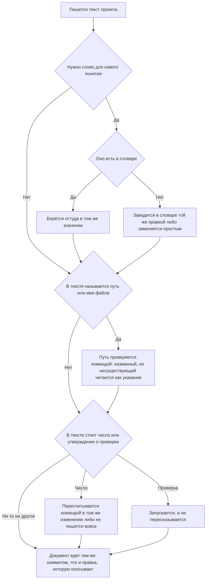

<!-- rt-kit v0.14.0 · rules/doc-style.md · 1915ebc4c532 · правится надстройкой, не здесь -->

# Тексты проекта — как это устроено здесь

Правило под закон `docs/constitution/project-documentation.md`. Закон говорит, что должно
быть верно про тексты; здесь — чем это проверяется в этом дереве и что остаётся за автором.
Устройство спеков и слоёв документации — правило `spec-driven` под тем же законом; здесь
только формулировки.

**Холодная часть:** `pitfalls.md` рядом — ловушки, грабли, на которые уже наступали.
Грузится по требованию, а не вместе с правилом.

## Как это называется здесь

| В законе                           | Здесь                                                                                                              |
| ---------------------------------- | ------------------------------------------------------------------------------------------------------------------ |
| документ                           | любой `.md` вне `docs/archive/`, плюс комментарии в коде, тела коммитов и описания PR                              |
| путь, названный в документе        | строка с расширением в обратных кавычках — её и ищет проверка                                                      |
| правка, которую документ описывает | пара из `docs-guard`: правило и его зеркало, `.proto` и спек, хук и его сценарии, переезд файла и README обеих либ |
| описание прошлого                  | `docs/archive/` — из проверки путей выведено целиком                                                               |

## Где это лежит

В этом дереве — таблица в `implementation.md` рядом. Пути живут там, а не здесь: правило
переносится между репозиториями, раскладка — нет, и путь, названный в правиле, врёт в первом
же дереве, которое держит код иначе.

## Ход

Ход правки текста: что проверяется до записи, где развилка между новым словом и уже занятым, и
что делается со снятым именем.

## Как закон применяется здесь

- **Путь, названный в документе, существует.** Ссылка на переехавший файл читается как
  действующее указание, и следующий читатель заводит снятое заново. Судятся документы,
  которые едут в репозиторий: личный черновик, закрытый `.gitignore` или
  `.git/info/exclude`, проверка не читает — мёртвая ссылка в нём держала гейт пуша, хотя ни
  в одну ветку этот файл не попадёт.
  <!-- rt-when: *.md -->

- **Голое имя и каталог судятся наравне с полным путём.** Имя без каталога ищется по всему
  дереву, каталог — среди каталогов; дерево спрашивается у системы контроля версий, иначе
  каталоги, начинающиеся с точки, не видны и всё, что в них лежит, читалось бы как
  несуществующее. Половина строк в таблицах «Где это лежит» — как раз каталоги.
  <!-- rt-when: *.md -->

- **Описание прошлого из проверки путей выведено целиком.** Архив по устройству называет
  файлы, которых уже нет, и правкой это не лечится. Папка задачи выведена по той же причине:
  раздел находок в ходе работы перечисляет ровно то, чего в дереве нет.
  <!-- rt-when: *.md -->

- **Переносимый текст из сверки адресов выведен, как архив.** Закон, правило и паттерн написаны
  для любого дерева этого класса, и адреса в них принадлежат тому дереву, куда текст ложится:
  `libs/common/util` там, где корни зовутся иначе, — пример, а не мёртвая ссылка. Разложенную
  копию проверка узнаёт по шапке раскладки, исходник — по каталогу, названному в настройке; без
  этого сверка краснеет на полторы сотни строк, ни одна из которых не чинится здесь.
  <!-- rt-when: *.md -->

- **Указатель каталога сверяется с его содержимым обеими сторонами.** Записи каталог набирает
  быстрее, чем читают его указатель, и промах не виден ни в сборке, ни в браузере: запись,
  приехавшая слиянием соседней ветки, просто не попадает в таблицу. Сверенный руками указатель
  расходится снова через сутки.
  <!-- rt-when: *.md -->

- **Имя, названное затем, чтобы сказать «его нет», стоит в списке исключений поимённо.**
  Отличить такое упоминание от ссылки машине нечем, а текст без него теряет смысл: правило и
  замысел предупреждают именно о снятом. Туда же — то, что появляется только после сборки,
  имена веток и правила линтеров: выглядят адресом, адресом не являются.
  <!-- rt-when: *.md -->

- **Документ едет в том же коммите, что и правка, которую он описывает.** Обход — строка
  `Docs-skip: <причина>` в теле коммита; пустая причина не принимается.
  <!-- rt-when: *.md -->

- **Документ не длиннее предела длины.** Текст, который не влезает на экран целиком, дописывают
  в конец, не перечитав начала, — так в одном документе и оказываются два ответа на один вопрос.
  Предел у текста свой, ниже, чем у кода, и считается так же — все строки; выросший спек
  делится на поддомены, а не переносит границу. Два числа вместо одного заведены потому, что
  тексту порог нужен раньше: у кода длину стережёт ещё и линтер, а у прозы — только это число. Описание прошлого из счёта выведено: архив по устройству
  перечисляет то, чего в дереве уже нет, а папка задачи умирает со слиянием.
  <!-- rt-when: *.md -->

- **Файл, уезжающий в описание прошлого, называет в шапке свой прежний адрес.** Записи архива
  ссылались на него, пока он был живым, и после переезда эти ссылки ведут в пустоту: проверка
  путей архив не читает вовсе, поэтому промах не краснеет никогда. Найти переехавшее нечем —
  имя записи архива с прежним адресом не совпадает, и поиск по нему её не показывает. Одна
  строка в шапке дешевле правки всех ссылающихся записей и прошлого не трогает.
  <!-- rt-when: *.md -->

- **Текст, называющий состояние машины, устаревает без единой правки в дереве.** Ловушка о том,
  что на машине установлено, верна в день, когда её пишут, и становится неправдой сама собой —
  ни одна сверка этого не видит: они читают дерево, а состарилась машина. Утверждение о машине
  пишется способом её спросить: команда и то, с чем сверять ответ, вместо снимка ответа.
  <!-- rt-when: *.md -->

## Чего из закона здесь нет

Ни одна из формулировочных договорённостей не проверяется: одна фраза на правило, простые
слова, отсутствие утверждений о будущем, свежесть числа в тексте. Две последние закон прямо
оставляет автору: открытый вопрос пишется теми же словами, что и обещание, а дата и номер —
такие же числа, как то, что пересчитывают.

На комментарии в коде правило распространяется, но гейтом не требуется: он зовёт его только
на `.md`. Расширять требование на каждый `.ts` значило бы шуметь на каждой правке, поэтому
здесь оно держится памятью автора — и цена этого видна: слова из левой колонки словаря живут
в комментариях хуков и `tools/*.mjs` десятками строк, включая текст отказа, который гард
печатает агенту.

## Паттерны

- `doc-style-write` — как формулировать: примеры «так» и «не так», правила для комментариев.
- `doc-style-sweep` — разбор документа, накопившего список работ, на действующее и закрытое.
- `doc-style-trace` — обратный проход: закрытые задачи против текстов, поиск того, чего не
  написали.

## Скилы дерева

Здесь дерево перечисляет свои скилы о документах — строка на скил: как он называется и какие
документы ведёт. У пакета этот раздел пуст: свои документы бывают только у дерева.

Раздел заведён затем, чтобы такому списку было куда встать. Дописанный в чужой раздел, он
уносит его с собой: надстройка сливается по заголовку `## ` и замещает пакетный раздел целиком,
поэтому приписка к «Ловушкам» стирает те пакетные пункты, которых дерево не переписывало, и
пропажу не видно ничем.

Читается этот список раньше остального: правило говорит, как формулировать, а скил дерева — что
у документа этого рода обязательно есть, вплоть до второго файла рядом.
