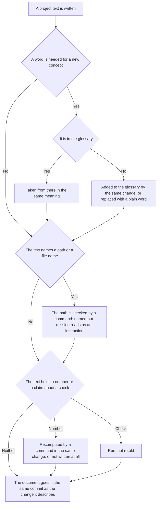

<!-- rt-kit v0.25.0 · rules/doc-style.md · 030d65433647 · правится надстройкой, не здесь -->

# Project texts — how it works here

Rule under the law `docs/constitution/project-documentation.md`. The law says what must be true
about texts; here — what checks it in this tree and what stays with the author. The structure of
specs and documentation layers is the rule `spec-driven` under the same law; here only wording.

**Cold part:** `pitfalls.md` next to it — traps already stepped on. Loaded on demand, not
together with the rule.

## What it is called here

| In the law                      | Here                                                                                                                                  |
| ------------------------------- | ------------------------------------------------------------------------------------------------------------------------------------- |
| document                        | any `.md` outside `docs/archive/`, plus code comments, commit bodies and PR descriptions                                              |
| a path named in a document      | a string with an extension in backticks — that is what the check looks for                                                            |
| the change a document describes | a pair from `docs-guard`: a rule and its mirror, a `.proto` and a spec, a hook and its scenarios, a moved file and both libs' READMEs |
| description of the past         | `docs/archive/` — excluded from the path check entirely                                                                               |

## Where it lives

In this tree — the table in `implementation.md` next to it. Paths live there, not here: the rule
travels between repositories, the layout does not, and a path named in the rule lies in the
first tree that keeps its code differently.

## Flow

The flow of editing a text: what is checked before writing, where the fork is between a new
word and one already taken, and what is done with a dropped name.

## How the law applies here

- **A path named in a document exists.** A link to a moved file reads as a current instruction,
  and the next reader recreates what was removed. Only documents that go into the repository are
  judged: a personal draft covered by `.gitignore` or `.git/info/exclude` is not read by the
  check — a dead link in one held the push gate although the file would never reach any branch.
  <!-- rt-when: *.md -->

- **A bare name and a directory are judged the same as a full path.** A name without a directory
  is searched across the whole tree, a directory among directories; the tree is asked from
  version control, otherwise dot-directories are invisible and everything in them would read as
  missing. Half the lines in the "Where it lives" tables are directories.
  <!-- rt-when: *.md -->

- **The description of the past is excluded from the path check entirely.** By design the
  archive names files that no longer exist, and no edit cures that. The task folder is excluded
  for the same reason: the findings section of its progress lists exactly what the tree lacks.
  <!-- rt-when: *.md -->

- **Portable text is excluded from the address check, like the archive.** A law, a rule and a
  pattern are written for any tree of this class, and the addresses in them belong to the tree
  the text lands in: `libs/common/util` where the roots are named differently is an example, not
  a dead link. The check recognises a laid-out copy by its layout header and a source by the
  directory named in the settings; without that the check turns red on a hundred and fifty lines,
  none of which can be fixed here.
  <!-- rt-when: *.md -->

- **A directory index is checked against its contents from both sides.** A directory gains
  entries faster than its index is read, and the miss shows neither in the build nor in the
  browser: an entry that arrived by merging a neighbouring branch simply does not make the table.
  An index reconciled by hand drifts again within a day.
  <!-- rt-when: *.md -->

- **An index is kept for a directory people read through it, not by walking it.** A directory
  whose file names are built from the task number and branch name is searched by that name, and
  the list answers one question — which entries are here — that a walk answers too. Its cost is
  full nonetheless: every closed piece of work appends a line at the end, and every branch gets a
  conflict marker from the host. The tree declares the list of indexed directories, and an empty
  list is a legitimate state.

- **An index entry is named by its file name in backticks.** The completeness check reads the
  first such name in a table row and knows no other form: a row where the entry is named by a
  single link with a title is empty to it — there is no entry, and it says nothing about what is
  missing. The reader sees everything, which is exactly why the miss survives. A link with a
  title is legitimate and goes in the same row next to the name.
  <!-- rt-when: *.md -->

- **A name mentioned only to say "it is gone" is listed in the exceptions by name.** A machine
  has no way to tell such a mention from a link, and the text loses its meaning without it: the
  rule and the plan warn precisely about what was removed. The same goes for what appears only
  after a build, branch names and linter rules: they look like an address and are not one.
  <!-- rt-when: *.md -->

- **A file placed by the layout needs no pair.** In a consumer tree it has one author — the
  package — and the document about it lives there too. The pair requirement reads the layout
  header: it stands in every laid-out file and tells it from what is written here more reliably
  than any path list. Otherwise the first layout demands a bypass for its whole volume, and a
  bypass declared for a hundred files lifts the requirement from future manual edits of those
  files as well.
  <!-- rt-when: *.md -->

- **A document goes in the same commit as the change it describes.** The bypass is the line
  `Docs-skip: <reason>` in the commit body; an empty reason is not accepted.
  <!-- rt-when: *.md -->

- **A document is no longer than the length limit.** A text that does not fit on one screen gets
  appended to without rereading the beginning — that is how one document ends up with two answers
  to one question. Text has its own limit, lower than code, counted the same way — all lines; a
  spec that has outgrown it is split into subdomains, the boundary is not moved. Two numbers
  instead of one exist because text needs its threshold earlier: code length is also watched by
  the linter, prose only by this number. The description of the past is excluded from the count:
  by design the archive lists what the tree no longer has, and the task folder dies with the
  merge.
  <!-- rt-when: *.md -->

- **A file leaving for the description of the past names its former address in its header.**
  Archive records referenced it while it was alive, and after the move those references lead
  nowhere: the path check does not read the archive at all, so the miss never turns red. There is
  no way to find what moved — the archive record's name does not match the old address, and a
  search by it does not show it. One line in the header is cheaper than editing every referencing
  record and does not touch the past.
  <!-- rt-when: *.md -->

- **The glossary is edited where it is assembled, not where it is read.** It goes into the
  context of every session whole and therefore reads as an ordinary tree document, but it is
  assembled by the layout like every resource with a header: an in-place edit lives until the next
  layout and vanishes silently, and until then the layout refuses the whole glossary. The
  companion of the rule names the override address, and the intro printed by the startup hook
  derives it from the header itself.
  <!-- rt-when: *.md -->

- **An override section replaces the package section of the same name entirely; it does not
  append to it.** So the tree's own words go into their own section, named unlike any section of
  the set: put into a section of the same name, they carry the whole package section away, and
  the loss is visible only to someone who remembers what stood there.
  <!-- rt-when: *.md -->

- **The working glossary and the screen language are two different vocabularies.** The word the
  rules layer uses for its concept means nothing to the person behind the screen: they have not
  read a single rule and will not. A glossary term in a button label, a column or an empty state
  is an internal word shown outward; the word for a person is chosen by whoever speaks to them,
  and it comes from the language of the domain, not from the glossary's left column.
  <!-- rt-when: *.md -->

- **A text naming the state of a machine goes stale without a single edit in the tree.** A trap
  about what is installed on the machine is true on the day it is written and becomes false by
  itself — no check sees it: they read the tree, and it is the machine that aged. A statement
  about the machine is written as the way to ask it: the command and what to compare its answer
  with, instead of a snapshot of the answer.
  <!-- rt-when: *.md -->

- **A record in the description of the past has an expiry, and after it the record is removed.**
  The directory gains a record per closed piece of work and gives nothing back. A removed record
  stays in history — retrieved by the same file name used to find a live one. The tree names the
  expiry with a settings key; there is no default, because what gets removed there is the grill,
  which exists nowhere else. The check demands a day later than the cleanup removes: age is
  counted by the commit minute, and between cleanup at push time and the pipeline run pass
  minutes or hours — without the margin the next record crossed the threshold between them, and
  the run turned red for something other than the branch's change.
  <!-- rt-when: *.md -->

- **A link to a record of the past in a live text lives exactly until the record's expiry.** The
  address check does not read the archive at all, so the dead link turns red not there but in the
  text that referenced it. A live text names the decision in words, not by the record's address.
  <!-- rt-when: *.md -->

- **A diagram is edited by the same change as the text it depicts.** Once they diverge, the
  diagram and the prose both remain readable, and the first to notice is whoever followed the
  diagram: it is shorter, it is read instead of the text, and the divergence derails the work
  entirely. No check sees this — the diagram is set in words and can be told from the text next
  to it only by reading.
  <!-- rt-when: *.md -->

## Texts for a person

- **A text has an addressee, and the register is chosen by them, not by what was written just
  before.** Rules, laws and specs are read by whoever works inside the rules layer; a task, a PR
  and a chat reply — by a person outside. A text written right after editing a spec inherits the
  spec's register: from the inside it looks precise, to the reader outside it is empty. The
  addressee is checked before the first line.
  <!-- rt-when: задача, описание заявки, ответ владельцу -->

A task in the queue, a PR description and a chat reply are read by the owner. They remember the
product and have not read a single rule of the layer: the layer's words are empty to them. The
form of a status reply is the rule `status-report`; here is the language all three texts are
written in.

- **A text for the owner is written in the words of the product, not the words of the rules
  layer.** What the person sees, what does not work for them, what was done about it. PR, run,
  suite, change size, agreement — those are the layer's words; in a text for the owner they are
  replaced with the ones the owner uses. Otherwise they read a text about their own work and do
  not recognise a single screen in it.
  <!-- rt-when: задача, описание заявки, ответ владельцу -->

- **A task shows what broke for the person, not only where the check is red.** A task described
  by file names and check numbers gives no way to decide whether it is urgent: the cost of the
  miss shows in what the person cannot do.
  <!-- rt-when: задача, описание заявки, ответ владельцу -->

- **Passive voice and metaphors are not written in these texts.** "The work has been handed
  over" and "red got in" sound weighty and name neither the action nor who did it. The owner
  decides by them what to do next, and has nothing to decide by.
  <!-- rt-when: задача, описание заявки, ответ владельцу -->

- **The rules layer and the text for the owner have different languages, and the boundary between
  them runs by addressee.** A law, a rule, a pattern, a skill, a check refusal, the glossary and
  the tree's documents are written in English: a session reads them, and English text costs it a
  fifth less with the same articles. A task in the queue, a PR description, a commit body and a
  chat reply are written in the owner's language: the owner reads them, and the rules layer does
  not. A text written in the other side's language is a miss of the same kind as a layer word in
  a task: its addressee will not read it.
  <!-- rt-when: любой текст -->

## What of the law is not here

None of the wording agreements is checked: one sentence per rule, plain words, no claims about
the future, freshness of a number in the text. The last two the law leaves with the author
explicitly: an open question is written in the same words as a promise, and a date and an id are
numbers like the ones that get recomputed.

No check reads the reply to the owner, and the misses in it are the same as in tree text: an
invented fact served alongside a verified one, and an appraisal of someone else's decision
instead of carrying it out. Only the owner catches them — that is, having already read. The rule
applies to a reply the same as to a file; the difference is that the gate answers for the file
and the author for the reply.

The rule extends to code comments but the gate does not demand it: it calls the rule only on
`.md`. Extending the requirement to every `.ts` would mean noise on every edit, so here it is
held by the author's memory — and the cost of that shows: words from the glossary's left column
live in hook comments and `tools/*.mjs` by the dozen, including the refusal text the guard prints
to the agent.

## Patterns

- `doc-style-write` — how to word: "do" and "don't" examples, rules for comments.
- `doc-style-sweep` — sorting a document that has accumulated a work list into current and closed.
- `doc-style-human` — the form of a task, a PR description and a reply to the owner: "do" and
  "don't" samples.
- `doc-style-trace` — the reverse pass: closed tasks against texts, looking for what was not
  written.

## Skills without a law

- `archive-record` — запись о закрытой работе: что в неё пишется, чем она находится без
  перечня и чего в ней не пишут.

## Указателя у описания прошлого здесь нет

Каталог описания прошлого в этом дереве набирает по записи на каждую закрытую работу, и
указателя у него нет: `indexedDirs` в настройке проверок пуст, поэтому статья правила о сверке
указателя обеими сторонами прикладывается здесь к одному каталогу спеков. Почему указателя тут
нет вовсе, говорит само правило; здесь — что из этого вышло в дереве.

- **Перечень, в конец которого дописывает каждая ветка, здесь не заводится вовсе.** Две дописи
  в одно место сводятся сложением сторон, и локально слияние проходит само, но метку конфликта
  на странице заявки хостинг ставит всё равно: настроек слияния он не читает. Дальше эта метка
  зовёт вливать главную ветку в каждую открытую заявку после каждого слияния — то самое, что
  паттерн стопки веток из одного основания запрещает прямо. Пятнадцать открытых заявок разом
  стояли конфликтующими из-за одной строки перечня в каждой.
- **Сложение сторон объявляется только там, где перечень остался.** У снятого оно не нужно, а
  оставленное объявление говорит читателю `.gitattributes`, что файл ещё дописывают.

## Срок хранения описания прошлого здесь — неделя

Число названо ключом `archiveRetentionDays` в настройке проверок. Пакет умолчания не даёт: он
не вправе начать сносить записи у дерева, которое об этом не просило.
