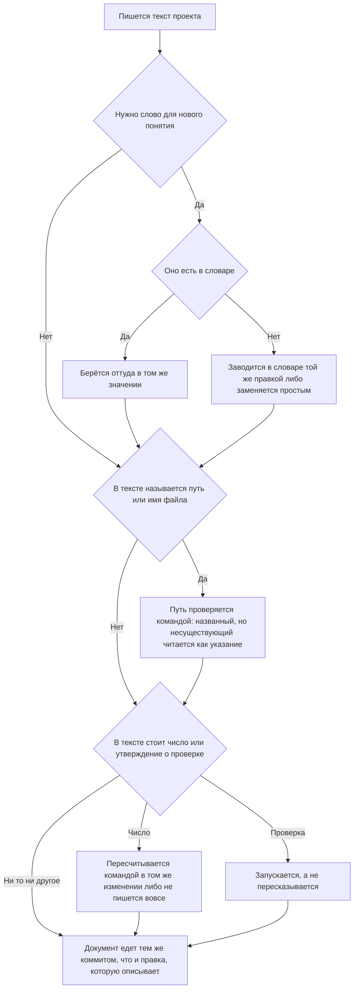

<!-- rt-kit v0.24.0 · rules/doc-style.md · 97ec3b14d85b · правится надстройкой, не здесь -->

# Тексты проекта — как это устроено здесь

Правило под закон `docs/constitution/project-documentation.md`. Закон говорит, что должно
быть верно про тексты; здесь — чем это проверяется в этом дереве и что остаётся за автором.
Устройство спеков и слоёв документации — правило `spec-driven` под тем же законом; здесь
только формулировки.

**Холодная часть:** `pitfalls.md` рядом — ловушки, грабли, на которые уже наступали.
Грузится по требованию, а не вместе с правилом.

## Как это называется здесь

| В законе                           | Здесь                                                                                                              |
| ---------------------------------- | ------------------------------------------------------------------------------------------------------------------ |
| документ                           | любой `.md` вне `docs/archive/`, плюс комментарии в коде, тела коммитов и описания PR                              |
| путь, названный в документе        | строка с расширением в обратных кавычках — её и ищет проверка                                                      |
| правка, которую документ описывает | пара из `docs-guard`: правило и его зеркало, `.proto` и спек, хук и его сценарии, переезд файла и README обеих либ |
| описание прошлого                  | `docs/archive/` — из проверки путей выведено целиком                                                               |

## Где это лежит

В этом дереве — таблица в `implementation.md` рядом. Пути живут там, а не здесь: правило
переносится между репозиториями, раскладка — нет, и путь, названный в правиле, врёт в первом
же дереве, которое держит код иначе.

## Ход

Ход правки текста: что проверяется до записи, где развилка между новым словом и уже занятым, и
что делается со снятым именем.

## Как закон применяется здесь

- **Путь, названный в документе, существует.** Ссылка на переехавший файл читается как
  действующее указание, и следующий читатель заводит снятое заново. Судятся документы,
  которые едут в репозиторий: личный черновик, закрытый `.gitignore` или
  `.git/info/exclude`, проверка не читает — мёртвая ссылка в нём держала гейт пуша, хотя ни
  в одну ветку этот файл не попадёт.
  <!-- rt-when: *.md -->

- **Голое имя и каталог судятся наравне с полным путём.** Имя без каталога ищется по всему
  дереву, каталог — среди каталогов; дерево спрашивается у системы контроля версий, иначе
  каталоги, начинающиеся с точки, не видны и всё, что в них лежит, читалось бы как
  несуществующее. Половина строк в таблицах «Где это лежит» — как раз каталоги.
  <!-- rt-when: *.md -->

- **Описание прошлого из проверки путей выведено целиком.** Архив по устройству называет
  файлы, которых уже нет, и правкой это не лечится. Папка задачи выведена по той же причине:
  раздел находок в ходе работы перечисляет ровно то, чего в дереве нет.
  <!-- rt-when: *.md -->

- **Переносимый текст из сверки адресов выведен, как архив.** Закон, правило и паттерн написаны
  для любого дерева этого класса, и адреса в них принадлежат тому дереву, куда текст ложится:
  `libs/common/util` там, где корни зовутся иначе, — пример, а не мёртвая ссылка. Разложенную
  копию проверка узнаёт по шапке раскладки, исходник — по каталогу, названному в настройке; без
  этого сверка краснеет на полторы сотни строк, ни одна из которых не чинится здесь.
  <!-- rt-when: *.md -->

- **Указатель каталога сверяется с его содержимым обеими сторонами.** Записи каталог набирает
  быстрее, чем читают его указатель, и промах не виден ни в сборке, ни в браузере: запись,
  приехавшая слиянием соседней ветки, просто не попадает в таблицу. Сверенный руками указатель
  расходится снова через сутки.
  <!-- rt-when: *.md -->

- **Указатель заводится каталогу, который читают по нему, а не обходом.** Каталог, где имя файла
  собрано из номера задачи и имени ветки, ищется своим именем, и перечень отвечает на один
  вопрос — какие записи здесь лежат, — на который отвечает обход. Цена у него при этом полная:
  строку в конец дописывает каждая закрытая работа, и каждая ветка получает от хостинга метку
  конфликта. Список каталогов со сверкой указателя объявляет дерево, и пустой список — законное
  его состояние.

- **Запись указателя называется именем файла в обратных кавычках.** Сверка полноты читает
  первое такое имя в строке таблицы и другой формы не знает: строка, где запись названа одной
  ссылкой с заголовком, для неё пуста — записи в ней нет, и о недостающих она молчит. Читателю
  при этом видно всё, и промах держится ровно поэтому. Ссылка с заголовком законна и ставится
  в той же строке при имени.
  <!-- rt-when: *.md -->

- **Имя, названное затем, чтобы сказать «его нет», стоит в списке исключений поимённо.**
  Отличить такое упоминание от ссылки машине нечем, а текст без него теряет смысл: правило и
  замысел предупреждают именно о снятом. Туда же — то, что появляется только после сборки,
  имена веток и правила линтеров: выглядят адресом, адресом не являются.
  <!-- rt-when: *.md -->

- **Файл, положенный раскладкой, пары не требует.** Автор у него в дереве-потребителе один —
  пакет, и документ о нём лежит там же. Требование пары читает шапку раскладки: она стоит в
  каждом разложенном файле и отличает его от написанного здесь надёжнее любого перечня путей.
  Иначе первая же раскладка требует обход на весь свой объём, а обход, объявленный на сотню
  файлов, снимает требование и с будущих правок этих файлов вручную.
  <!-- rt-when: *.md -->

- **Документ едет в том же коммите, что и правка, которую он описывает.** Обход — строка
  `Docs-skip: <причина>` в теле коммита; пустая причина не принимается.
  <!-- rt-when: *.md -->

- **Документ не длиннее предела длины.** Текст, который не влезает на экран целиком, дописывают
  в конец, не перечитав начала, — так в одном документе и оказываются два ответа на один вопрос.
  Предел у текста свой, ниже, чем у кода, и считается так же — все строки; выросший спек
  делится на поддомены, а не переносит границу. Два числа вместо одного заведены потому, что
  тексту порог нужен раньше: у кода длину стережёт ещё и линтер, а у прозы — только это число. Описание прошлого из счёта выведено: архив по устройству
  перечисляет то, чего в дереве уже нет, а папка задачи умирает со слиянием.
  <!-- rt-when: *.md -->

- **Файл, уезжающий в описание прошлого, называет в шапке свой прежний адрес.** Записи архива
  ссылались на него, пока он был живым, и после переезда эти ссылки ведут в пустоту: проверка
  путей архив не читает вовсе, поэтому промах не краснеет никогда. Найти переехавшее нечем —
  имя записи архива с прежним адресом не совпадает, и поиск по нему её не показывает. Одна
  строка в шапке дешевле правки всех ссылающихся записей и прошлого не трогает.
  <!-- rt-when: *.md -->

- **Словарь правится там, откуда он собирается, а не там, где читается.** Он уезжает в контекст
  каждой сессии целиком и оттого читается обычным документом дерева, а собран он раскладкой, как
  всякий ресурс с шапкой: правка на месте живёт до следующей раскладки и пропадает молча, а до
  тех пор раскладка отказывает по словарю целиком. Адрес надстройки называет компаньон правила, и
  вводная, которую печатает хук запуска, выводит его из шапки сама.
  <!-- rt-when: *.md -->

- **Раздел надстройки замещает одноимённый раздел набора целиком, а не дописывает в него.** Своё
  слово поэтому кладётся в свой раздел, названный иначе, чем любой из разделов набора: положенное
  в одноимённый, оно уносит с собой весь пакетный раздел, и потеря видна только тому, кто помнит,
  что там стояло.
  <!-- rt-when: *.md -->

- **Словарь работы и язык экрана — два разных словаря.** Слово, которым слой правил зовёт своё
  понятие, для человека за экраном ничего не значит: он не читал ни одного правила и читать не
  будет. Термин словаря в подписи кнопки, колонки или пустого состояния — это внутреннее слово,
  показанное наружу; слово для человека выбирает тот, кто с ним говорит, и берёт он его из языка
  предметной области, а не из левой колонки словаря.
  <!-- rt-when: *.md -->

- **Текст, называющий состояние машины, устаревает без единой правки в дереве.** Ловушка о том,
  что на машине установлено, верна в день, когда её пишут, и становится неправдой сама собой —
  ни одна сверка этого не видит: они читают дерево, а состарилась машина. Утверждение о машине
  пишется способом её спросить: команда и то, с чем сверять ответ, вместо снимка ответа.
  <!-- rt-when: *.md -->

- **У записи описания прошлого есть срок, и после него запись снимается.** Каталог набирает по
  записи на каждую закрытую работу и не отдаёт обратно ничего. Снятая остаётся в истории —
  достают её тем же именем файла, которым ищут живую. Срок называет дерево ключом настройки;
  умолчания у него нет, потому что снимается там разбор просьбы, которого нет больше нигде.
  <!-- rt-when: *.md -->

- **Ссылка на запись описания прошлого в живом тексте живёт ровно до её срока.** Проверка
  адресов архив не читает вовсе, поэтому мёртвая ссылка краснеет не в нём, а в том тексте,
  который сослался. Живой текст называет решение словами, а не адресом записи.
  <!-- rt-when: *.md -->

- **Схема правится тем же изменением, что и текст, который она изображает.** Разойдясь, схема и
  проза остаются читаемыми обе, и первым это замечает тот, кто пошёл по схеме: она короче, её
  читают вместо текста, и расхождение уводит работу целиком. Ни одна проверка этого не видит —
  схема набрана словами и от текста рядом отличима только чтением.
  <!-- rt-when: *.md -->

## Тексты для человека

- **У текста есть адресат, и слог выбирается по нему, а не по тому, что писалось до него.**
  Правила, законы и спеки читает тот, кто работает внутри слоя правил; задачу, заявку и ответ в
  чате — человек снаружи. Текст, написанный сразу после правки спеки, наследует её слог: изнутри
  он выглядит точным, а для читателя снаружи пуст. Адресат проверяется до первой строки.
  <!-- rt-when: задача, описание заявки, ответ владельцу -->

Задачу в очереди, описание заявки и ответ в чате читает владелец. Он помнит продукт и не читал
ни одного правила слоя: слова слоя для него пустые. Форма ответа о состоянии работы — правило
`status-report`; здесь язык, каким написаны все три текста.

- **Текст для владельца пишется словами продукта, а не словами слоя правил.** Что человек видит,
  что у него не работает, что с этим сделали. Заявка, прогон, набор, объём правки,
  договорённость — это слова слоя; в тексте для владельца они заменяются на те, которыми зовёт
  их он сам. Иначе он читает текст о своей же работе и не узнаёт в нём ни одного экрана.
  <!-- rt-when: задача, описание заявки, ответ владельцу -->

- **Из задачи видно, что сломалось у человека, а не только где красная проверка.** Задача,
  описанная именами файлов и номерами проверок, не даёт решить, срочная она или нет: цена
  промаха видна по тому, чего человек не может сделать.
  <!-- rt-when: задача, описание заявки, ответ владельцу -->

- **Страдательный залог и метафоры в этих текстах не пишутся.** «Работа отдана» и «красное
  въехало» звучат весомо и не называют ни действия, ни того, кто его сделал. Владелец решает по
  ним, что делать дальше, и решать ему не по чему.
  <!-- rt-when: задача, описание заявки, ответ владельцу -->

## Чего из закона здесь нет

Ни одна из формулировочных договорённостей не проверяется: одна фраза на правило, простые
слова, отсутствие утверждений о будущем, свежесть числа в тексте. Две последние закон прямо
оставляет автору: открытый вопрос пишется теми же словами, что и обещание, а дата и номер —
такие же числа, как то, что пересчитывают.

Ответ владельцу не читает ни одна проверка, а промахи в нём те же, что в тексте дерева:
выдуманный факт, поданный наравне с проверенным, и оценка чужого решения вместо исполнения.
Ловит их только владелец — то есть уже прочитав. Правило действует на ответ так же, как на файл;
разница в том, что за файл отвечает гейт, а за ответ — автор.

На комментарии в коде правило распространяется, но гейтом не требуется: он зовёт его только
на `.md`. Расширять требование на каждый `.ts` значило бы шуметь на каждой правке, поэтому
здесь оно держится памятью автора — и цена этого видна: слова из левой колонки словаря живут
в комментариях хуков и `tools/*.mjs` десятками строк, включая текст отказа, который гард
печатает агенту.

## Паттерны

- `doc-style-write` — как формулировать: примеры «так» и «не так», правила для комментариев.
- `doc-style-sweep` — разбор документа, накопившего список работ, на действующее и закрытое.
- `doc-style-human` — форма задачи, описания заявки и ответа владельцу: образцы «так» и «не так».
- `doc-style-trace` — обратный проход: закрытые задачи против текстов, поиск того, чего не
  написали.

## Скилы дерева

- `archive-record` — запись о закрытой работе: что в неё пишется, чем она находится без
  перечня и чем она не является.

## Указателя у описания прошлого здесь нет

Каталог описания прошлого в этом дереве набирает по записи на каждую закрытую работу, и
указателя у него нет: `indexedDirs` в настройке проверок пуст, поэтому статья правила о сверке
указателя обеими сторонами прикладывается здесь к одному каталогу спеков. Почему указателя тут
нет вовсе, говорит само правило; здесь — что из этого вышло в дереве.

- **Перечень, в конец которого дописывает каждая ветка, здесь не заводится вовсе.** Две дописи
  в одно место сводятся сложением сторон, и локально слияние проходит само, но метку конфликта
  на странице заявки хостинг ставит всё равно: настроек слияния он не читает. Дальше эта метка
  зовёт вливать главную ветку в каждую открытую заявку после каждого слияния — то самое, что
  паттерн стопки веток из одного основания запрещает прямо. Пятнадцать открытых заявок разом
  стояли конфликтующими из-за одной строки перечня в каждой.
- **Сложение сторон объявляется только там, где перечень остался.** У снятого оно не нужно, а
  оставленное объявление говорит читателю `.gitattributes`, что файл ещё дописывают.

## Срок хранения описания прошлого здесь — неделя

Число названо ключом `archiveRetentionDays` в настройке проверок. Пакет умолчания не даёт: он
не вправе начать сносить записи у дерева, которое об этом не просило.
