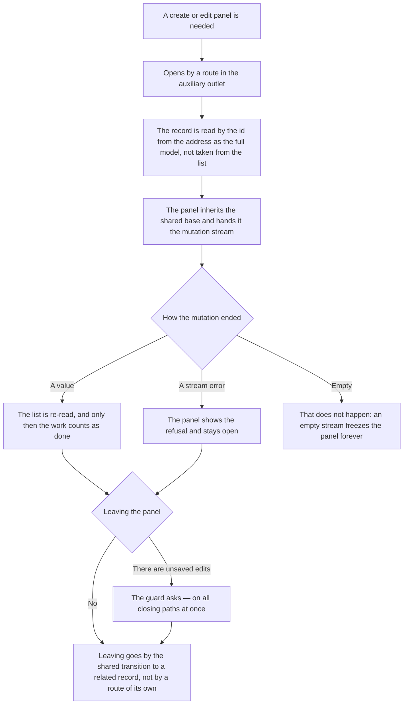

<!-- rt-kit v0.29.0 · rules/entity-conventions.needs-admin.md · 0d25dce69297 · правится надстройкой, не здесь -->

# Entity editing — how it works here

Rule under the law `docs/constitution/entity-editing.md`. The law says how the application behaves
when a record is created and edited; here — what that is assembled from in this tree and how it
looks. The look is spoken of by the rule: the law is silent on it by design.

## What it is called here

| In the law                    | Here                                                                              |
| ----------------------------- | --------------------------------------------------------------------------------- |
| record edit panel             | an aside; opens by a route with `outlet: 'ro'`                                    |
| shared base of the aside      | `RtRouteAsideComponent<T>` — a directive without a selector                       |
| shared base of the list store | `BaseListStoreService`                                                            |
| record                        | `entity`, `entityId`, `isCreateMode` — names from the entity, not from the domain |
| save harness                  | `runMutation` in the panel, `mutate` in the store                                 |
| form pristineness             | `pristineSignal(control)`                                                         |

## Where it lives

In this tree — the table in `implementation.md` next to it. Paths live there, not here: the rule
travels between repositories, the layout does not, and a path named in the rule lies in the first
tree that keeps its code differently.

## Flow

The flow of editing a record from the panel: what opens the panel, what happens to the mutation and
how leaving the panel ends.

## How the law applies here

- **The aside opens by a route in the `ro` outlet, not by a service call.** There is no programmatic
  opening through `RtAsideService.open()` in the admin. This way the panel survives a reload, is
  passed by link and lands in the browser history.
- **Saving goes through `runMutation`, and the panel hands the base the mutation stream and the
  keys.** The busy state, clearing the previous error, the success toast and closing are held by the
  base.
- **The mutation stream must give a value or an error.** An empty stream freezes the panel forever:
  it waits for one or the other, and the owner cannot close it while the save is running.
- **A mutation ends with a re-read list, not with a sent request.** A list re-read after closing
  would show the previous value.
- **The store answers with a stream: success is a value, refusal is a stream error.** No boolean
  answer is left in admin stores: it lost both the saved record and the reason of the refusal.
- **Names come from the entity, not from the domain.** `save`, `remove`, `load` — not
  `createBooking`, `loadBookings`: the domain name is already in the store name.
- **The unsaved-edits guard is set by the panel itself, on all four closing paths.** Checking one
  path is pointless — Esc bypasses what the button catches. The four paths are the button in the
  header, the button in the footer, a press outside the panel and Esc.
- **Leaving the panel goes through `openRelated`, not through an own `router.navigate`.** Absolute
  commands change only the primary branch, the `ro` outlet stays in the address, and the router
  rejects the navigation silently.
- **The record is read by the identifier from the address as the full model, not taken from the
  list.** The list gives the short one.

## What of the law is not here

Reading a record by a separate procedure is not set up everywhere — debt `Q-M-3`. The store file is
called `<entity>.store.ts`; the name `<entity>-store.service.ts` takes it out of both the linter
rule and the rule gate, and the shared stores of requests and objects are edited without the entity
rules at all.

## Patterns

- `entity-aside` — assemble the edit panel: route, base, `runMutation`, header and footer, guard.
- `entity-store` — assemble the entity store: heir of the shared base, `mutate`, refusal keys.

## Pitfalls

- An action with a busy state of its own does not go through the base: subscription polling keeps
  its own `pollingId`, because the panel is not frozen for the minute of polling.
- A tail with `EMPTY` glued to a mutation is handled by `defaultIfEmpty`: otherwise a refusal of the
  glued stream turns a successful save into an endless spinner.
- `routerLink` in the panel is no good: the directive navigates itself, `preventDefault` does not
  stop it, and it bypasses the question about unsaved edits.
- Angular does not accept `viewChild` on a `#` field — the field is declared `protected`.
- Field skeletons go by `resolving()`, not by `busy()`: `busy` covers both saving and reading.
- A panel that stays open after success resets pristineness itself.
- A branch where the ro-route constant was not mixed in differs only in that the header button opens
  nothing there: the build, the lint and the routes of the other branches stay intact.
