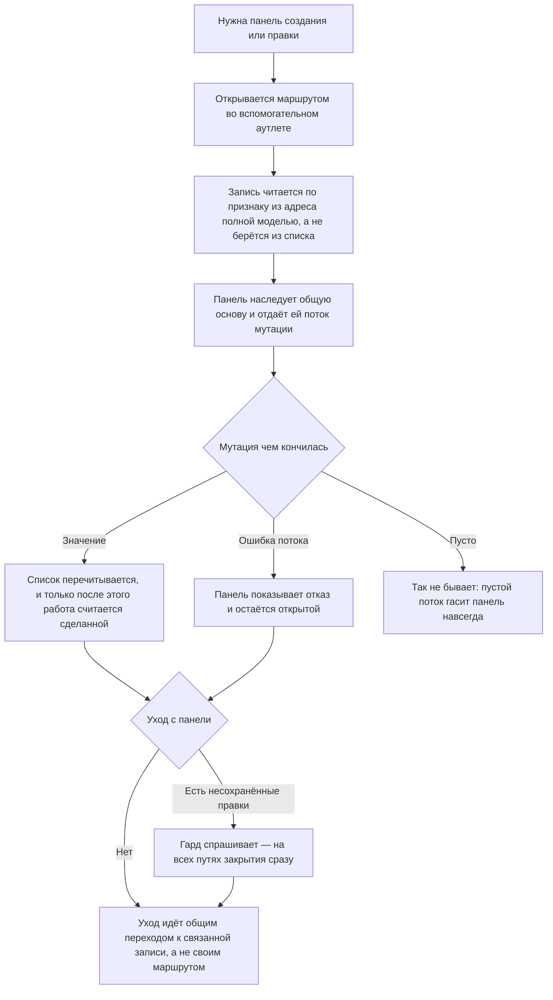

<!-- rt-kit v0.16.0 · rules/entity-conventions.needs-admin.md · 2546884f3e12 · правится надстройкой, не здесь -->

# Правка сущности — как это устроено здесь

Правило под закон `docs/constitution/entity-editing.md`. Закон говорит, как ведёт себя
приложение при создании и правке записи; здесь — из чего это собрано в этом дереве и как
выглядит. Про вид говорит правило: закон о нём молчит намеренно.

## Как это называется здесь

| В законе                      | Здесь                                                                    |
| ----------------------------- | ------------------------------------------------------------------------ |
| панель правки записи          | асайд; открывается маршрутом с `outlet: 'ro'`                            |
| общая основа асайда           | `RtRouteAsideComponent<T>` — директива без селектора                     |
| общая основа списочного стора | `BaseListStoreService`                                                   |
| запись                        | `entity`, `entityId`, `isCreateMode` — имена от сущности, а не от домена |
| обвязка записи                | `runMutation` в панели, `mutate` в сторе                                 |
| нетронутость формы            | `pristineSignal(control)`                                                |

## Где это лежит

В этом дереве — таблица в `implementation.md` рядом. Пути живут там, а не здесь: правило
переносится между репозиториями, раскладка — нет, и путь, названный в правиле, врёт в первом
же дереве, которое держит код иначе.

## Ход

Ход правки записи из панели: чем панель открывается, что происходит с мутацией и чем кончается
уход с панели.

## Как закон применяется здесь

- **Асайд открывается маршрутом в аутлете `ro`, а не вызовом сервиса.** Программного открытия
  через `RtAsideService.open()` в админке нет: так панель переживает перезагрузку, передаётся
  ссылкой и попадает в историю браузера.
- **Запись идёт через `runMutation`, и панель отдаёт основе поток мутации и ключи.** Занятость,
  гашение прежней ошибки, тост об успехе и закрытие держит основа.
- **Поток мутации обязан отдать значение или ошибку.** Пустой поток гасит панель навсегда:
  она ждёт того или другого, а закрыть её владелец не может, пока идёт запись.
- **Мутация завершается перечитанным списком, а не отправленным запросом.** Список,
  перечитанный после закрытия, показал бы прежнее значение.
- **Стор отвечает потоком: успех — значение, отказ — ошибка потока.** Булева ответа у сторов
  админки не осталось: он терял и записанную запись, и причину отказа.
- **Имена берутся от сущности, а не от домена.** `save`, `remove`, `load` — не
  `createBooking`, `loadBookings`: имя домена уже в имени стора.
- **Гард несохранённых правок ставит сама панель и на все четыре пути закрытия.** Проверять
  один путь бессмысленно — Esc обойдёт то, что ловит кнопка. Четыре пути — кнопка в шапке,
  кнопка в футере, нажатие мимо панели и Esc.
- **Уход из панели идёт через `openRelated`, а не своим `router.navigate`.** Абсолютные
  команды меняют только первичную ветку, аутлет `ro` остаётся в адресе, и роутер отклоняет
  навигацию молча.
- **Запись читается по идентификатору из адреса полной моделью, а не берётся из списка.**
  Список отдаёт короткую.

## Чего из закона здесь нет

Чтение записи отдельной процедурой заведено не везде — долг `Q-M-3`. Файл стора называется
`<сущность>.store.ts`; имя `<сущность>-store.service.ts` выводит его и из правила линтера, и
из гейта скилов, и общие сторы заявок и объектов правятся без правил сущностей вовсе.

## Паттерны

- `entity-aside` — собрать панель правки: маршрут, основа, `runMutation`, шапка и футер, гард.
- `entity-store` — собрать стор сущности: наследник общей основы, `mutate`, ключи отказа.

## Ловушки

- Действие со своей занятостью через основу не идёт: опрос подписки держит свой `pollingId`,
  потому что панель на минуту опроса не гасится.
- Хвост с `EMPTY`, приклеенный к мутации, гасится `defaultIfEmpty`: иначе отказ приклеенного
  потока превращает удачную запись в вечный спиннер.
- `routerLink` в панели не годится: директива навигирует сама, `preventDefault` её не
  останавливает, и вопрос о несохранённых правках она обходит.
- `viewChild` на поле с `#` Angular не принимает — поле объявляется `protected`.
- Скелетоны полей идут по `resolving()`, не по `busy()`: `busy` включает и запись, и чтение.
- Панель, которая после успеха остаётся открытой, сбрасывает нетронутость сама.
- Ветка, куда забыли подмешать константу ro-маршрута, отличается только тем, что кнопка в
  шапке на ней ничего не открывает: сборка, линт и маршруты остальных веток при этом целы.
