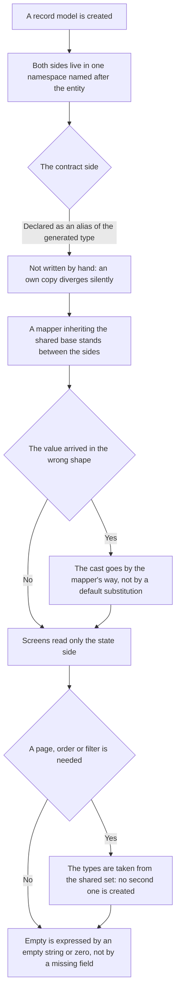

<!-- rt-kit v0.27.0 · rules/entity-models.md · a5809b975886 · правится надстройкой, не здесь -->

# Entity models — how it works here

Rule under the law `docs/constitution/entity-models.md`. The law says how much data the application
requests on each screen; here — how that model is declared in this tree.

## What it is called here

| In the law           | Here                                                                |
| -------------------- | ------------------------------------------------------------------- |
| the contract side    | `Api` — an alias of the generated type from `@<scope>/common/proto` |
| what the screen uses | `State`, all fields `readonly`                                      |
| what goes to a write | `Draft`                                                             |
| the short level      | the nested namespace `Short` with its own `Api` and `State`         |
| translation          | a mapper inheriting `BaseMapper`, one per level                     |

All three sides lie in one namespace `I<Entity>`, and there is nothing to confuse them by in
imports.

## Where it lives

In this tree — the table in `implementation.md` next to it. Paths live there, not here: the rule
travels between repositories, the layout does not, and a path named in the rule lies in the first
tree that keeps its code differently.

## Flow

The flow of creating a model: the two sides of an entity, which of them is written by hand and where
the translation between them stands.

## How the law applies here

- **An entity has two sides, and both lie in the namespace `I<Entity>`.** `Api` repeats the
  contract, `State` is normalised and does not depend on a contract change.
- **The contract side is not written by hand — it is declared as an alias.** An own copy diverges
  from the contract silently, and only one of them compiles.
- **A mapper inheriting `BaseMapper` stands between the sides, and screens read only `State`.** A
  type from the contract does not get into the template.
- **Empty is expressed by an empty string or zero, not by a missing field.** There are no optional
  scalars in the contract, so `null` and `undefined` are not introduced into `State`; the meaning of
  zero is explained by a comment next to the field.
- **A cast goes through `this.typeCast`, not through `??`.** The contract returns default values,
  not emptiness, and a check for `undefined` catches nothing here.
- **The page, order and filter types are taken from `@rt-tools/utils`.** There is no second set of
  these types in the tree: `rt-pagination` accepts `IPageModel` from the same place.

## What of the law is not here

No entity has levels, and the contract does not return a short message — debts `Q-M-1` and `Q-M-2`.
A new entity is created with levels from the start.

An edit of `.proto` is checked by nothing: `buf lint` and `buf breaking` are configured but are part
of neither `check:all` nor CI.

## Patterns

- `entity-models-new` — declare a model and a mapper: the namespace, the levels, `typeCast`,
  contract regeneration.

## Pitfalls

- `getAsType` accepts no default: a value outside the set it writes to the console and returns as
  the string `'unknown'`. A string field with a finite set of values is checked against the set
  explicitly.
- `as Type` in a mapper is forbidden — rule `typescript-conventions`.
- A message field is always optional; a mandatory model field cannot be filled from it without a
  fallback value. The other way, into a request, a `readonly` array does not pass: the init type
  demands a mutable one.
- The admin model and the site model are different. A shared type for two applications would mean
  the site pulls admin fields.
- A removed contract field is marked `reserved` with its number and name: a number given to a new
  field silently breaks an already rolled-out client.
