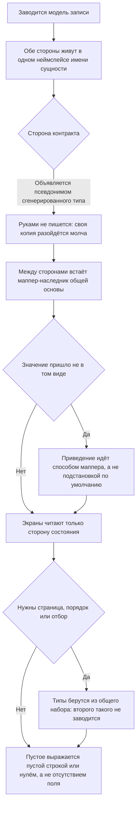

<!-- rt-kit v0.15.0 · rules/entity-models.md · 6f1579e04d9e · правится надстройкой, не здесь -->

# Модели сущностей — как это устроено здесь

Правило под закон `docs/constitution/entity-models.md`. Закон говорит, сколько данных
приложение запрашивает на каждом экране; здесь — как эта модель объявляется в этом дереве.

## Как это называется здесь

| В законе                 | Здесь                                                                |
| ------------------------ | -------------------------------------------------------------------- |
| сторона контракта        | `Api` — псевдоним сгенерированного типа из `@<область>/common/proto` |
| то, чем пользуется экран | `State`, все поля `readonly`                                         |
| то, что уходит на запись | `Draft`                                                              |
| короткий уровень         | вложенный неймспейс `Short` с собственными `Api` и `State`           |
| перевод                  | маппер-наследник `BaseMapper`, свой на каждый уровень                |

Все три стороны лежат в одном неймспейсе `I<Сущность>` и спутать их в импортах нечем.

## Где это лежит

В этом дереве — таблица в `implementation.md` рядом. Пути живут там, а не здесь: правило
переносится между репозиториями, раскладка — нет, и путь, названный в правиле, врёт в первом
же дереве, которое держит код иначе.

## Ход

Ход заведения модели: две стороны сущности, кто из них пишется руками и где стоит перевод между
ними.

## Как закон применяется здесь

- **У сущности две стороны, и обе лежат в неймспейсе `I<Сущность>`.** `Api` повторяет
  контракт, `State` нормализован и от смены контракта не зависит.
- **Сторона контракта руками не пишется — она объявляется псевдонимом.** Своя копия разойдётся
  с контрактом молча, а компилируется из них только одна.
- **Между сторонами стоит маппер-наследник `BaseMapper`, и экраны читают только `State`.** Тип
  из контракта в шаблон не попадает.
- **Пустое выражается пустой строкой или нулём, а не отсутствием поля.** Необязательных
  скаляров в контракте нет, поэтому `null` и `undefined` в `State` не заводятся; смысл нуля
  объясняется комментарием рядом с полем.
- **Приведение идёт через `this.typeCast`, а не через `??`.** Контракт отдаёт значения по
  умолчанию, а не пустоту, и проверка на `undefined` здесь не ловит ничего.
- **Типы страницы, порядка и отбора берутся из `@rt-tools/utils`.** Второго набора этих типов
  в дереве нет: `rt-pagination` принимает `IPageModel` оттуда же.

## Чего из закона здесь нет

Уровней нет ни у одной сущности, и контракт короткого сообщения не отдаёт — долги `Q-M-1` и
`Q-M-2`. Новая сущность заводится сразу с уровнями.

Правка `.proto` не проверяется ничем: `buf lint` и `buf breaking` настроены, но не входят ни в
`check:all`, ни в CI.

## Паттерны

- `entity-models-new` — объявить модель и маппер: неймспейс, уровни, `typeCast`, перегенерация
  контракта.

## Ловушки

- `getAsType` умолчания не принимает: значение вне набора он пишет в консоль и возвращает
  строкой `'unknown'`. Строковое поле с конечным набором значений сверяется с набором явно.
- `as Type` в маппере запрещено — правило `typescript-conventions`.
- Поле-сообщение необязательно всегда; обязательное поле модели им не заполнить без запасного
  значения. Обратно, в запрос, `readonly`-массив не проходит: init-тип требует изменяемый.
- Модель админки и модель сайта — разные. Общий тип на два приложения означал бы, что сайт
  тянет поля админки.
- Снятое поле контракта помечается `reserved` с номером и именем: номер, отданный новому полю,
  ломает уже выкаченного клиента молча.
