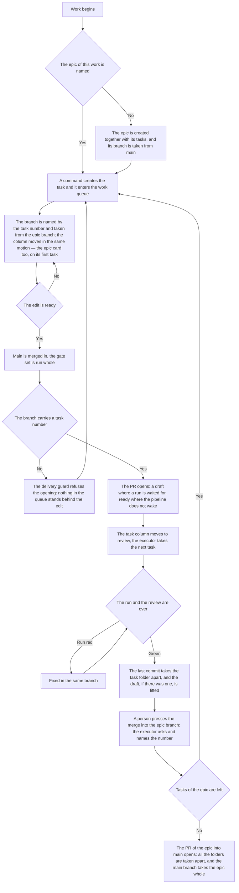

<!-- rt-kit v0.28.0 · rules/git-workflow.github.md · 3680b1a9a8eb · правится надстройкой, не здесь -->

# Delivery — how it works here

Rule under the law `docs/constitution/delivery.md`. The law says what must be true; here — by which
technique it is held in a tree that lives on GitHub. The task key, the board address, the machine
account and the commit scopes are this tree's, in `implementation.md` next to it: they cannot be
guessed and are never shared.

**Cold part:** `pitfalls.md` next to it — traps already stepped on. Loaded on demand, not together
with the rule.

## What it is called here

| In the law                   | Here                                                                                                                                   |
| ---------------------------- | -------------------------------------------------------------------------------------------------------------------------------------- |
| main branch                  | `main`                                                                                                                                 |
| task key                     | the tree's word for its tasks: `board.taskKey` in `.claude/rt-kit/checks.json`, named in `implementation.md` for the reader            |
| epic                         | a repository issue with the epic label, `[<КЛЮЧ>-<номер>] <Возможность>`, and a plan next to it: the order of tasks and how the branches stand |
| epic branch                  | `<КЛЮЧ>-<номер эпика>-<короткий-slug>`, taken from `main`. Task branches are taken from it, and their PRs go into it                   |
| PR of an epic                | PR into `main` from the epic branch; opens after all its tasks are merged and their folders taken apart                                |
| separate branch              | `<КЛЮЧ>-<номер задачи>-<короткий-slug>`, taken from the epic branch. A name without a number (`feat/…`, `fix/…`) is legitimate locally: no PR opens from it |
| task                         | a repository issue `[<КЛЮЧ>-<номер>] <Что не так>`, assignee the machine account; attached PR: `Closes #<номер>` in its body           |
| work queue                   | a GitHub Projects board, not bound to the repository: its `projectsV2` is empty, and a task lands on it only when added                |
| task state in the work queue | a board column ("Status"): created, in progress, in review; names in `implementation.md`. A closed task leaves by merge, not by column. The epic card stands in the same columns and moves with its first task and its own PR |
| PR about a task              | PR title `[<КЛЮЧ>-<номер>] <Что сделано>` — the task's number and title turned into the done; commit type and scope stay out           |
| discussion of an edit        | PR review: reviewer — the repository owner, assignee — the machine account, labels — the same as on the task                           |
| record of an edit            | `type(scope): description`, types `feat`, `fix`, `refactor`, `docs`, `style`, `test`, `chore`, `perf`; scopes: `implementation.md`     |
| author of machine work       | a separate account; its name and the token's place — in `implementation.md`. The token lies outside the repository                     |

## Where it lives

In this tree — the table in `implementation.md` next to it. Paths live there, not here: the rule
travels between repositories, the layout does not, and a path named in the rule lies in the first
tree that keeps its code differently.

## Flow

The flow from task to merge: where the guard stands, what moves the work queue column and how the
work ends.

## How the law applies here

- **A commit into the main branch is refused by the guard.** It finds a commit call anywhere in the
  command and reads the branch at launch: a compound "branch and commit at once" is rejected whole
  — the branch does not exist yet at review.
- **A branch without a task number opens no PR.** Locally it is legitimate; an edit from it is a
  rollout with nothing behind it in the queue. The work moves to a branch with a number.
- **Work begins with the epic, and the branch of a task is taken from the epic branch.** `git
  checkout -b <КЛЮЧ>-<номер задачи>-<slug> <ветка эпика>`; from `main` only the epic branch itself is
  taken — a task branched from `main` carries into it what the epic has not finished.
- **The PR of a task has the epic branch as its base — `gh pr create --base <ветка эпика>`.** Opened
  into `main`, it leaves the epic branch a copy nobody merges.
- **The PR of an epic into the main branch opens after all its tasks are merged and their folders
  are taken apart.** The merge button there means the whole epic, and there is nothing to press it
  for while a task of it is still written.
- **The epic branch carries the plan of the epic and the merges of its tasks, and no edits of its
  own.** An edit made in it goes into `main` unreviewed: nobody opens a PR from that branch to it.
- **The main branch is merged into the epic branch, and the epic branch into the branches of its
  tasks — while the work runs, not before the hand-over.** Otherwise the reviewer sees the edit mixed
  with someone else's, checked from a base that is gone.
- **A wave of branches off one epic branch is checked by a trial merge, not one by one:** each is
  green on its own, and they collide on what one branch cannot show.
- **The next work's branch is taken from the previous one while the chain is unbroken.** `git
  checkout -b <КЛЮЧ>-<номер>-<slug> <предыдущая ветка>`; from the epic branch — only the chain's
  first work.
- **A PR in a chain has the previous branch as its base, not main.** `gh pr create --base
  <предыдущая ветка>` — otherwise the review shows the edit mixed with all under it. The base is
  retargeted by the same motion that merges the lower one — the call is in the pattern.
- **A chain is merged bottom-up, and the order stands in every PR body.** Branch kinship is
  invisible in the list, and the line "stands on #<number>" is the only place it is read.
- **`--hard` is not taken to drop a commit — that is `--soft`.** `reset --hard`, `checkout --
  <path>`, `restore <path>` and `clean -f` erase what is not committed. On a dirty tree the guard
  refuses and names the files; the bypass is `# discard: <reason>` in the command.
- **The lower branch of a chain does not rewrite history — neither `rebase` nor a force push.** The
  host closes the upper PR as merged once its diff goes empty. A lagging branch is fixed by merging
  main in.
- **A divergence inside a chain is resolved by the one who branches.** Both edits are theirs; the
  owner resolving the same at merge time owns neither.
- **Unmet delivery conditions are named in one refusal.** The guard collects and prints them at
  once: everything unmet is known on the first call.
- **A condition known at the start of work is asked at the start.** Creating a branch refuses a base
  without main's tip and a foreign signature email: at push time the fix costs more.
- **The form of a branch name is judged by the tree the command runs in.** The task key of a
  neighbouring tree is its own; a tree with no profile is not judged at all.
- **The base judged is the one named by the command, not the tip of the working copy.** A branch is
  also created straight from `origin/main`, and that command takes the base fresh; a base the tree
  knows nothing of is not judged.
- **A branch without a task number gets no delivery conditions.** A local trial branch is
  legitimate, and it will not go to main.
- **The task key is set once, and all three name forms derive from it.** The task title is assembled
  from it, and by it the audit reads the branch number and the PR title. The tree profile writes the
  branch form with the same pair `<КЛЮЧ>-<номер>`.
- **An unset key refuses work with the queue on the spot.** No default on purpose: a title from an
  empty value matches nothing, and a real discrepancy drowns among false lines.
- **A created task is confirmed by the work queue's answer, not by the creation command's output.**
  A task can be created and never reach the board.
- **The visibility of what was created is checked by the side it is meant for.** A PR is read by a
  person, a task by the work queue, and both read with a token other than the creating one.
- **A refusal is read before it is bypassed by a second way.** It can be an early sign of a write
  limit, and a bypass by another call carries the sign away: the discrepancy surfaces at the owner.
- **The branch number and the PR title number are checked on the spot, the task state — by the
  board.** The format is read from the command text and works offline; the second tier needs
  something to ask with.
- **The task column moves in the same motion as the work.** Branch created — the task is in
  progress, PR opened — awaiting review; the move command does it, not GraphQL calls from memory.
- **The epic card moves by the same command, on the epic number, at two moments.** First task
  taken — the epic is in progress, by the same turn as the task's move; the PR of the epic into
  `main` opens — the epic awaits review. `npm run task:move -- <номер эпика> in-progress`; the
  merge of the epic PR closes the card by the host's rule on a closed item. Left in the first
  column while its tasks merge, the epic reads to the owner as never started.
- **A task left in the first column opens no PR.** By the work queue it reads as not taken, though
  the work is done and published. The tree names the first column itself; unnamed — not judged.
- **The board holds tasks, not PRs about them.** A PR card has no column and never leaves the queue.
  The queue audit finds such cards, a line each.
- **A lagging column is found by the queue audit, not by eye.** It judges the column by the PR both
  ways: an open PR with the task not in review, and review with no open PR.
- **A branch with an open PR lags behind its base silently.** The guard judges the base once, at
  opening, and the run does not see what merged after. The work queue audit counts the lag.
- **The link between a task and an epic is read by the audit both ways.** A one-sided binding looks
  as whole as a two-sided one.
- **Tasks fixed by one edit are merged before the merge.** The second is erased with its number, and
  the missing is added to the first: after the merge the branch went in whole.
- **Work that one session cannot close is marked in two places, and they are audited.** The board
  label and the sessions line in the epic plan say the same to two readers; only what legitimately
  does not split is marked.
- **The tip of an open PR without a run is seen by the work queue audit, unless the pipeline does
  not wake for its base.** A page without a run looks the same as with a green one; where no run
  comes at all, its absence tells nothing and the audit is silent about that PR.
- **What checks a PR whose base is not the main branch is asked before the first PR of an epic
  opens.** The trigger either wakes for it as for one into main, or does not, and then the push
  gate is the only check behind the work — pattern `git-workflow-stack`.
- **A run pushed out of the pipeline queue gets a separate audit line.** It looks failed though it
  never checked the branch, and the step count tells them apart.
- **A draft with a green run on its tip is an audit discrepancy.** A green page permits nothing: the
  host locks the button.
- **One's own drafts are judged all at once, not only the checked-out branch's.** Two signs — a
  green run on the tip and a folder taken apart; a folder still there means ongoing work.
- **Opening a PR is refused while the branch carries its task folder.** Opening is the last point
  where the executor still sees the refusal.
- **One's own open PRs are reread in three places: before a push, on taking a task and after every
  known merge.** A PR goes stale with no action by its author: a neighbouring work merged, and the
  rest lagged that second. Technique — `git-workflow-freshness`.
- **One's own conflicting PR is fixed by the turn's first action, and no new work is taken before
  that.** Work here means creating a task or a branch, moving the column and opening a PR.
- **A conflicting PR of a neighbouring session is not one's own.** One's own branch is the one this
  working copy led — the machine account is shared and tells nothing apart. A neighbour's PR is
  named to the owner, and work is taken as usual.
- **A conflicting open PR is a work queue audit discrepancy.** The conflict arrives with someone
  else's merge, and the host shows the mark only inside the PR.
- **A document goes in the same commit as the edit.** The bypass is the line `Docs-skip: <reason>`
  in the commit body; an empty reason is not accepted.
- **The commit subject is checked against the format on the spot.** A subject parsed by type and
  scope is read as a list, free text — only whole.
- **Before a push all linters are run, not one.** The code linter usually does not read style files
  at all; without a second run nothing checks the styling rules.
- **The build is in the set on a par with lint and unit tests.** The linter does not read types,
  and a type error in uncovered code lives until the merge.
- **On a machine with several runners, any path from the home directory is shared.** Install
  directory, container name and builder name are per project.
- **The push gate set is never narrower than the pipeline set.** A pipeline step with neither a
  line in the set nor a declared exclusion refuses the push: a warning reads as permission.
- **The gate set calls the package default instead of listing it line by line.** Rewritten as
  lines, it leaves tomorrow's hole: a check the package adds never reaches the tree. Sifting out is
  legitimate, by name and with a reason.
- **The final set before a push is read from the state review, not assembled in the head.** The "set
  before push" section prints it whole, naming what the default gave and the set did not take.
- **An exclusion reason naming a task is judged on whether that task is alive.** A dead number
  silently makes the exclusion perpetual.
- **The layout audit stands in the push gate set on a par with lint and the build.** An edit past the
  source piles up silently, and the audit is not in the pipeline.
- **After merging the base in, the check set is revised by what the branch now carries.** Checking by
  what the author edited means checking half: the branch answers whole.
- **The main branch is taken by the remote ref — in words and in actions.** The local one is
  yesterday's snapshot and silent about it: by it a merged branch counts as unmerged.
- **A code edit is handed to a person by an open PR, not by a pushed branch.** A branch reaches no
  inbox and has no discussion, and the PR opens in the turn the executor says the work is handed
  over.
- **What is not ready to merge opens as a draft — `gh pr create --draft`.** The host locks a draft's
  merge button: everything waiting for a run, a rework or an answer goes as a draft.
- **A PR the pipeline does not wake for opens ready, without `--draft`.** Which bases it wakes for
  is read from the pipeline file: where no run comes, a draft waits for nothing and costs a locked
  button and a second turn. The reviewer is set in the same turn.
- **The PR body is written in the turn the PR opens, and next to the sample.** A blank from the day
  before diverges from it, and nobody reads a ready-looking text twice.
- **The draft is lifted by a separate call — `gh pr ready <номер>`.** With it the executor answers
  for readiness: checks passed, no rework left, the work matches the task. Lifting the draft and
  asking to merge are one turn, and a PR opened ready needs no such call.
- **The draft is not lifted from a branch that does not merge.** A green run says "not broken",
  mergeability says "the button can be pressed", and the owner needs the second. Asked from the
  host's `mergeable` field; a local merge does not derive it.
- **An index that branches only append lines to is declared a union of both sides.** A conflict there
  is no dispute: both additions are needed whole. The declaration does **not** clear the mergeability
  mark — it clears when the branch has absorbed main and that reached the host.
- **An edit brought to a commit is brought to the host in the same turn.** The owner sees the old
  state and reads it as "nothing done". What stays in the tree is named with a reason — in the
  owner's words, not a list of leftovers.
- **The working tree is emptied before the PR opens, not after.** `git status --porcelain` is asked
  in the same turn as the opening: what is uncommitted goes to the host by a commit before it, or
  is named. A push after the opening moves the tip past the green run the body names.
- **A push into a branch that has an open PR is followed by rereading its body.** The statement
  about a green run names the tip by its sha, and moving the tip makes it false in silence: no check
  reads a PR body.
- **The draft is not lifted while the PR has no review.** The guard reads the requested reviewer and
  the review left: a lifted draft reads as "may be merged", and there is nobody to merge.
- **The PR merge is pressed by a person, not by the work's executor.** Button and merge call are
  equal. The executor merges their own PR only when a person said so about this PR; said about
  one, it does not carry to the next.
- **The identity of the call opening a PR is guarded by the delivery guard, not by the executor's
  memory.** It shows in the command text only by an explicit token substitution; judged is the
  clash with the reviewer, not the account name.
- **The host client's active account is chosen per machine, not per tree; the machine account is
  substituted per call, never made active.** A login as it hijacks every neighbouring session.

- **The PR author cannot be its reviewer.** GitHub accepts a self review request and silently does
  not create it. Only a request and a review not from the author count.
- **The host client call goes from the tree, and a command chain does not check the outcome.** Outside
  the tree the client refuses, and the next link carries the rest to the host.
- **PR labels, assignee and reviewer are set by `gh api` calls, not by `gh pr edit`:** that one
  refuses about Projects.
- **The board is edited by a GraphQL query by the board id, not by the owner's name.**
- **The machine commit's email is copied from the companion, not typed from memory.** The address
  `<число>+<логин>@users.noreply.github.com` matches by the number: with a foreign one the commit
  leaves signed by a stranger. The guard refuses the push over it.
- **The identity of the machine account is confirmed by the host's answer:** asked with the token,
  login and number come together.
- **Guard scenarios set the git settings themselves, not take them from the machine.** Author, email
  and signature go as `-c` flags.

- **Every commit of the branch's contribution is signed by the machine account, and the push set
  checks it.** The guard judges a commit that named itself as it; a person's passes by.
- **The PR state is reread from the host right after publishing.** Opening and setting a reviewer
  answer zero even having done nothing.
- **The author of an open PR and whether it has a reviewer are audited by the work queue.** Before the
  merge neither miss shows: a PR opened by a person never gets a reviewer.
- **Reviewers are asked by a REST call, not by the client's selection.** Its fields come from GraphQL,
  which the account has no rights to: "matched" is not told from "nothing to ask with".

- **A second working copy is for reading, and the call goes from the copy the session stands in.**
  The gate runs its set where the session was started: someone else's uncommitted work refuses the
  call, and its own contribution passes unchecked.
- **The working tree is not emptied for a tool run.** The comparison goes on a second copy: stashing
  takes uncommitted work where neither the tree state nor the audit sees it.

## What of the law is not here

The delivery guard stands on the agent's commands, so a branch created by hand in the editor it does
not see: its name is held by memory. Work is recognised by the task title and the PR, and the queue
audit never judges the branch name.

The guard does not move a task to in progress: it does not edit the board at all. The move is held
by memory and the task creation command's hint; a task left in the first column the guard names at
PR opening, other column discrepancies the queue audit finds. The epic card is held by memory
alone: no guard reads its column at branch creation, and the queue audit does not judge it.

The freshness of main's tip the guard asks by the second tier — the same technique as the task
state. The first tier works offline: the local ref answers whether the branch lags what lies in the
tree, the remote one — whether the ref itself went stale.

## Patterns

- `git-workflow-commit` — task, branch, commit and push as the machine account.
- `git-workflow-pr` — opening a PR, the draft and lifting it, the body, reviewer, labels, state.
- `git-workflow-merge` — the base merged into the branch standing on it, the conflict resolved.
- `git-workflow-stack` — a chain of branches: branching from the previous, the PR base, the handover
  order.
- `git-workflow-freshness` — one's own open PRs: reading all at once, lag against a dispute.
- `git-workflow-pr-ready` — finishing the handed-over: the lifted draft, the red run's analysis, a
  wave over the chain.

## The language of the record of an edit

- **A commit description is written in the language of the tree.** The history of this repository is
  Russian throughout, and an English line reads in it as foreign. What is judged is the presence of a
  Russian letter, not the absence of Latin: the subject lawfully holds the edit area, a version
  number, a command name and the service mark that skips the pipeline. The check stands on a git hook
  and judges the hand; a pipeline record goes past it, and the language there is held by the release
  templates.
