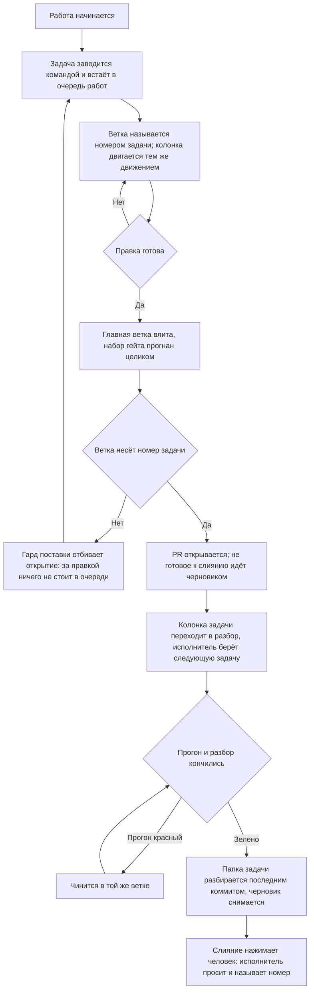

<!-- rt-kit v0.17.0 · rules/git-workflow.github.md · 0c735f1fc88f · правится надстройкой, не здесь -->

# Поставка — как это устроено здесь

Правило под закон `docs/constitution/delivery.md`. Закон говорит, что должно быть верно;
здесь — каким приёмом это держится в дереве, лежащем на GitHub. Ключ задач, адрес борды,
учётная запись машинной работы и области коммита — при этом дереве, в `implementation.md`
рядом: их не угадать, и общими они не бывают.

**Холодная часть:** `pitfalls.md` рядом — ловушки, грабли, на которые уже наступали.
Грузится по требованию, а не вместе с правилом.

## Как это называется здесь

| В законе                         | Здесь                                                                                                                                                                                           |
| -------------------------------- | ----------------------------------------------------------------------------------------------------------------------------------------------------------------------------------------------- |
| главная ветка                    | `main`                                                                                                                                                                                          |
| ключ задач                       | короткое слово, которым дерево зовёт свои задачи; задаётся ключом `board.taskKey` в `.claude/rt-kit/checks.json`, а в `implementation.md` называется для читателя                               |
| отдельная ветка                  | `<КЛЮЧ>-<номер задачи>-<короткий-slug>`. Имя без номера (`feat/…`, `fix/…`) законно, пока ветка живёт локально: PR с неё не откроется                                                           |
| задача                           | issue репозитория, заголовок `[<КЛЮЧ>-<номер>] <Что не так>`, исполнитель — учётная запись машинной работы; PR прикрепляется к нему строкой `Closes #<номер>` в теле                            |
| очередь работ                    | борда GitHub Projects. К репозиторию она не привязана: `projectsV2` у него пуст, и задача попадает на борду только явным добавлением                                                            |
| состояние задачи в очереди работ | колонка борды — поле «Status»: заведённая, взятая в работу, ждущая разбора. Имена колонок — в `implementation.md`; закрытая задача уходит из очереди мержем, а не переводом в последнюю колонку |
| PR о задаче                      | заголовок PR `[<КЛЮЧ>-<номер>] <Что сделано>` — тот же номер, что у задачи, и её название, переведённое в сделанное; тип и область коммита сюда не идут                                         |
| обсуждение правки                | разбор PR: ревьювер — владелец репозитория, исполнитель — учётная запись машинной работы, метки — те же, что у задачи                                                                           |
| запись о правке                  | коммит формата `type(scope): description` — типы `feat`, `fix`, `refactor`, `docs`, `style`, `test`, `chore`, `perf`; области — в `implementation.md`                                           |
| автор машинной работы            | отдельная учётная запись; её имя и место токена — в `implementation.md`. Токен лежит вне репозитория                                                                                            |

## Где это лежит

В этом дереве — таблица в `implementation.md` рядом. Пути живут там, а не здесь: правило
переносится между репозиториями, раскладка — нет, и путь, названный в правиле, врёт в первом
же дереве, которое держит код иначе.

## Ход

Ход работы от задачи до слияния: где стоит гард, что двигает колонку очереди работ и чем
работа кончается.

## Как закон применяется здесь

- **Коммит в главную ветку отбивается гардом.** Гард ищет вызов коммита в любом месте команды и
  смотрит текущую ветку на момент запуска: составная «создать ветку и сразу коммитить»
  отклоняется целиком — ветки в момент разбора ещё нет.
- **Ветка без номера задачи PR не открывает.** Локально она законна, но правка из неё — выкатка,
  за которой в очереди работ ничего не стоит. Заводится задача, и работа переносится в ветку с
  её номером.
- **Главная ветка влита в ветку задачи до открытия PR.** Гард отбивает открытие, пока вершина
  главной не стала предком текущей, и называет расхождение числом коммитов: иначе ревьювер видит
  свою правку вперемешку с чужой, а проверено всё было от основания, которого уже нет.
- **Волна веток от одной главной проверяется пробным слиянием, а не по одной:** каждая зелена
  сама по себе, а сталкиваются они тем, чего на отдельной ветке не видно.
- **Ветка следующей работы отводится от предыдущей, пока череда не прервалась.** `git checkout -b
  <КЛЮЧ>-<номер>-<slug> <предыдущая ветка>` вместо `origin/main`; от главной — только первая
  работа череды и та, что предыдущей не касается. Иначе первое же слияние делает расходящимися
  все остальные разом.
- **У заявки в череде основанием стоит предыдущая ветка, а не главная.** `gh pr create --base
  <предыдущая ветка>` — иначе разбор показывает свою правку вперемешку со всем, что под ней. Базу
  влитой нижней хостинг переносит сам.
- **Череда вливается снизу вверх, и порядок стоит в теле каждой заявки.** Родство веток по
  списку не видно: строка «стоит на #<номер>» — единственное место, где владелец это прочтёт.
- **Нижняя ветка череды историю не переписывает — ни `rebase`, ни силовой отправкой.** Хостинг
  закрывает заявку верхней как слитую при пустой главной. Отставшая чинится вливанием главной.
- **Расхождение внутри череды разбирается тем, кто ветвится.** У него обе правки свои; у
  владельца, разбирающего то же при слиянии, нет ни одной.
- **Несошедшиеся условия поставки называются одним отказом, а не по одному.** Гард копит их все и
  печатает разом: всё несошедшееся известно на первом вызове.
- **Условие, известное в начале работы, спрашивается в начале.** Заведение ветки отбивает
  основание без вершины главной и чужую почту в подписи. На пуше те же проверки остаются вторым
  рубежом, но стоят дороже: основание чинится вливанием с конфликтом, подпись — переписыванием
  ветки.
- **Судится то основание, которое названо командой, а не вершина рабочей копии.** Ветку заводят и
  от `origin/main` прямо — этой командой основание как раз и берут свежим. Основание, о котором
  дерево ничего не знает, не судится вовсе.
- **Ветка без номера задачи условий поставки не получает.** Локальная ветка под пробу законна, а
  требовать от неё свежего основания значило бы отбивать работу, которая в главную не поедет.
- **Ключ задач задаётся один раз, и все три формы имени выводятся из него.** По нему собирается
  заголовок задачи, из него достаётся номер ветки, по нему же сверка читает заголовок PR. Форма
  ветки в профиле дерева пишется той же парой `<КЛЮЧ>-<номер>`.
- **Незаданный ключ отбивает работу с очередью на месте.** Модуль борды отказывает при первом же
  вызове и называет, где ключ задаётся. Умолчания нет намеренно: собранный из пустого значения
  заголовок не совпадает ни с чем, и настоящее расхождение тонет среди ложных строк.
- **Заведённая задача подтверждается ответом очереди работ, а не выводом команды заведения.**
  Напечатанный номер значит «вызов прошёл»: задачу можно завести и не довести до борды.
  Спрашивается очередь по номеру, и ответ читается колонкой и исполнителем.
- **Видимость заведённого проверяется той стороной, которой оно предназначено.** Заявку читает
  человек, задачу — очередь работ, и оба читают не тем токеном, которым заводили: ограниченная
  запись отвечает им «не найдено», а заводившей — успехом.
- **Отказ читается прежде, чем его обходят вторым способом.** Он бывает ранним признаком
  ограничения записи, и обход другим вызовом уносит признак с собой: расхождение всплывает у
  владельца. Ограничение от исчерпания отличает ответ о пределах — там ноль.
- **Номер ветки и номер в заголовке PR сверяются на месте, а состояние задачи — по борде.**
  Формат читается из текста команды и работает без сети; задача, колонка, исполнитель и разбор —
  только когда есть чем спросить. Нет сети или токена — второй ярус молча пропускается.
- **Колонка задачи двигается тем же движением, что и работа.** Ветка заведена — задача во взятых
  в работу, PR открыт — в ждущих разбора; делает это команда перевода, а не вызовы GraphQL по
  памяти. Перевод идёт сразу за шагом: очередь читают между шагами, а не после них.
- **Задача, оставшаяся в первой колонке, PR не открывает.** По очереди работ она читается как
  невзятая, хотя работа сделана и выложена. На заведении ветки колонка не спрашивается — там её
  ещё не двигали. Имя первой колонки дерево называет само; не названо — колонка не судится.
- **На борде стоят задачи, а не PR о них.** Карточка PR колонки не имеет, из очереди не уходит и
  остаётся навсегда; заводит её правило борды или рука, и то и другое выключается. Находит такие
  карточки сверка очереди — строкой на каждую.
- **Отставшая колонка находится сверкой очереди, а не глазами.** Она судит колонку по PR в обе
  стороны: открытый PR при задаче не в разборе и разбор без открытого PR. Момента, когда задачу
  берут в работу, ей не видно: ветки на борде нет.
- **Ветка с открытой заявкой отстаёт от главной молча.** Основание гард судит раз, в минуту
  открытия, а влитого после не видит и прогон. Отставание считает сверка очереди работ.
- **Связь задачи с эпиком сверка читает в обе стороны.** Односторонняя привязка выглядит целой
  так же, как двусторонняя: читатель приходит то от замысла эпика, то от карточки. Держалась она
  подражанием — тело с образца соседней задачи везло строку вместе с формой.
- **Задачи, чинящиеся одной правкой, сливаются до мержа.** Вторая стирается вместе с номером, а
  недостающее дописывается в первую: после мержа ветка въехала целиком.
- **Работа, которую одним заходом не закрыть, помечена в двух местах, и они сверяются.** Метка на
  борде и строка о заходах в замысле эпика говорят одно и то же двум читателям. Помечается только
  то, что законно не делится.
- **Вершина открытого PR без прогона видна сверкой очереди работ.** Страница без прогона выглядит
  так же, как с зелёным: цвета нет ни там, ни там. Сверка спрашивает вершину, считает сам факт
  прогона, а не цвет, и свежей вершине даёт время.
- **Прогон, вытесненный из очереди конвейера, сверка называет отдельной строкой.** Он выглядит
  упавшим, хотя ветку не проверял; отличает их число заданий — у него ноль.
- **Готовность отданной работы живёт до следующего слияния в главную.** Влитая соседняя делает
  свою конфликтующей. После каждого слияния сливаемость своих заявок спрашивается заново — одним
  вызовом на все.
- **Черновик при зелёном прогоне на вершине — расхождение сверки.** Зелёная страница черновика
  владельцу ничего не разрешает: кнопка заблокирована хостингом. Внутри хода это закрывает гард,
  между ходами — сверка.
- **Свои черновики судятся все разом, а не тот один, чья ветка сейчас взята.** Каждый черновик
  машинной записи судится двумя признаками — зелёный прогон на его вершине и разобранная папка
  задачи в его ветке; лежащая папка означает идущую работу.
- **Открытие PR отбивается, пока ветка везёт папку своей задачи.** Кнопку слияния нажимает
  человек там, где гардов нет, и открытие — последняя точка, где отказ ещё виден тому, кто может
  его выполнить.
- **Свои открытые заявки перечитываются в трёх местах: перед пушем, при взятии новой задачи и после
  каждого известного слияния.** Заявка устаревает без единого действия автора: человек влил соседнюю
  работу, главная ушла вперёд, и остальные в ту же секунду стали отставшими. Сверка очереди это
  находит, но зовут её руками, а гарды судят один ход и о соседних заявках не знают: без этого
  движения о конфликте говорит владелец, и работа стоит до его слова.
- **Конфликтующий открытый PR — расхождение сверки очереди работ.** Конфликт приезжает чужим
  слиянием и по списку не виден: метку хостинг показывает только внутри самого PR. Непосчитанная
  сливаемость расхождением не считается.
- **Свои открытые заявки перечитываются перед пушем, при взятии задачи и после каждого
  известного слияния.** Чужое слияние отставляет их все разом; приём — `git-workflow-freshness`.
- **Документ едет в том же коммите, что и правка.** Обход — строка `Docs-skip: <причина>` в теле
  коммита; пустая причина не принимается.
- **Заголовок коммита сверяется с форматом на месте.** Разобранный по типу и области заголовок
  читается списком, а свободный текст — только целиком.
- **Перед пушем прогоняются все линтеры, а не один.** Линтер кода обычно не читает файлы стилей
  вовсе, и правила оформления без второго прогона не проверяет ничто.
- **Сборка входит в набор наравне с линтом и юнитами.** Линтер типов не читает, а юниты читают
  только импортированное тестом: ошибка типов в непокрытом коде доживает до сборки образа, то
  есть до мержа.
- **Набор гейта пуша не бывает уже набора конвейера.** Гейт — обещание, что пуш не приедет
  красным. Шаг конвейера, которому в наборе гейта нет ни строки, ни объявленного исключения с
  причиной, отбивает пуш, а не печатается рядом: предупреждение читается как разрешение.
- **Набор гейта зовёт умолчание пакета, а не перечисляет его строками.** Переписанный строками, он
  закрывает сегодняшнюю дыру и оставляет завтрашнюю: заведённая пакетом проверка до дерева не
  доедет. Отсеивать из умолчания законно, но поимённо и с причиной.

- **Причина исключения, называющая задачу, судится на живость этой задачи.** Мёртвый номер делает
  исключение бессрочным, не сказав об этом ни строкой. Спрашивается тем же ярусом, что состояние
  задачи у гарда: нет сети или доступа — пропускает молча.
- **Сверка раскладки стоит в наборе гейта пуша наравне с линтом и сборкой.** Правка мимо источника
  копится молча: раскладка отказывает по правленому файлу целиком. Статьёй выше это не покрывается —
  сверки нет в конвейере.
- **После вливания главной ветки набор проверок пересматривается по тому, что ветка везёт
  теперь.** Вливание меняет состав правки: проверять по тому, что правил автор, — значит
  проверять половину, а отвечает ветка целиком.
- **Утверждение о главной ветке делается по удалённой ссылке, а не по локальной.** Локальная
  протухает в ту минуту, когда её подтянули, и молчит об этом. Сравнение пишется от `origin/main`
  целиком: смешав удалённую ссылку с локальной в одной команде, промах изнутри выглядит верным.
- **Правка кода отдаётся человеку открытым PR, а не запушенной веткой.** Ветка ему не
  показывается, во входящие не приходит и обсуждения не имеет: до открытия PR правки для человека
  нет. Открывается он тем же ходом, которым исполнитель говорит, что работу отдаёт.
- **Не готовое к слиянию открывается черновиком — `gh pr create --draft`.** Кнопка слияния у
  черновика заблокирована хостингом, поэтому «выложено на обозрение» и «можно вливать» перестают
  выглядеть одинаково. Черновиком идёт всё, что ждёт прогона, доработки или ответа на вопрос.
- **Черновик снимается отдельным вызовом — `gh pr ready <номер>`.** Им исполнитель отвечает за
  готовность: проверки пройдены, доработок не осталось, работа сходится с задачей. Снятие
  черновика и просьба влить — один ход, а не два разных дня.
- **Черновик не снимается с ветки, которая не сливается.** Зелёный прогон говорит «не сломано»,
  сливаемость — «кнопку можно нажать», и владельцу нужно второе. Спрашивается у хостинга: поле
  `mergeable` приходит тем же ответом, что автор и ревьювер. Из локального вливания она не
  выводится.
- **Указателю, в который ветки только дописывают строки, объявляется сложение обеих сторон.**
  Конфликт там не спор: обе допись нужны целиком. Объявление снимает ручное разрешение, но
  **метку сливаемости не гасит** — она гаснет, когда ветка вобрала главную и это уехало на
  хостинг.
- **Правка, доведённая до коммита, доводится до хостинга тем же ходом.** Владелец видит прежнее
  состояние и читает его как «не сделано ничего», а сделанное лежит там, где его не видит никто.
  Оставшееся в дереве называется причиной — словом владельца, а не списком остатков.
- **Черновик не снимается, пока у PR нет разбора.** Гард смотрит запрошенного ревьювера и
  оставленный отзыв: снятый черновик читается как «можно вливать», а вливать некому. Судится и
  вызов без номера — без него клиент берёт PR текущей ветки.
- **Мерж PR нажимает человек, а не исполнитель работы.** Кнопка и вызов слияния равны: запрет на
  них один. Исполнитель сливает свой PR только тогда, когда человек сказал это прямо и про этот
  PR; сказанное об одном на следующий не переносится, а молчание разрешением не бывает.
- **Личность вызова, открывающего заявку, стережёт гард поставки, а не память исполнителя.** Она
  приходит окружением, и в тексте команды её видно только явной подстановкой токена. Ответ
  хостинга об авторе гард спрашивает на снятии черновика: влитую заявку не переоткрыть.

- **Автор PR не может быть его ревьювером.** Запрос разбора на самого себя GitHub принимает и
  молча не создаёт — разбор при этом выглядит запрошенным. В разборе считаются только запрос и
  отзыв не от автора.
- **Вызов клиента хостинга идёт из дерева, а связка команд исхода не проверяет.** Репозиторий
  клиент берёт у текущего каталога и вне дерева отказывает; следующее звено связки увозит на
  хостинг то, что осталось от отказавшего, поэтому тело читается обратно тем же ходом.
- **Метки, исполнитель и ревьювер PR ставятся вызовами `gh api`, а не `gh pr edit`.** На старой
  борде `gh pr edit` отвечает отказом про Projects (classic) и до правки не доходит.
- **Борда правится запросом GraphQL по идентификатору самой борды, а не по имени владельца.**
- **Почта машинного коммита копируется из компаньона, а не набирается по памяти.** Служебный адрес —
  `<число>+<логин>@users.noreply.github.com`, и сопоставляется он по числу: коммит с чужим числом
  уезжает подписанным посторонним. Ту же строку держит профиль дерева, и гард отбивает пуш.
- **Личность машинной записи подтверждается ответом хостинга, а не узнаванием строки.** Спрашивается
  токеном самой записи, ответом о себе: логин и число приходят вместе — поиск по числу для
  ограниченной записи отвечает «не найдено».
- **Сценарии гардов задают настройки git сами, а не берут их с машины.** Включённая на машине
  подпись уводит git в агент ключей, а заблокированный агент роняет весь набор. Автор, почта и
  подпись передаются флагами `-c` прямо в команду.

- **Каждый коммит вклада ветки подписан машинной записью, и это проверяется набором пуша.** Гард
  поставки судит только коммит, назвавшийся ею, и подписанный человеком проходит мимо: там, где
  человек не коммитит вовсе, это промах, а не законный случай.
- **Состояние заявки перечитывается у хостинга сразу после публикации, а не берётся из кода
  возврата.** Открытие заявки и постановка ревьювера отвечают нулём и тогда, когда сделали не то
  или не сделали ничего.
- **Автор открытой заявки и наличие у неё ревьювера сверяются очередью работ.** До слияния оба
  промаха не видны ничем: заявка, открытая человеком, ревьювера не получит никогда, и выглядит
  это как заявка, которой его просто не поставили.
- **Ревьюверы спрашиваются вызовом REST, а не выборкой клиента.** Её поля собирает GraphQL, а он
  требует прав, которых у машинной записи нет: «сошлось» перестаёт отличаться от «спросить было
  нечем».

## Чего из закона здесь нет

Гард поставки стоит на командах агента, поэтому ветку, заведённую руками в редакторе, он не
видит: имя такой ветки держится памятью. Отдельной проверки под него не заводится — работа
опознаётся заголовком задачи и PR. Сверка очереди имя ветки не судит вовсе.

Задачу в работу гард не переводит: борду он не правит — правка борды в разборе команды падала бы
вместе со связью. Перевод держится памятью и подсказкой команды заведения задачи; задачу,
оставшуюся в первой колонке, гард называет на открытии PR, прочие расхождения колонки находит
сверка очереди.

Свежесть вершины главной ветки гард спрашивает вторым ярусом — тем же приёмом, что и состояние
задачи. Первый ярус работает без сети: локальная ссылка отвечает, отстала ли ветка от лежащего
в дереве, удалённая — не протухла ли сама ссылка.

## Паттерны

- `git-workflow-commit` — задача, ветка, коммит и пуш от учётной записи машинной работы.
- `git-workflow-pr` — открытие PR, черновик и его снятие, тело, ревьювер, метки, состояние.
- `git-workflow-merge` — главная ветка влита в ветку задачи, конфликт разобран.
- `git-workflow-stack` — череда веток: ветвление от предыдущей, основание заявки, порядок отдачи.
- `git-workflow-freshness` — свои открытые заявки: чтение всех разом, отставание против спора.

## Язык записи о правке

- **Описание коммита пишется на языке дерева.** История этого репозитория русская целиком, и
  английская строка читается в ней как чужая. Судится присутствие русской буквы, а не
  отсутствие латиницы: в заголовке законно стоят область правки, номер версии, имя команды и
  служебная пометка пропуска конвейера. Проверка стоит на хуке гита, то есть судит руку; запись
  конвейера идёт мимо хука, и язык там держат сами шаблоны выпуска.
