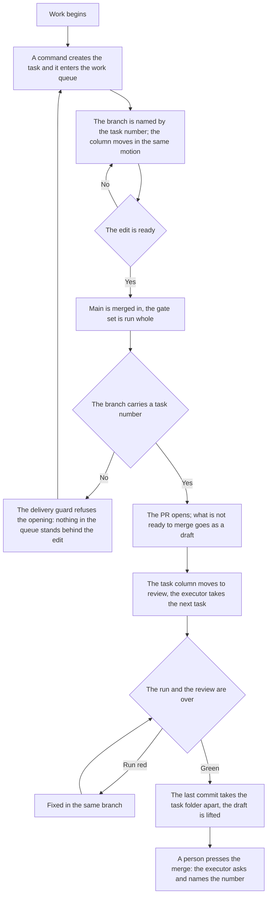

<!-- rt-kit v0.25.0 · rules/git-workflow.github.md · 6fd4d7f25872 · правится надстройкой, не здесь -->

# Delivery — how it works here

Rule under the law `docs/constitution/delivery.md`. The law says what must be true; here — by which
technique it is held in a tree that lives on GitHub. The task key, the board address, the machine
account and the commit scopes are this tree's, in `implementation.md` next to it: they cannot be
guessed and are never shared.

**Cold part:** `pitfalls.md` next to it — traps already stepped on. Loaded on demand, not together
with the rule.

## What it is called here

| In the law                   | Here                                                                                                                                   |
| ---------------------------- | -------------------------------------------------------------------------------------------------------------------------------------- |
| main branch                  | `main`                                                                                                                                 |
| task key                     | the tree's word for its tasks: `board.taskKey` in `.claude/rt-kit/checks.json`, named in `implementation.md` for the reader            |
| separate branch              | `<КЛЮЧ>-<номер задачи>-<короткий-slug>`. A name without a number (`feat/…`, `fix/…`) is legitimate locally: no PR opens from it        |
| task                         | a repository issue `[<КЛЮЧ>-<номер>] <Что не так>`, assignee the machine account; attached PR: `Closes #<номер>` in its body           |
| work queue                   | a GitHub Projects board, not bound to the repository: its `projectsV2` is empty, and a task lands on it only when added                |
| task state in the work queue | a board column ("Status"): created, in progress, in review; names in `implementation.md`. A closed task leaves by merge, not by column |
| PR about a task              | PR title `[<КЛЮЧ>-<номер>] <Что сделано>` — the task's number and title turned into the done; commit type and scope stay out           |
| discussion of an edit        | PR review: reviewer — the repository owner, assignee — the machine account, labels — the same as on the task                           |
| record of an edit            | `type(scope): description`, types `feat`, `fix`, `refactor`, `docs`, `style`, `test`, `chore`, `perf`; scopes: `implementation.md`     |
| author of machine work       | a separate account; its name and the token's place — in `implementation.md`. The token lies outside the repository                     |

## Where it lives

In this tree — the table in `implementation.md` next to it. Paths live there, not here: the rule
travels between repositories, the layout does not, and a path named in the rule lies in the first
tree that keeps its code differently.

## Flow

The flow from task to merge: where the guard stands, what moves the work queue column and how the
work ends.

## How the law applies here

- **A commit into the main branch is refused by the guard.** The guard looks for a commit call
  anywhere in the command and reads the current branch at launch: a compound "create a branch and
  commit at once" is rejected whole — the branch does not exist yet at review.
- **A branch without a task number opens no PR.** Locally it is legitimate, but an edit from it is a
  rollout with nothing behind it in the queue. A task is created, and the work moves to a branch
  with its number.
- **The main branch is merged into the task branch before the PR opens.** The guard refuses the
  opening until main's tip is an ancestor of the current branch: otherwise the reviewer sees the
  edit mixed with someone else's, and everything was checked from a base that is gone.
- **A wave of branches off one main is checked by a trial merge, not one by one:** each is green on
  its own, and they collide on what one branch cannot show.
- **The next work's branch is taken from the previous one while the chain is unbroken.** `git
  checkout -b <КЛЮЧ>-<номер>-<slug> <предыдущая ветка>` instead of `origin/main`; from main — only
  the chain's first work. Otherwise the first merge diverges the rest at once.
- **A PR in a chain has the previous branch as its base, not main.** `gh pr create --base
  <предыдущая ветка>` — otherwise the review shows the edit mixed with all under it. The host
  retargets the base of a merged lower one itself.
- **A chain is merged bottom-up, and the order stands in every PR body.** Branch kinship is
  invisible in the list: the line "stands on #<number>" is the only place the owner reads it.
- **The lower branch of a chain does not rewrite history — neither `rebase` nor a force push.** The
  host closes the upper PR as merged once its diff goes empty. A lagging branch is fixed by merging
  main in.
- **A divergence inside a chain is resolved by the one who branches.** Both edits are theirs; the
  owner resolving the same at merge time owns neither.
- **Unmet delivery conditions are named in one refusal.** The guard collects and prints them at
  once: everything unmet is known on the first call.
- **A condition known at the start of work is asked at the start.** Creating a branch — also with a
  flag between the verb and `-b` — refuses a base without main's tip and a foreign email in the
  signature: at push time the fix costs more.
- **The base judged is the one named by the command, not the tip of the working copy.** A branch is
  also created straight from `origin/main` — that very command takes the base fresh. A base the tree
  knows nothing of is not judged at all.
- **A branch without a task number gets no delivery conditions.** A local trial branch is
  legitimate, and it will not go to main.
- **The task key is set once, and all three name forms derive from it.** The task title is assembled
  from it, the branch number is read by it, and so is the PR title by the audit. The tree profile
  writes the branch form with the same pair `<КЛЮЧ>-<номер>`.
- **An unset key refuses work with the queue on the spot.** No default on purpose: a title from an
  empty value matches nothing, and a real discrepancy drowns among false lines.
- **A created task is confirmed by the work queue's answer, not by the creation command's output.**
  A printed number means "the call went through": a task can be created and never reach the board.
- **The visibility of what was created is checked by the side it is meant for.** A PR is read by a
  person, a task by the work queue, and both read with a token other than the creating one. Whose
  eyes took the answer, its `viewer` field says.
- **A refusal is read before it is bypassed by a second way.** It can be an early sign of a write
  limit, and a bypass by another call carries the sign away: the discrepancy surfaces at the owner.
  A limit is told from exhaustion by the limits answer — there it is zero.
- **The branch number and the PR title number are checked on the spot, the task state — by the
  board.** The format is read from the command text and works offline; task, column, assignee and
  review — only with something to ask with. No network or token — the second tier is skipped
  silently.
- **The task column moves in the same motion as the work.** Branch created — the task is in
  progress, PR opened — awaiting review; the move command does it, not GraphQL calls from memory.
  The move follows the step at once: the queue is read between steps, not after.
- **A task left in the first column opens no PR.** By the work queue it reads as not taken, though
  the work is done and published. At branch creation the column is not asked — nothing has moved it
  yet. The tree names the first column itself; unnamed — not judged.
- **The board holds tasks, not PRs about them.** A PR card has no column and never leaves the queue.
  The queue audit finds such cards, a line each.
- **A lagging column is found by the queue audit, not by eye.** It judges the column by the PR both
  ways: an open PR with the task not in review, and review with no open PR.
- **A branch with an open PR lags behind main silently.** The guard judges the base once, at
  opening, and the run does not see what merged after either. The work queue audit counts the lag.
- **The link between a task and an epic is read by the audit both ways.** A one-sided binding looks
  as whole as a two-sided one: the reader comes now from the epic plan, now from the card.
- **Tasks fixed by one edit are merged before the merge.** The second is erased with its number, and
  the missing is added to the first: after the merge the branch went in whole.
- **Work that one session cannot close is marked in two places, and they are audited.** The label on
  the board and the sessions line in the epic plan say the same to two readers. Only what
  legitimately does not split is marked.
- **The tip of an open PR without a run is seen by the work queue audit.** A page without a run
  looks the same as with a green one: no colour in either. The audit asks the tip, counts the fact
  of a run, not the colour, and gives a fresh tip time.
- **A PR whose base is not the main branch is checked by the same set as a PR into main.** The
  pipeline trigger reads the base, and a PR into a neighbouring branch does not raise it: an empty
  checks field reads as waiting in the queue. Asked before the first PR of the stack opens; a PR
  without a run on its tip is not merged — pattern `git-workflow-stack`.
- **A run pushed out of the pipeline queue gets a separate audit line.** It looks failed though it
  never checked the branch; the step count tells them apart — it has zero.
- **A draft with a green run on its tip is an audit discrepancy.** A green page permits nothing: the
  host locks the button. Within a turn the guard closes this, between turns — the audit.
- **One's own drafts are judged all at once, not only the checked-out branch's.** Two signs — a
  green run on the tip and a task folder taken apart in the branch; a folder still there means
  ongoing work.
- **Opening a PR is refused while the branch carries its task folder.** Opening is the last point
  where the executor still sees the refusal.
- **One's own open PRs are reread in three places: before a push, on taking a task and after every
  known merge.** A PR goes stale with no action by its author: a neighbouring work merged — the rest
  lagged that second. Technique — `git-workflow-freshness`.
- **One's own conflicting PR is fixed by the turn's first action, and no new work is taken before
  that.** While the handed-over conflicts, a person cannot merge it. Work here means creating a task
  or a branch, moving the column to in progress and opening a PR; what fixes the conflict goes as
  before.
- **A conflicting open PR is a work queue audit discrepancy.** The conflict arrives with someone
  else's merge and is invisible in the list: the host shows the mark only inside the PR.
- **A document goes in the same commit as the edit.** The bypass is the line `Docs-skip: <причина>`
  in the commit body; an empty reason is not accepted.
- **The commit subject is checked against the format on the spot.** A subject parsed by type and
  scope is read as a list, free text — only whole.
- **Before a push all linters are run, not one.** The code linter usually does not read style files
  at all; without a second run nothing checks the styling rules.
- **The build is in the set on a par with lint and unit tests.** The linter does not read types, and
  unit tests read only what a test imports: a type error in uncovered code lives until the image
  build — that is, the merge.
- **On a machine with several runners, any path from the home directory is shared.** A neighbouring
  run rewrites a ready-made step's default to its own version. Install directory, container name and
  builder name are per project and fixed; a temporary directory will not do — the package store
  lives there.
- **The push gate set is never narrower than the pipeline set.** A pipeline step with neither a line
  in the set nor a declared exclusion with a reason refuses the push instead of printing next to it:
  a warning reads as permission.
- **The gate set calls the package default instead of listing it line by line.** Rewritten as lines,
  it leaves tomorrow's hole: a check the package adds never reaches the tree. Sifting out of the
  default is legitimate, by name and with a reason.
- **The final set before a push is read from the state review, not assembled in the head.** The "set
  before push" section prints it whole and names next to it what the default printed and the set did
  not take.
- **An exclusion reason naming a task is judged on whether that task is alive.** A dead number
  silently makes the exclusion perpetual. Asked by the same tier as the task state at the guard.
- **The layout audit stands in the push gate set on a par with lint and the build.** An edit past
  the source piles up silently, and the audit is not in the pipeline.
- **After merging main in, the check set is revised by what the branch now carries.** Checking by
  what the author edited means checking half: the branch answers whole.
- **The main branch is taken by the remote ref — in words and in actions.** The local one is
  yesterday's snapshot and silent about it. From `origin/main` go the comparison, a new branch's
  base and the count of the merged: by the local one a merged branch counts as unmerged, and cleanup
  ends with a list of unmerged that does not exist.
- **A code edit is handed to a person by an open PR, not by a pushed branch.** A branch reaches no
  inbox and has no discussion: before the PR opens there is no edit for a person. It opens in the
  turn in which the executor says the work is handed over.
- **What is not ready to merge opens as a draft — `gh pr create --draft`.** The host locks a draft's
  merge button, so "put up for viewing" and "may be merged" stop looking alike. Everything waiting
  for a run, a rework or an answer goes as a draft.
- **The PR body is written in the turn the PR opens, and next to the sample.** A blank from the day
  before diverged from it by two sections and the link line: nobody reads a ready-looking text
  twice, and the guards judge the title, the branch number and the task folder.
- **The draft is lifted by a separate call — `gh pr ready <номер>`.** With it the executor answers
  for readiness: checks passed, no rework left, the work matches the task. Lifting the draft and
  asking to merge are one turn, not two days.
- **The draft is not lifted from a branch that does not merge.** A green run says "not broken",
  mergeability says "the button can be pressed", and the owner needs the second. Asked from the
  host's `mergeable` field; a local merge does not derive it.
- **An index that branches only append lines to is declared a union of both sides.** A conflict
  there is no dispute: both additions are needed whole. The declaration does **not** clear the
  mergeability mark — it clears when the branch has absorbed main and that reached the host.
- **An edit brought to a commit is brought to the host in the same turn.** The owner sees the old
  state and reads it as "nothing done", while the done lies where nobody sees it. What stays in the
  tree is named with a reason — in the owner's words, not a list of leftovers.
- **The draft is not lifted while the PR has no review.** The guard reads the requested reviewer and
  the review left: a lifted draft reads as "may be merged", and there is nobody to merge. A call
  without a number is judged too — the client then takes the PR of the current branch.
- **The PR merge is pressed by a person, not by the work's executor.** Button and merge call are
  equal: one ban covers both. The executor merges their own PR only when a person said so directly
  and about this PR; said about one, it does not carry to the next, and silence is never permission.
- **The identity of the call opening a PR is guarded by the delivery guard, not by the executor's
  memory.** It comes from the environment and shows in the command text only by an explicit token
  substitution. The guard asks the host about the author at draft lifting: a merged PR cannot be
  reopened.
- **The host client's active account is chosen per machine, not per tree; the machine account is
  substituted per call, never made active.** A client login as the machine account hijacks every
  neighbouring session on the machine: a neighbour with rights to one repository reads its task as
  nonexistent, and from inside the tree the miss is invisible. Substitution is mandatory even with
  an active account.

- **The PR author cannot be its reviewer.** GitHub accepts a self review request and silently does
  not create it. Only a request and a review not from the author count.
- **The host client call goes from the tree, and a command chain does not check the outcome.**
  Outside the tree the client refuses, and the next link carries the rest to the host.
- **PR labels, assignee and reviewer are set by `gh api` calls, not by `gh pr edit`:** that one
  refuses about Projects.
- **The board is edited by a GraphQL query by the board id, not by the owner's name.**
- **The machine commit's email is copied from the companion, not typed from memory.** The address
  `<число>+<логин>@users.noreply.github.com` matches by the number: with a foreign one the commit
  leaves signed by a stranger. The tree profile holds the same line, and the guard refuses the push.
- **The identity of the machine account is confirmed by the host's answer, not by recognising a
  string:** asked with the token, login and number come together.
- **Guard scenarios set the git settings themselves, not take them from the machine.** A machine
  signature sends git to the key agent, and a locked agent brings the set down; author, email and
  signature go as `-c` flags.

- **Every commit of the branch's contribution is signed by the machine account, and the push set
  checks it.** The guard judges a commit that named itself as it; one signed by a person passes by.
- **The PR state is reread from the host right after publishing.** Opening and setting a reviewer
  answer zero even having done nothing.
- **The author of an open PR and whether it has a reviewer are audited by the work queue.** Before
  the merge neither miss shows: a PR opened by a person never gets a reviewer.
- **Reviewers are asked by a REST call, not by the client's selection.** Its fields come from
  GraphQL, which the account has no rights to: "matched" cannot be told from "nothing to ask with".

- **The working tree is not emptied for a tool run.** The comparison goes on a second copy: stashing
  takes uncommitted work where neither the tree state nor the audit sees it.

## What of the law is not here

The delivery guard stands on the agent's commands, so it does not see a branch created by hand in
the editor: its name is held by memory. No separate check is made for it — work is recognised by the
task title and the PR. The queue audit never judges the branch name.

The guard does not move a task to in progress: it does not edit the board — a board edit during
command review would fall with the connection. The move is held by memory and the task creation
command's hint; a task left in the first column the guard names at PR opening, other column
discrepancies the queue audit finds.

The freshness of main's tip the guard asks by the second tier — the same technique as the task
state. The first tier works offline: the local ref answers whether the branch lags what lies in the
tree, the remote one — whether the ref itself went stale.

## Patterns

- `git-workflow-commit` — task, branch, commit and push as the machine account.
- `git-workflow-pr` — opening a PR, the draft and lifting it, the body, reviewer, labels, state.
- `git-workflow-merge` — main merged into the task branch, the conflict resolved.
- `git-workflow-stack` — a chain of branches: branching from the previous, the PR base, the handover
  order.
- `git-workflow-freshness` — one's own open PRs: reading all at once, lag against a dispute.
- `git-workflow-pr-ready` — finishing the handed-over: the lifted draft, the red run's analysis, a
  wave over the chain.

## The language of the record of an edit

- **A commit description is written in the language of the tree.** The history of this repository
  is Russian throughout, and an English line reads in it as foreign. What is judged is the
  presence of a Russian letter, not the absence of Latin: the subject lawfully holds the edit
  area, a version number, a command name and the service mark that skips the pipeline. The check
  stands on a git hook, that is, it judges the hand; a pipeline record goes past the hook, and the
  language there is held by the release templates themselves.
