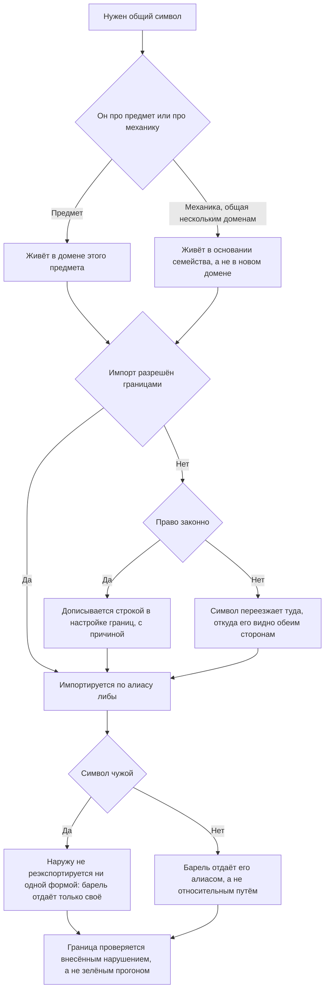

<!-- rt-kit v0.25.0 · rules/lib-layers.md · 08e61682c809 · правится надстройкой, не здесь -->

# Импорты между либами — как это устроено здесь

Правило под закон `docs/constitution/lib-imports.md`. Закон говорит, кто кого видит; здесь —
как это нарезано в этом дереве, чем названо и чего у нас нет.

## Как это называется здесь

| В законе                         | Здесь                                                  |
| -------------------------------- | ------------------------------------------------------ |
| семья либ                        | `libs/site`, `libs/admin`, `libs/api`                  |
| слой                             | `api`, `data-access`, `feature`, `shell`, `ui`, `util` |
| право видеть либу                | тег в `eslint/boundaries/domains/<семья>.config.mjs`   |
| общая всем трём приложениям либа | `libs/common/util`, тег `scope:common-util`            |
| основание семейства              | `<семья>/core`; его тег входит в `ADMIN_UNIVERSAL`     |
| барель                           | `src/index.ts` либы и `index.ts` каталога компонента   |

Фичевый домен фронта — шесть слоёв (`api`, `data-access`, `feature/<экран>`, `shell`, `ui`,
`util`), общий домен — те же без `shell`. У бэкенда `ui` и `shell` нет: отдавать разметку и
роутиться ему нечем.

## Где это лежит

В этом дереве — таблица в `implementation.md` рядом. Пути живут там, а не здесь: правило
переносится между репозиториями, раскладка — нет, и путь, названный в правиле, врёт в первом
же дереве, которое держит код иначе.

## Ход

Ход заведения общего символа: где он должен жить, что делать с недостающим правом импорта и чем
проверяется граница.

## Как закон применяется здесь

- **Чужой символ не реэкспортируется ни одной из двух форм.** Запрещены и
  `export { X } from '@<область>/…'`, и пара «импорт плюс `export { X };`»: вторая
  выглядит как собственное объявление и глазами в ревью проходила.
- **Строка с алиасом чужой либы в бареле — тот же реэкспорт.** Относительный путь в бареле
  законен: он собирает наружу собственные файлы либы.
- **Не хватает права — оно дописывается строкой в конфиге домена с комментарием.** Импорт,
  который «просто заработал», означает, что тег ещё не сужен.
- **У `libs/common/util` список зависимостей пуст, и Angular туда не попадает.** Либу
  импортирует бэкенд, и фреймворк уехал бы в его бандл; токен DI, общий двум фронтовым
  семьям, живёт в `common/platform`.
- **Основание семейства видит только `util`.** Его зовут все домены семьи, и любая его
  зависимость становится общей для всех сразу.
- **Поведение, которого основанию семейства не видно, приходит к нему токеном.** Токен
  объявляется в `util` общего домена, а `data-access` подставляет туда свою реализацию: так
  основание зовёт её, не видя её либы. Расширение границ основания ради одного вызова
  открывает эту либу всем доменам семьи сразу и обратно уже не сужается.
- **Домен заводится под предмет, а не под механику.** Механика, общая нескольким доменам,
  едет в либу, которой она уже видна: у фронта это основание семейства, у бэкенда — слой
  `util`, перечисленный у каждого домена.
- **Домен, у которого непуст один слой, значится строкой с причиной.** Иначе он неотличим от
  слота: пустые слои есть и у того, и у другого, а барель лежит в обоих.

## Чего из закона здесь нет

Отклонение основания семейства от лесенки сегодня одно и названо в `CORE_EXCEPTIONS`
проверки: `common/proto` и `common/connect` у `admin/core` ради транспорта Connect.

Полный набор слоёв требуется у всех, и пустой слой дефектом не считается: `api` пуст у
домена, который ни с кем чужим не говорит. Судится только крайний случай — непуст ровно один
слой; такой домен обычно один, и он стоит в списке исключений с
причиной.

## Паттерны

- `lib-layers-new` — завести или удалить либу: генератор, теги, алиас, README.
- `lib-layers-move` — перенести код между либами: порядок, границы, импорты, README обеих.

## Ловушки

- **Либа, которую никто не импортирует, не проверена ничем.** `nx lint` и `nx test` проверяют
  её саму, а не договор с потребителем: потерянное поле в `*.State` ошибкой не считается, пока
  нет вызывающего кода. Первый импортёр и есть первая проверка — слой моделей принимается
  после `nx build` и живого прогона сценария, а не по зелёному `lint test`.
- **Проверка принимается на нарушении, а не на зелёном прогоне.** Нарушение вносится руками,
  прогон краснеет, правка снимается. У проверок в `tools/` тестов нет, и это единственная
  приёмка.
- `git rm -r` оставляет `node_modules/.vite` внутри удалённого каталога, и проверка продолжает
  видеть его как домен без слоёв. Добивать `rm -rf`.
- Образец, написанный второй раз, ловит `npm run check:dupes` — правило `shared-code`.

## Круги импортов внутри пакета

Проверка — `npm run check:cycles`. Она читает относительные импорты всех файлов под
`projects/` и называет каждый круг участниками, от файла к файлу.

- **Круг заводится через баррель каталога.** Файл берёт соседа не прямо, а из `index.ts`
  рядом, а тот собирает и его самого. Разрывается это прямым импортом файла: `from './index'`
  меняется на `from './table-column.interface'`.
- **Ни сборка, ни линтер круг не судят.** Сборщик разрывает его сам и отдаёт одному из
  участников недособранный модуль; всплывает это у потребителя — символ, прочитанный на
  старте, оказывается пустым.
- **Взаимная рекурсия двух функций барелем не лечится.** Две функции глубокого сравнения зовут
  друг друга по существу, и порознь они круг в любом случае: обе живут в одном модуле, а
  прежние адреса символов остаются тонкими реэкспортами.
- **Компонент, который берут родителем через `inject`, заменяется токеном.** Подпункт бокового
  меню инжектил сам компонент меню, а меню объявляло подпункт в своих импортах; токен в файле
  типов разводит обоих.
- **Типы, которые нужны обеим сторонам, переезжают в свой файл.** Настройка кита называла вид
  кнопки типами из файла её компонента — круг из одних типов сборка переживает, но живёт он до
  первой правки, которая добавит к нему значение.
- **Проверка стоит в наборе гейта пуша и в конвейере.** Круг, снятый разово, возвращается
  первой же правкой рядом, и заметить это нечем.
