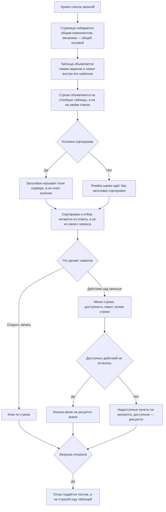

<!-- rt-kit v0.17.0 · rules/lists.md · e5480c1bc125 · правится надстройкой, не здесь -->

# Списочный экран — как это устроено здесь

Правило под закон `docs/constitution/lists.md`. Закон говорит, что пользователь видит и
делает; здесь — из чего этот экран собирается в этом дереве и как он выглядит. Про вид
говорит правило: закон о нём молчит намеренно.

## Как это называется здесь

| В законе                  | Здесь                                                                           |
| ------------------------- | ------------------------------------------------------------------------------- |
| таблица записей           | `rt-table` из `@rt-tools/ui-kit-v2`, вход `[dataSource]`                        |
| состав и порядок столбцов | `[columnsConfig]`, хранятся по ключу `tableId`                                  |
| карточка на узком экране  | ветка `<префикс>-table`, а не своя разметка                                     |
| тулбар                    | `<префикс>-toolbar` со слотами `<префикс>ToolbarLeft` и `<префикс>ToolbarRight` |
| выборка                   | `IList.Query.State` — страница, сортировка, условия отбора, строка поиска       |
| панель настройки столбцов | асайд по маршруту `path: 'table-settings'`                                      |

## Где это лежит

В этом дереве — таблица в `implementation.md` рядом. Пути живут там, а не здесь: правило
переносится между репозиториями, раскладка — нет, и путь, названный в правиле, врёт в первом
же дереве, которое держит код иначе.

## Ход

Ход сборки списочного экрана: что берётся готовым, где решается сортировка и отбор, и что
происходит с действиями строки.

## Как закон применяется здесь

- **Страница собирается общим компонентом страницы списка, а не своей разметкой.** Заголовок,
  панель действий, зона прокрутки и переключатель страниц одинаковы у всех списков, и
  переписанные заново они расходятся молча.
- **Механика экрана берётся из общей основы списочного экрана, а не пишется заново.** Экран
  домена объявляет стор, ключ таблицы, поля сортировки и столбцы; выборка из адреса и в адрес,
  страница, её размер, сортировка, тост отказа и переходы в панель уже там.
- **Таблицу экран объявляет сам и кладёт внутрь шаблона.** Обернуть её нельзя: столбцы она
  собирает собственным запросом по содержимому, и через посредника они до неё не доходят.
- **Список собирается `<префикс>-table`, а не своей разметкой.** Скелетоны, пустое состояние,
  карточки на узком экране и настройка столбцов — входы таблицы; свой
  `@if (rows().length === 0)` означает, что экран собран мимо неё.
- **Строки объявляются на `rowsTable.displayedColumns()`, а не на своём списке.** Столбец с
  меню таблица добавляет сама.
- **Заголовок сортируемой колонки называет поле сервера, а не ключ колонки.** Колонка и поле
  совпадают не всегда, и пока в разметке стоит ключ колонки, экран держит две карты перевода в
  обе стороны.
- **Сортируема та колонка, у чьей ячейки шапки стоит заголовок сортировки.** Отдельного
  признака рядом со списком столбцов нет, и расходиться нечему.
- **Клик по строке открывает запись, а меню — для действий над ней.** Вид нажимаемой строки
  даёт `clickable`, активацию мышью и с клавиатуры — `<префикс>TableRow`; клик по кнопке внутри строки
  активацией не считается.
- **Доступность действия лежит полем строки, а не вызовом метода компонента.** Метод из шаблона
  пересчитывался бы на каждой проверке.
- **Недоступное сейчас действие в меню строки не рисуется вовсе.** Пункт заводится под `@if` по
  полю строки, а не выключенным: выключенный пункт перечисляет владельцу запреты вместо того,
  что он может сделать, и набор их меняется от строки к строке.
- **Необратимое действие спрашивает подтверждение готовым приёмом, а не своим окном.** Пункт
  меню несёт признак опасного и пару полей подтверждения — заголовок и текст с последствием, — а
  окно берёт набор. Правило, молчавшее об этом, стоило владельцу выбора из трёх вариантов, среди
  которых был свой компонент окна в новой либе: ответ лежал в паттерне, и туда исполнитель не
  дошёл. Поля названы в паттерне `admin-lists-screen`.
- **Кнопка меню не показывается, если у строки не осталось доступных действий.** За это
  отвечает вход `[rowHasActions]` — предикат по строке; считать по содержимому меню нельзя,
  спроецированный шаблон известен только после отрисовки.
- **Отказ загрузки подаётся тостом, а не строкой над таблицей.** Ключ отказа читается сразу
  после запроса, а не подпиской на сигнал стора: стор делят список и панель правки.
- **Экран берёт сортировку и условия отбора из ответа, а не из своего запроса.** Сервер мог
  применить умолчание домена или отбросить условие.
- **Строка списка получает короткую модель сущности, а не полную.**

## Чего из закона здесь нет

Страницу отдаёт только та процедура, в чьём ответе есть `page_model`; заявки и объекты
приходят целиком — долги `Q-L-5`, `Q-L-7` и `Q-M-2`. Выборка живёт в адресе не у каждого
списка — долг `Q-L-4`.

## Паттерны

- `admin-lists-screen` — собрать экран: порядок блоков, таблица, меню строки, сортируемый
  заголовок, тулбар.

## Ловушки

- Без `[<префикс>TableRowActionsRowType]` тип `let-row` выводится как `unknown`, и падает только
  продовая сборка — юниты и дев-сервер проходят.
- Прокрутке нужны оба правила вместе: контейнер с `overflow-x`, таблица с
  `min-width: max-content`. С одним столбцы сжимаются вместо сдвига.
- Тулбар и пагинация своих классов не носят: промежуток задаёт `<префикс>-page`.
- Заголовок стоит в своём `<header>`, а не внутри тулбара.

## Чем экран говорит с общей страницей списка

Раздел этого дерева. У пакета такого посредника нет: там тулбар и переключатель страниц
объявляет сам экран, а здесь между экраном и китом стоит общий вид страницы, одна на все
разделы. Статьи ниже — про эту границу, и стоят они отдельным разделом затем, чтобы правка
пакетных статей приезжала сюда сама.

- **Отбор и свои кнопки экран кладёт в слоты общей страницы, а не передаёт ей входами.**
  Зашитый в страницу отбор одинаков у всех разделов по принуждению: разделу, которому нужен
  другой, положить его некуда, и страница обрастает входом на каждый новый вид отбора, который
  когда-нибудь понадобится.
- **Слотов у страницы три: левая часть тулбара, правая и место над таблицей.** Слева — то, что
  меняет выборку; справа — действия над списком целиком; над таблицей — то, что относится ко
  всему списку сразу. Сказанное о всём списке, поставленное строкой в сам список, читается как
  одна из записей.
- **Незанятый слот на экране не появляется вовсе.** Пустая половина тулбара и пустая полоса над
  таблицей читаются поломкой разметки, а не свободным местом.
- **Обновление списка и настройку столбцов рисует страница, а кнопки раздела встают левее их.**
  Они есть у всех разделов и одинаковы; розданные разделам, они разойдутся подписью,
  значком и местом, и человек ищет их у края тулбара на каждом разделе.
- **Чтение, страницу, её размер и настройку столбцов страница спрашивает у хоста, а не отдаёт
  наружу событиями.** Событие на каждое действие растёт числом с каждым новым действием, а
  забытое подключение видно только на собранном экране.
- **Хостом раздел объявляет себя одной строкой провайдера, а отвечает за него общая основа
  механики.** Внедрение ищет то, что объявил сам экран, — основа селектора не имеет и объявить
  себя за него не может; но своего ответа экран не пишет ни одного.
- **Якоря проверки на общей странице собираются из префикса, который называет экран.**
  Одинаковые якоря на разных разделах не отвечают на вопрос, чей элемент нашла проверка: спека,
  открывшая не тот раздел, находит тот же якорь и проходит зелёной. Префикс — то же слово, что
  у таблицы раздела.
- **Якоря самой таблицы и её строк собираются там же, где якоря страницы.** Записанные строкой
  в шаблоне каждого экрана, они расходятся с префиксом молча: имя правится в одном месте, а
  спека соседнего раздела остаётся зелёной, потому что находит прежнее.
- **Заголовок принимает подсказку, и раздел без подсказки показывает одно название.** Пустое
  место, оставленное под подсказку, сдвигает заголовок на разделах, где её нет.
- **Таблицу экран объявляет тегом кита, а не атрибутом на нативной `<table>`.** Обе формы
  собираются и обе показывают строки, поэтому промах молчит: атрибутная теряет оверлей чтения и
  карточки узкого экрана целиком — кит рисует их узлами, которые детьми `<table>` не бывают, и
  на чужой разметке не рисует вовсе. Цена тега — роль таблицы: у своего элемента её нет, роли
  строк и ячеек ставит CDK, а роли таблицы у него не бывает, и ставит её сам кит.
- **Пустой список показывает вид пустоты, а не фразу на месте строк.** Фраза внутри таблицы
  читается как одна из записей, и пустой раздел от не догрузившегося не отличается ничем.
  Вид даёт кит и только когда чтение кончилось: пока оно идёт, на месте строк скелетоны.
- **Вид пустоты называет, откуда записи приходят, отдельной строкой.** «Записей нет» отвечает
  на вопрос «сломано ли», но не на вопрос «что мне сделать»; вторую строку раздел называет за
  себя, потому что у разных разделов записи приносит разное. Одной фразой через двоеточие это
  не пишется: кит рисует заголовок и описание разными узлами и разным начертанием.
- **Страница списка прокручивается вместе со всей страницей, а не своей зоной.** Каркас к
  высоте окна не прибит: в прибитом режиме кит обрезает зону содержимого и ждёт прокрутку от
  каждой зоны внутри, а страница списка её не заводит — строки и переключатель страниц уходят
  за нижний край и достать их нечем.
