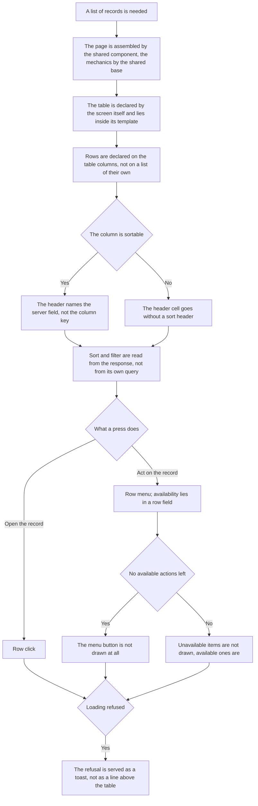

<!-- rt-kit v0.28.0 · rules/lists.md · 59c0a8700cb2 · правится надстройкой, не здесь -->

# List screen — how it works here

Rule under the law `docs/constitution/lists.md`. The law says what the user sees and does; here —
what this screen is assembled from in this tree and how it looks. The look is spoken of by the rule:
the law is silent on it by design.

## What it is called here

| In the law               | Here                                                                               |
| ------------------------ | ---------------------------------------------------------------------------------- |
| table of records         | `rt-table` from `@rt-tools/ui-kit-v2`, input `[dataSource]`                        |
| set and order of columns | `[columnsConfig]`, stored under the key `tableId`                                  |
| card on a narrow screen  | the `<prefix>-table` branch, not markup of one's own                               |
| toolbar                  | `<prefix>-toolbar` with the slots `<prefix>ToolbarLeft` and `<prefix>ToolbarRight` |
| query                    | `IList.Query.State` — page, sort, filter conditions, search string                 |
| column settings panel    | an aside by the route `path: 'table-settings'`                                     |

## Where it lives

In this tree — the table in `implementation.md` next to it. Paths live there, not here: the rule
travels between repositories, the layout does not, and a path named in the rule lies in the first
tree that keeps its code differently.

## Flow

The flow of assembling a list screen: what is taken ready-made, where sort and filter are decided,
and what happens to row actions.

## How the law applies here

- **The page is assembled by the shared list-page component, not by markup of its own.** The title,
  the action bar, the scroll area and the page switcher are the same on every list. Rewritten from
  scratch, they drift silently.
- **The screen mechanics come from the shared list-screen base, not written anew.** The domain
  screen declares the store, the table key, the sort fields and the columns. The query from and into
  the address, the page and its size, the sort, the refusal toast and the transitions into the panel
  are already there.
- **The screen declares the table itself and puts it inside the template.** It cannot be wrapped:
  the table collects its columns by its own content query, and through an intermediary they do not
  reach it.
- **The list is assembled by `<prefix>-table`, not by markup of its own.** Skeletons, the empty
  state, cards on a narrow screen and column settings are inputs of the table. An own `@if
  (rows().length === 0)` means the screen was assembled bypassing it.
- **Rows are declared on `rowsTable.displayedColumns()`, not on a list of their own.** The column
  with the menu the table adds itself.
- **The header of a sortable column names the server field, not the column key.** Column and field
  do not always match, and while the markup holds the column key, the screen keeps two translation
  maps in both directions.
- **A column is sortable when its header cell carries a sort header.** There is no separate sign
  next to the column list, and nothing to drift.
- **A row click opens the record, and the menu is for actions on it.** The look of a pressable row
  comes from `clickable`, activation by mouse and keyboard from `<prefix>TableRow`. A click on a
  button inside the row does not count as activation.
- **Action availability lies in a row field, not in a call of a component method.** A method from
  the template would be recomputed on every check.
- **An action unavailable right now is not drawn in the row menu at all.** The item goes under `@if`
  by a row field, not disabled. A disabled item lists to the owner what is forbidden instead of what
  they can do, and the set changes from row to row.
- **An irreversible action asks for confirmation by the ready-made technique, not by a dialog of its
  own.** The menu item carries the dangerous sign and a pair of confirmation fields — a title and a
  text with the consequence. The dialog takes the set. The rule that was silent on this cost the
  owner a choice among three options, one of them an own dialog component in a new lib: the answer
  lay in the pattern, and the executor did not get there. The fields are named in pattern
  `admin-lists-screen`.
- **The menu button is not shown when the row has no available actions left.** The input
  `[rowHasActions]` answers for that — a predicate over the row. Counting by the menu content is
  impossible: the projected template is known only after rendering.
- **A loading refusal is served as a toast, not as a line above the table.** The refusal key is read
  right after the request, not by subscribing to the store signal. The store is shared by the list
  and the edit panel.
- **The screen takes the sort and the filter conditions from the response, not from its own query.**
  The server may have applied the domain default or dropped a condition.
- **A list row receives the short model of the entity, not the full one.**

## What of the law is not here

A page is returned only by the procedure whose response has `page_model`; requests and objects
arrive whole — debts `Q-L-5`, `Q-L-7` and `Q-M-2`. Not every list keeps the query in the address —
debt `Q-L-4`.

## Patterns

- `admin-lists-screen` — assemble the screen: order of blocks, table, row menu, sortable header,
  toolbar.

## Pitfalls

- Without `[<prefix>TableRowActionsRowType]` the type of `let-row` is inferred as `unknown`, and
  only the production build fails — units and the dev server pass.
- Scrolling needs both rules together: a container with `overflow-x`, a table with `min-width:
  max-content`. With one of them the columns shrink instead of shifting.
- The toolbar and the pagination carry no classes of their own: the gap is set by `<prefix>-page`.
- The title stands in its own `<header>`, not inside the toolbar.

## How a screen talks to the shared list page

A section of this tree. The package has no such intermediary: there the toolbar and the page
switcher are declared by the screen itself, while here a shared page view, one for all sections,
stands between the screen and the kit. The articles below are about that boundary, and they stand
as a separate section so that an edit of the package articles travels here by itself.

- **The filter and its own buttons the screen puts into the slots of the shared page, not passes
  to it as inputs.** A filter nailed into the page is the same for every section by compulsion: a
  section that needs a different one has nowhere to put it, and the page grows an input for every
  new kind of filter that may ever be needed.
- **The page has three slots: the left part of the toolbar, the right one and the place above the
  table.** On the left is what changes the selection; on the right, actions over the list as a
  whole; above the table, what concerns the whole list at once. What is said about the whole list,
  put as a row into the list itself, reads as one of the records.
- **An unoccupied slot does not appear on the screen at all.** An empty half of the toolbar and an
  empty strip above the table read as broken markup, not as free space.
- **Refreshing the list and the column settings are drawn by the page, and the section buttons
  stand to their left.** They exist on every section and are the same; handed out to sections,
  they drift in label, icon and place, and a person hunts for them at the toolbar edge on every
  section.
- **The read, the page, its size and the column settings the page asks of the host, rather than
  giving them outward as events.** An event per action grows in number with every new action,
  while a forgotten wiring shows only on the assembled screen.
- **A section declares itself the host by one provider line, and the shared mechanics base answers
  for it.** Injection looks for what the screen itself declared — the base has no selector and
  cannot declare itself in its stead; yet the screen writes not one answer of its own.
- **The check anchors on the shared page are assembled from a prefix named by the screen.**
  Identical anchors on different sections do not answer whose element the check found: a spec that
  opened the wrong section finds the same anchor and passes green. The prefix is the same word as
  the section table uses.
- **The anchors of the table itself and of its rows are assembled where the page anchors are.**
  Written as a string in the template of each screen, they drift from the prefix silently: the
  name is fixed in one place, and the spec of a neighbouring section stays green because it finds
  the former one.
- **The heading accepts a hint, and a section without a hint shows a single name.** Space left for
  a hint shifts the heading on the sections that have none.
- **The screen declares the table by the kit tag, not by an attribute on a native `<table>`.**
  Both forms build and both show rows, so the miss stays silent: the attribute form loses the
  reading overlay and the narrow-screen cards entirely — the kit draws them as nodes that are
  never children of `<table>`, and on foreign markup it does not draw them at all. The price of
  the tag is the table role: an own element has none, the row and cell roles are set by CDK, which
  has no table role, and the kit sets it itself.
- **An empty list shows an emptiness view, not a phrase in place of the rows.** A phrase inside
  the table reads as one of the records, and an empty section is indistinguishable from one that
  did not finish loading. The view is given by the kit and only once the read is over: while it
  goes, skeletons stand in place of the rows.
- **The emptiness view names where the records come from, as a separate line.** «No records»
  answers the question whether it is broken, but not the question what to do; the second line the
  section names for itself, because different sections have their records brought by different
  things. It is not written as one phrase through a colon: the kit draws the heading and the
  description as different nodes and in different type.
- **The list page scrolls together with the whole page, not by a zone of its own.** The frame is
  not nailed to the window height: in the nailed mode the kit clips the content zone and expects
  scrolling from every zone inside, and the list page starts none — the rows and the page switcher
  go past the bottom edge with nothing to reach them by.
