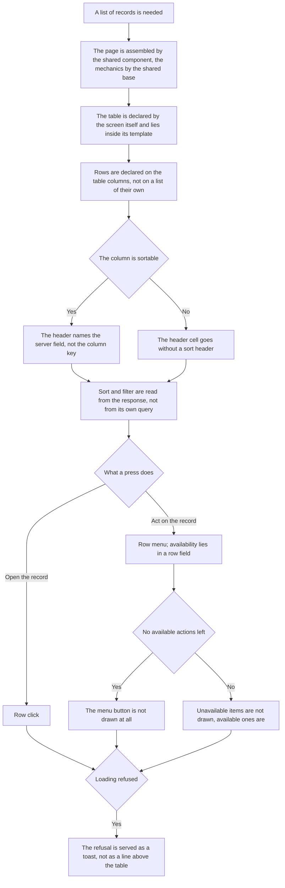

<!-- rt-kit v0.25.0 · rules/lists.md · a7cca3cfaea9 · правится надстройкой, не здесь -->

# List screen — how it works here

Rule under the law `docs/constitution/lists.md`. The law says what the user sees and does; here —
what this screen is assembled from in this tree and how it looks. The look is spoken of by the rule:
the law is silent on it by design.

## What it is called here

| In the law               | Here                                                                               |
| ------------------------ | ---------------------------------------------------------------------------------- |
| table of records         | `rt-table` from `@rt-tools/ui-kit-v2`, input `[dataSource]`                        |
| set and order of columns | `[columnsConfig]`, stored under the key `tableId`                                  |
| card on a narrow screen  | the `<prefix>-table` branch, not markup of one's own                               |
| toolbar                  | `<prefix>-toolbar` with the slots `<prefix>ToolbarLeft` and `<prefix>ToolbarRight` |
| query                    | `IList.Query.State` — page, sort, filter conditions, search string                 |
| column settings panel    | an aside by the route `path: 'table-settings'`                                     |

## Where it lives

In this tree — the table in `implementation.md` next to it. Paths live there, not here: the rule
travels between repositories, the layout does not, and a path named in the rule lies in the first
tree that keeps its code differently.

## Flow

The flow of assembling a list screen: what is taken ready-made, where sort and filter are decided,
and what happens to row actions.

## How the law applies here

- **The page is assembled by the shared list-page component, not by markup of its own.** The title,
  the action bar, the scroll area and the page switcher are the same on every list. Rewritten from
  scratch, they drift silently.
- **The screen mechanics come from the shared list-screen base, not written anew.** The domain
  screen declares the store, the table key, the sort fields and the columns. The query from and into
  the address, the page and its size, the sort, the refusal toast and the transitions into the panel
  are already there.
- **The screen declares the table itself and puts it inside the template.** It cannot be wrapped:
  the table collects its columns by its own content query, and through an intermediary they do not
  reach it.
- **The list is assembled by `<prefix>-table`, not by markup of its own.** Skeletons, the empty
  state, cards on a narrow screen and column settings are inputs of the table. An own `@if
  (rows().length === 0)` means the screen was assembled bypassing it.
- **Rows are declared on `rowsTable.displayedColumns()`, not on a list of their own.** The column
  with the menu the table adds itself.
- **The header of a sortable column names the server field, not the column key.** Column and field
  do not always match, and while the markup holds the column key, the screen keeps two translation
  maps in both directions.
- **A column is sortable when its header cell carries a sort header.** There is no separate sign
  next to the column list, and nothing to drift.
- **A row click opens the record, and the menu is for actions on it.** The look of a pressable row
  comes from `clickable`, activation by mouse and keyboard from `<prefix>TableRow`. A click on a
  button inside the row does not count as activation.
- **Action availability lies in a row field, not in a call of a component method.** A method from
  the template would be recomputed on every check.
- **An action unavailable right now is not drawn in the row menu at all.** The item goes under `@if`
  by a row field, not disabled. A disabled item lists to the owner what is forbidden instead of what
  they can do, and the set changes from row to row.
- **An irreversible action asks for confirmation by the ready-made technique, not by a dialog of its
  own.** The menu item carries the dangerous sign and a pair of confirmation fields — a title and a
  text with the consequence. The dialog takes the set. The rule that was silent on this cost the
  owner a choice among three options, one of them an own dialog component in a new lib: the answer
  lay in the pattern, and the executor did not get there. The fields are named in pattern
  `admin-lists-screen`.
- **The menu button is not shown when the row has no available actions left.** The input
  `[rowHasActions]` answers for that — a predicate over the row. Counting by the menu content is
  impossible: the projected template is known only after rendering.
- **A loading refusal is served as a toast, not as a line above the table.** The refusal key is read
  right after the request, not by subscribing to the store signal. The store is shared by the list
  and the edit panel.
- **The screen takes the sort and the filter conditions from the response, not from its own query.**
  The server may have applied the domain default or dropped a condition.
- **A list row receives the short model of the entity, not the full one.**

## What of the law is not here

A page is returned only by the procedure whose response has `page_model`; requests and objects
arrive whole — debts `Q-L-5`, `Q-L-7` and `Q-M-2`. Not every list keeps the query in the address —
debt `Q-L-4`.

## Patterns

- `admin-lists-screen` — assemble the screen: order of blocks, table, row menu, sortable header,
  toolbar.

## Pitfalls

- Without `[<prefix>TableRowActionsRowType]` the type of `let-row` is inferred as `unknown`, and
  only the production build fails — units and the dev server pass.
- Scrolling needs both rules together: a container with `overflow-x`, a table with `min-width:
  max-content`. With one of them the columns shrink instead of shifting.
- The toolbar and the pagination carry no classes of their own: the gap is set by `<prefix>-page`.
- The title stands in its own `<header>`, not inside the toolbar.

## Чем экран говорит с общей страницей списка

Раздел этого дерева. У пакета такого посредника нет: там тулбар и переключатель страниц
объявляет сам экран, а здесь между экраном и китом стоит общий вид страницы, одна на все
разделы. Статьи ниже — про эту границу, и стоят они отдельным разделом затем, чтобы правка
пакетных статей приезжала сюда сама.

- **Отбор и свои кнопки экран кладёт в слоты общей страницы, а не передаёт ей входами.**
  Зашитый в страницу отбор одинаков у всех разделов по принуждению: разделу, которому нужен
  другой, положить его некуда, и страница обрастает входом на каждый новый вид отбора, который
  когда-нибудь понадобится.
- **Слотов у страницы три: левая часть тулбара, правая и место над таблицей.** Слева — то, что
  меняет выборку; справа — действия над списком целиком; над таблицей — то, что относится ко
  всему списку сразу. Сказанное о всём списке, поставленное строкой в сам список, читается как
  одна из записей.
- **Незанятый слот на экране не появляется вовсе.** Пустая половина тулбара и пустая полоса над
  таблицей читаются поломкой разметки, а не свободным местом.
- **Обновление списка и настройку столбцов рисует страница, а кнопки раздела встают левее их.**
  Они есть у всех разделов и одинаковы; розданные разделам, они разойдутся подписью,
  значком и местом, и человек ищет их у края тулбара на каждом разделе.
- **Чтение, страницу, её размер и настройку столбцов страница спрашивает у хоста, а не отдаёт
  наружу событиями.** Событие на каждое действие растёт числом с каждым новым действием, а
  забытое подключение видно только на собранном экране.
- **Хостом раздел объявляет себя одной строкой провайдера, а отвечает за него общая основа
  механики.** Внедрение ищет то, что объявил сам экран, — основа селектора не имеет и объявить
  себя за него не может; но своего ответа экран не пишет ни одного.
- **Якоря проверки на общей странице собираются из префикса, который называет экран.**
  Одинаковые якоря на разных разделах не отвечают на вопрос, чей элемент нашла проверка: спека,
  открывшая не тот раздел, находит тот же якорь и проходит зелёной. Префикс — то же слово, что
  у таблицы раздела.
- **Якоря самой таблицы и её строк собираются там же, где якоря страницы.** Записанные строкой
  в шаблоне каждого экрана, они расходятся с префиксом молча: имя правится в одном месте, а
  спека соседнего раздела остаётся зелёной, потому что находит прежнее.
- **Заголовок принимает подсказку, и раздел без подсказки показывает одно название.** Пустое
  место, оставленное под подсказку, сдвигает заголовок на разделах, где её нет.
- **Таблицу экран объявляет тегом кита, а не атрибутом на нативной `<table>`.** Обе формы
  собираются и обе показывают строки, поэтому промах молчит: атрибутная теряет оверлей чтения и
  карточки узкого экрана целиком — кит рисует их узлами, которые детьми `<table>` не бывают, и
  на чужой разметке не рисует вовсе. Цена тега — роль таблицы: у своего элемента её нет, роли
  строк и ячеек ставит CDK, а роли таблицы у него не бывает, и ставит её сам кит.
- **Пустой список показывает вид пустоты, а не фразу на месте строк.** Фраза внутри таблицы
  читается как одна из записей, и пустой раздел от не догрузившегося не отличается ничем.
  Вид даёт кит и только когда чтение кончилось: пока оно идёт, на месте строк скелетоны.
- **Вид пустоты называет, откуда записи приходят, отдельной строкой.** «Записей нет» отвечает
  на вопрос «сломано ли», но не на вопрос «что мне сделать»; вторую строку раздел называет за
  себя, потому что у разных разделов записи приносит разное. Одной фразой через двоеточие это
  не пишется: кит рисует заголовок и описание разными узлами и разным начертанием.
- **Страница списка прокручивается вместе со всей страницей, а не своей зоной.** Каркас к
  высоте окна не прибит: в прибитом режиме кит обрезает зону содержимого и ждёт прокрутку от
  каждой зоны внутри, а страница списка её не заводит — строки и переключатель страниц уходят
  за нижний край и достать их нечем.
