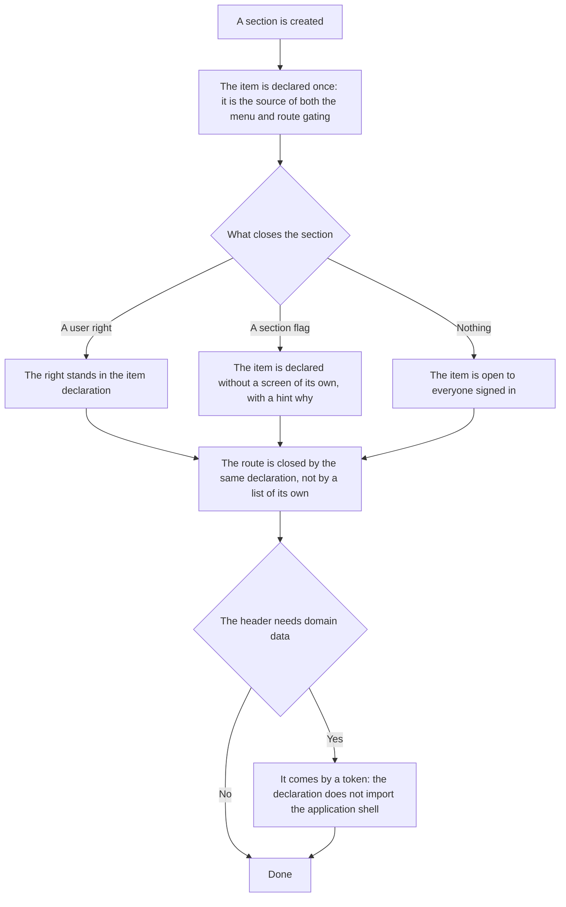

<!-- rt-kit v0.28.0 · rules/navigation.md · 32771b399546 · правится надстройкой, не здесь -->

# Admin navigation — how it works here

Rule under the law `docs/constitution/navigation.md`. The law says how the user finds a section and
gets into it; here — what the menu is assembled from in this tree and how it looks. The look is
spoken of by the rule: the law is silent about it on purpose.

## What it is called here

| In the law               | Here                                                                            |
| ------------------------ | ------------------------------------------------------------------------------- |
| menu item                | an entry in the `admin-nav.items.ts` declaration                                |
| section with a panel     | an item with columns; has no address of its own                                 |
| second-level panel       | the `rt-page-header` popup from the kit package, laid out in columns and groups |
| unread sign              | a dot, comes as a predicate by the item id                                      |
| the "no screen yet" flag | `disabled` in the declaration                                                   |

## Where it lives

In this tree — the table in `implementation.md` next to it. Paths live there, not here: the rule
travels between repositories, the layout does not, and a path named in the rule lies in the first
tree that keeps its code differently.

## Flow

The flow of creating a section: one declaration per item and route, two layers of gating and the
data path into the header.

## How the law applies here

- **An item is declared once and serves as the source of both the menu and route gating.** A second
  declaration next to the routes would drift from the first, and the result would be "the item is
  not visible, but the page opens".
- **The declaration imports no `shell`.** Otherwise the graph `shell → container/feature → shell`
  closes into a cycle and the layout check stops.
- **Gating has two layers: the user right and the section flag.** An item with a flag is declared
  without rights and without an address — a right opens the screen, and there is no screen; it is
  visible to everyone all the while.
- **Domain data comes into the header by a token, not by an import.** The interface and the
  `InjectionToken` live in `container/util`; the composition root ties them to the implementation.

## What of the law is not here

The menu holds seventeen second-level items and the "Finance" section that have no screen yet: they
are rolled out as unavailable, because a vanished item cannot be told from one that never existed.

The rendering of the header itself lives in `rt-page-header` from `@rt-tools/ui-kit-v2`. The project
does not write it and cannot break it: it declares the items, and the kit draws them. The kit sets:

- the hint on an unavailable item and `aria-disabled` instead of the native `disabled`;
- section highlighting by address prefix;
- opening the second-level panel on hover, and on touch — by a tap;
- the panel layout in columns, inside a column — in groups with a caption; if the first group in a
  column has no heading, its items start from the top of the panel;
- the panel width by the number of columns, not by the length of captions, and its fit from its own
  section to the right edge of the screen;
- the expand pointer on a section with a panel and its absence on a section without one;
- a separate mobile layout: the menu collapses into a button, expands with the same sections and
  groups and scrolls when the items do not fit in height.

None of this the rule binds to project code: there is nothing to bind.

## Patterns

- `admin-nav-item` — create a menu item and its route: the declaration, rights, the flag, address
  nesting, the caption in all locales.

## Pitfalls

- An unavailable item has no click handler at all: `aria-disabled` does not refuse a click.
- A branch where the ro-route constant was not merged in differs only in that the button in the
  header opens nothing on it.
- Groups inside an expanded section on a narrow screen do not collapse separately, so the set of
  expanded ones holds only section ids.
- The panel width is computed by the number of columns, not by the content; the numbers are set by
  `--rt-*` tokens, raw values are forbidden by the styling rule.
- An address move touches links and the e2e specs — they walk by addresses.
