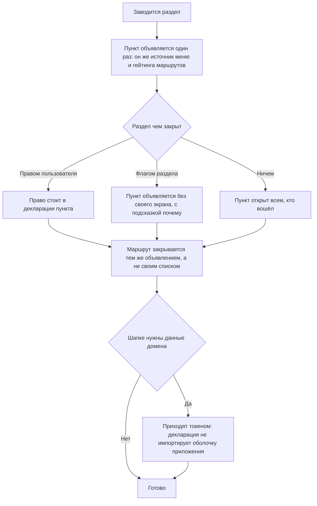

<!-- rt-kit v0.9.1 · rules/navigation.md · bd4655500e65 · правится надстройкой, не здесь -->

# Навигация админки — как это устроено здесь

Правило под закон `docs/constitution/navigation.md`. Закон говорит, как пользователь
находит раздел и попадает в него; здесь — из чего меню собрано в этом дереве и как
выглядит. Про вид говорит правило: закон о нём молчит намеренно.

## Как это называется здесь

| В законе                 | Здесь                                                                   |
| ------------------------ | ----------------------------------------------------------------------- |
| пункт меню               | запись в декларации `admin-nav.items.ts`                                |
| раздел с панелью         | пункт с колонками; своего адреса не имеет                               |
| панель второго уровня    | попап `rt-page-header` из пакета кита, разложенный колонками и группами |
| признак непросмотренного | точка, приходит предикатом по идентификатору пункта                     |
| флаг «экрана ещё нет»    | `disabled` в декларации                                                 |

## Где это лежит

В этом дереве — таблица в `implementation.md` рядом. Пути живут там, а не здесь: правило
переносится между репозиториями, раскладка — нет, и путь, названный в правиле, врёт в первом
же дереве, которое держит код иначе.

## Ход

Ход заведения раздела: одна декларация на пункт и маршрут, два слоя гейтинга и путь данных в
шапку.

## Как закон применяется здесь

- **Пункт объявляется один раз и служит источником и меню, и гейтинга маршрутов.** Второе
  объявление рядом с маршрутами разошлось бы с первым, и получилось бы «пункта не видно, а
  страница открывается».
- **Декларация не импортирует ни один `shell`.** Иначе граф `shell → container/feature → shell`
  замкнётся и проверка раскладки встанет.
- **Гейтинг двухслойный: право пользователя и флаг раздела.** Пункт с флагом объявляется без
  прав и без адреса — право открывает экран, а экрана нет; виден он при этом всем.
- **Данные домена приходят в шапку токеном, а не импортом.** Интерфейс и `InjectionToken` живут
  в `container/util`, связывает их с реализацией композиционный корень.

## Чего из закона здесь нет

В меню стоят семнадцать пунктов второго уровня и раздел «Финансы», у которых экрана пока нет:
они выкачены недоступными, потому что исчезнувший пункт неотличим от того, которого никогда
не было.

Отрисовка самой шапки живёт в `rt-page-header` из `@rt-tools/ui-kit-v2`. Проект её не пишет и
не может нарушить: он объявляет пункты, а рисует их кит. Китом заданы:

- подсказка у недоступного пункта и `aria-disabled` вместо нативного `disabled`;
- подсветка раздела по префиксу адреса;
- открытие панели второго уровня наведением, а на касании — нажатием;
- раскладка панели колонками, внутри колонки — группами с подписью; если первая группа в
  колонке без заголовка, её пункты начинаются от верха панели;
- ширина панели по числу колонок, а не по длине подписей, и её помещаемость от своего
  раздела до правого края экрана;
- указатель раскрытия у раздела с панелью и его отсутствие у раздела без неё;
- отдельная мобильная раскладка: меню сворачивается в кнопку, раскрывается теми же разделами
  и группами и прокручивается, когда пункты не помещаются по высоте.

Ничего из этого правило к коду проекта не привязывает: привязывать нечего.

## Паттерны

- `admin-nav-item` — завести пункт меню и его маршрут: декларация, права, флаг, вложение
  адреса, подпись во всех локалях.

## Ловушки

- Обработчика нажатия у недоступного пункта нет вовсе: `aria-disabled` нажатие не отбивает.
- Ветка, куда забыли подмешать константу ro-маршрута, отличается только тем, что кнопка в
  шапке на ней ничего не открывает.
- Группы внутри раскрытого раздела на узком экране отдельно не сворачиваются, поэтому в
  множестве раскрытых лежат только идентификаторы разделов.
- Ширина панели считается числом колонок, а не содержимым; числа задаются токенами `--rt-*`,
  сырые значения запрещены правилом стилей.
- Переезд адреса трогает ссылки и спеки e2e — они ходят по адресам.
