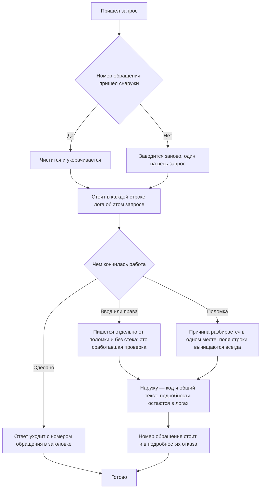

<!-- rt-kit v0.22.0 · rules/observability.needs-app.md · 1dec40498668 · правится надстройкой, не здесь -->

# Наблюдаемость — как это устроено здесь

Правило под закон `docs/constitution/observability.md`. Закон говорит, что владелец должен
знать о работе приложения; здесь — как это названо в этом дереве, где лежит и чего пока нет.

## Как это называется здесь

| В законе                                                   | Здесь                                                                                                                              |
| ---------------------------------------------------------- | ---------------------------------------------------------------------------------------------------------------------------------- |
| то, что приложение о себе пишет                            | логи приложения: одна строка на каждый вызов логгера, в машинном виде                                                              |
| ступень важности                                           | уровень: от подробностей разбора до отказа, поднявшего процесс                                                                     |
| номер обращения                                            | идентификатор запроса, он же заголовок ответа                                                                                      |
| признак, по которому находятся все отказы одного обращения | тот же номер обращения — он стоит в каждой строке лога                                                                             |
| подробности отказа                                         | разобранная причина: класс, текст, код протокола, код и подробности от хранилища, срезанный стек                                   |
| общий текст ошибки наружу                                  | внутренняя ошибка без подробностей                                                                                                 |
| вычистка секретов                                          | замена значений по имени поля                                                                                                      |
| отказ в хранилище                                          | то, что домен отказов сохранил: группа отказов и её вхождения                                                                      |
| то, с чем приложение поднялось                             | сводка старта: одна строка лога с версией, портом, адресом хранилища и списками возможностей — включённых, выключенных и сломанных |

## Где это лежит

В этом дереве — таблица в `implementation.md` рядом. Пути живут там, а не здесь: правило
переносится между репозиториями, раскладка — нет, и путь, названный в правиле, врёт в первом
же дереве, которое держит код иначе.

## Ход

Ход обработки запроса глазами наблюдаемости: где заводится номер обращения, чем отличается
отказ от поломки и что уходит наружу.

## Как закон применяется здесь

- **Номер обращения заводится один раз на запрос и стоит в каждой строке лога о нём.** По
  времени строки одного обращения не отобрать: обращений бывает десяток в секунду.
- **Номер обращения уходит вызывающему заголовком ответа и в подробностях отказа.** Он же стоит
  в логах, поэтому названный человеком номер ищется прямым отбором. Заголовок при этом открыт
  странице чужого домена: без явного разрешения браузер его не отдаёт.
- **Номер, пришедший снаружи, чистится и укорачивается, а пустой заводится заново.** Значение
  из заголовка приходит от кого угодно, а попадает в отбор по хранилищу.
- **Наружу уходит код и общий текст ошибки, подробности остаются в логах.** Иначе гость на
  сломанной выкатке прочитает имя колонки и устройство хранилища.
- **Отказ по вводу и правам пишется отдельно от поломки и без стека.** Это сработавшая
  проверка. На одном уровне с поломками она забивает тревогу опечатками гостей.
- **Причина отказа разбирается в одном месте.** Иначе одна и та же ошибка приходит в логи
  тремя разными формами.
- **Поля строки лога вычищаются всегда, а не по решению того, кто пишет.** Решать на каждом
  вызове, есть ли в полях секрет, — значит однажды ошибиться.
- **Приложение при старте пишет, с чем поднялось.** Половина возможностей включается наличием
  переменной окружения и без неё молча выключена. Иначе на вопрос «почему там не работает то,
  что работает локально» отвечают чтением настроек прода по ssh.
- **В сводке старта стоят имена возможностей и их состояние, но не значения переменных.**
  Состояния разложены тремя списками, а не картой «имя → состояние»: вычистка работает по
  имени ключа, и карта приехала бы в лог вычищенной ровно там, где состояние и нужно.
- **Возможность, включаемая парой ключей, знает третье состояние.** Половины пары лежат по
  разные стороны поставки, и заполнить можно ровно одну; тогда возможность не выключена и не
  включена, а сломана — списком из двух состояний этот случай назвать нечем, и он читается как
  включённый.
- **Порог уровня решает, появится ли строка лога в выводе, но не в хранилище отказов.** Порог
  ставится ради объёма вывода, и при высоком пороге отобранные строки нижнего уровня пропали бы
  из хранилища молча.
- **Отобранная строка лога сохраняется в хранилище отказом.** Отбирается уровень отказа и всё,
  что выше, и строки уровнем ниже — по списку имён, объявленному в коде.
- **Логгер отдаёт отказ приёмнику, а хранилища не видит.** Интерфейс приёмника объявлен рядом с
  логгером, исполняет его домен отказов, и ставится он извне при старте.
- **Строки лога клиента хранилища, домена отказов и домена оповещений в приёмник не идут.**
  Отсекается источник, а не момент записи: медленная вставка в таблицу отказов сама порождает
  строку лога клиента хранилища, и признаком «я внутри записи» её не поймать. Домен оповещений
  отсечён по той же причине: сбой оповещения стал бы новым отказом, тот — новым оповещением.
- **Обращение к чужой службе идёт с явным пределом ожидания.** Без него молчащая — не
  отказавшая — служба держит соединение до умолчания среды, а это минуты: отказа нет,
  записывать нечего, и владельцу такое молчание неотличимо от исправной работы. Предел
  называется числом рядом с клиентом, потому что цена ожидания у каждой службы своя.
- **Отправка наружу заводит свою строку до обращения, а исход дописывается в неё после.**
  Строку заводит тот, кто видит хранилище, а не тот, кто отправляет: клиент внешней службы
  хранилища не видит вовсе. Она же служит замком — второе обращение по той же записи не
  уходит, — и по незакрытой строке видно разницу между «идёт прямо сейчас» и «упало посреди
  отправки».
- **Запись отказа не задерживает ответ и не роняет запрос.** Между логгером и хранилищем стоит
  очередь с пределом; переполненная очередь отбрасывает новый отказ и считает отброшенное.
- **Контекст запроса снимается в момент вызова логгера, а не в момент записи.** К моменту
  записи хранилище исполнения уже отдано следующему запросу.
- **Записанное владелец читает своим разделом, закрытым отдельным правом.** Группы своего
  владения, а под группой — её вхождения с причиной, полями строки лога и телами.
- **Хранилище не растёт без предела: раз в сутки лишнее и старое удаляются.** Удаляются
  вхождения: сперва лишние за пределом, потом старые за сроком. Группа, у которой после этого
  не осталось ни одного вхождения, уходит третьим шагом — и только если она старше часа: между
  её заведением и первым вхождением проходит отдельный запрос.
- **Предел хранилища назван числом строк, а не байтами.** Удаление физический размер таблицы не
  уменьшает, и условие «размер под пределом» не стало бы верным никогда.
- **О новом отказе владелец узнаёт сам — строкой журнала событий и письмом.** Обе дороги
  открывает один порог: новая группа или группа, молчавшая дольше суток.
- **В письме нет ничего, что закрыто правом на экран отказов.** Оно уходит на адрес, который
  правами не закрыт ничем, и подробности в нём обошли бы право почтой.
- **Частоту отказов владелец читает кривой над лентой: столбик — ведёрко выбранного периода.**
  Счётчик группы говорит, сколько раз она случилась, но не когда: по нему не отличить поломку,
  которая идёт потоком сейчас, от набравшейся за месяц.
- **Тревогу поднимает рост поломок, а не всех отказов.** Отклонённый вызов — сработавшая
  проверка, и таких девять из десяти: на их фоне рост поломок не заметен вовсе.
- **Всплеск считается по последнему закрытому ведёрку, текущее правилу не отдаётся.** Оно ещё
  набирается, и в начале каждого периода сравнение с ним показывало бы падение частоты.
- **Частоту разбирает такт расписания, а не запрос экрана.** Кривая считает тревогу при каждом
  ответе, но экран владелец может и не открыть, а узнать о всплеске должен без этого.
- **О всплеске владелец узнаёт строкой журнала и письмом; повтор письма держит
  предохранитель.** Одно происшествие занимает в ленте одну строку, а письмо о затяжной
  поломке нужно и назавтра.

## Чего из закона здесь нет

Отказ, случившийся до подъёма приложения, записать некуда: хранилища в этот момент ещё нет.
Такие остаются только в выводе контейнера. Туда же уходит отказ самого хранилища: его строки
лога отобраны из отказов целиком, иначе поломка хранилища порождает поток, который сам себя
разгоняет.

Список отобранных имён нижнего уровня не сверяется ни с чем. Новое место, которому надо в
хранилище, дописывает себя в него руками, а забытое молча остаётся только в выводе.

Правильность выбора уровня не проверяет ничто. Новое место само решает, какой уровень взять, и
ошибку видно только при чтении кода.

Полнота сводки старта не сверяется ничем. Имена возможностей перечислены руками, а переменную
окружения читают десятки файлов по всем доменам: новая возможность, забывшая дописать себя в
сводку, молча не попадёт ни в один из трёх списков — и на проде будет выглядеть не выключенной,
а несуществующей. Само чтение переменной окружения поэтому и требует этого правила вторым
слоем: гард видит обращение к окружению в тексте правки, но не то, дописали себя в сводку или
нет.

## Паттерны

- `observability-record` — как завести новую строку лога.

## Ловушки

- **Контекст запроса живёт в хранилище исполнения и в отложенную работу не переезжает.**
  Отложенная запись прочитает контекст того обращения, которое заняло место исходного. Снимать
  контекст надо в момент вызова логгера.
- **Логгер ставится на всё приложение, поэтому строки каркаса идут тем же путём, что и свои.**
  Всё, что каркас пишет о себе, попадает в тот же вывод и в тот же отбор.
- **Отказ потока приходит после того, как ответ начался.** Управление возвращается, когда отдан
  только заголовок. Без обёртки такой отказ не попадёт в логи вовсе.
- **Сериализация строки лога не должна бросать исключение.** Циклическая ссылка в полях иначе
  уронит запрос, ради лога которого её и складывали.
- **Ключ, в который заворачивают чужое тело для вычистки, выбирается по правилам вычистки.**
  Она работает по имени ключа, и голое значение мимо неё проходит вовсе, — но ключ, который сам
  числится свободным текстом, увозит тело в хранилище отметкой о вычистке целиком. Новая
  обёртка сверяется со списками ключей до того, как её так назвали.
- **Предохранитель повтора, чей ключ собран из того, чем меряют время, не срабатывает никогда.**
  При равенстве такта разбора и ширины ведёрка каждый разбор видит пустой замок и шлёт заново.
  Со стороны это выглядит работающим: предохранитель объявлен, привязка сходится, письма уходят
  каждый час. Ключ берётся от предмета оповещения, а не от отрезка времени, которым его считают.
