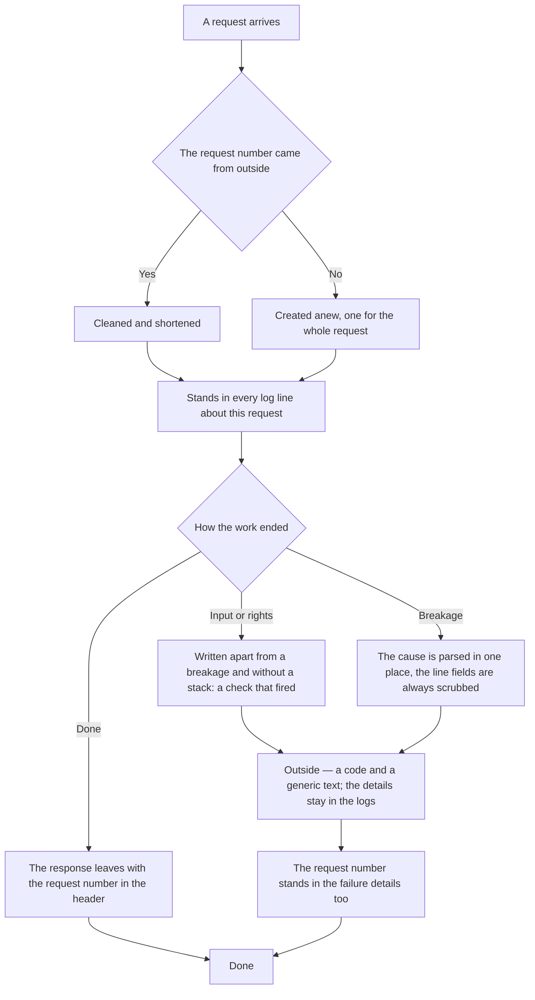

<!-- rt-kit v0.27.0 · rules/observability.needs-app.md · e459b8046eb3 · правится надстройкой, не здесь -->

# Observability — how it works here

Rule under the law `docs/constitution/observability.md`. The law says what the owner must know
about the running application; here — what it is called in this tree, where it lives and what
is not here yet.

## What it is called here

| In the law                                              | Here                                                                                                                                       |
| ------------------------------------------------------- | ------------------------------------------------------------------------------------------------------------------------------------------ |
| what the application writes about itself                | application logs: one line per logger call, in machine form                                                                                |
| the step of importance                                  | the level: from debugging details to a failure that took the process down                                                                  |
| the request number                                      | the request id, also the response header                                                                                                   |
| the marker by which all failures of one request are found | the same request number — it stands in every log line                                                                                    |
| failure details                                         | the parsed cause: class, text, protocol code, code and details from the storage, a trimmed stack                                          |
| the generic error text going outside                    | an internal error without details                                                                                                          |
| scrubbing secrets                                       | replacing values by field name                                                                                                             |
| a failure in the store                                  | what the failures domain saved: a failure group and its occurrences                                                                        |
| what the application came up with                       | the startup digest: one log line with the version, the port, the storage address and the lists of features — enabled, disabled and broken |

## Where it lives

In this tree — the table in `implementation.md` next to it. Paths live there, not here: the rule
travels between repositories, the layout does not, and a path named in the rule lies in the
first tree that keeps its code differently.

## Flow

The flow of handling a request through the eyes of observability: where the request number is
created, how a failure differs from a breakage and what goes outside.

## How the law applies here

- **The request number is created once per request and stands in every log line about it.** By
  time the lines of one request cannot be picked out: there are a dozen requests a second.
- **The request number goes to the caller as a response header and in the failure details.** It
  also stands in the logs, so a number named by a person is found by a direct filter. The header
  is open to a page of a foreign domain: without explicit permission the browser does not hand
  it over.
- **A number that came from outside is cleaned and shortened, and an empty one is created anew.**
  The value from the header comes from anyone, and it lands in a filter over the store.
- **Outside goes the code and a generic error text; the details stay in the logs.** Otherwise a
  guest on a broken rollout reads a column name and the storage layout.
- **A failure on input or rights is written apart from a breakage and without a stack.** It is a
  check that fired. On one level with breakages it floods the alarm with guests' typos.
- **The cause of a failure is parsed in one place.** Otherwise the same error arrives in the logs
  in three different shapes.
- **The fields of a log line are always scrubbed, not at the discretion of whoever writes.**
  Deciding on every call whether the fields hold a secret means being wrong once.
- **At startup the application writes what it came up with.** Half of the features are enabled by
  the presence of an environment variable and are silently off without it. Otherwise the
  question "why does it not work there when it works locally" is answered by reading the
  production settings over ssh.
- **The startup digest holds the names of features and their state, but not the values of
  variables.** The states are laid out as three lists, not as a map "name → state": scrubbing
  works by key name, and the map would arrive in the log scrubbed exactly where the state is
  needed.
- **A feature enabled by a pair of keys knows a third state.** The halves of the pair lie on
  different sides of the delivery, and exactly one can be filled; then the feature is neither off
  nor on but broken — a list of two states has no name for this case, and it reads as enabled.
- **The level threshold decides whether a log line appears in the output, but not in the failure
  store.** The threshold is set for the volume of output, and under a high threshold the selected
  lines of a lower level would silently vanish from the store.
- **A selected log line is saved to the store as a failure.** Selected are the failure level and
  everything above it, and lines of a lower level — by a list of names declared in the code.
- **The logger hands a failure to the sink and does not see the store.** The sink interface is
  declared next to the logger, the failures domain implements it, and it is set from outside at
  startup.
- **Log lines of the storage client, the failures domain and the alerts domain do not go to the
  sink.** The source is cut off, not the moment of writing: a slow insert into the failures table
  itself produces a log line of the storage client, and a marker "I am inside a write" cannot
  catch it. The alerts domain is cut off for the same reason: a failed alert would become a new
  failure, and that one — a new alert.
- **A call to a foreign service goes with an explicit wait limit.** Without it a silent — not
  failed — service holds the connection up to the environment default, and that is minutes: there
  is no failure, nothing to record, and to the owner such silence is indistinguishable from
  healthy work. The limit is named as a number next to the client, because the price of waiting
  differs per service.
- **A send outside creates its own line before the call, and the outcome is appended to it
  after.** The line is created by whoever sees the store, not by whoever sends: the client of the
  external service does not see the store at all. The line also serves as a lock — a second call
  on the same record does not leave — and an unclosed line shows the difference between "running
  right now" and "fell in the middle of sending".
- **Recording a failure does not delay the response and does not take the request down.**
  Between the logger and the store stands a bounded queue; a full queue drops the new failure and
  counts what was dropped.
- **The request context is captured at the moment of the logger call, not at the moment of
  writing.** By the time of writing the execution storage has already been handed to the next
  request.
- **The owner reads what was recorded in their own section, closed by a separate right.** The
  groups that are theirs, and under a group — its occurrences with the cause, the log line fields
  and the bodies.
- **The store does not grow without limit: once a day the excess and the old are removed.**
  Occurrences are removed: first the excess beyond the limit, then the old beyond the age.
  A group left with no occurrence after that goes in a third step — and only if it is older than
  an hour: between its creation and its first occurrence a separate request passes.
- **The store limit is named in rows, not bytes.** Deletion does not shrink the physical size of
  the table, and the condition "size under the limit" would never become true.
- **The owner learns of a new failure by themselves — by an event journal line and by mail.**
  Both roads are opened by one threshold: a new group, or a group silent for longer than a day.
- **The mail holds nothing that is closed by the right to the failures screen.** It goes to an
  address closed by no right, and details in it would bypass the right by mail.
- **The owner reads the failure rate as a curve above the feed: a bar is a bucket of the chosen
  period.** The group counter says how many times it happened, but not when: by it a breakage
  streaming right now cannot be told from one accumulated over a month.
- **The alarm is raised by growth in breakages, not in all failures.** A rejected call is a check
  that fired, and those are nine in ten: against them growth in breakages is not visible at all.
- **A spike is counted over the last closed bucket; the current one is not given to the rule.**
  It is still filling, and at the start of every period a comparison with it would show a drop in
  the rate.
- **The rate is analysed by a schedule tick, not by a screen request.** The curve computes the
  alarm on every response, but the owner may never open the screen, and must learn of a spike
  without it.
- **The owner learns of a spike by a journal line and by mail; a repeat of the mail is held by a
  fuse.** One incident takes one line in the feed, and a mail about a lasting breakage is needed
  the next day too.

## What of the law is not here

A failure that happened before the application came up has nowhere to be recorded: the store
does not exist yet at that moment. Such failures stay only in the container output. A failure of
the store itself goes there too: its log lines are excluded from failures entirely, otherwise a
breakage of the store produces a stream that speeds itself up.

The list of selected lower-level names is checked against nothing. A new place that needs the
store appends itself to it by hand, and a forgotten one silently stays only in the output.

Nothing checks that the level was chosen right. A new place decides on its own which level to
take, and the mistake shows only when the code is read.

The completeness of the startup digest is checked by nothing. Feature names are listed by hand,
while the environment variable is read by dozens of files across all domains: a new feature that
forgot to append itself to the digest silently lands in none of the three lists — and in
production looks not disabled but nonexistent. That is why reading an environment variable
itself demands this rule as a second layer: the guard sees the access to the environment in the
text of the edit, but not whether the digest was appended.

## Patterns

- `observability-record` — how to add a new log line.

## Pitfalls

- **The request context lives in the execution storage and does not move into deferred work.** A
  deferred write reads the context of the request that took the place of the original one. The
  context is captured at the moment of the logger call.
- **The logger is set on the whole application, so the framework lines go the same way as our
  own.** Everything the framework writes about itself lands in the same output and the same
  selection.
- **A stream failure arrives after the response has started.** Control returns when only the
  header has been sent. Without a wrapper such a failure does not reach the logs at all.
- **Serialising a log line must not throw.** Otherwise a circular reference in the fields takes
  down the request whose log the fields were assembled for.
- **The key that wraps a foreign body for scrubbing is chosen by the scrubbing rules.** Scrubbing
  works by key name, and a bare value passes it entirely — but a key that itself counts as free
  text carries the whole body into the store as one scrubbing mark. A new wrapper is checked
  against the key lists before it gets such a name.
- **A repeat fuse whose key is built from what measures time never fires.** When the analysis
  tick equals the bucket width, every analysis sees an empty lock and sends again. From the
  outside it looks working: the fuse is declared, the binding matches, mails go out every hour.
  The key is taken from the subject of the alert, not from the stretch of time it is counted by.
