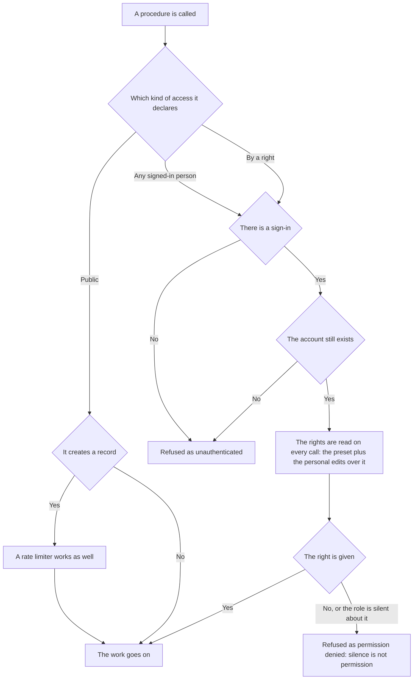

# Access — how it is arranged here

A rule under the law `docs/constitution/application/access.md`. The law says what must be true;
here — what it is called in this tree and where it lies. How the admin panel sections themselves
are arranged is `navigation`.

## What it is called here

| In the law            | Here                                                                                                                                                              |
| --------------------- | ------------------------------------------------------------------------------------------------------------------------------------------------------------------ |
| a right               | the pair "resource and action" as a string: `bookings:manage`, `chat:manage`                                                                                      |
| an access declaration | a decorator on the procedure class: `@RequiresPermission('bookings:manage')`, `@RequiresAuth('reason')`, `@PublicProcedure('reason')`, `@OptionalAuthProcedure('reason')` |
| a preset              | a named set of rights given to a user whole                                                                                                                       |
| an override           | a pointed edit of one right over the preset for one user                                                                                                          |
| the refusal without sign-in | `Code.Unauthenticated`                                                                                                                                      |
| the refusal without a right  | `Code.PermissionDenied`                                                                                                                                    |

## Where it lives

In this tree — the table in `implementation.md` next to it. Paths live there, not here: the rule
travels between repositories, the layout does not, and a path named in the rule lies in the first
tree that keeps its code differently.

## Flow

The flow of an access check: what a procedure is closed by, where the signed-in person's rights
come from and how the absence of a sign-in differs from the absence of a right.

## How the law applies here

- **Every procedure declares its access by a decorator, and there is exactly one declaration.**
  A procedure without a declaration or with two does not let the application come up.
- **There are four kinds of access: by a right, to any signed-in person, public and public with a
  read of the sign-in.** The last gives a signed-in person more than a guest — that is how an
  owner sees hidden objects in a shared list.
- **A user's rights are the preset's rights with their overrides applied over them.**
- **A person has one role per ownership, and the storage holds that.** Two memberships in one
  ownership would have to be added up, and the result of adding bans and permissions over two rows
  cannot be read. The rights of different ownerships are not added at all: they are written down
  on the membership, not on the account.
- **A right the role says nothing about counts as not given.** A value that is not boolean is
  discarded in the addition: an absent right and one outright taken away mean the same, and
  "not empty" does not count as a right.
- **A signed-in person's rights are read on every call rather than taken from the issued
  sign-in.** An issued sign-in says only who came: once signed, it lives for hours and does not
  survive an edit of the rights, so a right taken away would keep a section open until the end of
  the day.
- **An account that no longer exists opens no calls that require a sign-in.** By that same read a
  person who lost their membership in their ownership is refused too: they have nothing to work
  in.
- **The counter and the advertising signals are switched on by the guest's answer, not by the
  presence of a key in the settings.** There are two decisions, and they are stored as a pair:
  "allowed the visit count but not the advertising" is a lawful state, and as a third value of an
  enum it would have to be started anew for every new permission. Everything that is not a pair of
  boolean values is read as an unanswered question, that is, as a refusal: the storage accepts
  anything, and a decision may not be made on a corrupted record. One's own statistics is not tied
  to consent — it goes nowhere outward.
- **A public procedure that creates a record is closed by a rate limiter as well.** No right
  watches it, and without a limit the growth rate of the table is set by the sender, not by the
  owner. It is counted by the client key, and the key is shared by all such procedures: a second
  answer to the question "who is this" would diverge from the first. A public procedure that only
  reads requires no limiter.
- **A request without a sign-in is refused as unauthenticated, and a sign-in without a right as
  permission denied.** These are different answers: the first is cured by signing in, the second
  is not.
- **The right is checked by an interceptor before the procedure body.** The handler does not
  decide whether to let the caller in.
- **Being public is declared with a reason.** The reason is an argument of the decorator, written
  for the reader of the code; it goes neither into the answer nor into the log.
- **A menu item and a section address are closed by one declaration.** Otherwise a hidden item
  closes the section only in appearance: the address opens by a direct link.
- **Until the rights are received the admin panel hides nothing.** An empty header after a network
  failure looks like a broken admin panel and leaves no way out.

## What of the law is not here

A right taken away mid-session does not act until a re-sign-in: the token lives with its rights
until it expires — that is `Q-A-1` in the law. There is no password change from the interface at
all: no screen, no procedure, no recovery of a forgotten one — `Q-A-2`.

## Patterns

- `permissions-procedure` — declaring access on a procedure and gating an admin panel section.

## Pitfalls

- **A procedure the interceptor knows nothing about is refused as permission denied rather than
  let through.**
- **The guard stands on the child routes of the protected group, not on the group itself:** a
  group's guard runs once per page load and does not see moves between sections.
- **The rights arrive in the profile's answer already inside the protected group**, so the guard
  waits for the admin panel to start. A refused request does not take the wait down: with unknown
  rights nothing is closed.
- The decorators live in the `util` of the authentication domain rather than next to the
  interceptor: every domain with procedures sets them, and an edge to the declarations is cheaper
  than an edge to the secret and the database.
