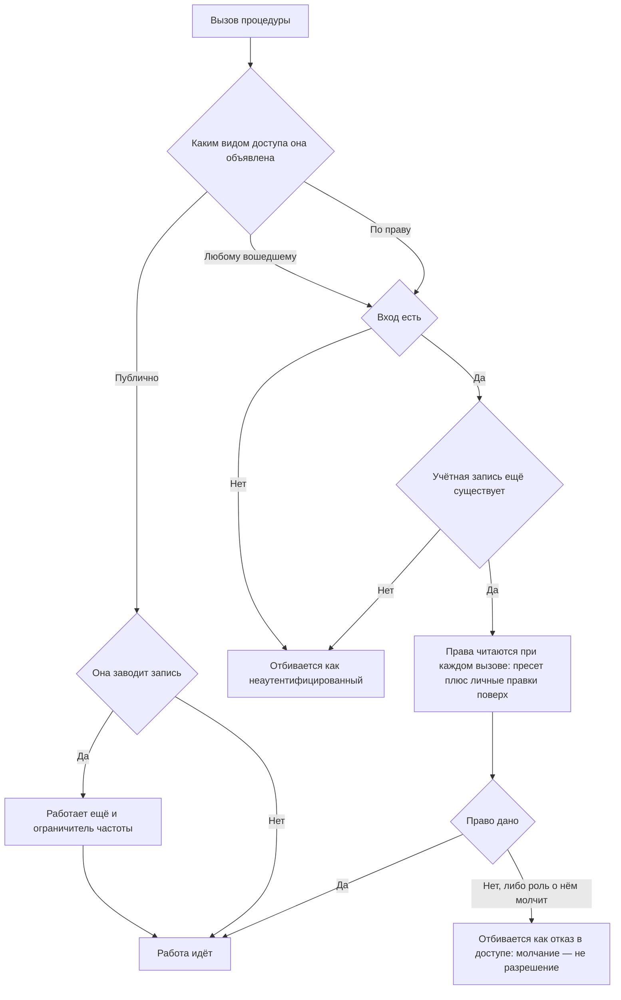

<!-- rt-kit v0.8.3 · rules/permissions.md · 789d8d7e48a6 · правится надстройкой, не здесь -->

# Доступ — как это устроено здесь

Правило под закон `docs/constitution/application/access.md`. Закон говорит, что должно быть верно;
здесь — чем это названо в этом дереве и где лежит. Устройство самих разделов админки —
`navigation`.

## Как это называется здесь

| В законе           | Здесь                                                                                                                                                                   |
| ------------------ | ----------------------------------------------------------------------------------------------------------------------------------------------------------------------- |
| право              | пара «ресурс и действие» строкой: `bookings:manage`, `chat:manage`                                                                                                      |
| объявление доступа | декоратор на классе процедуры: `@RequiresPermission('bookings:manage')`, `@RequiresAuth('причина')`, `@PublicProcedure('причина')`, `@OptionalAuthProcedure('причина')` |
| пресет             | именованный набор прав, выдаваемый пользователю целиком                                                                                                                 |
| оверрайд           | точечная правка права поверх пресета для одного пользователя                                                                                                            |
| отбивка без входа  | `Code.Unauthenticated`                                                                                                                                                  |
| отбивка без права  | `Code.PermissionDenied`                                                                                                                                                 |

## Где это лежит

В этом дереве — таблица в `implementation.md` рядом. Пути живут там, а не здесь: правило
переносится между репозиториями, раскладка — нет, и путь, названный в правиле, врёт в первом
же дереве, которое держит код иначе.

## Ход

Ход проверки доступа: чем закрыта процедура, откуда берутся права вошедшего и чем отличается
отсутствие входа от отсутствия права.

## Как закон применяется здесь

- **Каждая процедура объявляет свой доступ декоратором, и объявление ровно одно.**
  Процедура без объявления или с двумя объявлениями не даёт приложению подняться.
- **Видов доступа четыре: по праву, любому вошедшему, публично и публично с чтением входа.**
  Последний отдаёт вошедшему больше, чем гостю, — так владелец видит скрытые объекты в общем
  списке.
- **Права пользователя — это права пресета, поверх которых применены его оверрайды.**
- **У человека одна роль во владении, и держит это хранилище.** Две принадлежности в одном
  владении пришлось бы складывать, а результат сложения запретов и разрешений по двум строкам
  не прочитать. Права разных владений не складываются вовсе: они записаны у принадлежности, а
  не у учётной записи.
- **Право, о котором роль ничего не говорит, считается неданным.** Значение, которое не булево,
  отбрасывается при сложении: отсутствующее право и прямо отобранное означают одно и то же, и
  «непусто» правом не считается.
- **Права вошедшего читаются при каждом вызове, а не берутся из выданного входа.** Выданный
  вход говорит только о том, кто пришёл: подписанное однажды живёт часами и правку прав не
  переживает, поэтому отобранное право открывало бы раздел до конца дня.
- **Учётная запись, которой больше нет, вызовов, требующих входа, не открывает.** Тем же
  чтением отбивается и человек, потерявший принадлежность в своём владении: работать ему не в
  чем.
- **Счётчик и рекламные сигналы включает ответ гостя, а не наличие ключа в настройках.**
  Решений два, и хранятся они парой: «разрешил счёт посещений, но не рекламу» — законное
  состояние, а третьим значением перечисления его пришлось бы заводить заново на каждое новое
  разрешение. Всё, что не пара булевых значений, читается как неотвеченный вопрос, то есть как
  отказ: хранилище принимает что угодно, а решать по испорченной записи нельзя. Своя
  статистика к согласию не привязана — она не уходит наружу.
- **Публичная процедура, заводящая запись, закрыта ещё и ограничителем частоты.** Право её не
  сторожит, и без предела скорость роста таблицы задаёт отправитель, а не владелец. Считается
  по ключу клиента, и ключ у всех таких процедур общий: второй ответ на вопрос «кто это»
  разошёлся бы с первым. Публичная процедура, которая только читает, ограничителя не требует.
- **Запрос без входа отбивается как неаутентифицированный, а вход без права — как отказ в
  доступе.** Это разные ответы: первый лечится входом, второй — нет.
- **Право проверяется перехватчиком до тела процедуры.** Обработчик не решает, пускать ли
  вызывающего.
- **Публичность объявляется с причиной.** Причина — аргумент декоратора, записанный для
  читателя кода; ни в ответ, ни в лог она не уходит.
- **Пункт меню и адрес раздела закрыты по одной декларации.** Иначе скрытый пункт закрывает
  раздел лишь на вид: адрес открывается по прямой ссылке.
- **Пока права не получены, админка ничего не прячет.** Пустая шапка после сетевого сбоя
  выглядит как сломанная админка и не оставляет выхода.

## Чего из закона здесь нет

Право, отобранное посреди сессии, до перевхода не действует: токен живёт со своими правами до
истечения — это `Q-A-1` в законе. Смены пароля из интерфейса нет вовсе: ни экрана, ни
процедуры, ни восстановления забытого — `Q-A-2`.

## Паттерны

- `permissions-procedure` — объявление доступа у процедуры и гейтинг раздела админки.

## Ловушки

- **Процедура, о которой перехватчик ничего не знает, отбивается как отказ в доступе, а не
  пропускается.**
- **Гвард стоит на дочерних маршрутах защищённой группы, а не на самой группе:** гвард группы
  отрабатывает один раз за загрузку страницы и переходов между разделами не видит.
- **Права приходят ответом профиля уже внутри защищённой группы**, поэтому гвард дожидается
  запуска админки. Отказ запроса ожидание не роняет: с неизвестными правами не закрывается
  ничего.
- Декораторы живут в `util` домена аутентификации, а не рядом с перехватчиком: их ставит
  каждый домен с процедурами, и ребро к объявлениям дешевле ребра к секрету и базе.
