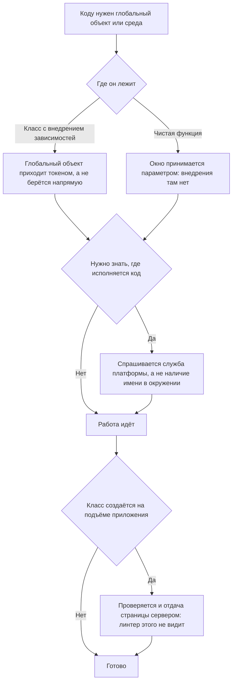

<!-- rt-kit v0.24.0 · rules/platform-access.md · 043d00a452af · правится надстройкой, не здесь -->

# Окружение браузера — как это устроено здесь

Правило под закон `docs/constitution/frontend-application.md`. Закон говорит, что должно быть
верно; здесь — чем в этом дереве заменяется прямое обращение к глобальному объекту. Состояние
— `angular-patterns`, файл компонента — `component-structure`, стили — `styling-bem`, слой
обращения к серверу — `api-layer`. Все пять под одним законом.

Правило про фронт: `libs/api/**` и `apps/api/**` — это NestJS, там своя среда, и ничего из
перечисленного не применяется.

## Как это называется здесь

| Прямое обращение                         | Здесь                                              |
| ---------------------------------------- | -------------------------------------------------- |
| `globalThis.open(...)`, `window.open()`  | `inject(WINDOW).open(...)`                         |
| `globalThis.crypto.randomUUID()`         | `inject(WINDOW).crypto.randomUUID()`               |
| `isPlatformBrowser(inject(PLATFORM_ID))` | `inject(PlatformService).isPlatformBrowser`        |
| `document.defaultView`                   | `inject(WINDOW)`                                   |
| прямой `document`                        | `inject(DOCUMENT)` из `@angular/common` — как было |
| инициализация DOM после отрисовки        | `afterNextRender()`                                |

`WINDOW`, `PlatformService` и `StorageService` приходят из `@rt-tools/core`.

## Где это лежит

В этом дереве — таблица в `implementation.md` рядом. Пути живут там, а не здесь: правило
переносится между репозиториями, раскладка — нет, и путь, названный в правиле, врёт в первом
же дереве, которое держит код иначе.

## Ход

Ход обращения к среде исполнения: чем берётся глобальный объект, где проверяется среда и что
делается в файле без внедрения зависимостей.

## Как закон применяется здесь

- **Глобальный объект приходит токеном `WINDOW`, а не берётся напрямую.** Тип уточняется
  приведением к `Window & typeof globalThis`: конструкторы вроде `IntersectionObserver`
  объявлены на глобальном объекте, а не на интерфейсе `Window`.
- **Среда проверяется через `PlatformService`, а не через `typeof window`.** Проверка по
  наличию глобала верна случайно и ломается на первой же среде, где глобал подставлен.
- **Прямое обращение к глобальному объекту отбивает линтер.** Шестнадцать имён окружения
  браузера запрещены на фронтовых деревьях; три места, где прямой доступ осознан, выведены
  из-под запрета списком в конфиге, а не отключением в строке.

## Чего из закона здесь нет

Запрет действует на имена, а не на пути к ним: `this.#document.defaultView` линтер пропускает,
потому что глобального имени в такой строке нет. Такое обращение законно — окно там уже пришло
внедрением, — но и настоящий обход выглядел бы так же, и увидеть его можно только чтением.

Прямой доступ остаётся в трёх местах, и это осознанно: встроенный скрипт против мелькания темы
в `apps/site/src/index.html` (работает до подъёма приложения), обработчик отказа подъёма в
`apps/*/src/main.ts`, и код внутри `page.evaluate` в сквозных спеках — он исполняется в
странице, вне DI. Новое место в этот список не добавляется без явного согласования владельца.

## Паттерны

- `platform-access-di` — готовые инжекты, приведение типа, чистые функции, проверка среды.

## Ловушки

- **Фабрика токена бросает `Window is not available`, если у документа нет `defaultView`.**
  Под отдачей страницы сервером `defaultView` есть, и инжект полем класса в root-сервисе
  безопасен, но сервис, обязанный работать без DOM вообще, берёт окно внутри метода под
  проверкой среды.
- **После правки, добавляющей `WINDOW` в сервис, который создаётся на подъёме, нужна не только
  сборка, но и поднятый сервер отдачи страниц.** Сайт — настоящий SSR, и падение видно только
  там.
- **Вокруг хранилища проверка среды не нужна:** `StorageService` и так уходит в память вне
  браузера, и лишний `if (!isBrowser)` вокруг чтения и записи — мёртвый код.
- **В `*.logic.ts` и `*.util.ts` нет DI:** окно принимается параметром, а инжектит его
  вызывающий компонент.
- **Подготавливать состояние сквозной спеки записью в хранилище нельзя:** спека проходит те же
  шаги, что и пользователь.
