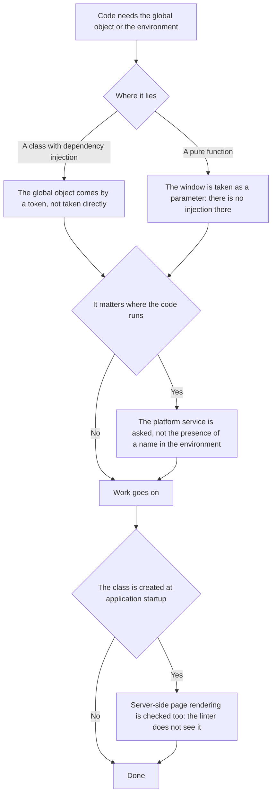

<!-- rt-kit v0.29.0 · rules/platform-access.md · 28138749f60c · правится надстройкой, не здесь -->

# Browser environment — how it works here

Rule under the law `docs/constitution/frontend-application.md`. The law says what must be true; here
— what replaces a direct call to the global object in this tree. State — `angular-patterns`, the
component file — `component-structure`, styles — `styling-bem`, the server access layer —
`api-layer`. All five under one law.

The rule is about the front end: `libs/api/**` and `apps/api/**` are NestJS, the environment there
is its own, and nothing of the listed applies.

## What it is called here

| Direct call                              | Here                                                  |
| ---------------------------------------- | ----------------------------------------------------- |
| `globalThis.open(...)`, `window.open()`  | `inject(WINDOW).open(...)`                            |
| `globalThis.crypto.randomUUID()`         | `inject(WINDOW).crypto.randomUUID()`                  |
| `isPlatformBrowser(inject(PLATFORM_ID))` | `inject(PlatformService).isPlatformBrowser`           |
| `document.defaultView`                   | `inject(WINDOW)`                                      |
| direct `document`                        | `inject(DOCUMENT)` from `@angular/common` — as before |
| DOM initialisation after rendering       | `afterNextRender()`                                   |

`WINDOW`, `PlatformService` and `StorageService` come from `@rt-tools/core`.

## Where it lives

In this tree — the table in `implementation.md` next to it. Paths live there, not here: the rule
travels between repositories, the layout does not, and a path named in the rule lies in the first
tree that keeps its code differently.

## Flow

The flow of reaching the runtime: how the global object is taken, where the environment is checked
and what is done in a file without dependency injection.

## How the law applies here

- **The global object comes by the `WINDOW` token, not taken directly.** The type is narrowed by a
  cast to `Window & typeof globalThis`: constructors like `IntersectionObserver` are declared on the
  global object, not on the `Window` interface.
- **The environment is checked through `PlatformService`, not through `typeof window`.** A check by
  the presence of a global is right by accident and breaks on the first environment where the global
  is stubbed.
- **A direct call to the global object is refused by the linter.** Sixteen browser environment names
  are banned on the front-end trees; the three places where direct access is deliberate are taken
  out from under the ban by a list in the config, not by a disable on the line.

## What of the law is not here

The ban acts on names, not on paths to them: the linter lets `this.#document.defaultView` through,
because there is no global name in such a line. Such a call is lawful — the window there already
came by injection — but a real bypass would look the same, and it can be seen only by reading.

Direct access remains in three places, and deliberately: the inline script against theme flicker in
`apps/site/src/index.html` (it runs before the application starts), the startup failure handler in
`apps/*/src/main.ts`, and the code inside `page.evaluate` in the end-to-end specs — it runs in the
page, outside DI. A new place is not added to this list without the owner's explicit agreement.

## Patterns

- `platform-access-di` — ready-made injects, the type cast, pure functions, the environment check.

## Pitfalls

- **The token factory throws `Window is not available` if the document has no `defaultView`.** Under
  server-side page rendering `defaultView` exists, and an inject as a class field in a root service
  is safe, but a service that must work without a DOM at all takes the window inside a method under
  an environment check.
- **After an edit that adds `WINDOW` to a service created at startup, not only the build is needed
  but also a running page-rendering server.** The site is real SSR, and the failure shows only
  there.
- **No environment check is needed around storage:** `StorageService` falls back to memory outside
  the browser anyway, and an extra `if (!isBrowser)` around a read and a write is dead code.
- **There is no DI in `*.logic.ts` and `*.util.ts`:** the window is taken as a parameter, and the
  calling component injects it.
- **Preparing the state of an end-to-end spec by writing to storage is not allowed:** the spec walks
  the same steps as the user.
