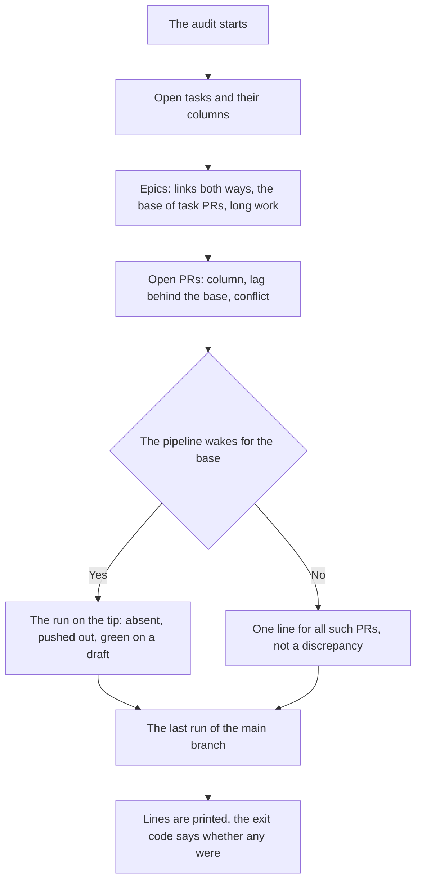

<!-- rt-kit v0.29.4 · rules/queue-audit.github.md · a4aed6fc7397 · правится надстройкой, не здесь -->

# Work queue audit — how it works here

Rule under the law `docs/constitution/delivery.md`. The law says what must be true about the work
queue; here — what the audit reads in a tree on GitHub and which discrepancies it names. Creating a
task, a branch and a PR is the rule `git-workflow`.

## What it is called here

| In the law                 | Here                                                         |
| -------------------------- | ------------------------------------------------------------ |
| the work queue             | the project board; a task is an issue on it                  |
| a discrepancy of the queue | a line of the audit; a run with lines exits with code 1      |
| the audit run              | `npm run check:board`                                        |

## Where it lives

In this tree — the table in `implementation.md` next to it. Paths live there, not here: the rule
travels between repositories, the layout does not, and a path named in the rule lies in the first
tree that keeps its code differently.

## Flow

What the audit reads, in the order it reads it.

## How the law applies here

- **A lagging column is found by the queue audit, not by eye.** It judges the column by the PR both
  ways: an open PR with the task not in review, and review with no open PR.
- **A branch with an open PR lags behind its base silently.** The guard judges the base once, at
  opening, and the run does not see what merged after. The work queue audit counts the lag.
- **The link between a task and an epic is read by the audit both ways.** A one-sided binding looks
  as whole as a two-sided one.
- **Work that one session cannot close is marked in two places, and they are audited.** The board
  label and the sessions line in the epic plan say the same to two readers; only what legitimately
  does not split is marked.
- **The tip of an open PR without a run is seen by the work queue audit, unless the pipeline does
  not wake for its base.** A page without a run looks the same as with a green one; where no run
  comes at all, the audit is silent about that PR.
- **A run pushed out of the pipeline queue gets a separate audit line.** It looks failed though it
  never checked the branch, and the step count tells them apart.
- **The last run of the main branch is judged by the audit too: red and pushed out get lines of
  their own.** The merge itself is checked by nobody; a pipeline asleep on a push to main is named.
- **A draft with a green run on its tip is an audit discrepancy.** A green page permits nothing: the
  host locks the button.
- **A conflicting open PR is a work queue audit discrepancy.** The conflict arrives with someone
  else's merge, and the host shows the mark only inside the PR.
- **The author of an open PR and whether it has a reviewer are audited by the work queue.** Before the
  merge neither miss shows: a PR opened by a person never gets a reviewer.

## What of the law is not here

The audit reads the queue and the host, not the tree: what a PR body says about the work it reads
as text and does not judge. A column moved by hand between two runs is seen only on the next run.

## Patterns

- `queue-audit-read` — running the audit and acting on each of its lines.
