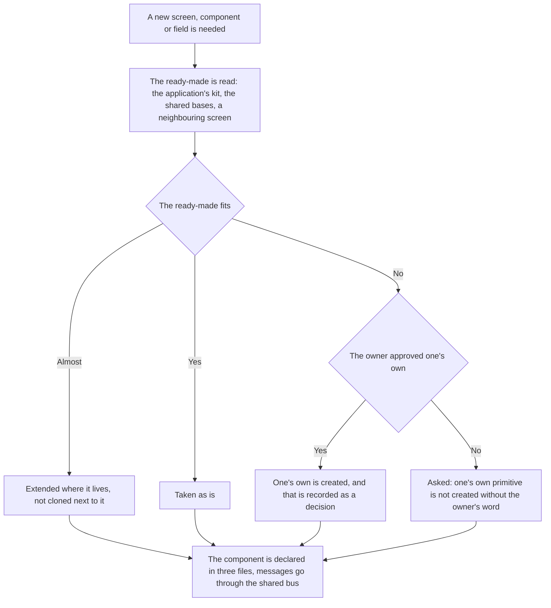

<!-- rt-kit v0.26.0 · rules/reuse-first.md · 20df04ff82db · правится надстройкой, не здесь -->

# Uniformity — how it works here

Rule under the law `docs/constitution/reuse-first.md`. The law says that the same things behave
the same; here — what that stands on in this tree and what it is called.

## What it is called here

| In the law                            | Here                                                                                                                                              |
| ------------------------------------- | ------------------------------------------------------------------------------------------------------------------------------------------------- |
| the ready-made                        | the kit components of `@rt-tools/ui-kit-v2` with the `rt-` prefix — over seventy today — and selectorless base classes inherited in a screen's `@Component` |
| the layout of pages, forms and windows | `apps/<app>/src/styles/`, applied with the BEM directives                                                                                        |
| styling of a part of the application  | the `.scss` file next to the component                                                                                                            |
| a departure decided by the owner      | the `native-ok` marker with an explanation — a comment on the line above or in the line itself                                                    |

## Where it lives

In this tree — the table in `implementation.md` next to it. Paths live there, not here: the rule
travels between repositories, the layout does not, and a path named in the rule lies in the
first tree that keeps its code differently.

## Flow

The flow of creating something new: where the work starts, where the border runs between
extending the ready-made and writing one's own, and what holds that border.

## How the law applies here

- **The source of look is chosen by application, not by habit.** Every application of the tree
  has its own base: the public site — its design system, the rest — the kit. A mixed-up source
  brings to the screen a shape that exists nowhere else in this application. Which application
  rests on what is named in the tree's names.
- **Work starts with reading the ready-made, not with a blank file.** First the base is found — a
  kit component, a base class, a sample in a neighbouring domain — then one's own is written on
  top of it.
- **A restriction invented on the spot is checked by a search over the tree before it becomes an
  argument.** "This is not allowed" is a statement about the tree like any other, and a tree
  where the technique is already applied answers it with one command. Named to the owner before
  the search, it closes a road the tree uses every day and sets off a walk through needless
  options: the decision "a class of a foreign kit cannot be edited from the application" went
  unchecked while a sample of exactly that edit lay in the same file — with the argument on the
  next line.
- **A value of an integration is taken the same way as the neighbouring value of the same
  integration.** The half of the integration done properly is a ready-made sample, and it stands
  not in a foreign domain but one line above: next to a map id hardcoded in the code lived that
  map's own key, arriving by injection. A divergence between neighbours is the question "why is
  one parameter done and the other not", not a choice between three ways to fix the second.
  Nothing catches it: the value is syntactically valid, lint and build are green, and the
  duplicate audit does not take a pair of constants under its signs.
- **One's own primitive and one's own base are created only with the owner's explicit approval.**
  This is asked before the first file is written.
- **The record edit panel inherits the shared base, not its own markup.** Then it opens, closes
  and asks about unsaved edits the same way in every section.
- **Success and failure are reported by the shared bus, not by one's own markup on the screen.**
  One's own message diverges from the neighbouring one in look, place and time of showing. A
  ready-made kit message placed on the screen is the same own markup: the rule speaks of the
  place of showing, not the tag, and replacing one's own paragraph with a ready-made component
  does not lift the violation — it lifts the sign.
- **An inline message is lawful where the record edit panel stays open after a failure.** The
  panel base holds it; a screen, a list and a public page have no claim to that place.
- **The departure marker is set after reading the inventory of the ready-made, and what was read
  is named next to it.** The explanation at the marker names the kit component and what it
  lacks. A marker without that is not a departure but a silencer: it lifts the sign having proved
  nothing.
- **A check is not taken off the gate so that the push goes through.** A divergence is closed by
  the ready-made or declared as a departure in the code itself; a profile override is no means
  for that.
- **A component is declared in three files: `.ts`, `.html`, `.scss`.** `template:` and `styles:`
  in the decorator, the `style=` attribute and resizing through `[ngStyle]` are styles that
  neither the kit nor `stylelint` reaches.
- **A screen component outside the kit has an empty styles file by default.** The layout is
  declared once in the shared layer of the application, and the screen only applies it with the
  same BEM directives.
- **The ready-made is extended, not cloned next to it.** The missing variant is created in the kit
  or in the base class, and the other screens see it.
- **What accumulated before the guard is counted by the full check, and the list may only not
  grow.** Its signs are the same as the guard's, because both read the same declared sets, but it
  looks at the whole file: the gate falls on a new place, the old stays a number in the digest.
- **Signs are declared by the tree, not hardcoded in the check.** The tree does not take
  everything from rt-tools, and a sign about the ready-made of a package that is not here answers
  falsely exactly like the name of a foreign application.
- **The second value of the same integration follows its own kind, not its neighbour in the
  file.** An external service rarely has one parameter: next to the key stands an id, next to the
  address — a scope, and the first is usually done properly while the second stays hardcoded.
  What is asked is not the neighbour but the kind: where values of this kind are created, who
  edits them, by what road they reach the build. The neighbour may itself be unmoved, and
  repeating it spreads the stale way further; the nearest neighbour is taken as the sample only
  when the tree has no such kind at all. A hardcoded value is refused by neither linter, build nor
  test: it is syntactically valid and simply does not belong to this tree — that is how a demo
  value from the vendor's documentation leaves for the production build.

## What of the law is not here

The same response of an input field to an error is held by the kit: nobody in this tree inherits
`RtFormControlBase`, because fields are taken as its ready-made components. There is nothing here
to bind this article of the law to.

An inline template stands on one component, and the same one has the only `styles:` — the admin
header. `role="alert"` is written by hand in sixteen templates, and `rt-message` is called by one
consumer. That is debt, not a permitted departure.

## Patterns

- `reuse-first-extend` — what to do when the ready-made was not enough: extend the kit, declare a
  departure with the marker, remove it.

## Signs by which it is visible that the ready-made was bypassed

They are not listed here: a sign is a record in a file, not the text of the rule and not the code
of the check. The sets live with the package, one file per rt-tools package, and each holds only
what that package ships. The tree names the sets it needs with the key `reuse.bundles` in the
checks settings and appends its own signs in a file named by the key `reuse.signals`; a matching
key replaces the package one, a new one is appended. There the tree also names the directives of
its design system — with the key `reuse.kitDirectives`: a native tag carrying such a directive is
cut out of the signs, because the source of look in a tree is not always one. The guard on an
edit and the full check both read from here — they have nothing to diverge by.

What counts as a sign:

- a native control in a template where the kit ships its own;
- a failure, a warning or a wait assembled by hand instead of the ready-made — the sign names the
  tag, and the decision is made by the place of showing: a ready-made message on the screen
  closes the sign without closing the violation;
- an overlay above the page declared with one's own styles — backdrop, layer order, rotation;
- a layout declared in the screen's styles file instead of applied with directives from the
  shared layer;
- one's own implementation of what the kit base gives, instead of inheritance;
- a file name repeating the name of a kit primitive, outside the kit.

A sign names its scope: inheriting a base and a class decorator do not land in a spot edit, and a
sign judging them by the added text is always silent. A sign also names its cancel — a sample
under which it does not fire: the base is already inherited, the ready-made is already called.

## Pitfalls

- **A sample is searched for by the kit's names, not by what the kit is written on.** A search by
  the names of the library the kit is built on finds not one file: the overlay, the portal and the
  window are covered by the kit and called by its names. The reverse happens too: the library is a
  direct dependency, and what the kit does not cover is called in the tree by the library's own
  name. Before deciding that a name is not in the tree, it is searched for — this costs two
  reworks per technique.
- A move does not count as reinvention: a line already lying in a file is struck out of the
  checked text by the guard, and the comparison goes without indentation — on a move a block
  changes its indent while staying the same code.
- An answer given before reading the sample is overruled by the sample: the agreed shape of a list
  query was replayed together with the contract two questions after it was accepted.
- **A set is declared by what the tree consumes, not by what the package ships.** A tree in which
  the kit is written, not called, having declared its set, gets advice to call the kit on the
  kit's own files: the sign is right but pointed the wrong way. Such a tree declares only the sets
  whose ready-made it takes from outside.
- **A guard that received no sign is indistinguishable from a guard with nothing to refuse.** It
  says so itself, and the first edit in a tree without declared sets shows it. Silence of the
  check does not count as a sign of order — first one looks whether it has anything to judge by.
