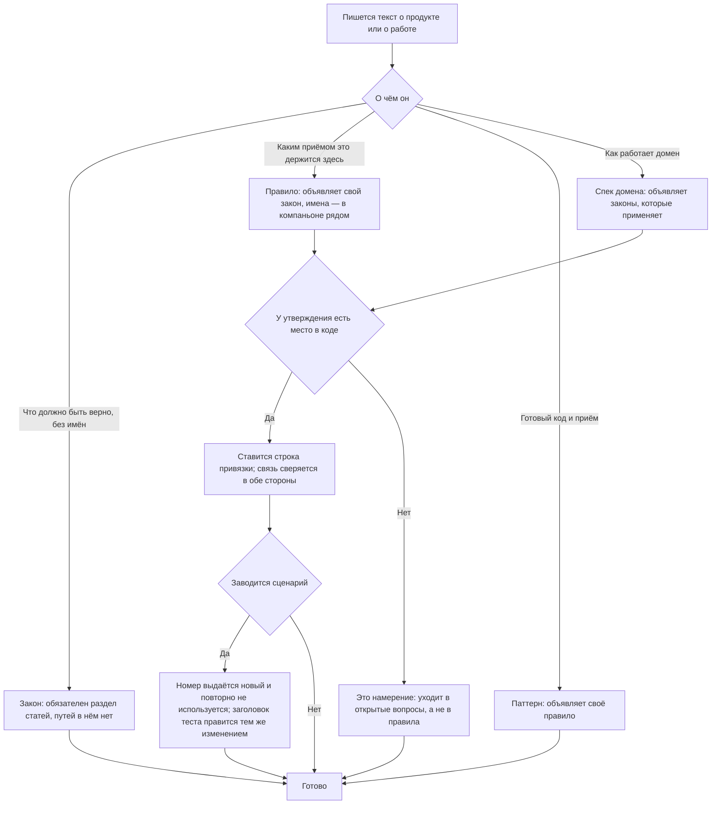

<!-- rt-kit v0.16.0 · rules/spec-driven.md · 866e855735c0 · правится надстройкой, не здесь -->

# Документация проекта — как это устроено здесь

Правило под закон `docs/constitution/project-documentation.md`. Закон говорит, что должно
быть верно про тексты; здесь — из каких слоёв они сложены в этом дереве и что сверяет машина.
Формулировки — правило `doc-style` под тем же законом.

**Холодная часть:** `pitfalls.md` рядом — ловушки, грабли, на которые уже наступали.
Грузится по требованию, а не вместе с правилом.

## Как это называется здесь

```
ЗАКОН      docs/constitution/<закон>.md              — верен для любого приложения этого класса
           docs/constitution/application/<закон>.md  — закон приложения: деньги, локали, доступ
           о проекте не знает ничего: ни путей, ни имён файлов, ни привязок

  ├─ ПРАВИЛО    .claude/skills/<правило>/SKILL.md   (kind: rule, law: <закон>)
  │             привязывает закон к этому проекту; несколько правил на закон
  │             .claude/skills/<правило>/implementation.md — привязка к коду
  │             .claude/skills/<правило>/pitfalls.md — холодная часть: грузится по требованию
  │
  │  └─ ПАТТЕРН  .claude/skills/<правило>-<что>/SKILL.md   (kind: pattern, rule: <правило>)
  │              готовый код и конкретные приёмы; минимум один на правило
  │
  └─ СПЕК ДОМЕНА  docs/specs/<домен>/
                  как работает домен; объявляет законы, которые применяет

СКИЛ БЕЗ ЗАКОНА  .claude/skills/<имя>/SKILL.md   (ни kind: rule, ни kind: pattern)
                 стоит рядом с лестницей, а не в ней: он не про то, что должно быть
                 верно в продукте, а про то, как здесь делается работа
```

Ссылки идут только снизу вверх: закон не ссылается ни на правило, ни на спек, ни на файл.

Скил без закона — третий случай, и он законный. Витрина, генератор, работа с чужим сервисом,
заведение самого скила: над таким нет утверждения о продукте, а значит нет и закона. Выдумывать
ему закон, чтобы уложить в лестницу, нельзя — закон, у которого одно правило и ни одной статьи о
продукте, разъезжается с остальными при первой же правке. Как такой скил заводится — скил
`write-a-skill`.

| В законе                        | Здесь                                                                                                |
| ------------------------------- | ---------------------------------------------------------------------------------------------------- |
| набор разделов                  | `REQUIRED_HEADINGS` для спека, «Статьи» для закона                                                   |
| утверждение документа           | пункт `## Правила` в спеке, `## Статьи` в законе, `## Как закон применяется здесь` в правиле         |
| место, где оно исполняется      | строка в `implementation.md` рядом: `` `файл:символ` ``                                              |
| обещанное поведение             | сценарий `SC-<ПРЕФИКС>-<НОМЕР>` в `docs/specs/<домен>/scenarios.md`                                  |
| открытый вопрос                 | `Q-N` — на него ссылаются из задачи на борде и из коммитов; номер после закрытия не переиспользуется |
| законы, которые применяет домен | строка `**Законы:**` в шапке спека, именами в кавычках                                               |

## Где это лежит

В этом дереве — таблица в `implementation.md` рядом. Пути живут там, а не здесь: правило
переносится между репозиториями, раскладка — нет, и путь, названный в правиле, врёт в первом
же дереве, которое держит код иначе.

## Ход

Ход заведения текста: какой слой пишется, чем утверждение привязывается к коду и что происходит
со сценарием после выкатки.



## Как закон применяется здесь

- **Набор разделов спека задан заранее, и отсутствие раздела — отказ.** «Не применимо» —
  законный ответ, отсутствие раздела — нет: сквозные требования вспоминаются постфактум
  именно тогда, когда для них не заведено места.
- **Каждое утверждение привязано к месту в коде, и связь сверяется в обе стороны.** Ключ
  связи — сам текст утверждения, поэтому переформулировать его, забыв про привязку, нельзя.
- **Привязка не ведёт в код, который никто не зовёт.** Символ, объявленный в своём файле и
  больше нигде не встречающийся, местом исполнения не считается.
- **Таблица процедур сверяется с декораторами в обе стороны.** Иначе процедура, которую домен
  обслуживает, но забыл описать, видна только в декораторе.
- **Код отказа принимается, только если он в домене бросается.** Коды выписывались по
  замыслу, и на одном пути обещанный отказ не бросал никто.
- **Префикс сценариев в спеке один, и по всему дереву он занят им одним.** Второй префикс
  внутри спека означает, что предмет описан дважды; занятый чужим — что по номеру не видно,
  чей это сценарий. Договорённость о продукте — исключение: она нумеруется вместе со спеком, в
  который вольётся, и занятым префикс от неё не становится.
- **Номер сценария выдаётся один раз и повторно не используется.** Новый сценарий берёт
  следующий свободный номер, а не вставляется в середину и не занимает номер удалённого: на
  месте удалённого номер так и остаётся пустым. Номер — единственное, чем сценарий связан с
  тестом, и отданный второй раз он оставляет старую ссылку правильной на вид и ведущей не туда.
  Пересчитать номера подряд особенно дёшево на вид: тесты зелёные и до, и после.
- **Сценарий и заголовок его теста правятся одним изменением.** Изменилось обещание — номер тот
  же, а заголовок теста правится тем же коммитом; удалён сценарий — удаляется и тест.
  Разъехавшись, они оставляют прогон зелёным, хотя проверяет он уже не то.
- **Поддомен спрашивается наравне с доменом.** Те же обязательные разделы, тот же компаньон
  рядом, та же связь сценариев с тестами. Домен, у которого половина поддоменов описана, а
  половина заведена пустыми каталогами, зелёным не бывает.
- **У закона обязателен раздел «Статьи», а кроме них он держит только открытые вопросы.**
  Истории правок и доводов о выбранном когда-то варианте в законе нет: историю держит система
  контроля версий, а довод с отвергнутой альтернативой — свойство работы, и место ему в
  «Ловушках» правила. Закрытый вопрос из закона уходит, а пустой раздел ради заголовка
  проверку всё равно проходил.
- **Предложенный закон правила не требует.** Договорённость, записанную раньше кода,
  привязывать не к чему, а требование правила заставило бы завести его с якорями в
  несуществующие места. Признак стоит строкой статуса в самом законе, а не в списке исключений
  рядом с проверкой.
- **Закон, назвавший файл проекта, — отказ.** Путям и привязкам место в правиле: иначе закон
  нельзя ни прочитать без знания дерева, ни применить на другом приложении.
- **Описание правила не длиннее трёхсот знаков и отвечает на один вопрос — брать это правило
  или нет.** Описание едет в системный промпт каждого захода целиком, и платит его заход, чем бы
  ни занимался: тем оно и отличается от тела правила, которое исполнитель читает сам. Растёт оно
  само — его пишут вслед за правилом и пересказывают в нём содержимое, — а пересказ приходит
  вторым разом вместе с самим правилом. Считает длину проверка описаний; оставленное длиннее
  предела называется в перечне принятого долга поимённо, с причиной.

- **Правило объявляет закон, под который написано.** Правило без закона — набор приёмов, из
  которого не видно, что именно должно быть верно.
- **Слоёв законов два, а имя закона одно на оба.** Общий лежит в корне конституции, закон
  приложения — в `application/`; ни `law:`, ни `**Законы:**` слоя не называют, поэтому имена
  законов уникальны по всему дереву конституции.
- **Расхождение правила и его компаньона решается в пользу правила.** Компаньон называет имена
  дерева и привязки статей, а не отменяет их: прочитанный старше правила, он становится местом,
  где требование снимается молча и без разбора. Предметность доводом тут не бывает — компаньон
  предметнее всегда, на то он и компаньон. Найденное расхождение называется владельцу и чинится
  в том тексте, который отстал, а работа до этого идёт по правилу.
- **Утверждение компаньона о состоянии внешней службы проверяется командой, которую он сам
  называет.** Ограничение соседа снимается вместе с чужой настройкой, а текст о нём остаётся
  стоять в настоящем времени и после снятия выглядит верным: действующее от снятого отличает
  только вызов. Компаньон поэтому пишет способ спросить, а не снимок ответа, — и велеть по
  такому снимку обратное тому, что говорит правило, он не вправе.
- **У правила бывает третий файл, и в него уходит то, что при решении не читают.** Ловушки и
  поведение по разборам происшествий нужны не тому, кто принимает обычное решение, а тому, кто
  разбирает промах или спорит с гардом, — а грузятся они вместе с правилом каждый раз и растут
  быстрее статей. Такой текст уезжает в `pitfalls.md` рядом, правило называет его строкой в
  шапке, и грузится он по требованию. Отказ гейта о холодной части молчит: он зовёт правило, а о
  третьем файле говорит само правило.

- **Спек объявляет законы, которые применяет, и связь сверяется в обе стороны.** Закон,
  названный в тексте спека, обязан стоять в шапке: иначе по закону не узнать, какие домены
  на нём стоят.
- **Переносимый текст говорит о соседнем ресурсе условно и называет его по имени.** Что
  разложено в дереве, а что нет, знает список раскладки, а не текст ресурса. Сказанное
  безусловно — «правку кода до этого отбивает гард» — приходит в контекст каждой сессии и врёт
  про дерево, где того гарда не разложили; поправить это дерево не может ничем, если у ресурса
  нет надстройки. Требование ресурса к ресурсу при этом объявляется строкой в шапке, а не
  выводится из такой фразы.
- **Статья правила говорит о своей применимости сама, строкой признака при себе.** Отказ гейта
  зовёт правило целиком, а под конкретную правку подпадает одна его статья: платить за решение
  полной ценой правила — значит учить не читать лишнего, то есть работать хуже разведанным.
  Признак стоит при статье, а не в карте гейта: карта знает путь и правило, но не знает, какая
  из двух десятков статей про этот путь.

    ```markdown
    - **Заголовок статьи.** Текст статьи, как обычно.
      <!-- rt-when: *.scss *.css -->
    ```

    Образцы разделены пробелом и сверяются с путём правки как образцы оболочки, а не поиском по
    словам: поиск называет не ту статью и молчит об этом. Образец без каталога сверяется и с
    именем файла. Комментарий не виден в собранной разметке, поэтому статья читается человеком
    как прежде.

- **Статья без признака законна, и правило без единого признака — тоже.** Признак ставится тем
  статьям, чьё правило отбивает на правке файла; остальные размечаются по мере того, как их
  отбития попадут в сводку. Отсутствие признака означает «эту статью по пути правки не
  выбирают», а не промах: требовать его у всех значило бы размечать наугад те правила, которые
  ни разу никого не отбили.

- **Паттерн находится по полю `rule:`, а не по приставке имени.** Приставку имени несут не все
  паттерны, и поиск по имени правила таких не видит: сверка ищет их полем, человек — разделом
  «Паттерны» самого правила. Счёт паттернов, собранный приставками, выходит меньше настоящего, а
  число потом уезжает в деление работы.
- **Решение из спека уходит в слой, а не в описание прошлого.** Что сверяется у спека, машина
  знает; куда девается принятое решение — не знает и не узнает: отличить действующее требование
  от рассказа о состоявшемся может только тот, кто спросит «останется ли это верным завтра».
  Держится это шагом разбора закрытой работы и признаком отбора, записанным там заранее.
- **Имя в якоре записывается так, как объявлено в коде.** Приватное поле класса стоит с
  решёткой, и записанное без неё имя называет не тот символ: проверка остаётся зелёной, а
  читателю по строке привязки не видно, приватный это метод или соседний с ним обычный. Прежняя
  форма при этом законна — имя без решётки помнится наравне с ним самим.
- **Якорь сверяется по сырому тексту файла, и комментарий засчитывается наравне с кодом.**
  Существование символа проверка ищет словом по всему файлу, не вычищая комментарии, а живость
  считает только у объявленного в коде. Имя, стоящее в одном лишь пояснении, проходит мимо обеих
  сторон: якорем утверждения оказывается слово из комментария, тогда как объявление рядом
  называется иначе.

## Форма сжатой статьи

Правило грузится в заход целиком и платит за это каждый заход, чем бы он ни занимался. Замер
называет, где вес: в двадцати девяти грузимых правилах 289 440 знаков, раздел статей — 45% из
них, а внутри раздела утверждения занимают 19%, доводы при них — 81%. Режется поэтому довод, а
не утверждение: снятое утверждение меняет правило, снятый довод — только его цену.

У абзаца при статье три исхода, и выбирают между ними одним вопросом: **что этот текст нужен
сделать — принять решение, не отменить его или разобрать промах?**

| Текст нужен, чтобы…                                          | Исход                          |
| ------------------------------------------------------------- | ------------------------------ |
| принять решение по правке: что считается верным, где граница | остаётся при статье дословно   |
| не отменить решение через месяц: почему именно так           | сворачивается до одной строки  |
| разобрать промах или спорить с гардом                        | уезжает в холодную часть целиком |

- **При статье остаётся утверждение и то, без чего оно читается неверно.** Граница, исключение,
  признак применимости, имя того, кто это стережёт. Проверяется отниманием: снятый кусок меняет
  ответ на вопрос «так делать или нет» — значит он не лишний.
- **Довод сворачивается до одной строки: цена промаха, а не его история.** «Иначе прогон зелёный,
  а проверяет он уже не то» — это довод. Когда это случилось, сколько раз подряд и в какой ветке
  — уже история, и её место в холодной части.
- **В холодную часть уезжает разбор происшествия целиком, вместе с числами и отвергнутыми
  вариантами.** Она грузится по требованию — тем, кто разбирает промах, — и растёт свободно:
  цену за неё платит один заход из сотни, а не каждый.
- **Холодная часть держит объяснение, а не требование.** Утверждения, которого нет в правиле, в
  ней не бывает: правило, чьё требование живёт в холодной части, обещает то, чего грузящий его
  заход не увидит. Проверяется тем же вопросом наоборот — по холодной части нельзя принять ни
  одного решения, которого не принять по правилу.
- **Сжатие судится в пересказе, а не в исходнике.** Статья, сжатая верно, пересказывается тем же
  решением: тот, кто прочёл только её, правит так же, как читавший прежнюю. Разошлись — снято
  лишнее, и снятое возвращается при статье, а не в холод.
- **Правило без холодной части законно, и заводится она первым же уехавшим абзацем.** Пустой
  `pitfalls.md` рядом — обещание, а не механизм: в замере из двадцати девяти правил у четверых
  самых тяжёлых холодной части нет вовсе, и весь их разбор происшествий грузится каждый заход.

## Чего из закона здесь нет

Закон, которого не применяет ни один спек, отказом не считается: законы про устройство кода,
поставку и проверяемость доменов не касаются вовсе. Порядок «сначала описание, потом код»
держится договорённостью — это `Q-PD-3` в законе.

Таблицы состояний экрана не сверяются ничем. `check:specs` знает сценарии против заголовков
тестов, правила против якорей, процедуры против декораторов и коды отказа против бросков —
строка таблицы состояний не привязана ни к чему и проходит зелёной, даже когда код в
названное состояние не попадает. Состояние «проверка не загрузилась» стояло в таблицах двух
доменов раньше, чем код научился в него приходить, и всё это время читалось описанием
работающего.

Полноту разметки статей признаком применимости не считает ничто. Правило, у которого признака
нет ни у одной статьи, отбивает прежним текстом — и от размеченного отличается только тем, что
исполнитель читает его целиком; ни одна проверка об этом не говорит. Судит это сводка
наблюдений: правило, которое чаще прочего отбивает на правке файла, и есть первое, что
размечают.

Полноту разделов у самого закона, правила и паттерна здесь не проверяет ничто. Статьи о том,
что текст судится не слабее своей копии, что невыбранная редакция судится наравне с выбранной и
что набор разделов объявлен отдельно от образца, исполняются там, где эти тексты пишут, — в
наборе того пакета, который их везёт. В дереве-потребителе лежат разложенные копии, и краснеть
у него на промахе, который правится не у него, проверка не должна. Согласие двух текстов между
собой не считается нигде и ни у кого: оно ищется чтением.

Форму сжатой статьи не проверяет ничто, и проверки на неё не будет: машине видно число знаков,
но не то, принимается ли по сжатой статье прежнее решение. Довод, вырезанный вместе с границей
утверждения, короче правильного и проходит любой счёт знаков. Стережёт это одно — предел длины
текста: он говорит, что правило переросло, и молчит о том, что именно из него резать. Судится
сжатие пересказом, и судит его тот, кто правит по сжатой статье следующим.

Долю довода в правиле не считает ничто. Замер, на котором стоит форма, сделан разовым проходом
и в дерево не поехал: он отвечает на вопрос «где вес», а не «сошлось ли», и повторяют его тогда,
когда снова спрашивают о весе.

## Паттерны

- `spec-driven-domain` — заведение и правка спека домена, сценарии, привязка.
- `spec-driven-rule` — заведение закона, правила и паттерна.
