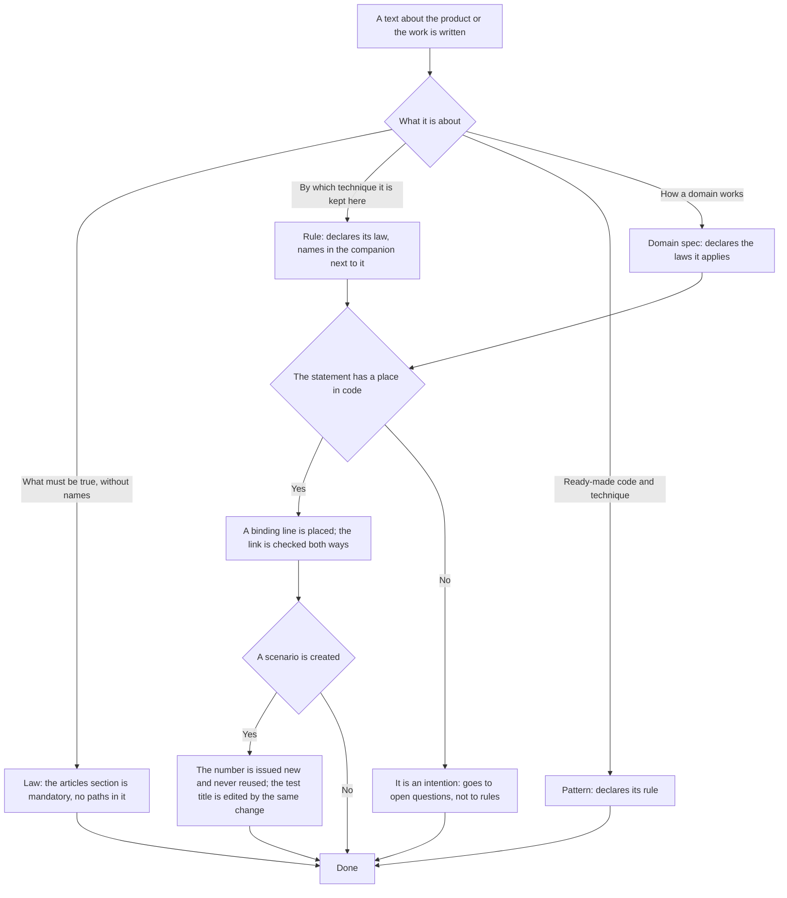

<!-- rt-kit v0.26.0 · rules/spec-driven.md · d24f7f6d8e0f · правится надстройкой, не здесь -->

# Project documentation — how it works here

Rule under the law `docs/constitution/project-documentation.md`. The law says what must be true
about texts; here — which layers they are built from in this tree and what the machine checks.
Wording is the rule `doc-style` under the same law.

**Cold part:** `pitfalls.md` next to it — traps already stepped on. Loaded on demand, not together
with the rule.

## What it is called here

```
LAW        docs/constitution/<law>.md              — true for any application of this class
           docs/constitution/application/<law>.md  — an application law: payments, locales, access
           knows nothing of the project: no paths, no file names, no bindings

  ├─ RULE       .claude/skills/<rule>/SKILL.md   (kind: rule, law: <law>)
  │             binds the law to this project; several rules per law
  │             .claude/skills/<rule>/implementation.md — binding to code
  │             .claude/skills/<rule>/pitfalls.md — cold part: loaded on demand
  │
  │  └─ PATTERN  .claude/skills/<rule>-<what>/SKILL.md   (kind: pattern, rule: <rule>)
  │              ready-made code and concrete techniques; at least one per rule
  │
  └─ DOMAIN SPEC  docs/specs/<domain>/
                  how the domain works; declares the laws it applies

SKILL WITHOUT A LAW  .claude/skills/<name>/SKILL.md   (neither kind: rule nor kind: pattern)
                     stands next to the ladder, not in it: not about what must be true
                     in the product, but about how work is done here
```

Links go only upward: a law refers neither to a rule, nor to a spec, nor to a file.

A skill without a law is the third case, and it is legitimate. The showcase, a generator, work with
a third-party service, creating the skill itself: there is no statement about the product above such
a thing, so there is no law either. Inventing a law for it to fit the ladder is not allowed — a law
with one rule and not a single article about the product drifts from the rest at the first edit. How
such a skill is created — skill `write-a-skill`.

| In the law                        | Here                                                                                                 |
| --------------------------------- | ---------------------------------------------------------------------------------------------------- |
| set of sections                   | `REQUIRED_HEADINGS` for a spec, "Articles" for a law                                                 |
| a statement of a document         | an item of `## Правила` in a spec, `## Статьи` in a law, `## Как закон применяется здесь` in a rule |
| the place where it is carried out | a line in `implementation.md` next to it: `` `file:symbol` ``                                       |
| promised behaviour                | scenario `SC-<PREFIX>-<NUMBER>` in `docs/specs/<domain>/scenarios.md`                                |
| open question                     | `Q-<law letter>-<number>` in the law's "Open questions" section; tasks and commits refer to it, and the number is not reused after closing |
| laws a domain applies             | the `**Законы:**` line in the spec header, names in quotes                                           |

## Where it lives

In this tree — the table in `implementation.md` next to it. Paths live there, not here: the rule
travels between repositories, the layout does not, and a path named in the rule lies in the first
tree that keeps its code differently.

## Flow

The flow of creating a text: which layer is written, how a statement is bound to code and what
happens to a scenario after the rollout.



## How the law applies here

- **The set of spec sections is fixed in advance, and a missing section is a refusal.** "Not
  applicable" is a legitimate answer, a missing section is not: cross-cutting requirements get
  remembered after the fact exactly when no place was made for them.
- **Every statement is bound to a place in code, and the link is checked both ways.** The key of the
  link is the statement text itself, so it cannot be reworded with the binding forgotten.
- **The first column of the companion is the article text copied, not retold.** The key of the link
  is the text itself: a line written by meaning breaks the link while looking filled in. The check
  counts articles without an address and knows nothing of an article with a wrong address.
- **A binding does not lead into code nobody calls:** a symbol called nowhere is not a place.
- **A "not carried out" binding moves together with its article.** Otherwise the companion line
  keeps in the hot part an article with nothing behind it: removed alone, it leaves the binding
  without an item, and the audit turns red. Both sides move at once.
- **The procedure table is checked against the decorators both ways, the permission together with
  the name.** Otherwise a procedure the domain serves but forgot to describe is visible only in the
  decorator, and a permission that drifted from the spec — nowhere.
- **A refusal code is accepted only if the domain throws it.** Codes were written out from the
  design, and on one path nobody threw the promised refusal.
- **A spec has one scenario prefix, and across the whole tree it is taken by that spec alone.** A
  second prefix inside a spec means the subject is described twice; a prefix taken by another means
  the number does not show whose scenario it is. A product agreement is numbered together with the
  spec it will merge into, and the prefix does not become taken by it.
- **A scenario number is issued once and never reused.** A new one takes the next free number; it is
  not inserted in the middle and does not take a deleted one — the deleted number's place stays
  empty. The number ties the scenario to its test, and issued a second time it leaves the old
  reference right on the surface; renumbering in sequence is deceptively cheap — the tests are green
  both before and after.
- **A scenario and the title of its test are edited by one change.** The promise changed — the
  number stays, and the test title is edited by the same commit; the scenario deleted — the test is
  deleted too. Having drifted apart, they leave the run green while it checks something else.
- **A subdomain is asked the same as a domain.** The same mandatory sections, the same companion
  next to it, the same link between scenarios and tests. A domain with half its subdomains described
  and half created as empty directories is never green.
- **A law has a mandatory "Articles" section, and beyond it holds only open questions.** A law
  carries no history of edits and no arguments for an option chosen once: version control holds the
  history, and an argument with a rejected alternative is a trait of the work, and its place is the
  rule's "Pitfalls". A closed question leaves the law, and an empty section kept for its heading
  passed the check anyway.
- **A proposed law requires no rule.** An agreement written down before the code has nothing to bind
  to, and demanding a rule would force creating one with anchors into places that do not exist. The
  sign stands as a status line in the law itself, not in an exceptions list next to the check.
- **A law that names a project file is a refusal.** Paths and bindings belong in a rule; otherwise
  the law can neither be read without knowing the tree nor applied to another application.
- **A rule description is no longer than three hundred characters and answers one question — load
  this rule or not.** The description goes whole into the system prompt of every session, and the
  session pays for it whatever it works on: that is what tells it from the rule body, which the
  executor reads by itself. It grows on its own — it is written after the rule and retells its
  content — and the retelling arrives a second time together with the rule itself. The descriptions
  check counts the length; what is left longer than the limit is named in the accepted-debt list by
  name, with a reason.

- **A rule declares the law it is written under.** A rule without a law is a set of techniques that
  does not show what exactly must be true.
- **There are two layers of laws, and a law name is one for both.** The shared one lies in the
  constitution root, an application law in `application/`; neither `law:` nor `**Законы:**` names
  the layer, so law names are unique across the whole constitution tree.
- **A divergence between a rule and its companion is resolved in favour of the rule.** The companion
  names the tree's names and the bindings of the articles; it does not cancel them: read above the
  rule, it becomes the place where a requirement is lifted silently and without review. Concreteness
  is no argument here — the companion is always more concrete, that is what it is for. A divergence
  found is named to the owner and fixed in the text that fell behind, and until then the work goes
  by the rule.
- **A companion's statement about the state of an external service is checked by the command the
  companion itself names.** A neighbour's limit is lifted together with someone else's setting,
  while the text about it stays in the present tense and looks right after the lifting: only a call
  tells the current from the lifted. So the companion writes the way to ask, not a snapshot of the
  answer — and it has no right to order, on such a snapshot, the opposite of what the rule says.
- **A rule may have a third file, and what is not read when deciding goes there.** Pitfalls and
  behaviour from incident analyses are needed not by whoever makes an ordinary decision but by
  whoever reviews a miss or argues with a guard — yet they load with the rule every time and grow
  faster than the articles. Such text leaves for `pitfalls.md` next to it, the rule names it with a
  line in its header, and it loads on demand. The gate refusal is silent about the cold part: it
  calls the rule, and the rule itself speaks of the third file.

- **A spec declares the laws it applies, and the link is checked both ways.** A law named in the
  spec text must stand in the header: otherwise the law gives no way to learn which domains stand on
  it.
- **Portable text speaks of a neighbouring resource conditionally and names it by name.** What is
  laid out in the tree and what is not is known to the layout list, not to the resource text. Said
  unconditionally — "a guard refuses a code edit before that" — it enters the context of every
  session and lies about a tree where that guard was not laid out; the tree has no way to fix that
  if the resource has no override. A resource's requirement of a resource is declared by a line in
  the header, not derived from such a phrase.
- **An article of a rule speaks of its own applicability itself, by a sign line at its side.** A
  gate refusal calls the whole rule, while one of its articles covers the specific edit: paying the
  rule's full price for a decision means teaching to skip reading, that is to work worse than what
  was explored. The sign stands at the article, not in the gate map: the map knows the path and the
  rule, not which of two dozen articles is about that path.

    ```markdown
    - **Article title.** Article text, as usual.
      <!-- rt-when: *.scss *.css -->
    ```

    The globs are separated by a space and matched against the edit path as shell globs, not by
    word search: a word search names the wrong article and stays silent about it. A glob without
    a directory is also matched against the file name, and the comment is invisible in the
    assembled markup.

- **An article without a sign is legitimate, and so is a rule without a single sign.** A sign is
  given to the articles whose rule refuses on a file edit; the rest are marked as their refusals
  reach the digest. A missing sign means "this article is not selected by the edit path", not a
  miss: demanding it from all would mean marking at random.

- **A pattern is found by the `rule:` field, not by the name prefix.** Not every pattern carries the
  name prefix, and a search by rule name does not see those: the audit finds them by the field, a
  person by the rule's own "Patterns" section. A count of patterns gathered by prefixes comes out
  below the true one, and the number then goes into splitting the work.
- **A decision from a spec goes to the layer, not to the archive.** What a spec is checked against
  the machine knows; where an accepted decision goes it does not know and will not: only whoever
  asks "will this still be true tomorrow" can tell a current requirement from an account of what
  happened. This is held by the closed-work review step and the selection sign written there in
  advance.
- **A name in an anchor is written as declared in code.** A private class field stands with a hash,
  and the name written without it names the wrong symbol: the check stays green, and the reader
  cannot tell from the binding line whether this is the private method or the ordinary one next to
  it. The former form stays legitimate — the name without the hash is remembered alongside the name
  itself.
- **An anchor is checked against the raw text of the file, and a comment counts the same as code.**
  The check looks for the symbol's existence by word across the whole file without stripping
  comments, and counts liveness only for what is declared in code. A name standing in an explanation
  alone slips past both sides: the statement's anchor turns out to be a word from a comment, while
  the declaration next to it is called differently.

- **A check nailed to a resource name breaks when the resource is split, and this has to be known
  before the edit.** A rule name and a pattern name stand not only in texts but in the tree's
  checks, in the probes of their suites and in the state tables. So a split starts with a search for
  the name across the whole tree: otherwise red arrives one check per run — that is how splitting
  one rule took down three.

## The shape of a compressed article

A rule loads whole into a session and pays for it every session, whatever the session works on. A
measurement names where the weight is: 289 440 characters in twenty-nine loaded rules, the articles
section is 45% of them, and inside the section statements take 19%, their arguments 81%. So the
argument is cut, not the statement: a removed statement changes the rule, a removed argument only
its price.

A paragraph at an article has three outcomes, chosen by one question: **what is this text needed for
— to make a decision, to keep it from being reversed, or to review a miss?**

| The text is needed to…                                          | Outcome                        |
| --------------------------------------------------------------- | ------------------------------ |
| decide on the edit: what counts as right, where the boundary is | stays at the article verbatim  |
| not reverse the decision in a month: why exactly so             | folds to one line              |
| review a miss or argue with a guard                             | leaves for the cold part whole |

- **What stays at the article is the statement and what it reads wrong without.** The boundary, the
  exception, the applicability sign, the name of whoever guards it. Tested by subtraction: a removed
  piece changes the answer to "do it this way or not" — then it is not surplus.
- **An argument folds to one line: the price of the miss, not its history.** "Otherwise the run is
  green while it checks something else" is an argument. When it happened, how many times in a row
  and in which branch is history, and its place is the cold part.
- **An incident analysis leaves for the cold part whole, with its numbers and rejected options.**
  The cold part loads on demand — for whoever reviews a miss — and grows freely: one session in a
  hundred pays for it, not every one.
- **The cold part holds explanation, not requirement.** A statement absent from the rule never lives
  there: a rule whose requirement lives in the cold part promises what the session loading it will
  not see. Tested by the same question reversed — no decision can be made by the cold part that
  cannot be made by the rule.
- **Compression is judged by retelling, not in the source.** An article compressed right is retold
  by the same decision: whoever read only it edits the same way as whoever read the former one. They
  diverged — surplus was removed, and it comes back at the article, not to the cold part.
- **A rule without a cold part is legitimate, and the first paragraph that leaves creates one.** An
  empty `pitfalls.md` next to it is a promise, not a mechanism: in the measurement of twenty-nine
  rules, four of the heaviest have no cold part at all, and their whole incident analysis loads
  every session.

## What of the law is not here

A law no spec applies does not count as a refusal: the laws on code structure, delivery and
verifiability do not touch domains at all. The order "description first, code second" is held by
agreement: the project-documentation law carries no such requirement, and no open question for it is
opened there.

Screen state tables are checked by nothing. `check:specs` knows scenarios against test titles, rules
against anchors, procedures against decorators and refusal codes against throws — a state table row
is bound to nothing and passes green even when the code never reaches the named state. The state
"the check did not load" stood in the tables of two domains before the code learned to reach it, and
all that time read as a description of something working.

The meaning of a scenario is checked against its neighbour by nothing: the check judges the number.
Two scenarios promising the same thing in different words are different to it, and the second counts
as unverifiable for as long as it lives.

The completeness of marking articles with an applicability sign is counted by nothing. A rule with a
sign on none of its articles refuses with the old text — and differs from a marked one only in that
the executor reads it whole; no check says so. The observations digest judges it: the rule that
refuses on a file edit more often than the others is the first to be marked.

Section completeness of the law, the rule and the pattern themselves is checked by nothing here. The
articles saying that a text is judged no more leniently than its copy, that an unchosen edition is
judged the same as the chosen one and that the set of sections is declared apart from the sample are
carried out where these texts are written — in the suite of the package that ships them. A consumer
tree holds laid-out copies, and its check must not turn red on someone else's miss. Agreement of two
texts is looked for by reading.

The shape of a compressed article is checked by nothing, and there will be no check for it: the
machine sees the character count, not whether the compressed article still yields the former
decision. An argument cut out together with the statement's boundary is shorter than the right one
and passes any character count. One thing guards this — the text length limit: it says the rule has
outgrown, and is silent about what to cut. Compression is judged by retelling — by whoever edits by
the compressed article next.

The share of argument in a rule is counted by nothing. The measurement the shape stands on was made
in a one-off pass and did not go into the tree: it answers "where the weight is", not "does it add
up".

## Patterns

- `spec-driven-domain` — creating and editing a domain spec, scenarios, binding.
- `spec-driven-rule` — creating a law, a rule and a pattern.
- `spec-driven-sweep` — a full review of a domain's binding, passes and their review.

## Pitfalls

- **The line requiring a neighbouring resource is checked by nothing, and a miss in it shows only by
  counting.** A rule without it looks whole: sections in place, bindings match, the completeness
  suite green. It is counted by one command over the rules directory, and the divergence reads at
  once — how many rules declared requirements and how many refer to a neighbouring resource in
  prose.
