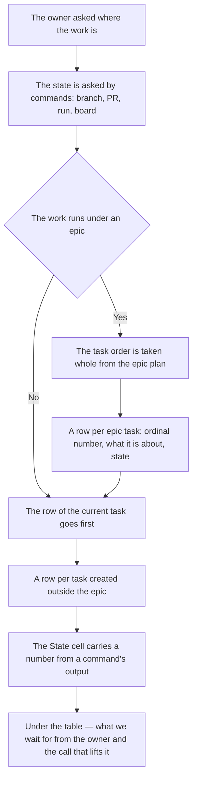

<!-- rt-kit v0.27.0 · rules/status-report.md · e8e0bcc528e0 · правится надстройкой, не здесь -->

# Status report — how it works here

Rule under the work-conduct law. The law says that the work state outlives the session and is read
from the outside; here — in what shape it is shown to the owner when they asked.

## What it is called here

| In the law | Here |
| --- | --- |
| the work state | the "State" cell in the reply table |
| the place where the state is read | the reply to the owner and the progress entry in the task folder |
| the work asked about | a paragraph about the epic, under it all its tasks in order and those created outside it |
| the mark of done work | a run number, a PR number, a count of scenarios — not the word "done" |
| what backs the state | a command run by the same turn as the reply |

## Where it lives

Ready-made calls and a sample of a filled table — in the pattern `status-report-table` next to it.
Here is said what the reply must hold; how it is asked from the host and the tree — there.

## Flow

The flow of one status reply: what is asked from the tree before the first line of the reply and in
what order it lands for the owner.

## How the law applies here

- **The table is assembled by a command, not by the memory of the session.** A session that has just
  started remembers no order of calls, and one that has worked for hours folds the answers otherwise
  than the previous one: two answers about one and the same work then disagree. The command takes the
  order of the tasks from the epic plan and the state of each of them from the hosting; the tree
  names the call in the companion.
  <!-- rt-when: ответ владельцу о состоянии работы -->

- **The work state is shown as a table, not as prose.** A retelling the owner reads whole to find
  one row, and next time does not read at all.
  <!-- rt-when: ответ владельцу о состоянии работы -->

- **The epic itself is described by text above the table, not by a row in it.** The columns are made
  for a task — number, subject, state — and an epic squeezed into them loses the one thing it is
  named for: why it is and where it goes. The paragraph says this in one or two sentences and names
  how many tasks the epic has and which one runs now.
  <!-- rt-when: ответ владельцу о состоянии работы -->

- **The epic's tasks are listed all, and in the order the plan assigned them.** With only the done
  and the next one named, the owner sees neither how much is left nor where the work goes, while the
  epic's order is assigned in advance and holds to the end. Each row has a short description, in
  one's own words and one sentence: a task number says nothing about its subject.
  <!-- rt-when: ответ владельцу о состоянии работы -->

- **Every cell about the tree's state is backed by a command run by the same turn.** A statement
  without a command the owner reads as a verified fact and learns of a divergence last. The output
  is named by a number — the run number, the time, how many scenarios of how many; "all green"
  without a number is not written.
  <!-- rt-when: ответ владельцу о состоянии работы -->

- **A run confirms the commit it ran on.** A run older than the branch tip speaks of a past tree and
  will be read as of the present one; the tip is checked before the run number goes into the cell.
  <!-- rt-when: ответ владельцу о состоянии работы -->

- **A draft PR is called a draft aloud, together with what we wait for.** A draft's merge is locked
  by the host, and a green page permits the owner nothing; silence they read as breakage.
  <!-- rt-when: ответ владельцу о состоянии работы -->

- **A task folder left as an empty template is "created, not started".** A created task with an
  unfilled grill reads as work in progress and gets created a second time.
  <!-- rt-when: ответ владельцу о состоянии работы -->

- **Under the table — no more than two lines.** What we wait for from the owner and the call that
  lifts it. The rest the owner asks themselves, and asks exactly what they need.
  <!-- rt-when: ответ владельцу о состоянии работы -->

## What of the law is not here

None of the agreements on the shape of the reply is checked by machine: the reply to the owner does
not land in the tree, and there is nothing to read it. It is held by the memory of whoever replies,
and a violation is visible only to the owner — by looking for a row in the text and not finding it.

## Patterns

- `status-report-table` — ready-made calls for each cell and a sample of a filled table.
