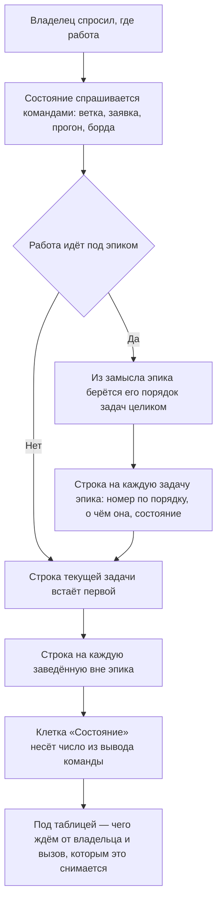

<!-- rt-kit v0.17.0 · rules/status-report.md · 178196ac4ffb · правится надстройкой, не здесь -->

# Ответ о состоянии работы

Правило под закон о ведении работы. Закон говорит, что состояние работы
переживает заход и читается со стороны; здесь — в какой форме оно показывается владельцу,
когда он спросил.

## Как это называется здесь

| В законе                     | Здесь                                                              |
| ---------------------------- | ------------------------------------------------------------------- |
| состояние работы             | клетка «Состояние» в таблице ответа                                |
| место, где состояние читают  | ответ владельцу и запись хода в папке задачи                        |
| работа, о которой спросили   | абзац об эпике, под ним все его задачи по порядку и заведённые вне |
| отметка о сделанном          | номер прогона, номер заявки, число сценариев — а не слово «готово»  |
| чем состояние подтверждается | команда, запущенная тем же ходом, что и ответ                      |

## Где это лежит

Готовые вызовы и образец заполненной таблицы — в паттерне `status-report-table` рядом. Здесь
сказано, что в ответе обязано быть; чем это спрашивается у хостинга и у дерева — там.

## Ход

Ход одного ответа о состоянии: что спрашивается у дерева до первой строки ответа и в каком
порядке это ложится владельцу.

## Как закон применяется здесь

- **Состояние работы показывается таблицей, а не прозой.** Пересказ владелец читает целиком,
  чтобы найти одну строку, и в следующий раз не читает вовсе.
  <!-- rt-when: ответ владельцу о состоянии работы -->

- **Сам эпик описывается текстом над таблицей, а не строкой в ней.** Колонки заведены под
  задачу — номер, предмет, состояние, — и эпик, втиснутый в них, теряет то единственное, ради
  чего он назван: зачем он и куда идёт. Абзац говорит это одной-двумя фразами и называет,
  сколько в эпике задач и какая идёт сейчас.
  <!-- rt-when: ответ владельцу о состоянии работы -->

- **Задачи эпика перечисляются все и в том порядке, в каком их назначил замысел.** Названы
  только сделанная и следующая — владелец не видит ни сколько осталось, ни куда идёт работа, а
  порядок эпика назначен заранее и держится до конца. У каждой строки — краткое описание,
  своими словами и одной фразой: номер задачи о её предмете не говорит ничего.
  <!-- rt-when: ответ владельцу о состоянии работы -->

- **Каждая клетка о состоянии дерева подпирается командой, запущенной тем же ходом.**
  Утверждение без команды владелец читает как проверенный факт и о расхождении узнаёт
  последним. Вывод называется числом — номером прогона, временем, сколько сценариев из
  скольких; «всё зелёное» без числа не пишется.
  <!-- rt-when: ответ владельцу о состоянии работы -->

- **Прогон подтверждает тот коммит, на котором он запускался.** Прогон старше вершины ветки
  говорит о прошлом дереве, а прочитан будет как о нынешнем; вершина сверяется перед тем, как
  номер прогона встанет в клетку.
  <!-- rt-when: ответ владельцу о состоянии работы -->

- **Заявка черновиком называется вслух вместе с тем, чего ждём.** У черновика слияние
  заблокировано хостингом, и зелёная страница владельцу ничего не разрешает; молчание он
  читает как поломку.
  <!-- rt-when: ответ владельцу о состоянии работы -->

- **Папка задачи, оставшаяся пустым шаблоном, — это «заведена, не начата».** Заведённая задача
  с незаполненным разбором читается как работа в ходу и второй раз заводится заново.
  <!-- rt-when: ответ владельцу о состоянии работы -->

- **Под таблицей — не больше двух строк.** Чего ждём от владельца и вызов, которым это
  снимается. Остальное владелец спросит сам, и спросит ровно то, что ему нужно.
  <!-- rt-when: ответ владельцу о состоянии работы -->

## Чего из закона здесь нет

Ни одна из договорённостей о форме ответа не проверяется машиной: ответ владельцу в дерево не
ложится, и читать его нечему. Держится это памятью отвечающего, а видно нарушение только
владельцу — по тому, что он ищет в тексте строку и не находит.

## Паттерны

- `status-report-table` — готовые вызовы для каждой клетки и образец заполненной таблицы.
