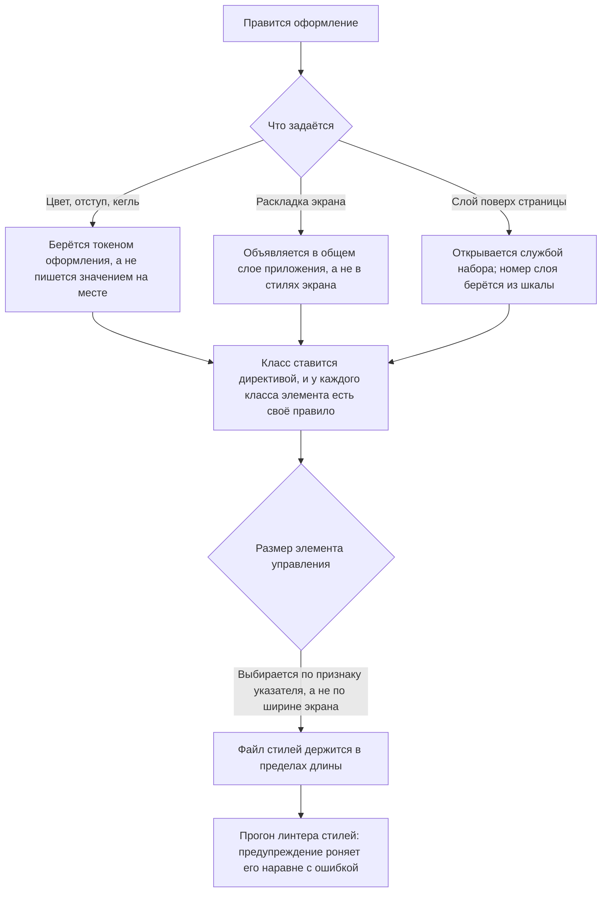

<!-- rt-kit v0.11.0 · rules/styling-bem.md · 00efc405cd6f · правится надстройкой, не здесь -->

# Оформление — как это устроено здесь

Правило под закон `docs/constitution/frontend-application.md`. Закон говорит, что должно быть
верно; здесь — чем это названо в этом дереве и где лежит. Раскладка файла компонента —
`component-structure`, состояние — `angular-patterns`, окружение браузера —
`platform-access`, слой обращения к серверу — `api-layer`. Все пять под одним законом.

## Как это называется здесь

| В законе                        | Здесь                                                                                                                                        |
| ------------------------------- | -------------------------------------------------------------------------------------------------------------------------------------------- |
| общий набор значений оформления | шкалы кита `--rt-*`; своё поверх них — `--<префикс>-*` в `styles.scss` приложения                                                            |
| класс в разметке                | директивы `rtBlock` и `rtElem` из `@rt-tools`, а не строка в атрибуте                                                                        |
| правило стилей                  | объявление `&__<элемент>` в `.scss` — своём или в общем слое приложения                                                                      |
| общий слой раскладки            | `apps/<app>/src/styles/`: `<префикс>-page`, `<префикс>-form`, `<префикс>-panel`, `<префикс>-window` у админки, `<префикс>-site-page` у сайта |

## Где это лежит

В этом дереве — таблица в `implementation.md` рядом. Пути живут там, а не здесь: правило
переносится между репозиториями, раскладка — нет, и путь, названный в правиле, врёт в первом
же дереве, которое держит код иначе.

## Ход

Ход правки оформления: откуда берётся значение, где живёт раскладка и чем открывается
всплывающее.

## Как закон применяется здесь

- **Оформление берётся токеном `--rt-*`, а не пишется значением на месте.** Составные
  значения — `box-shadow`, `text-shadow` — берутся готовым токеном целиком, а не собираются
  из частей.
  <!-- rt-when: *.scss *.css -->

- **У каждого класса элемента есть своё правило стилей.** Класс без правила выглядит рабочим
  и молча ничего не делает.
  <!-- rt-when: *.scss *.css -->

- **Класс ставится директивой, а не строкой в атрибуте.** Имя блока `rtElem` получает
  инъекцией от ближайшего предка с `rtBlock`, и повторить этот разбор по тексту шаблона нечем.
  <!-- rt-when: *.html *.scss -->

- **Раскладка объявлена в общем слое приложения, а не в стилях экрана.** У компонента экрана
  вне кита файл стилей по умолчанию пустой.
  <!-- rt-when: *.scss *.css -->

- **Шторку и окно открывает служба кита, а не номер слоя.** Числа шкалы сравниваются только
  между соседями по разметке; служба выносит разметку наружу, к `<body>`, и сравнивать её
  становится не с чем.
  <!-- rt-when: *.ts *.scss -->

- **Номер слоя берётся из шкалы, а не пишется числом в файле компонента.** Шкала — единственное
  место, где слои видно рядом: написанное на месте число в неё не попадает, и следующий узел
  занимает тот же номер, ничего об этом не узнав.
  <!-- rt-when: *.scss *.css -->

- **Размер элемента управления выбирается по признаку указателя, а не по ширине экрана.**
  Планшет в ландшафте шире порога узкого вьюпорта, а нажимают по нему пальцем: `pointer: coarse`
  отвечает про способ нажатия, ширина — про место под раскладку. Ступени берутся у кита, а не
  назначаются пикселями.
  <!-- rt-when: *.scss *.css -->

- **Файл стилей не длиннее 500 строк.** Предел общий с кодом и текстами, но stylelint длину не
  судит вовсе — держит его проверка дерева. Выросший файл экрана делится по блокам, а общая
  раскладка уходит в свой слой.
  <!-- rt-when: *.scss *.css -->

- **Предупреждение stylelint роняет прогон наравне с ошибкой.** `!important` объявлен
  предупреждением, а прогон идёт с `--max-warnings 0`: иначе запрет читается как пожелание —
  два таких предупреждения лежали в дереве, а `npm run stylelint` возвращал ноль и гейтом не был.
  <!-- rt-when: *.scss *.css -->

## Чего из закона здесь нет

Проверка «класс без правила» считает совпадение по имени элемента, а не по паре «блок —
элемент»: класс, у которого правило есть, но у чужого блока, она пропускает. Обратное
направление — снятие правила у живого класса — не проверяется вовсе и ловится чтением шаблона.

## Паттерны

- `styling-bem-layout` — экран на общем слое раскладки, блоки приложения.
- `styling-bem-component` — стили компонента кита, `:host`, модификаторы, язык оформления сайта.
- `styling-bem-sheet` — шторка и окно поверх страницы: чем открываются, подложка, замер.

## Ловушки

- **`rtElem` без предка с `rtBlock` роняет отрисовку в рантайме** — сборка и линт молчат.
- **Спроецированный узел блока-предка не имеет.** `rtElem` берёт имя блока инъекцией от
  ближайшего предка **по месту объявления шаблона**, а не по месту вставки: элемент, который
  экран объявляет у себя и отдаёт в проекцию чужого компонента, ищет `rtBlock` в своём шаблоне
  и не находит. Отрисовка падает в рантайме, сборка и линт зелёные. Класс на такой узел
  вешается правилом по селектору кита в общем слое раскладки, а не директивой.
- **Элемент с `backdrop-filter` или своим `z-index` замыкает потомков в свой слой.** Липкая
  шапка с размытием — самый частый случай: номер слоя у того, что лежит внутри неё,
  сравнивается не с соседями по странице, а только с соседями внутри шапки, и нижняя панель
  накрывает открытую шторку вместе с её кнопкой. Проверяется это `elementFromPoint` в центре
  кнопки: сборка, линт и скриншот показывают тут целую страницу.
- **До узла, вынесенного к `<body>`, стили компонента не достают.** Превью и заглушку переноса
  кладёт туда библиотека, а правила компонента заскоуплены атрибутом: файл выглядит рабочим и
  не красит ничего. Такие правила объявляются в общем слое приложения. Ни сборка, ни линт, ни
  проверка «класс без правила» этого не видят: класса такого в шаблоне нет вовсе, и пролежать
  это может несколько задач подряд.
- **Имя токена не сверяется ничем.** Ссылка на несуществующий токен собирается, проходит
  stylelint и проверку класса без правила, а свойство молча берёт наследованное значение:
  правило выглядит написанным и не красит ничего. Ловится это только замером в браузере, а
  имена берутся из объявлений кита, а не по догадке о том, как токен должен был бы называться.
- **`rtBlock` на `<ng-container>` класса не ставит вовсе:** узел это комментарий, и имя блока
  он только объявляет потомкам. Класс блока экрана вешает хост через `host: { class: … }`.
- **`justify-content: center` во flex-контейнере с `overflow-x` уводит первые элементы за
  нулевой скролл** — доскроллить до них невозможно. В прокручиваемых лентах —
  `justify-content: safe center`.
- **`scrollbar-gutter: stable` на корне не заводить:** резерв под полосу прокрутки сужает
  содержащий блок для `position: fixed`, и попап, выровненный по правому краю, встаёт на
  ширину резерва левее своей кнопки.
- **`& + :host` невалиден:** изнутри компонента до соседнего хоста не дотянуться. Разделитель
  между повторяющимися хостами — `:host(:not(:first-of-type))`.
- **`[attr.aria-disabled]` визуального состояния не даёт:** браузер стилизует `:disabled`, но
  атрибуты `aria-*` — нет. К каждому `aria-disabled` заводится правило `[aria-disabled='true']`.
- **Гарнитуру с `body` элементы формы не наследуют:** браузер задаёт `button`, `input`,
  `select` и `textarea` свой шрифт. Наследование включено глобально — сбрасывать его нельзя.
- **Комментарии-выключатели stylelint не ставятся.** Селекторы объединяются вложенностью.
- **При переносе стилей новых объявлений не появляется** — только перемещение существующих.

## Узкий экран

Порог один на весь кит, и он записан дважды: медиа-запросом в стилях и запросом службы точек
перелома в коде. Разойдясь, они дают полосу ширин, где разметка уже мобильная, а оформление
ещё нет.

- **Признак узкого экрана даёт служба кита, а не вход от приложения.** Вход оставлен ради
  приложений, которые его уже передают; переданное значение главнее замера.
- **Размер и раскладка узкого экрана объявлены медиа-запросом, а не условием в шаблоне.**
  Условие в шаблоне, ставящее модификатор ради других отступов, — это оформление, уехавшее в
  код.
- **За условием в шаблоне остаётся то, чего CSS не делает:** другая ветка дерева, отключённая
  подсказка, другой обработчик.
- **Правило, которое действует только на широком экране, объявляется медиа-запросом вверх, а
  не отменяется вторым правилом вниз.** Отмена оставляет в файле два места, где решается один
  вопрос.
- **Вывод про узкий вид подкрепляется замером по обе стороны порога.** Условие в шаблоне и
  медиа-запрос разъезжаются молча: модификатор продолжает ставиться, а правила под ним уже
  переехали.
- **Порог бывает трёх родов, и рамка кадра ловит только один.** Медиа-запрос по ширине окна
  переключается рамкой снимка; запрос по ширине контейнера и порог из службы точек перелома от
  рамки не зависят вовсе. До съёмки называется, какого рода порог у компонента: кадр на
  оконной ширине для контейнерного порога не сработает ни разу, и это выглядит как отсутствие
  правила, а не как промах проверки.

## Оформление берётся токеном

Проверка второго кита — `pnpm run check:tokens-styles`. Она зовёт stylelint своим конфигом
(`tools/stylelint-tokens.config.mjs`) по набору `projects/ui-kit-v2/src/lib/**/*.scss` и сверяет
находки со списком принятого `tools/tokens-styles-allowlist.json`.

- **Правила навешены своим конфигом, а не общим.** `lint:styles` идёт по всем `projects/**` с
  `--max-warnings 0`, а списка принятого у stylelint нет: включи их там — и накопленное
  покраснеет в тот же день, после чего правило снимут вместо того, чтобы чинить.
- **Список принятого — свой файл.** `tools/styles-allowlist.json` и `tools/check-styles.mjs`
  заняты проверкой классов вёрстки, разложены пакетом и на месте не правятся.
- **Запись списка — файл и значение, без номера строки.** Строка едет от любого
  переформатирования, и список краснел бы на правках, которых не было.
- **Список только убывает.** Запись, которой в стилях больше ничего не отвечает, роняет прогон:
  починка снимает и место, и строку списка.
- **Правило судит цвет и свойства отступа, скругления, кегля и толщины рамки; размеры числом —
  `width`, `height`, `inline-size`, `outline` — оно не судит вовсе.** Это не пропуск проверки, а
  её граница. Шкалы под размеры у кита уже есть — габариты `--rt-size-*` и высоты контролов
  `--rt-control-height-*`, — но суд над ними проверка пока не берёт: включённый в тот же день,
  он покраснел бы на сотне мест, где размер числом задают не контролы, а полоски, значки и
  ячейки таблицы. Расширение набора — своя работа.

- **Набор проверки — стили компонентов, и слой оформления в него не входит.** Литерал в шкале
  или в назначении она не видит вовсе: шесть прозрачных оттенков, повторявших коды цвета своих
  ступеней тройками каналов, нашлись чтением, а не прогоном. Зелёный прогон означает «в стилях
  компонентов чисто», а не «литералов не осталось».

## Между ступенью и местом стоит своё свойство компонента

Судит та же проверка — `pnpm run check:tokens-styles`: правило
`declaration-property-value-disallowed-list` стоит в том же конфиге, и находки ложатся в тот же
список принятого. Второго перечня накопленного не заводится.

- **Свойство объявляется в корне блока, значением по умолчанию — та ступень, что стояла на
  месте.** Вид от перевода не двигается ни на пиксель, и разошедшийся кадр читается дефектом
  правки, а не поводом переснять.
- **Имя выводится из имени блока — `--rt-<блок>-<что>`.** Там, где блок уже носит имя семейства
  назначений (`--rt-nav-panel-*` у подменю шапки), берётся оно, а не имя файла. Имя под место
  употребления не заводится.
- **Модификатор переназначает свойство, а не повторяет объявление свойства CSS.** У плашки семь
  видов скругления стали семью строками вместо семи правил `border-radius`.
- **Судятся четыре семейства: скругление, тень, толщина рамки и длительность.** Отступ, кегль и
  габариты остаются на ступенях, и это граница правила, а не пропуск: роль отступа одним словом
  не называется, и свойство под неё вышло бы именем места, а не именем роли.
- **Объявление своего свойства правило не судит — и это единственный законный вид ступени в
  стилях компонента.** Имя цели отбирается выражением `^(?!--)`; запрет на само объявление
  отменял бы весь приём.
- **Правую часть объявления своего свойства не судит ничто.** `--rt-btn-radius: 10px` проходило и
  гейт литералов, и это правило, хотя это ступень `lg`: гейт судит `border-radius`, а не
  объявление своего свойства. Ловится чтением.
- **Часть, которую браузер уносит из поддерева блока, объявляет свойство на себе.** Панель в
  перекрытии, меню и перетаскиваемая строка живут вне блока, и объявление с его корня до них не
  докатывается. Девять кадров разошлись молча и показали панель без тени, пока причину не нашли.
- **Линтер стилей требует пустую строку после блока объявлений и запрещает внутри него.**
  `declaration-empty-line-before` и `custom-property-empty-line-before` вместе означают: блок
  своих свойств идёт сплошным, дальше ровно одна пустая строка.
- **Потребитель переопределяет свойство правилом той же цели и большей силы.** Объявление живёт
  на самом блоке и перебивает всё, что пришло по наследству сверху.

## Токен объявлен, назван ручкой или мёртв

Проверка — `pnpm run check:tokens-graph`. Она читает объявления и обращения по всем стилям
второго кита и разводит имя на три состояния; перечень ручек — `tools/tokens-handles.json`,
список принятого — `tools/tokens-graph-allowlist.json`.

- **Третьего состояния у имени нет.** Не объявлено и не названо ручкой — мёртвая ссылка: правило
  работает, значение не применяется, и увидеть это можно только глазами.
- **Ссылка на токен кита идёт без запасного значения.** Запасное значение скрывает промах и
  переживает смену темы: переопределять нечего. Стоит оно только у ручки потребителя.
- **Ручка перечислена дважды и сверена машиной.** Данные проверки и раздел «Ручки потребителя» в
  `Theming.mdx` — второго перечня без сверки не заводится.
- **Общее имя на корне страницы из стилей компонента — отказ.** Имя своего блока
  (`--rt-<блок>-*`) проходит: это третий слой, он у компонента и должен быть.
- **Имя, употребляемое обоими китами, отбивается.** Побеждает файл стилей, подключённый позже, и
  приложение с двумя китами получает не то, на что рассчитывал ни один из них.

## Тёмная тема отвечает, и контраст считает машина

Проверка — `pnpm run check:tokens-theme`. Она читает три файла слоя оформления второго кита,
разбирает граф значений один раз и отвечает двумя разделами: полнотой тёмной темы и контрастом
пар. Перечень пар — `tools/tokens-contrast-pairs.json`, список принятого —
`tools/tokens-theme-allowlist.json`.

- **У молчания есть ровно две законные причины: переопределение и названная общность.** Цветовое
  назначение светлой темы либо переопределено тёмной, либо помечено `/* rt-theme-shared: причина */`
  в своей же строке. Пометка стоит там, где правят цвет, и умирает вместе со строкой.
- **Ответ и пометка наследуются по цепочке ссылок.** Назначение, ссылающееся на другое
  назначение, меняется вместе с ним и наследует его причину: дублировать строку в тёмной теме
  незачем. Двадцать молчаний закрыты десятью пометками ровно поэтому.
- **Судится цветовое объявление слоя назначений, а не имя с приставкой `--rt-color-`.**
  Композиционные токены компонентов (`--rt-input-color-*`, `--rt-nav-*`, `--rt-field-*-color`)
  красят экран наравне с ними, и забытый среди них так же не виден.
- **Тёмный ответ живёт в слое оформления либо объявляет своё свойство компонента.** Тёмный блок в
  стилях компонента, красящий свойство напрямую, — расхождение; переопределение ступени шкалы
  тёмной темой — тоже, шкала неизменна.
- **Запись списка принятого несёт причину, и пустая причина роняет прогон.** Список из четырёх
  десятков мест без причин через месяц читается как перечень того, что кто-то когда-то решил не
  чинить.
- **Порог контраста один на все пары — 4.5:1, — и перечень пар ведётся руками.** Полноту перечня
  машина не судит: забытая пара молчит так же, как её нет. Судит владелец на разборе.
- **Числа контраста в документах не пишутся.** Таблица замера на странице «Colors» считает то же
  самое в браузере по отрисованным узлам; проверка сверяет с ней только состав пар. Написанное
  текстом отношение стареет при первой правке значения и молчит об этом.

## Состояние сильнее оформления

- **Блок состояния стоит ниже всех вариантов оформления и палитры того же блока.** Отключённость,
  загрузка и только-чтение отменяют заливку, обводку и цвет подписи; обратного не бывает.
  Специфичность у модификаторов одного блока равная, и правила равной силы разбираются порядком
  в файле — состояние, записанное выше варианта оформления, проигрывает ему молча.
- **Специфичность вместо переноса не поднимается.** Поднятая, она перебивает и то, чего
  перебивать не собирались: размер, скругление и свойства, которые потребитель задаёт снаружи.
- **Проигравшее состояние не ловит ничто.** Ни сборка, ни линтер стилей, ни кадр витрины не
  отличают его от задуманного: отключённая текстовая кнопка получала серую заливку, которой у
  неё нет ни в одном другом состоянии, и это простояло во всех восемнадцати ячейках её матрицы,
  пока не пришли глазами.
- **Безфоновому оформлению отключённость фона не даёт.** Заливка, появляющаяся только в
  отключённом виде, читается подсветкой, а не недоступностью: остаются приглушённая подпись и
  спокойная рамка.

## Класс блока и директива блока

- **`rtElem` в шаблоне требует `BlockDirective` в инжекторе, а класса блока на хосте ему мало.**
  `host: { class: BEM_BLOCK }` рисует класс и никакой директивы не заводит: компонент
  собирается, тайпчек и линтер молчат, а первый же потребитель получает `NG0201` при подъёме
  шаблона. Класс остаётся на хосте — директиву даёт `<ng-container rtBlock="…">`, обнимающий
  разметку: он ничего не рисует и хозяина для `rtElem` предоставляет.
- **Компонент, который не поднят ни одной спекой и ни одной историей, этой ошибки не
  показывает.** Она видна только там, где его рисуют, — поэтому набор показов и есть проверка.

## Правило кита живёт в слое каскада

Проверка — `pnpm run check:cascade-layer`. Она читает стили компонентов второго кита и слой
оформления, судит обёртку и порядок подслоёв; список принятого — `tools/cascade-layer-allowlist.json`.

- **Файл стилей компонента объявлен в подслое `rt-kit.components` целиком.** Обёртка одна на
  файл: вторая оставляет часть правил снаружи, а файл выглядит обёрнутым. Новый файл заводится
  сразу обёрнутым — приехавший мимо слоя работает, ничего не роняет и виден только глазами у
  потребителя, которому перебить его снова нечем.
- **Снаружи обёртки законны только `@use`, `@forward` и `@import`.** Sass требует их в начале
  файла и роняет сборку на объявлении, загнанном внутрь блока.
- **Порядок подслоёв объявлен заранее — `@layer rt-kit.vendor, rt-kit.base, rt-kit.components;`.**
  Подслой, не названный заранее, встаёт в каскад по первому появлению, а появляются они в
  порядке загрузки: стили компонента Angular инжектит отдельным блоком, и он способен опередить
  основу.
- **Объявления на корне страницы в слой не уходят.** Перекраска бренда держится порядком:
  потребитель объявляет свою линейку после `tokens.css` и выигрывает. Уехав в слой, объявление
  отнимает у него эту возможность.
- **Чужой CSS, который чинит кит, подключается в нижний подслой `vendor`.** Слой опускает
  правила кита ниже всего, что объявлено вне слоя, — не только ниже приложения, но и ниже такой
  библиотеки. Тема редактора текста, подключённая мимо подслоя, стала выигрывать у кита, и
  панель редактора перестроилась молча; поймали это пять кадров витрины, а у потребителя не
  поймал бы никто. Приём — импорт с именем подслоя:
  `@import 'quill/dist/quill.snow.css' layer(rt-kit.vendor);`
- **Кит не настаивает на своём восклицательным знаком.** Последнее слово за приложением, и
  правило кита, спорящее с ним важностью, отменяет то, ради чего слой заведён. Два таких правила
  в таблице сняты вместе с заведением слоя.
- **Обёртка слоя меняет растеризацию текста в композитном слое перекрытия.** Раскладка при этом
  не двигается: сорок узлов шапки по двадцати двум свойствам совпали до тысячных, а кадр разошёлся
  на 0,11% сдвигом текста в пиксель. Кадр в таком случае пересъёмывается, а вывод «поехала
  вёрстка» делается замером, а не долей расхождения.

## Слой оформления собирается, а не правится

Источник — `projects/ui-kit-v2/src/styles/tokens.source.mjs`, генератор —
`tools/build-tokens-v2.mjs`, сверка — `pnpm run check:tokens-build`. Собранное — три файла
стилей слоя оформления и типы имён `projects/ui-kit-v2/src/lib/tokens/rt-design-tokens.ts`.

- **Ступень, назначение и ответ тёмной темы правятся в источнике.** Правка на месте теряется на
  следующей сборке, и её называет сверка; каждый собранный файл несёт об этом шапку.
- **Тёмный ответ живёт в источнике рядом со своим светлым назначением, а тёмная раскладка
  называет только имена.** Забытая половина пары видна там, где правят цвет, а не сверкой двух
  файлов: имя без ответа и ответ без имени в раскладке роняют сборку каждый по-своему.
- **Ссылка на имя, которого источник не объявляет и которое не названо ручкой потребителя,
  роняет сборку, и собранное при этом не переписывается.** Иначе имя с опечаткой просто не
  применяется: правило работает, значение не приходит, и увидеть это можно только на витрине и
  только если посмотреть.
- **Собранное совпадает с тем, что даёт форматтер.** Генератор ставит длинное составное значение
  под своё имя ровно так же, как prettier: разойдясь, они дают вечную правку — форматтер
  переписывает файл, сверка краснеет на следующем прогоне.
- **Правила, которые свойств не объявляют, в собранный файл не попадают.** Подложка экранов
  входа и инверсия логотипа стоят своим файлом `_theme-dark-rules.scss`: собранный держит только
  объявления.
- **Третий слой — свойства компонента — источником не собирается.** Они живут в стилях своего
  компонента рядом со своими правилами; источник знает шкалу, назначения и тёмные ответы.
