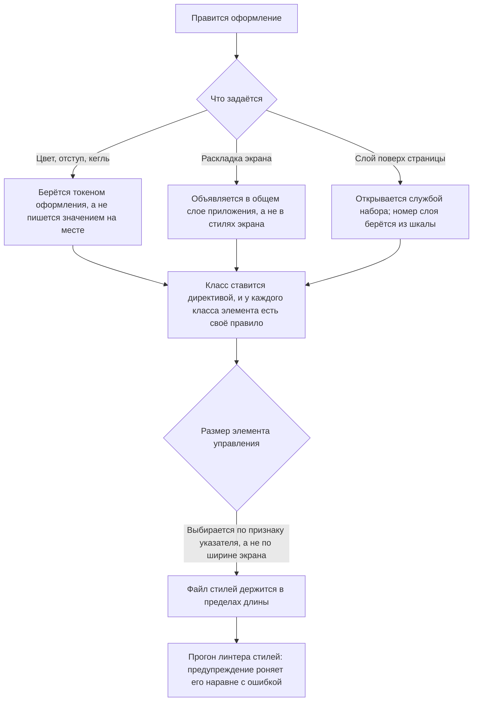

<!-- rt-kit v0.23.0 · rules/styling-bem.md · 84d3e6d27f4c · правится надстройкой, не здесь -->

# Оформление — как это устроено здесь

Правило под закон `docs/constitution/frontend-application.md`. Закон говорит, что должно быть
верно; здесь — чем это названо в этом дереве и где лежит. Раскладка файла компонента —
`component-structure`, состояние — `angular-patterns`, окружение браузера —
`platform-access`, слой обращения к серверу — `api-layer`. Все пять под одним законом.

**Холодная часть:** `pitfalls.md` рядом — ловушки, грабли, на которые уже наступали.
Грузится по требованию, а не вместе с правилом.

## Как это называется здесь

| В законе                        | Здесь                                                                                                                                        |
| ------------------------------- | -------------------------------------------------------------------------------------------------------------------------------------------- |
| общий набор значений оформления | шкалы кита `--rt-*`; своё поверх них — `--<префикс>-*` в `styles.scss` приложения                                                            |
| класс в разметке                | директивы `rtBlock` и `rtElem` из `@rt-tools`, а не строка в атрибуте                                                                        |
| правило стилей                  | объявление `&__<элемент>` в `.scss` — своём или в общем слое приложения                                                                      |
| общий слой раскладки            | `apps/<app>/src/styles/`: `<префикс>-page`, `<префикс>-form`, `<префикс>-panel`, `<префикс>-window` у админки, `<префикс>-site-page` у сайта |

## Где это лежит

В этом дереве — таблица в `implementation.md` рядом. Пути живут там, а не здесь: правило
переносится между репозиториями, раскладка — нет, и путь, названный в правиле, врёт в первом
же дереве, которое держит код иначе.

## Ход

Ход правки оформления: откуда берётся значение, где живёт раскладка и чем открывается
всплывающее.

## Как закон применяется здесь

- **Оформление берётся токеном `--rt-*`, а не пишется значением на месте.** Составные
  значения — `box-shadow`, `text-shadow` — берутся готовым токеном целиком, а не собираются
  из частей.
  <!-- rt-when: *.scss *.css -->

- **У каждого класса элемента есть своё правило стилей.** Класс без правила выглядит рабочим
  и молча ничего не делает.
  <!-- rt-when: *.scss *.css -->

- **Класс ставится директивой, а не строкой в атрибуте.** Имя блока `rtElem` получает
  инъекцией от ближайшего предка с `rtBlock`, и повторить этот разбор по тексту шаблона нечем.
  <!-- rt-when: *.html *.scss -->

- **Раскладка объявлена в общем слое приложения, а не в стилях экрана.** У компонента экрана
  вне кита файл стилей по умолчанию пустой.
  <!-- rt-when: *.scss *.css -->

- **Одна вещь называется одним именем во всех местах, где она встречается.** Раскладка, у которой
  для страницы, панели правки и окна заведены три словаря с общими именами в разных значениях,
  общим слоем не бывает: место объявления сходится, а значение имени — нет. Одно и то же имя
  элемента означало ряд полей в две колонки, пару «подпись — значение» и список снимков; другое
  разводило кнопки тремя разными промежутками. Выбирая имя, исполнитель попадает в чужой словарь и
  приносит чужой отступ, а проверки при этом молчат. Место, где элемент стоит, задаётся видом
  блока, а не вторым набором имён.
  <!-- rt-when: *.scss *.css *.html -->

- **Шторку и окно открывает служба кита, а не номер слоя.** Числа шкалы сравниваются только
  между соседями по разметке; служба выносит разметку наружу, к `<body>`, и сравнивать её
  становится не с чем.
  <!-- rt-when: *.ts *.scss -->

- **Номер слоя берётся из шкалы, а не пишется числом в файле компонента.** Шкала — единственное
  место, где слои видно рядом: написанное на месте число в неё не попадает, и следующий узел
  занимает тот же номер, ничего об этом не узнав.
  <!-- rt-when: *.scss *.css -->

- **Предел ширины объявляется вместе с судьбой не влезшего.** Предел и место в строке сами по
  себе ничего не прячут и не переносят: у узла, который может получить значение длиннее своего
  места, стоит либо обрезка с многоточием, либо перенос. Без этого текст молча вылезает за
  границы и ложится поверх соседа, а разрешение элементу сжаться обрезки не заменяет.
  <!-- rt-when: *.scss *.css -->

- **Обрезка идёт в паре с подсказкой.** Обрезок без подсказки читается как целое значение:
  узнать, где текст кончается на самом деле, человеку неоткуда. Значение целиком он видит либо
  в самом месте, либо при наведении — и подсказка, которой поставлен свой предел ширины,
  подчиняется статье выше наравне с ячейкой.
  <!-- rt-when: *.scss *.css -->

- **Размер элемента управления выбирается по признаку указателя, а не по ширине экрана.**
  Планшет в ландшафте шире порога узкого вьюпорта, а нажимают по нему пальцем: `pointer: coarse`
  отвечает про способ нажатия, ширина — про место под раскладку. Ступени берутся у кита, а не
  назначаются пикселями.
  <!-- rt-when: *.scss *.css -->

- **Файл стилей не длиннее 500 строк.** Предел общий с кодом и текстами, но stylelint длину не
  судит вовсе — держит его проверка дерева. Выросший файл экрана делится по блокам, а общая
  раскладка уходит в свой слой.
  <!-- rt-when: *.scss *.css -->

- **Предупреждение stylelint роняет прогон наравне с ошибкой.** `!important` объявлен
  предупреждением, а прогон идёт с `--max-warnings 0`: иначе запрет читается как пожелание —
  два таких предупреждения лежали в дереве, а `npm run stylelint` возвращал ноль и гейтом не был.
  <!-- rt-when: *.scss *.css -->

## Чего из закона здесь нет

Проверка «класс без правила» считает совпадение по имени элемента, а не по паре «блок —
элемент»: класс, у которого правило есть, но у чужого блока, она пропускает. Обратное
направление — снятие правила у живого класса — не проверяется вовсе и ловится чтением шаблона.

## Паттерны

- `styling-bem-layout` — экран на общем слое раскладки, блоки приложения.
- `styling-bem-component` — стили компонента кита, `:host`, модификаторы, язык оформления сайта.
- `styling-bem-sheet` — шторка и окно поверх страницы: чем открываются, подложка, замер.
