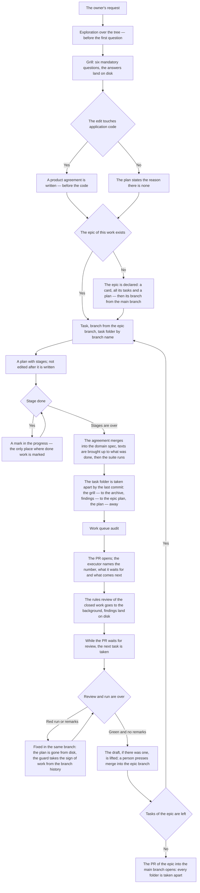

<!-- rt-kit v0.28.0 · rules/task-flow.md · 5d1ed29cc59b · правится надстройкой, не здесь -->

# Work conduct — how it works here

Rule under the law `docs/constitution/work-conduct.md`. The law says what must be true about the
course of work; here — what it is called in this tree, where it lives and what is not checked here.

**Cold part:** `pitfalls.md` next to it — traps and conduct from incident analyses. Loaded on
demand, not with the rule: an ordinary decision does not need it — whoever analyses a miss or argues
with a guard does.

**Requires:** `hooks/task-flow-guard.sh`, `hooks/task-flow-draft-guard.sh`,
`hooks/task-context-load.sh`, `hooks/grill-gate.sh`, `hooks/window-fill-guard.sh`,
`hooks/turn-exit-guard.sh`, `hooks/work-start-guard.sh`

## What it is called here

| In the law | Here |
| --- | --- |
| the owner's request | what work begins with; grilled by the `/grill-me` command before the first edit |
| understanding written where the work goes | `docs/tasks/<ветка>/grill.md` — the request verbatim, the owner's answers in their words, decisions with reasons |
| the plan | `docs/tasks/<ветка>/plan.md` — the task footprint and stages with readiness signs; not edited after it is written |
| the progress | `docs/tasks/<ветка>/progress.md` — "Where we stand", decisions along the way, session entries; the only place where done work is marked |
| the product agreement written before the code | `docs/specs/<домен>/proposed/<фича>/` — the feature spec; survives the merge and merges into the domain spec |
| an epic — the unit of delivery | a card in the work queue with the epic label, a branch of its own from the main branch and a plan next to it: the opportunity, the tasks, their order |
| the epic branch | `<КЛЮЧ>-<номер эпика>-<короткий-slug>`; the branches of its tasks are taken from it, and their PRs go into it |
| the epic plan | a record outside the task folder: the folder dies with the merge, the epic outlives it; the directory — in the rule's companion |
| the task folder before the task is created | `docs/tasks/_draft-<slug>/` — outside history while there is no number |
| exploration | an `Explore` or `general-purpose` session before the first question to the owner |
| the plan review by roles | `.claude/workflows/plan.js` — need, agreement, critique, plan |

## Where it lives

In this tree — the table in `implementation.md` next to it. Paths live there, not here: the rule
travels between repositories, the layout does not, and a path named in the rule lies in the first
tree that keeps its code differently.

## Work states

The unit of work is a state, not a step. A state has an entry, a mandatory action and an exit, and
until the action is done the work stays in the same state.

The state is declared in the "Where we stand" section of the progress by the machine-readable line
``- **State:** `этап-идёт` `` and is rewritten with it.

| State | Entry | Mandatory action | Pattern |
| --- | --- | --- | --- |
| `просьба-не-разобрана` | the owner's message about new work | exploration over the tree, then questions | `task-flow-start` |
| `эпик-заведён` | the epic card, all its tasks and its plan lie in the queue | take the epic branch from the main branch | `task-flow-start` |
| `разбор-закрыт` | the owner's answers lie on disk | a product agreement, or the reason there is none | `task-flow-start` |
| `договорённость-записана` | the draft lies, or the reason is named | create the task, the branch from the epic branch, and the folder | `task-flow-start` |
| `задача-взята` | task in the work column, branch by number, folder | write the plan | `task-flow-start` |
| `замысел-записан` | the plan lies and is not edited after writing | do the first stage | `task-flow-start` |
| `этап-идёт` | a stage is begun | finish the stage and mark it in the progress | `task-flow-resume` |
| `этапы-кончились` | all stages are marked | merge the agreement, bring texts up to date, run the suite | `task-flow-close` |
| `разбор-кончился` | the suite is green, texts are up to date | take the folder apart by the last commit | `task-flow-archive` |
| `папка-разобрана` | no folder in the branch, a record in the archive | open the PR: a draft where a run is waited for, ready where the pipeline does not wake | `task-flow-close` |
| `работа-отдана` | the PR is open into the epic branch, with a reviewer | take the next task of the epic | `task-flow-resume` |
| `влито` | the PR merged by a person | rules review of the work and the work queue audit | `task-flow-archive` |
| `задачи-эпика-кончились` | every task of the epic is merged and its folder taken apart | open the PR of the epic into the main branch | `task-flow-close` |

No state has a mandatory action that sounds like "wait": waiting for someone else's step is not a
work state, so in `работа-отдана` the mandatory action is the next task, not the open PR. A blocked
task does not count as next: the same waiting under the name of work. The next is taken from the
work queue, and the queue is asked by a command: "no tasks" is a statement about the tree, backed by
output, not by the executor's memory. A filled session window is no state either: the session ends
with a handover, and the work stays where it stood. **An open card says nothing about whether the
work is taken.** A card is closed by the merge, and in a session that opens no PRs the list of open
ones does not shrink. A task is untaken when the tree holds no trace of it: open numbers are checked
against the archive — closed work has a record there with its number. The audit costs one command
and answers for both sides; the open list answers for neither.

What a turn ends with — rule `turn-conduct` under the same law.

The list is shown to the owner at the start of work, and where we stand is marked on it.

The last two states cannot be declared on disk: the progress leaves with the folder, and the folder
is taken apart before the PR opens. Their sign is in the branch history — the commit that takes the
folder apart — and a guard reads it, not a line in a file.

## Flow

The course of work from the owner's request to closing: where the grill stands, what the guard
demands and where the task folder goes.

## How the law applies here
- **Editing application code is refused until the work has reached a state in which code is
  edited.** The guard demands three things: a task folder by branch name, a plan in it and a
  declared state. The agreement has a guard of its own on the same events.
- **The guard judges the declared transition, not the presence of files.** An empty plan lies the
  same as a written one, so the refusal is lifted by the declared state — `этап-идёт`,
  `этапы-кончились`, `разбор-кончился`. The fourth road is the branch history: a folder taken apart
  means handed-in work.
- **A state line moved forward is the same declaration of intent, only machine-readable.** It is
  declared by the turn in which its mandatory action is begun by deed.
- **A refusal by state names the mandatory action of that state.** Hearing only "wrong state", the
  executor rewrites the state line instead of the step.
- **Only a word from the list counts as a state name.** A word of one's own says nothing about the
  entry, the exit or the action.
- **Two requirements — two guards, and one can be lifted without losing the other.** A line about
  unchanged behaviour lifts the agreement, not the requirement to reach the code-editing state.
- **A merged agreement does not lock the branch.** After the merge the "proposed" directory is gone
  from disk while the plan refers to it to the end: the guard tells merged from never-created by the
  branch history.
- **The agreement is required by the edit paths, not by an appraisal of the task.** `apps/**` and
  `libs/**` are the sign; rules, texts, tooling and dependencies fall outside it. The bypass is the
  line `**Behaviour:** unchanged — <the reason of the owner>` in the plan; an empty reason is not
  accepted.
- **What needs the owner's word is taken from a list, not appraised on the spot.** The appraisal
  "this is safe" is assigned by whoever finds it convenient.
- **A reply to the owner's order begins with the result, not with intent or its justification.** A
  justification under someone else's accepted decision reads as its appraisal. One exception:
  execution stopped by an obstacle — then the obstacle is named.
- **A session does not start work by itself.** A start needs the owner's word in the same session:
  the handover, the state from the startup hook and an assigned epic say what to do, not whether to
  work. The form of the message is judged: an empty message, one word or one path order no work.
- **A refusal by an external limiter removes the way, not the task.** It is not the tree's guard and
  names no exit: read as the end of the road, it stops the work whole. The way is taken from the
  guard that already described this fix — a bypass with the reason in the commit body, a mark in the
  observations, a word to the owner — and the task stays the same.
- **An instruction to work by the progress covers all its steps, including those that change
  history.** Questions are asked about what the progress lacks.
- **A question written by a past session does not become a question to the owner.** It is addressed
  to the handover's author, and some are closed by a work step.
- **The owner's instruction holds until they cancel it, and a new fact against it is a line in the
  reply about the cost, not a new question.** Re-asked is what the instruction does not cover. A
  menu where two options of three offer to cancel the owner's decision is that very cancellation.
- **An answer in the owner's message counts the same as an answer in a document.** A question
  already answered in the conversation is not asked again.
- **The owner's word about the design is a task setting, not a decision.** What they named is
  usually already in the tree under that word — a name on a screen, a spec section, a model field —
  and is checked against them before the edit. Diverged — the owner is asked.
- **A task folder is created for any work, no exceptions.** An exception with even one lawful form
  is executed as permission. It goes in before the first edit.
- **The task folder goes into the branch by a commit, not lives in one working tree.** Uncommitted,
  it passes edits without refusal, and the refusal comes at the end, when the plan is already gone.
  Outside history one draft without a number is lawful.
- **The task folder is taken apart by the last commit before the PR opens, not after approval.** A
  person merges as soon as they see green, and no room is left for a closing commit.
- **After opening the PR, the executor tells the owner the number, what it waits for and what comes
  next.** A draft waits for the run, and next it is lifted: a green run says nothing is broken and
  nothing about the locked merge button. A PR opened ready waits for the owner's hand, and that is
  said in the same words.
- **A request to merge never comes before the work is checked.** Where the pipeline wakes for this
  base: folder taken apart and pushed → PR as a draft → run green → draft lifted → the request to
  merge, naming the number. Where it does not wake, the green push gate is the check, and opening
  the PR and asking to merge are one turn.
- **A PR that waits for a run opens as a draft, and one that waits for nothing opens ready.** Before
  it opens the owner sees no edits, and an open PR reads as an invitation to merge. Which of the two
  applies is decided by the bases the pipeline wakes for, and that is read from its file.
- **The plan guard is the lower bound of the requirement, not its limit.** It demands a folder only
  for an edit of application code; the article above — for any work.
- **An instruction to work by a rule is an instruction to do its steps, including those that change
  history.** Marking a stage, a commit, a push and opening a PR are prescribed by the rule.
- **A taken task does not end a turn.** Creating the task, the branch, the column and the folder is
  preparation: the work moves to the written-plan state, where the action is different. The
  turn-exit guard names the first stage in its refusal.
- **The stages of a plan cover its done-sign whole.** A sign written wider than the sum of the
  stages means a part of the order is given to no step at all: every stage closes, the run is
  green, and half the order is not done. Either the stages are written up to the sign, or the sign
  is narrowed to what the stages give.
- **A stage's readiness sign is taken from the output of a command run while the plan is written.**
  Written by a guess, it is checked at the stage itself — latest of everything that depended on it.
  Some lines come not from the work but from an unconfigured tree, and no stage puts them out.
- **A plan for work that ports a technique from outside is written by a measurement of one's own
  code.** Reading the sample says how the sample is built; what of it is needed here is said by a
  count over one's own files.
- **Waiting for one part of a stage is never a stop of the stage.** The parts independent of what is
  awaited are done in the same turn; the owner is told what is done and what is left for their step.
  A refused command reads the same: everything else is done first.
- **A finding made mid-stage is checked against the plan's exit conditions before the first edit.**
  Nearness of subject proves no belonging. A finding named by no exit condition goes to the section
  on what the work does not do, and is filed as a task.
- **Done work is marked only in the progress.** "Where we stand" is rewritten by every session, not
  appended: it is the first thing the next session reads.
- **A word for a new notion is looked up in the tree's glossary.** The package carries the common
  part, the tree appends the subject part by an override; the glossary goes into the context whole
  at session start, so "did not read it" is never a ground.
- **The task folder is created as a draft and gets its number by a command.** Until the grill ends,
  how many tasks come out is unknown, so the number never comes first. The command renames the
  draft, fills the plan header and strips the layout header from the copies.
- **An abandoned grill is visible.** A draft older than a week is listed by the work queue audit.
- **Work ordered in words becomes a task in the queue in the same turn.** Even if it will not be
  done now. A draft folder is not the queue: it has no number, and one session knows of it.
  Postponed work names a date; postponed silently, it reads as done.
- **Work begins with the epic, and a task outside one is not taken.** The epic names what the whole
  is, and the main branch takes that whole or does not take it. Work outside an epic exists only by
  the owner's word about that work, said about that work.
- **The epic branch is taken before the first task of the epic, not with it.** Taken later, it
  leaves the first task standing on the main branch, and the epic starts as half of itself already
  merged.
- **The next task is taken from the epic plan, and the queue list is asked only where there is no
  epic.** By a list of numbers someone else's epic cannot be told from one's own.
- **An epic is not closed by a sign confirmed by reading alone.** What is checkable by eye is
  called checked only with a command and its output.
- **The tasks of an epic are created all at once, by the same turn as the epic itself.** Creating
  them one at a time hides the volume.
- **A task of an epic is linked to the epic card as a sub-issue, not only named in the plan.** The
  board reads no text: without the link a task of an epic looks exactly like a task outside one.
  Closed tasks are linked too — the share of what is done counts them.

- **The epic plan names how the branches of its tasks stand, on a par with their order.** Two
  arrangements: each branch from the epic branch, or a stack — each from the previous. The
  arrangement written in the plan is the epic's decision, not that of whoever creates the branch.
- **The PR of the epic opens when its last folder is taken apart, and not a task earlier.** A folder
  left in the epic branch reaches the main branch with it: what one branch needed becomes the tree's
  for good. Until then the epic branch is not offered to a person at all — the merge button on it
  means the whole epic.
- **The epic plan lies where it is found without the network and after the merge.** The card does
  not hold the task order, and the task folder would hold it only until the first merge; the
  directory — in the rule's companion. What the owner names along the way is appended there by the
  turn that accepted it.
- **Building by a sample begins with reading the sample itself.** The repeated part is opened whole,
  by walking the directories.
- **What acts on the tree, not on the edit, lies outside the index.** The path to the sample and the
  permission to work outside the epic do not belong to the branch and live next to the handover. A
  number in the permitted list repeats the owner's word, not replaces it.
- **Closed work is reviewed by the rules as a closing step, not as a separate request.** What was
  loaded and what was missing is seen only by the session that led the work.
- **The review of closed work goes to the background, and the executor takes the next task.** The
  role works in a turn of its own; the digest is gathered before the launch, the findings are
  accepted in one turn.
- **The review's findings wait for the owner, and only the digest of observations leaves for the
  package.** A proposal sent unreviewed becomes the work of someone who did not order it. The digest
  is always sent: it says what was used and is never an opinion.
- **The cheap closing step goes before the costly one, and the run — after the merge.** Merging the
  agreement and bringing the texts up to date cost minutes, the run costs the session window; a run
  before the merge checks what will not reach main.
- **The agreement merges into the domain spec by one of the last commits of the branch, before the
  PR opens.** By then the code is written, the bindings are known, and the `proposed/` directory
  never appears in main. What is ready to merge is listed by `npm run check:specs`.
- **The folder of a closed task is taken apart, not moved whole.** What explains a decision goes to
  `docs/archive/`; the rest is deleted. One not taken apart is caught by the work queue audit.
- **Opening the PR and lifting the draft are refused while the branch carries its task folder.** A
  person presses merge on the host, where there are no guards: a lifted draft reads to them as an
  invitation. The branch content is judged, not the working tree.
- **A branch that removed the folder adds a record to the archive.** Removing is cheaper than taking
  apart, and the grill leaves first — the only record of the owner's words.
- **The bypass is the line `Task-folder-skip: <reason>` in the PR or in the command itself.** An
  empty reason is no bypass, and the bypass lifts the refusal but does not silence the work queue
  audit line.

## What of the law is not here

Nothing checks the completeness of the written understanding: the machine sees that a record exists,
not that it closes every gap. The same for a question worth asking and not asked — it leaves no
trace. The owner judges both.

The guard judges by the edit paths, not by whether the work changes behaviour. A refactoring gets no
sign of its own: the appraisal "behaviour does not change" would be assigned by whoever it hinders.

Nothing of the grill itself is checked. A conversation with the owner is not a tool call: the guard
sees a file edit and knows nothing of the exploration, the six mandatory questions or the answers.
An empty table passes the same as a filled one.

The conversation guard does not understand text: its second sign judges shared words between the
question's topic and the owner's last message, not meaning. The refusal names the lawful move: name
what the owner's earlier answer lacks.

Nothing watches the plan's immutability: an edit along the way is told from the original record only
by history.

Nothing checks that the texts match what was done: the machine cannot see what went stale in a rule
or a spec. This is held by the closing step and the task footprint in the plan. A rule and a spec
are edited in the branch, a law is not: its article goes to the owner as text, and the work goes on
without it.

What exactly went to the archive is not checked: the guard sees that the folder left and the branch
added something to the archive; whether it is the right thing the owner judges at review.

The task folder guard judges the executor's call, not the host's button: a person merging from their
side passes it in silence. On that half of the cases the requirement is held by the remaining step:
a section in the PR body, said aloud.

A tree may reverse the hand-in order by an override, and then some package steps stop being
executed. Which ones — nothing counts: a step whose mechanics broke by the same decision does not
enter the cancelled list and still reads as in force. This is held by reading both texts in a row on
every edit of the hand-in order.

## Patterns

- `task-flow-start` — exploration, grill, agreement, plan, task and branch.
- `task-flow-resume` — returning to unfinished work in a new session.
- `task-flow-close` — lifting the draft, merging the agreement, bringing the texts up to date.
- `task-flow-archive` — taking the task folder apart, the move to the archive, review by the rules.
