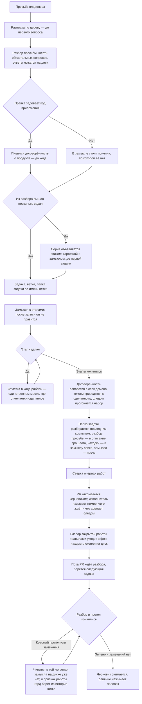

<!-- rt-kit v0.16.1 · rules/task-flow.md · 3b478350c030 · правится надстройкой, не здесь -->

# Ведение работы — как это устроено здесь

Правило под закон `docs/constitution/work-conduct.md`. Закон говорит, что должно быть верно
про ход работы; здесь — чем это названо в этом дереве, где лежит и что из закона у нас не
проверяется.

**Холодная часть:** `pitfalls.md` рядом — ловушки и поведение по разборам происшествий.
Грузится по требованию, а не вместе с правилом: при обычном решении она не нужна — она нужна
тому, кто разбирает промах или спорит с гардом.

**Требует:** `hooks/task-flow-guard.sh`, `hooks/task-context-load.sh`, `hooks/grill-gate.sh`, `hooks/window-fill-guard.sh`, `hooks/turn-exit-guard.sh`

## Как это называется здесь

| В законе                                      | Здесь                                                                                                                         |
| --------------------------------------------- | ----------------------------------------------------------------------------------------------------------------------------- |
| просьба владельца                             | то, с чего начинается работа; разбирается командой `/grill-me` до первой правки                                               |
| понимание, записанное там, где идёт работа    | `docs/tasks/<ветка>/grill.md` — просьба дословно, ответы владельца его словами, решения с доводами                            |
| замысел                                       | `docs/tasks/<ветка>/plan.md` — след задачи и этапы с признаками готовности; после написания не правится                       |
| ход работы                                    | `docs/tasks/<ветка>/progress.md` — «Где стоим», решения по ходу, записи заходов; единственное место, где отмечается сделанное |
| договорённость о продукте, записанная до кода | `docs/specs/<домен>/proposed/<фича>/` — спек фичи; переживает мерж и вливается в спек домена                                  |
| эпик — работа шире одной ветки                | карточка в очереди работ с меткой эпика и замысел рядом с ней: возможность, состав задач и порядок                            |
| замысел эпика                                 | запись вне папки задачи: та умирает с мержем, а эпик её переживает; каталог называет компаньон правила                        |
| папка задачи до заведения задачи              | `docs/tasks/_draft-<slug>/` — вне истории, пока номера нет                                                                    |
| разведка                                      | заход `Explore` или `general-purpose` до первого вопроса владельцу                                                            |
| разбор замысла ролями                         | `.claude/workflows/plan.js` — нужность, договорённость, критика, замысел                                                      |

## Где это лежит

В этом дереве — таблица в `implementation.md` рядом. Пути живут там, а не здесь: правило
переносится между репозиториями, раскладка — нет, и путь, названный в правиле, врёт в первом
же дереве, которое держит код иначе.

## Состояния работы

Единица работы — состояние, а не шаг. У состояния есть вход, обязательное действие и выход, и
пока действие не сделано, работа стоит в том же состоянии. Список шагов этого не давал: шаг
кончался, а что делать дальше, выводилось из соседних строк.

Состояние объявляется в разделе «Где стоим» хода работы машиночитаемой строкой
``- **Состояние:** `этап-идёт` `` и перезаписывается вместе с ним.

| Состояние                 | Вход в него                                     | Обязательное действие                                  | Ведёт паттерн      |
| ------------------------- | ----------------------------------------------- | ------------------------------------------------------ | ------------------ |
| `просьба-не-разобрана`    | реплика владельца о новой работе                | разведка по дереву, затем вопросы                      | `task-flow-start`  |
| `разбор-закрыт`           | ответы владельца лежат на диске                 | договорённость о продукте либо причина её отсутствия   | `task-flow-start`  |
| `договорённость-записана` | драфт лежит или причина названа                 | завести задачу, ветку и папку                          | `task-flow-start`  |
| `задача-взята`            | задача в колонке работы, ветка по номеру, папка | написать замысел                                       | `task-flow-start`  |
| `замысел-записан`         | замысел лежит и после записи не правится        | делать первый этап                                     | `task-flow-start`  |
| `этап-идёт`               | этап начат                                      | доделать этап и отметить в ходе работы                 | `task-flow-resume` |
| `этапы-кончились`         | все этапы отмечены                              | влить договорённость, привести тексты, прогнать набор  | `task-flow-close`  |
| `разбор-кончился`         | набор зелёный, тексты приведены                 | разобрать папку последним коммитом                     | `task-flow-archive` |
| `папка-разобрана`         | папки в ветке нет, запись в архиве есть         | открыть PR черновиком                                  | `task-flow-close`  |
| `работа-отдана`           | PR открыт черновиком                            | взять следующую задачу                                 | `task-flow-resume` |
| `влито`                   | PR слит человеком                               | разбор работы правилами и сверка очереди               | `task-flow-archive` |

Ни у одного состояния обязательное действие не звучит как «ждать»: ожидание чужого шага
состоянием работы не является, поэтому в `работа-отдана` обязательное действие смотрит на
следующую задачу, а не на открытый PR. Блокированная задача следующей при этом не считается: она
начнётся после чужого шага, то есть это то же ожидание, названное именем работы. Следующая
берётся из очереди работ, а очередь спрашивается командой: «задач нет» — утверждение о дереве, и
подтверждается оно выводом, а не памятью о том, что заводил сам исполнитель. Заполнение окна
захода состоянием тоже не бывает: заход кончается передачей, а работа остаётся там, где стояла.
Чем ход кончается — правило `turn-conduct` под тем же законом.

Перечень показывается владельцу в начале работы, и на нём же отмечается, где стоим.

Последние два состояния объявить на диске уже нечем: ход работы уезжает вместе с папкой, а папка
разбирается раньше, чем открывается PR. Признак у них поэтому в истории ветки — коммит разбора
папки, — и читает его гард, а не строка в файле. Цена: с этой минуты и до слияния состояние
работы виду не подлежит, и хвост из четырёх шагов держится паттерном, а не объявлением.

## Ход

Ход работы от просьбы владельца до закрытия: где стоит разбор, что требует гард и куда девается
папка задачи.

## Как закон применяется здесь
- **Правка кода приложения отбивается, пока работа не дошла до состояния, в котором код
  правится.** Гард требует четыре вещи: папку задачи по имени ветки, замысел в ней, объявленное
  в ходе работы состояние и названную в замысле договорённость о продукте.
- **Гард судит объявленный переход, а не наличие файлов.** Пустой замысел лежит так же, как
  написанный: отказ снимает объявленное состояние — `этап-идёт`, `этапы-кончились`,
  `разбор-кончился`. Четвёртый путь не состояние, а история ветки: папка, разобранная коммитом,
  означает отданную работу.
- **Строка состояния, переведённая вперёд, — то же объявление намерения, только
  машиночитаемое.** Она точнее всякого обещания, и пустоты за ней не видно никому. Состояние
  объявляется тем ходом, в котором его обязательное действие начато делом, а не тем, в котором о
  нём отчитались.
- **Отказ по состоянию называет обязательное действие того состояния, которое объявлено.**
  Исполнитель, которому сказано только «не в том состоянии», перепишет строку состояния вместо
  того, чтобы сделать шаг.
- **Именем состояния считается только слово из перечня.** Своё слово не говорит ни о входе, ни о
  выходе, ни об обязательном действии, а перечень называет все три.
- **Состояние судится раньше договорённости и её обхода.** Строка о неизменном поведении снимает
  требование договорённости о продукте, а не требование дойти до правки кода.
- **Влитая договорённость ветку не запирает.** После вливания директории «предложено» на диске
  нет, а замысел на неё ссылается до конца работы: гард отличает влитое от незаведённого по
  истории ветки. Иначе правкам по замечаниям не было бы дороги.
- **Договорённость требуется по путям правки, а не по оценке задачи.** `apps/**` и `libs/**` —
  признак; правила, тексты, обвязка и зависимости под него не подпадают. Обход — строка
  `**Поведение:** не меняется — <причина владельца>` в замысле; пустая причина не принимается.
- **Папка задачи заводится под любую работу, без исключений.** Исключение, у которого есть хоть
  одна законная форма, исполняется как разрешение. Заводится она до первой правки: сколько
  заходов уйдёт на работу, заранее не знает никто.
- **Папка задачи едет в ветку коммитом, а не живёт в одном рабочем дереве.** Незакоммиченная,
  она проходит все правки без отказа, а признак отданной работы берётся из истории: отказ придёт
  в последней точке, когда замысел уже снят своими руками. Вне истории законен один черновик без
  номера.
- **Папка задачи разбирается последним коммитом до открытия PR, а не после одобрения.** Человек
  вливает, как только видит зелёное, и закрывающему коммиту места не остаётся вовсе. Цена:
  замысла с этой минуты на диске нет, и признак отданной работы гард берёт из истории ветки.
- **Открыв PR, исполнитель называет владельцу три вещи: номер, чего ждёт и что сделает следом.**
  Ждёт он прогона, следом идёт снятие черновика. Зелёный прогон на странице однозначным не
  бывает: он говорит, что не сломано, и молчит о том, что кнопка слияния у черновика
  заблокирована.
- **Просьба о слиянии — отдельный ход, и раньше зелёного прогона её не бывает.** Порядок один:
  папка разобрана и запушена → PR открыт черновиком → прогон зелёный → черновик снят →
  исполнитель просит влить, называя номер.
- **PR открывается черновиком, а не в конце работы.** До открытия владелец правки не видит
  вовсе, а открытый PR читается как приглашение влить — поэтому незаконченная работа идёт
  черновиком. Черновик снимается тем ходом, которым исполнитель говорит, что решение готово.
- **Гард замысла — нижняя граница требования, а не его предел.** Он требует папку только под
  правку кода приложения, а статья выше — под любую работу. Прочитанный как признак, гард
  становится разрешением работать без замысла везде, куда он не смотрит.
- **Взятая задача ходом не кончается.** Заведение задачи, ветки, колонки и папки — подготовка, а
  не работа: они переводят её в состояние записанного замысла, где обязательное действие уже
  другое. Держит это страж выхода хода, называя в отказе первый этап замысла.
- **Ожидание одной части этапа остановкой этапа не бывает.** Части, которые от ожидаемого не
  зависят, делаются тем же ходом; сказать «стоит приёмка» и не тронуть остальное — это остановка
  всей работы по причине, действующей на её десятую часть. Владельцу называется, что уже сделано
  и что осталось на его шаг, — этим ожидание и отличается от остановки.
- **Сделанное отмечается только в ходе работы.** «Где стоим» перезаписывается каждым заходом, а
  не дописывается: это первое, что читает следующий заход.

- **Сделанное отмечается только в ходе работы.** «Где стоим» перезаписывается каждым заходом:
  это первое, что читает следующий заход.
- **Слово для нового понятия ищется в словаре дерева.** Общую часть везёт пакет, предметную
  дописывает дерево надстройкой; словарь уезжает в контекст на запуске сессии целиком, поэтому
  «не читал» основанием не бывает.
- **Папка задачи заводится черновиком и получает номер командой.** До конца разбора неизвестно,
  сколько задач из него выйдет, поэтому номер не может быть первым. Команда заведения
  переименовывает черновик, проставляет шапку замысла и собирает папку с образца, снимая с копий
  шапку раскладки.
- **Брошенный разбор виден.** Черновик старше недели перечисляет сверка очереди работ.
- **Следующая задача берётся из замысла эпика, а список очереди работ спрашивается только там,
  где эпика нет.** По списку, отсортированному номером, первая задача чужого эпика неотличима от
  своей. Кончившийся эпик называется владельцу тем же ходом, которым берётся работа вне его.
- **Эпик не закрывается по признаку, подтверждённому только чтением.** Признак, проверяемый
  глазами, называется проверенным лишь вместе с командой или замером и их выводом. Пометка
  «подтверждается живым замером» — обещание проверки, а не проверка.
- **Задачи эпика заводятся все разом, тем же ходом, что и сам эпик.** Заведение по одной прячет
  объём. Номера возвращаются в раздел порядка той же правкой — без них «взять следующую»
  отвечает названием, а не карточкой. Метку эпика несёт только его карточка.

- **Замысел эпика лежит там, где его найдут без сети и после мержа.** Карточка порядка задач не
  держит, а папка задачи держала бы его до слияния первой из них; каталог называет компаньон
  правила. Состав и порядок — не всё, что там живёт: имя, адрес и способ, названные владельцем по
  ходу, дописываются туда же тем ходом, каким приняты.
- **Сборка по образцу начинается с чтения самого образца, а не пересказа о нём.** Пересказ лежит
  в разборе просьбы и в замысле эпика; образцом они не считаются. Повторяемая часть открывается
  целиком — обходом каталогов, а не одним файлом, за которым пришли.
- **Путь к образцу лежит вне дерева и приходит в заход хуком запуска сессии.** Имя чужого дерева
  в файлы репозитория не пишется: там законна ссылка без имени. Каталог для записи — тот же, где
  лежит передача захода. Не записанный так, образец теряется на первой же чистке контекста.
- **Закрытая работа разбирается правилами, и это шаг закрытия, а не отдельная просьба.** Что
  грузилось, что помогло и чего не хватило, видно только тому заходу, который работу вёл. Разбор
  кончается правкой слоя правил или предложением наружу.
- **Разбор закрытой работы уходит в фон, а исполнитель берёт следующую задачу.** Роль работает
  своим ходом и ничего не спрашивает. Сводку собирают до запуска, вернувшиеся находки принимают
  одним ходом.
- **Находки разбора ждут владельца, а в пакет уезжает только сводка наблюдений.** Предложение —
  заготовка правки чужого дерева, и уехавшая без разбора, она становится работой того, кто её не
  заказывал. Сводка уезжает всегда: она говорит, чем пользовались, и мнением не бывает.
- **Дешёвый шаг закрытия идёт раньше дорогого, а прогон — после вливания.** Вливание
  договорённости и приведение текстов стоят минуты, прогон — окно захода. Прогон, идущий после
  вливания, вдобавок проверяет и его самого: идущий до, он смотрит то состояние дерева, которое
  в главную ветку не поедет.
- **Договорённость вливается в спек домена одним из последних коммитов ветки, до открытия PR.**
  К этому моменту код написан, привязки известны, и в главной ветке директория `proposed/` не
  появляется вовсе. Готовые к вливанию перечисляет `npm run check:specs`.
- **Папка закрытой задачи разбирается, а не переносится целиком.** В `docs/archive/` уезжает то,
  что объясняет состоявшееся решение; остальное удаляется. Неразобранную ловит сверка очереди.
- **Открытие PR отбивается, пока ветка везёт папку своей задачи.** Требование стоит здесь, а не
  на слиянии: слияние нажимает человек на хостинге, где гардов нет, и его отказ до владельца не
  доходит. Судится содержимое ветки, а не рабочее дерево.
- **Ветка, снёсшая папку, обязана прибавить запись в архив.** Снести дешевле, чем разобрать, и
  первым уходит разбор просьбы — единственная запись слов владельца.
- **Обход — строка `Task-folder-skip: <причина>` в PR или в самой команде.** Пустая причина
  обходом не считается, а сам обход снимает отказ, но не гасит строку сверки очереди — иначе он
  через месяц становится рабочим путём.

## Чего из закона здесь нет

Полноту записанного понимания не проверяет ничто: машине видно наличие записи, но не то, что в
ней закрыты все пробелы. То же с вопросом, который стоило задать и не задали, — следа он не
оставляет. Судит оба владелец.

Гард судит по путям правки, а не по тому, меняет ли работа поведение на самом деле. Своего
признака рефакторингу не заводится: оценку «поведение не меняется» назначал бы тот, кому она
мешает.

Ничто из самого разбора не проверяется. Разговор с владельцем инструментом не является: гард
видит правку файла и не знает ни о разведке до первого вопроса, ни о шести обязательных, ни об
ответах на них — пустая таблица проходит так же, как заполненная.

Гард разговора судит завершение хода, а не отправку вопроса: к моменту отказа вопрос уже у
владельца. Отсюда порядок — правило читается первым движением захода, а не по отказу гарда.

Неизменность замысла не стережёт ничто: правка по ходу отличима от первоначальной записи только
по истории.

Приведение текстов к сделанному не проверяет ничто: что устарело в правиле и в спеке, машине не
видно. Держится это шагом закрытия и следом задачи в замысле — там названо, что перечитать.
Правило и спек правятся в ветке, закон — нет: его статья приносится владельцу текстом, а работа
идёт дальше без неё.

Что именно перенесли в архив, не проверяется: гард видит, что папка уехала и что ветка что-то в
архив добавила, а то ли это — судит владелец на ревью.

Гард папки задачи судит вызов исполнителя, а не кнопку хостинга: человек, вливающий работу со
своей стороны, проходит мимо него молча, и папка уезжает в главную ветку целой. Гард закрывает ту
половину случаев, где вливает исполнитель; на второй требование держится оставшимся шагом,
который стоит разделом в теле заявки и произносится вслух.

Порядок отдачи работы дерево вправе перевернуть надстройкой, и тогда часть шагов пакета
перестаёт исполняться. Какие именно — не считает ничто: перечень отменяемого пишется руками, а
шаг, чья механика сломалась тем же решением, в него не попадает и продолжает читаться
действующим. Держится это чтением обоих текстов подряд — пакетного и надстройки — при каждой
правке порядка отдачи.

## Паттерны

- `task-flow-start` — разведка, разбор, договорённость, замысел, задача и ветка.
- `task-flow-resume` — возвращение к незаконченной работе новым заходом.
- `task-flow-close` — снятие черновика, вливание договорённости, приведение текстов.
- `task-flow-archive` — разбор папки задачи, переезд в описание прошлого, разбор правилами.
