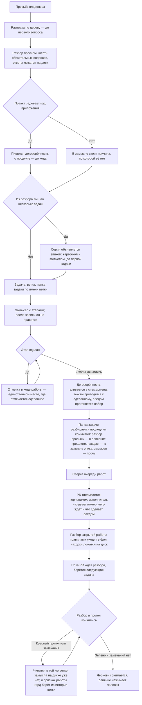

<!-- rt-kit v0.23.0 · rules/task-flow.md · a5ae6677a5ce · правится надстройкой, не здесь -->

# Ведение работы — как это устроено здесь

Правило под закон `docs/constitution/work-conduct.md`. Закон говорит, что должно быть верно
про ход работы; здесь — чем это названо в этом дереве, где лежит и что из закона у нас не
проверяется.

**Холодная часть:** `pitfalls.md` рядом — ловушки и поведение по разборам происшествий.
Грузится по требованию, а не вместе с правилом: при обычном решении она не нужна — она нужна
тому, кто разбирает промах или спорит с гардом.

**Требует:** `hooks/task-flow-guard.sh`, `hooks/task-flow-draft-guard.sh`, `hooks/task-context-load.sh`, `hooks/grill-gate.sh`, `hooks/window-fill-guard.sh`, `hooks/turn-exit-guard.sh`, `hooks/work-start-guard.sh`

## Как это называется здесь

| В законе                                      | Здесь                                                                                                                         |
| --------------------------------------------- | ----------------------------------------------------------------------------------------------------------------------------- |
| просьба владельца                             | то, с чего начинается работа; разбирается командой `/grill-me` до первой правки                                               |
| понимание, записанное там, где идёт работа    | `docs/tasks/<ветка>/grill.md` — просьба дословно, ответы владельца его словами, решения с доводами                            |
| замысел                                       | `docs/tasks/<ветка>/plan.md` — след задачи и этапы с признаками готовности; после написания не правится                       |
| ход работы                                    | `docs/tasks/<ветка>/progress.md` — «Где стоим», решения по ходу, записи заходов; единственное место, где отмечается сделанное |
| договорённость о продукте, записанная до кода | `docs/specs/<домен>/proposed/<фича>/` — спек фичи; переживает мерж и вливается в спек домена                                  |
| эпик — работа шире одной ветки                | карточка в очереди работ с меткой эпика и замысел рядом с ней: возможность, состав задач и порядок                            |
| замысел эпика                                 | запись вне папки задачи: та умирает с мержем, а эпик её переживает; каталог называет компаньон правила                        |
| папка задачи до заведения задачи              | `docs/tasks/_draft-<slug>/` — вне истории, пока номера нет                                                                    |
| разведка                                      | заход `Explore` или `general-purpose` до первого вопроса владельцу                                                            |
| разбор замысла ролями                         | `.claude/workflows/plan.js` — нужность, договорённость, критика, замысел                                                      |

## Где это лежит

В этом дереве — таблица в `implementation.md` рядом. Пути живут там, а не здесь: правило
переносится между репозиториями, раскладка — нет, и путь, названный в правиле, врёт в первом
же дереве, которое держит код иначе.

## Состояния работы

Единица работы — состояние, а не шаг. У состояния есть вход, обязательное действие и выход, и
пока действие не сделано, работа стоит в том же состоянии.

Состояние объявляется в разделе «Где стоим» хода работы машиночитаемой строкой
``- **Состояние:** `этап-идёт` `` и перезаписывается вместе с ним.

| Состояние                 | Вход в него                                     | Обязательное действие                                  | Ведёт паттерн      |
| ------------------------- | ----------------------------------------------- | ------------------------------------------------------ | ------------------ |
| `просьба-не-разобрана`    | реплика владельца о новой работе                | разведка по дереву, затем вопросы                      | `task-flow-start`  |
| `разбор-закрыт`           | ответы владельца лежат на диске                 | договорённость о продукте либо причина её отсутствия   | `task-flow-start`  |
| `договорённость-записана` | драфт лежит или причина названа                 | завести задачу, ветку и папку                          | `task-flow-start`  |
| `задача-взята`            | задача в колонке работы, ветка по номеру, папка | написать замысел                                       | `task-flow-start`  |
| `замысел-записан`         | замысел лежит и после записи не правится        | делать первый этап                                     | `task-flow-start`  |
| `этап-идёт`               | этап начат                                      | доделать этап и отметить в ходе работы                 | `task-flow-resume` |
| `этапы-кончились`         | все этапы отмечены                              | влить договорённость, привести тексты, прогнать набор  | `task-flow-close`  |
| `разбор-кончился`         | набор зелёный, тексты приведены                 | разобрать папку последним коммитом                     | `task-flow-archive` |
| `папка-разобрана`         | папки в ветке нет, запись в архиве есть         | открыть PR черновиком                                  | `task-flow-close`  |
| `работа-отдана`           | PR открыт черновиком                            | взять следующую задачу                                 | `task-flow-resume` |
| `влито`                   | PR слит человеком                               | разбор работы правилами и сверка очереди               | `task-flow-archive` |

Ни у одного состояния обязательное действие не звучит как «ждать»: ожидание чужого шага
состоянием работы не считается, поэтому в `работа-отдана` обязательное действие — следующая
задача, а не открытый PR. Блокированная задача следующей не считается: это то же ожидание под
именем работы. Следующая берётся из очереди работ, а очередь спрашивается командой: «задач нет» —
утверждение о дереве, и подтверждается оно выводом, а не памятью исполнителя. Заполнение окна
захода состоянием тоже не бывает: заход кончается передачей, а работа остаётся там, где стояла.
**Открытая карточка о взятости работы не говорит.** Карточку закрывает слияние, и в заходе без
открытия заявок список открытых не убывает. Невзятой задачу делает отсутствие следа в дереве:
открытые номера сверяются с описанием прошлого — на закрытую работу там лежит запись с её номером.
Сверка стоит одной команды и отвечает про обе стороны, список открытых — ни про одну.

Чем ход кончается — правило `turn-conduct` под тем же законом.

Перечень показывается владельцу в начале работы, и на нём же отмечается, где стоим.

Последние два состояния объявить на диске уже нечем: ход работы уезжает вместе с папкой, а папка
разбирается раньше, чем открывается PR. Признак у них в истории ветки — коммит разбора папки, — и
читает его гард, а не строка в файле.

## Ход

Ход работы от просьбы владельца до закрытия: где стоит разбор, что требует гард и куда девается
папка задачи.

## Как закон применяется здесь
- **Правка кода приложения отбивается, пока работа не дошла до состояния, в котором код
  правится.** Гард требует три вещи: папку задачи по имени ветки, замысел в ней и объявленное
  состояние. У договорённости о продукте свой гард на те же события.
- **Гард судит объявленный переход, а не наличие файлов.** Пустой замысел лежит так же, как
  написанный, поэтому отказ снимает объявленное состояние — `этап-идёт`, `этапы-кончились`,
  `разбор-кончился`. Четвёртый путь — история ветки: папка, разобранная её коммитом, означает
  отданную работу.
- **Строка состояния, переведённая вперёд, — то же объявление намерения, только машиночитаемое.**
  Состояние объявляется тем ходом, в котором его обязательное действие начато делом.
- **Отказ по состоянию называет обязательное действие объявленного состояния.** Услышав только
  «не в том состоянии», исполнитель перепишет строку состояния вместо шага.
- **Именем состояния считается только слово из перечня.** Своё слово не говорит ни о входе, ни о
  выходе, ни о действии.
- **Два требования — два гарда, и снять одно можно, не теряя второго.** Судят порознь: строка о
  неизменном поведении снимает договорённость, а не требование дойти до правки кода.
- **Влитая договорённость ветку не запирает.** После вливания директории «предложено» на диске
  нет, а замысел ссылается на неё до конца работы: влитое от незаведённого гард отличает по
  истории ветки.
- **Договорённость требуется по путям правки, а не по оценке задачи.** `apps/**` и `libs/**` —
  признак; правила, тексты, обвязка и зависимости под него не подпадают. Обход — строка
  `**Поведение:** не меняется — <причина владельца>` в замысле; пустая причина не принимается.
- **Что требует слова владельца, берётся списком, а не оценкой на месте.** Оценку «это безопасно»
  назначает тот, кому она удобна.
- **На команду владельца ответ начинается с результата, а не с намерения и не с его обоснования.**
  Обоснование при принятом чужом решении читается как его оценка. Исключение одно: исполнение
  остановлено препятствием — тогда называется препятствие.
- **Заход работу не начинает сам.** Начало требует слова владельца в этом же заходе: передача,
  состояние из хука запуска и назначенный эпик говорят, что делать, а не работать ли.
  Судится форма реплики: пустая реплика, одно слово или один путь работу не заказывают.
- **Указание работать по ходу работы покрывает все его шаги, включая меняющие историю.**
  Спрашивают о том, чего в ходе работы нет.
- **Вопрос, записанный прошлым заходом, вопросом владельца не становится.** Он адресован автору
  передачи, и часть таких вопросов закрыта шагом работы.
- **Указание владельца действует до его отмены, и новый факт против него — строка в ответе о
  цене, а не новый вопрос.** Переспрашивают то, чего указание не покрывает. Меню, где два
  варианта из трёх предлагают отменить решение владельца, и есть такая отмена.
- **Ответ, данный репликой владельца, записан наравне с ответом в документе.** Вопрос, на который
  в разговоре уже отвечали, второй раз не задают.
- **Слово владельца об устройстве — постановка, а не решение.** Названное им обычно уже есть в
  дереве под этим словом — имя на экране, раздел спека, поле модели — и сверяется с ними до
  правки. Разошлось — спрашивается владелец.
- **Папка задачи заводится под любую работу, без исключений.** Исключение, у которого есть хоть
  одна законная форма, исполняется как разрешение. Заводится она до первой правки.
- **Папка задачи едет в ветку коммитом, а не живёт в одном рабочем дереве.** Незакоммиченная,
  она проходит правки без отказа, и отказ приходит в конце, когда замысел уже снят. Вне истории
  законен один черновик без номера.
- **Папка задачи разбирается последним коммитом до открытия PR, а не после одобрения.** Человек
  вливает, как только видит зелёное, и закрывающему коммиту места не остаётся.
- **Открыв PR, исполнитель называет владельцу номер, чего ждёт и что сделает следом.** Ждёт он
  прогона, следом снимает черновик: зелёный прогон говорит, что не сломано, и молчит о
  заблокированной кнопке слияния.
- **Просьба о слиянии — отдельный ход, и раньше зелёного прогона её не бывает.** Порядок один:
  папка разобрана и запушена → PR открыт черновиком → прогон зелёный → черновик снят →
  исполнитель просит влить, называя номер.
- **PR открывается черновиком, а не в конце работы.** До открытия владелец правки не видит, а
  открытый PR читается как приглашение влить. Черновик снимается тем ходом, которым исполнитель
  говорит, что решение готово.
- **Гард замысла — нижняя граница требования, а не его предел.** Он требует папку только под
  правку кода приложения, а статья выше — под любую работу.
- **Указание работать по правилу — это указание делать его шаги, включая меняющие историю.**
  Отметка этапа, коммит, пуш и открытие заявки правилом предписаны.
- **Взятая задача ходом не кончается.** Заведение задачи, ветки, колонки и папки — подготовка:
  работа переходит в состояние записанного замысла, где действие другое. Гард завершения хода
  называет в отказе первый этап.
- **Ожидание одной части этапа остановкой этапа не бывает.** Независимые от ожидаемого части
  делаются тем же ходом, а владельцу называется, что сделано и что осталось на его шаг. Отбитая
  команда читается так же: сперва делается всё остальное.
- **Находка, сделанная посреди этапа, сверяется с условиями выхода замысла до первой правки.**
  Соседство по предмету принадлежности не доказывает: работа над слоем правил и работа над
  командами, которые этот слой вызывает, откатываются порознь. Не названная ни одним условием
  выхода, находка идёт в раздел о том, чего работа не делает, и заводится задачей.
- **Сделанное отмечается только в ходе работы.** «Где стоим» перезаписывается каждым заходом, а
  не дописывается: это первое, что читает следующий заход.
- **Слово для нового понятия ищется в словаре дерева.** Общую часть везёт пакет, предметную
  дописывает дерево надстройкой; словарь уезжает в контекст на запуске сессии целиком, поэтому
  «не читал» основанием не бывает.
- **Папка задачи заводится черновиком и получает номер командой.** До конца разбора неизвестно,
  сколько задач из него выйдет, поэтому номер не бывает первым. Команда переименовывает черновик,
  проставляет шапку замысла и снимает с копий шапку раскладки.
- **Брошенный разбор виден.** Черновик старше недели перечисляет сверка очереди.
- **Работа, заказанная словами, становится задачей в очереди тем же ходом.** Даже если делать её
  будут не сейчас. Черновик папки очередью не считается: номера нет, знает о нём один заход.
  Отложенная работа называет срок; отложенная молча читается как сделанная.
- **Следующая задача берётся из замысла эпика, а список очереди работ спрашивается только там, где
  эпика нет.** По списку номеров первая задача чужого эпика неотличима от своей. Кончившийся эпик
  называется владельцу тем же ходом, которым берётся работа вне его.
- **Эпик не закрывается по признаку, подтверждённому только чтением.** Проверяемое глазами
  называется проверенным лишь вместе с командой и её выводом.
- **Задачи эпика заводятся все разом, тем же ходом, что и сам эпик.** Заведение по одной прячет
  объём. Номера возвращаются в раздел порядка той же правкой.

- **Замысел эпика называет, как стоят ветки его задач, наравне с их порядком.** Расстановок две:
  каждая ветка от главной либо стопкой — каждая от предыдущей. Порядок задач об этом не говорит.
  Стопка стоит дороже, её цена перечислена в холодной части; записанная в замысле расстановка
  становится решением эпика, а не того, кто заводит ветку.
- **Замысел эпика лежит там, где его найдут без сети и после мержа.** Карточка порядка задач не
  держит, а папка задачи держала бы его до слияния первой; каталог называет компаньон правила.
  Названное владельцем по ходу дописывается туда же тем ходом, каким принято.
- **Сборка по образцу начинается с чтения самого образца, а не пересказа о нём.** Пересказ в
  разборе просьбы и в замысле эпика образцом не считается. Повторяемая часть открывается целиком,
  обходом каталогов.
- **Что действует на дерево, а не на правку, лежит вне индекса.** Путь к образцу и разрешение
  работать вне эпика ветке не принадлежат и живут рядом с передачей захода.
- **Закрытая работа разбирается правилами, и это шаг закрытия, а не отдельная просьба.** Что
  грузилось и чего не хватило, видно только заходу, который работу вёл. Разбор кончается правкой
  слоя правил или предложением наружу.
- **Разбор закрытой работы уходит в фон, а исполнитель берёт следующую задачу.** Роль работает
  своим ходом; сводку собирают до запуска, находки принимают одним ходом.
- **Находки разбора ждут владельца, а в пакет уезжает только сводка наблюдений.** Предложение —
  заготовка правки чужого дерева; отправленное без разбора, оно становится работой того, кто его
  не заказывал. Сводка отправляется всегда: она говорит, чем пользовались, и мнением не бывает.
- **Дешёвый шаг закрытия идёт раньше дорогого, а прогон — после вливания.** Вливание
  договорённости и приведение текстов стоят минуты, прогон — окно захода; прогон до вливания
  проверяет то, что в главную не попадёт.
- **Договорённость вливается в спек домена одним из последних коммитов ветки, до открытия PR.**
  К этому моменту код написан, привязки известны, и в главной ветке директория `proposed/` не
  появляется. Готовые к вливанию перечисляет `npm run check:specs`.
- **Папка закрытой задачи разбирается, а не переносится целиком.** В `docs/archive/` уезжает то, что
  объясняет решение; остальное удаляется. Неразобранную ловит сверка очереди.
- **Открытие PR и снятие черновика отбиваются, пока ветка везёт папку своей задачи.** Слияние
  нажимает человек на хостинге, где гардов нет: снятый черновик он читает как приглашение.
  Судится содержимое ветки, а не рабочее дерево.
- **Ветка, снёсшая папку, обязана прибавить запись в архив.** Снести дешевле, чем разобрать, а
  первым уходит разбор просьбы — единственная запись слов владельца.
- **Обход — строка `Task-folder-skip: <причина>` в PR или в самой команде.** Пустая причина обходом
  не считается, а сам обход снимает отказ, но не гасит строку сверки очереди.

## Чего из закона здесь нет

Полноту записанного понимания не проверяет ничто: машине видно наличие записи, но не то, что в
ней закрыты все пробелы. То же с вопросом, который стоило задать и не задали, — следа он не
оставляет. Судит оба владелец.

Гард судит по путям правки, а не по тому, меняет ли работа поведение на самом деле. Своего
признака рефакторингу не заводится: оценку «поведение не меняется» назначал бы тот, кому она
мешает.

Ничто из самого разбора не проверяется. Разговор с владельцем — не вызов инструмента: гард
видит правку файла и не знает ни о разведке до первого вопроса, ни о шести обязательных, ни об
ответах на них. Пустая таблица проходит так же, как заполненная.

Понимания текста у гарда разговора нет: второй его признак судит общие слова темы вопроса и
последней реплики владельца, а не смысл. Отказ называет законный ход: назвать то, чего в прежнем
ответе владельца нет.

Неизменность замысла не стережёт ничто: правка по ходу отличима от первоначальной записи только
по истории.

Приведение текстов к сделанному не проверяет ничто: что устарело в правиле и в спеке, машине не
видно. Держится это шагом закрытия и следом задачи в замысле. Правило и спек правятся в ветке,
закон — нет: его статья приносится владельцу текстом, а работа идёт дальше без неё.

Что именно перенесли в архив, не проверяется: гард видит, что папка уехала и что ветка что-то в
архив добавила, а то ли это — судит владелец на ревью.

Гард папки задачи судит вызов исполнителя, а не кнопку хостинга: человек, вливающий работу со
своей стороны, проходит мимо него молча. На этой половине случаев требование держится оставшимся
шагом, который стоит разделом в теле заявки и произносится вслух.

Порядок отдачи работы дерево вправе перевернуть надстройкой, и тогда часть шагов пакета перестаёт
исполняться. Какие именно — не считает ничто: шаг, чья механика сломалась тем же решением, в
перечень отменяемого не попадает и продолжает читаться действующим. Держится это чтением обоих
текстов подряд при каждой правке порядка отдачи.

## Паттерны

- `task-flow-start` — разведка, разбор, договорённость, замысел, задача и ветка.
- `task-flow-resume` — возвращение к незаконченной работе новым заходом.
- `task-flow-close` — снятие черновика, вливание договорённости, приведение текстов.
- `task-flow-archive` — разбор папки задачи, переезд в описание прошлого, разбор правилами.
