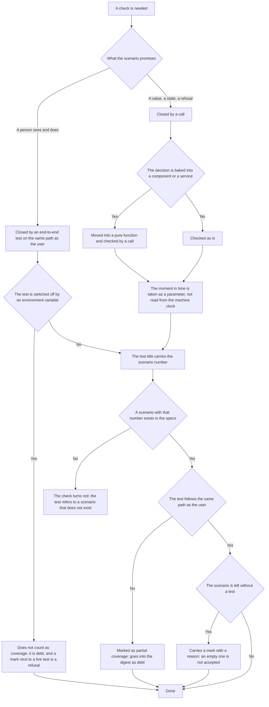

<!-- rt-kit v0.27.0 · rules/testing.md · 40e57d6b8ed2 · правится надстройкой, не здесь -->

# Verifiability — how it works here

Rule under the law `docs/constitution/verifiability.md`. The law says what counts as
confirmation; here — what it is called in this tree, where it lives and what of the law does not
apply here. Checking the running application by eye and by measurement is the rule
`browser-verification` under the same law.

**Cold part:** `pitfalls.md` next to it — traps already stepped on. Loaded on demand, not
together with the rule.

## What it is called here

| In the law            | Here                                                                                    |
| --------------------- | --------------------------------------------------------------------------------------- |
| scenario              | `SC-<PREFIX>-<NUMBER>` in `docs/specs/<domain>/scenarios.md`                            |
| test                  | `it(...)` in `*.spec.ts` next to the source — Vitest; an end-to-end test — Playwright   |
| coverage digest       | the output of `npm run check:specs`: covered, partial, without tests                    |
| uncovered mark        | the line `Не покрыто: <причина>` inside the scenario block                              |
| partial-coverage mark | the line `Покрытие: частичное — <чего не хватает>`                                      |

## Where it lives

In this tree — the table in `implementation.md` next to it. Paths live there, not here: the rule
travels between repositories, the layout does not, and a path named in the rule lies in the
first tree that keeps its code differently.

## Flow

The flow of creating a check: what is checked by a call, what by the end-to-end path, and how a
scenario is tied to its test.

## How the law applies here

- **The scenario id stands at the start of the test title, followed by a dash.** One scenario is
  checked by several tests, one test closes several scenarios.
- **A scenario without a test carries a mark with a reason.** An empty mark is not accepted, and
  a mark next to an existing test is a refusal: it means the debt was closed and the mark not
  removed.
- **A test that does not follow the user's path is marked as partial coverage.** It goes into the
  digest as debt, not as coverage.
- **A scenario whose "Then" names a person and what they see is closed by an end-to-end test.**
  A unit test on the same computation stays debt: between a right decision and a person seeing
  it lies everything the unit test did not touch.
- **An end-to-end test switched off by an environment variable does not count as coverage.** A
  switch by stand state is a skip of a case; a switch by variable is an unrun test. Stand state
  means what the stand never has by design, not what a neighbouring test left on the screen:
  skipping on someone else's trace the law does not count as coverage, and it differs from a
  legitimate skip only by its reason.
- **A test mentioning a scenario that is not in the specs takes the check down.** That is how a
  renamed or discarded scenario is caught: the tests stay green meanwhile.
- **A decision is moved into a pure function and checked by a call.** The component and the
  service stay a thin wrapper and are not checked separately while they have no branching of
  their own.
- **A decision that depends on the current moment takes the moment as a parameter.** It does not
  read the machine clock: the rule is checked by a call, not by winding time around the test. The
  default `= new Date()` goes at the boundary — where a procedure or a service calls the decision.
- **A hard-coded date in a fixture is the expiry date of the test itself.** The fixture's moment
  and the moment the code under test is called with are taken either both hard-coded or both from
  the clock: mixing the two kinds gives a test green on the day it is written and red a day or a
  week later — on someone else's edit, for whoever did not touch it. Neither the linter, nor the
  build, nor the spec audit knows time.
- **A Connect procedure is checked by calling its method with a hand-written database double.**
  No container or router needs raising: the test checks the decision, not the layout of fields.
- **A procedure is also called by the end-to-end suite, not only by the test next to it.** The
  end-to-end suite has its own direct-call helper, and the test takes the server's answer from
  there instead of raising a screen for one field. So "there are no tests for the procedure" is
  stated after a search for its name across the whole tree, end-to-end suite directories
  included, not after no test file was found next to its file: six coverage marks in a row
  declared closed work uncovered.
- **The seed creates what a screen cannot open without, and nothing a guest would take for
  real.** Content with an author — reviews, questions, discussions — a guest reads as written by
  people, and the stand is assembled from the same database as the check by eye. The owner's
  settings — contacts, sender address, keys of external services — the seed does not create
  either: they are entered in the application. What is needed rarely is switched on by a sign in
  the environment, not seeded for all.
- **A created check goes into the push gate or the pipeline, not only into the umbrella target.**
  The umbrella target is run by hand, and a check that lives only there answers whoever
  remembered it: such a check's silence reads as its green answer. Three checks stood outside the
  gate, declaring in their own known lists that they fail on new code.
- **A check that arrives by layout arrives with its place too.** The place is the name of the
  command that calls it and the line of the suite it stands in. A check without a place is
  recognised only by the layout having put a new file, and the article above does not act on it:
  it has nowhere to stand. That is how the length check arrived — by the same edition as the
  article on its mandatory place.
- **A test that irreversibly changes stand data is switched off by default.** `BASE_URL`
  redirects the run with one variable, and without the switch such a test would edit the data of
  someone else's stand.
- **Tests that need nginx in front of the application wake together with `BASE_URL`.** A bare
  page server does not pass them: the redirects live in the proxy config.
- **A linter rule that forbids a technique accepted here is switched off in the config, not
  bypassed in every test.** The test switch is this tree's technique, and
  `playwright/no-skipped-test` would forbid it in sixty-five places at once. The reason is
  written next to the disabling line, and a targeted `eslint-disable` stays for what is forbidden
  for good reason.
- **A guard lets the action through when it is itself broken.** No input parser, empty input,
  wrong directory, any error of its own — the guard exits zero and lets through: a broken check
  has no right to jam the work. This is declared by the `FAIL-OPEN` line in the guard's own
  header, next to the list of cases, and a new case is added there when it is found.
- **A guard that did not recognise the call is as silent as a working one.** A zero exit comes in
  two kinds: the guard broke and let through on purpose — declared in its header — or it did not
  recognise its business in the command and never reached the check. From outside they are
  indistinguishable, and the second is declared nowhere and leaves no trace. Two consequences
  follow. The call sign must err towards firing too often: one that fired needlessly is seen at
  once and fixed, one that failed to recognise is never seen. And the tree's accepted way of
  calling the command — by full path, through a wrapper, with variable substitution — goes into
  the sign alongside the bare name: the bypass the command is called by every day is exactly
  where the guard goes blind.
- **A check's known list is named and explains itself.** The first field of the list is the
  check's name and a word that what is listed does not count as a refusal. Then either two keys —
  the accepted stays forever, the debt was gathered when the check was created and only shrinks —
  or as many keys as the entries have kinds. The reason is mandatory: a lifted check without a
  reason is indistinguishable from an oversight a month later.
- **An accepted entry differs from debt by whether work is opened for it.** Accepted is what the
  tree does not intend to split; debt is what a task is opened for, and it only shrinks. One list
  for both would mean there is nothing to review: an entry without a task reads as eternal a
  month later, and an entry with a task as an oversight.
- **Every entry carries its own reason and the number of the task that added it.** A prose reason
  for the whole list explains any of its lines and therefore explains none, and an entry without
  a number cannot be asked of anyone: whoever added it remembers by that day neither the occasion
  nor their decision. An entry without a reason or a number makes the check refuse — and it is
  added by the owner's word, not by the decision of the executor it is in the way of at that
  minute.
- **A list entry nothing calls any more is removed together with what called it.** Such a line
  silently allows what the tree does not have, and the next reader takes it for a current
  explanation. Not every list has a dead-entry check, so it is removed by the same change that
  removes the place that caused it.
- **Red has an assigned action, and a second rerun is not part of it.** Red comes in two kinds,
  and in the list of runs they look the same: a hosting refusal on the preparation step is cured
  by a rerun, a defect of the branch is not cured by it at all. The assigned action is one: first
  the output of that step, then the decision. A rerun repeated before reading the output fixes
  not the cause but its symptom, and in history looks like work.
- **A line is not added to the known list for a red check.** The list was gathered by the day the
  check was created and has only shrunk since: an added line silences the signal, not the cause,
  and in history looks the same as a fix. A place where the check is right by the letter and
  wrong in substance is reviewed by the owner, and until their answer the check is right.
- **An exchange counts as read on both sides, not by the success of calls.** Sending and editing
  state answer with success even when there is nothing to read the result with: over two hundred
  records stood as new because there was nobody to collect them, and only those whose file still
  lay on the sender's disk got marked. When creating one side of an exchange, the other is named:
  what reads, who reads and what happens if it is absent. The answer "nothing" is written as a
  word — silence about it reads as a working exchange.
- **A value shared by two sides of an exchange is taken from the declaring side, not computed
  anew.** A record sign, the cargo shape, the way a key is computed — one's own copy of any of
  them drifts from the original silently, and both sides stay green: one writes under its value,
  the other looks under its own. This is checked by a scenario that computes the value both ways
  and compares them, not by one scenario on each side.
- **A test asserting absence is green even when it looks for the wrong thing.** There is no match
  for the right text, nor for a typo in the sample, nor for a renamed key — nothing tells them
  apart by the run's colour. So a negative assertion goes paired with a positive one: first it is
  checked that the place sought is found at all, and only then that it lacks what must not be
  there.
- **A test title promises more than the body checks, and the audit does not see it.** The
  scenario number stands in the title — the scenario counts as covered, and nobody asks what
  exactly is asserted. The body is read together with the title: the promise in the title and the
  assertion in the body are two different texts, and they drift apart silently.
- **A command's successful answer is re-read by a separate request.** The exit code says the call
  went through and is silent about whether the needed state arrived: creating a task, marking a
  record and assigning a reviewer answer zero even when they did the wrong thing. What goes into
  the reply is what was read, not what was ordered.
- **A service counts as up by a request it carried through, not by an open port.** The answer on
  the port says someone is listening there and is indistinguishable from a past build left from a
  previous session: both sides of the link are checked — that the client picks that very service
  and that the request went through it.
- **The snapshot suite's references lie next to the test, are updated by a separate call and read
  by eye.** Updating "just in case" together with the run erases the difference between a fixed
  look and a broken one: an updated reference makes any frame green. Where the references are and
  what updates them is named by the rule's companion.
- **The browser raster is named explicitly, otherwise a frame does not match itself.** The colour
  profile taken from the machine's display, the accelerator computing the raster and tiled
  repainting — each of the three moves colour by a unit or two per channel, and it shows only
  where blending sits on a rounding boundary: on the anti-aliased corners of the dark theme.
  Waiting for the frame to settle does not help here — the page is drawn, and each time drawn
  slightly differently; all three are named as arguments to the browser at launch and become part
  of the reference.
- **A mask covers the content but not the width.** A node under a mask still takes its place in
  the layout, and a drifting value inside it moves its neighbours past the mask. Where a node's
  size is computed from its content — a table cell, a label stretching a button — the drift is
  cured in the stand data by a constant value, and then no mask is needed at all.
- **Not only time is made constant but everything the application derived from it.** The
  application counts from its clock and computes the derivative — month key, deadline, freshness
  sign — at the minute of writing. An edit of times that comes after the write does not move the
  derivative: it was computed earlier and lies in the next column. The divergence does not arrive
  for months, and then the suite turns red on a day when not a line was added to the tree. The
  miss has its own sign, visible by comparing two columns: the derivative stopped matching what
  it had to be derived from.
- **The seeding checks itself instead of relying on the frame.** The frame says "it became
  different" and is silent about why; a seeding refusal names the reason in words and arrives
  before a single frame is taken. The sign is taken so that it holds on any run day: stand data is
  the past, so a time value that lands on the run day or later was computed by the machine clock
  and not pinned by the seeding. A deliberate future is separated by a boundary and named apart.
  Judged are the time columns of all the tables the screens read, not only those shown today: a
  column is put on screen by one line of markup, and nobody remembers the seeding then.

## What of the law is not here

The tree holds both libraries and applications, and the rule applies to them differently. The
libraries have no end-to-end runs at all: the visible state is shown by the showcase, and it is
confirmed by a story frame. There is one end-to-end suite in the tree — the suite of the
receiver's admin panel — and everything the law says about a stand, data and the request path
applies to it alone.

- **The runner of the package specs is Jest with `jest-preset-angular`, not Vitest.** One project
  per package; everything the rule says about the Vitest config has nothing to apply to here. The
  end-to-end suite runs Playwright.
- **Numbered scenarios exist for the receiver and do not for the kits.** The titles of the admin
  panel's end-to-end specs carry a scenario number, and the scenarios themselves live in
  `docs/specs/message-bus/`. The kits have none: the link between behaviour and test is held by a
  word — the behaviour is named in the component's `CONTEXT.md` and named once more in the test
  title.
- **The end-to-end suite raises the stand itself, and it cannot be pointed elsewhere by an
  environment variable.** Production builds of both applications, their own database, schema and
  seeding come up by one command and go down with the run; the specs therefore have no switches
  by the state of the stand.
- **The ready-made code of a kit component's spec and of an application screen frame lies in the
  rule `ui-component-tests`.** There too are the substitutions nobody would think of, and the
  choice between a spec, a story snapshot, a screen frame and a measurement.

The completeness of a test is checked by nothing, and the tree agreed on no way of substituting
modules: a double is written by hand.

## Patterns

- `testing-unit` — a test on a pure function, on a Connect procedure and a one-off proof test
  that is not committed.
- `testing-e2e` — running end-to-end tests, a stand under real nginx, switches.
