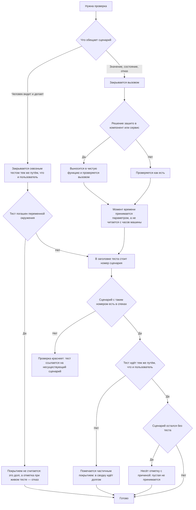

<!-- rt-kit v0.17.0 · rules/testing.md · 629404685804 · правится надстройкой, не здесь -->

# Проверяемость — как это устроено здесь

Правило под закон `docs/constitution/verifiability.md`. Закон говорит, что считается
подтверждением; здесь — чем это названо в этом дереве, где лежит и что из закона у нас не
применяется. Проверка работающего приложения глазами и замером — правило
`browser-verification` под тем же законом.

**Холодная часть:** `pitfalls.md` рядом — ловушки, грабли, на которые уже наступали.
Грузится по требованию, а не вместе с правилом.

## Как это называется здесь

| В законе                   | Здесь                                                                            |
| -------------------------- | -------------------------------------------------------------------------------- |
| сценарий                   | `SC-<ПРЕФИКС>-<НОМЕР>` в `docs/specs/<домен>/scenarios.md`                       |
| тест                       | `it(...)` в `*.spec.ts` рядом с исходником — Vitest; сквозная спека — Playwright |
| сводка покрытия            | вывод `npm run check:specs`: покрыто, частично, без тестов                       |
| отметка непокрытого        | строка `Не покрыто: <причина>` внутри блока сценария                             |
| отметка неполного покрытия | строка `Покрытие: частичное — <чего не хватает>`                                 |

## Где это лежит

В этом дереве — таблица в `implementation.md` рядом. Пути живут там, а не здесь: правило
переносится между репозиториями, раскладка — нет, и путь, названный в правиле, врёт в первом
же дереве, которое держит код иначе.

## Ход

Ход заведения проверки: что проверяется вызовом, что — сквозным путём и как сценарий связан со
своим тестом.

## Как закон применяется здесь

- **Идентификатор сценария стоит в начале заголовка теста, через тире.** Один сценарий проверяется
  несколькими тестами, один тест закрывает несколько сценариев.
- **Сценарий без теста несёт отметку с причиной.** Пустая отметка не принимается, а отметка при
  существующем тесте — отказ: она означает, что долг закрыли, а отметку не сняли.
- **Тест, идущий не тем путём, что пользователь, помечается частичным покрытием.** В сводку он
  попадает долгом, а не покрытием.
- **Сценарий, чьё «Тогда» называет человека и то, что он видит, закрывается сквозным тестом.**
  Юнит на тот же расчёт остаётся долгом: между верным решением и тем, что человек его видит, лежит
  всё, чего юнит не касался.
- **Сквозной тест, погашенный переменной окружения, покрытием не считается.** Выключатель по
  состоянию стенда — пропуск случая, выключатель по переменной — невыполненный тест. Состоянием
  стенда при этом считается то, чего на нём не бывает по устройству, а не то, что оставил на
  экране соседний тест: снятие по чужому следу закон покрытием не считает, и от законного
  пропуска оно отличается только причиной.
- **Упоминание в тесте сценария, которого в спеках нет, роняет проверку.** Так ловится
  переименованный или выкинутый сценарий: тесты при этом остаются зелёными.
- **Решение выносится в чистую функцию и проверяется вызовом.** Компонент и сервис остаются тонкой
  обёрткой и отдельно не проверяются, пока своего ветвления у них нет.
- **Решение, зависящее от текущего момента, принимает момент параметром.** Часы машины оно не
  читает: правило проверяется вызовом, а не подкруткой времени вокруг теста. Умолчание `= new
  Date()` ставится на границе — там, где решение зовёт процедура или служба.
- **Жёсткая дата в образце — это срок годности самой спеки.** Момент образца и момент, которым
  зовут проверяемый код, берутся либо оба жёсткими, либо оба от часов: смешение двух видов даёт
  спеку, зелёную в день, когда её пишут, и красную через сутки или неделю — на чужой правке, у
  того, кто её не трогал. Ни линтер, ни сборка, ни сверка спеков времени не знают.
- **Процедура Connect проверяется вызовом своего метода с рукописным двойником базы.** Контейнер и
  роутер поднимать не надо: спека проверяет решение, а не раскладку полей.
- **Сид заводит то, без чего экран не открыть, и ничего, что гость примет за настоящее.**
  Содержимое, у которого есть автор, — отзывы, вопросы, обсуждения — гость читает как написанное
  людьми, а стенд собирается из той же базы, что и проверка глазами. Настройки владельца —
  контакты, адрес отправителя, ключи внешних служб — сид не заводит тоже: их вписывают в
  приложении. То, что нужно редко, включается признаком в окружении, а не сеется всем.
- **Заведённая проверка встаёт в гейт пуша или в конвейер, а не только в сводную цель.** Сводная
  цель запускается руками, и проверка, которая живёт только в ней, отвечает тому, кто её вспомнил:
  молчание такой проверки читается как её зелёный ответ. Три проверки простояли вне гейта,
  объявляя в собственных списках известного, что падают на новом.
- **Проверка, приехавшая раскладкой, приезжает и со своим местом.** Место — это имя команды,
  которой её зовут, и строка набора, в котором она стоит. Проверка без места узнаётся только по
  тому, что раскладка положила новый файл, и статья выше на неё не действует: вставать ей некуда.
  Так приехала проверка длины — той же редакцией, что и статья о её обязательном месте.
- **Спека, необратимо меняющая данные стенда, выключена по умолчанию.** `BASE_URL` уводит прогон
  одной переменной, и без выключателя такая спека правила бы данные чужого стенда.
- **Спеки, которым нужен nginx перед приложением, просыпаются вместе с `BASE_URL`.** Голый сервер
  отдачи страниц их не проходит: перенаправления живут в конфиге прокси.
- **Правило линтера, которое запрещает принятый здесь приём, выключают в конфиге, а не обходят в
  каждом тесте.** Выключатель теста — приём этого дерева, а `playwright/no-skipped-test` запретил
  бы его сразу в шестидесяти пяти местах. Рядом со строкой отключения пишут причину, а точечный
  `eslint-disable` остаётся для того, что запрещено по делу.
- **Гард отпускает действие, когда сам сломался.** Нет разборщика входа, пустой ввод, не тот
  каталог, любая своя ошибка — гард выходит нулём и пропускает: сломанная проверка не имеет права
  заклинить работу. Объявляется это строкой `FAIL-OPEN` в шапке самого гарда, рядом с
  перечислением случаев, и туда же дописывается новый случай, когда он находится.
- **Список известного у проверки именной и объясняет себя сам.** Первым полем перечня стоит имя
  проверки и слово о том, что перечисленное отказом не считается. Дальше либо два ключа — принятое
  остаётся навсегда, долг накоплен к заведению проверки и только сокращается, — либо столько
  ключей, сколько у записей родов. Причина обязательна: снятая проверка без причины через месяц
  неотличима от недосмотра.
- **Запись принятого отличается от долга тем, заведена ли на неё работа.** Принятое — то, что
  дерево делить не собирается; долг — то, на что заведена задача, и он только сокращается. Один
  список на оба означал бы, что разбирать нечего: запись без задачи через месяц читается как
  вечная, а запись с задачей — как недосмотр.
- **У каждой записи стоят своя причина и номер задачи, которой она внесена.** Причина прозой на
  весь список объясняет любую его строку и потому не объясняет ни одной, а запись без номера не
  спросишь ни у кого: тот, кто её внёс, к этому дню не помнит ни повода, ни своего решения. Запись
  без причины или без номера отбивает проверку — и заводится она словом владельца, а не решением
  исполнителя, которому она в эту минуту мешает.
- **Запись списка, которую больше ничто не вызывает, снимается вместе с тем, что её вызывало.**
  Такая строка молча разрешает то, чего в дереве нет, и следующий читатель принимает её за
  действующее объяснение. Проверка на мёртвую запись бывает не у всякого списка, поэтому
  снимается она тем же изменением, которым уходит вызвавшее её место.
- **У красного есть назначенное действие, и второй перезапуск в него не входит.** Красное бывает
  двух родов, и в списке прогонов они выглядят одинаково: отказ хостинга на шаге подготовки
  лечится перезапуском, дефект ветки — не лечится им вовсе. Назначенное действие одно: сперва
  журнал этого задания, потом решение. Перезапуск, повторённый до чтения журнала, чинит не
  причину, а её проявление, и в истории выглядит работой.
- **Строка в список известного не заводится под красную проверку.** Список набран к дню заведения
  проверки и с тех пор только сокращается: дописанная строка гасит сигнал, а не причину, и в
  истории выглядит так же, как починка. Место, где проверка права по букве и не права по существу,
  разбирает владелец, а до его ответа верна проверка.
- **Обмен принимается прочитанным с обеих сторон, а не по успеху вызовов.** Отправка и правка
  состояния отвечают успехом и тогда, когда прочитать результат нечем: две с лишним сотни записей
  простояли новыми, потому что забрать их было некому, а отметились только те, чей файл ещё лежал
  на диске у отправителя. Заводя сторону обмена, называют вторую: чем читают, кто читает и что
  будет, если её нет. Ответ «нечем» пишется словом — молчание о ней читается как рабочий обмен.
- **Значение, общее двум сторонам обмена, берётся у объявившей стороны, а не считается заново.**
  Признак записи, форма груза, способ счёта ключа — своя копия любого из них расходится с
  оригиналом молча, и обе стороны при этом зелены: одна пишет под своим значением, другая ищет
  под своим. Проверяется это сценарием, который считает значение обоими путями и сверяет их между
  собой, а не по одному на каждой стороне.
- **Тест, утверждающий отсутствие, зелен и тогда, когда ищет не то.** Совпадения нет ни у верного
  текста, ни у опечатки в образце, ни у переименованного ключа — отличить их по цвету прогона
  нечем. Отрицательное утверждение поэтому идёт в паре с положительным: сначала проверяется, что
  искомое место вообще найдено, и только потом — что в нём нет того, чего быть не должно.
- **Заголовок теста обещает больше, чем тело проверяет, и сверка этого не видит.** Номер сценария
  в заголовке стоит — сценарий числится покрытым, а что именно утверждается, не спрашивает никто.
  Тело читается вместе с заголовком: обещание в заголовке и утверждение в теле — два разных
  текста, и расходятся они молча.
- **Успешный ответ команды перечитывается отдельным запросом.** Код возврата говорит, что вызов
  прошёл, и молчит о том, наступило ли нужное состояние: заведение задачи, отметка записи и
  постановка ревьювера отвечают нулём и тогда, когда сделали не то. В отчёт идёт прочитанное, а
  не заказанное.
- **Служба считается поднятой по выполненному заданию, а не по открытому порту.** Ответ на порту
  говорит, что кто-то там слушает, и неотличим от прошлой сборки, оставшейся с прежнего захода:
  проверяются обе стороны связи — что заказчик выбирает именно её и что задание через неё прошло.
- **Эталоны снимочного набора лежат рядом со спекой, а обновляются отдельным вызовом и читаются
  глазами.** Обновление «на всякий случай» вместе с прогоном стирает разницу между починенным
  видом и сломанным: обновлённый эталон делает зелёным любой кадр. Где эталоны и чем они
  обновляются, называет компаньон правила.
- **Растр браузера называется явно, иначе кадр не сходится сам с собой.** Профиль цвета, взятый у
  дисплея машины, ускоритель, считающий растр, и дорисовка кусками — каждый из трёх двигает цвет
  на единицу-другую по каналу, и видно это только там, где смешение стоит на границе округления:
  на сглаженных уголках тёмной темы. Ожидание вставшего кадра тут не помогает — страница
  нарисована, а нарисована она каждый раз чуть иначе; Все три называются доводами браузеру при
  запуске и становятся частью эталона.
- **Маска закрывает содержимое, но не ширину.** Узел под маской занимает своё место в раскладке
  по-прежнему, и плывущее значение внутри него двигает соседей мимо маски. Там, где размер узла
  считается по содержимому — ячейка таблицы, надпись, растягивающая кнопку, — плывущее лечится в
  данных стенда постоянным значением, и тогда маска не нужна вовсе.

## Чего из закона здесь нет

Дерево держит и библиотеки, и приложения, и правило прикладывается к ним по-разному. У
библиотек сквозных прогонов нет вовсе: видимое состояние показывает витрина, и подтверждается
оно кадром истории. Сквозной набор в дереве один — набор админки приёмника, — и всё, что закон
говорит про стенд, данные и путь запроса, приложено к нему одному.

- **Прогонщик спек пакетов — Jest с `jest-preset-angular`, а не Vitest.** Один проект на пакет;
  всё, что правило говорит про настройку Vitest, здесь не к чему приложить. Сквозной набор
  гоняет Playwright.
- **Нумерованные сценарии есть у приёмника и нет у китов.** Заголовки сквозных спек админки
  несут номер сценария, и сами сценарии живут в `docs/specs/message-bus/`. У китов их нет:
  связь поведения с тестом держится словом — поведение названо в `CONTEXT.md` компонента и
  названо ещё раз в заголовке теста.
- **Стенд сквозной набор поднимает себе сам, и увести его переменной окружения нельзя.**
  Прод-сборки обоих приложений, своя база, схема и засев встают одной командой и гаснут вместе
  с прогоном; выключателей по состоянию стенда у спек поэтому нет.
- **Готовый код спеки компонента кита и кадра экрана приложения лежит в правиле
  `ui-component-tests`.** Там же — подмены, до которых не додуматься, и выбор между спекой,
  снимком истории, кадром экрана и замером.

Полноту теста не проверяет ничто, и подмену модулей дерево не договаривалось делать никак:
двойник пишется руками.

## Паттерны

- `testing-unit` — тест на чистую функцию, на процедуру Connect и разовый тест-доказательство,
  который не коммитится.
- `testing-e2e` — прогон сквозных тестов, стенд под настоящим nginx, выключатели.
