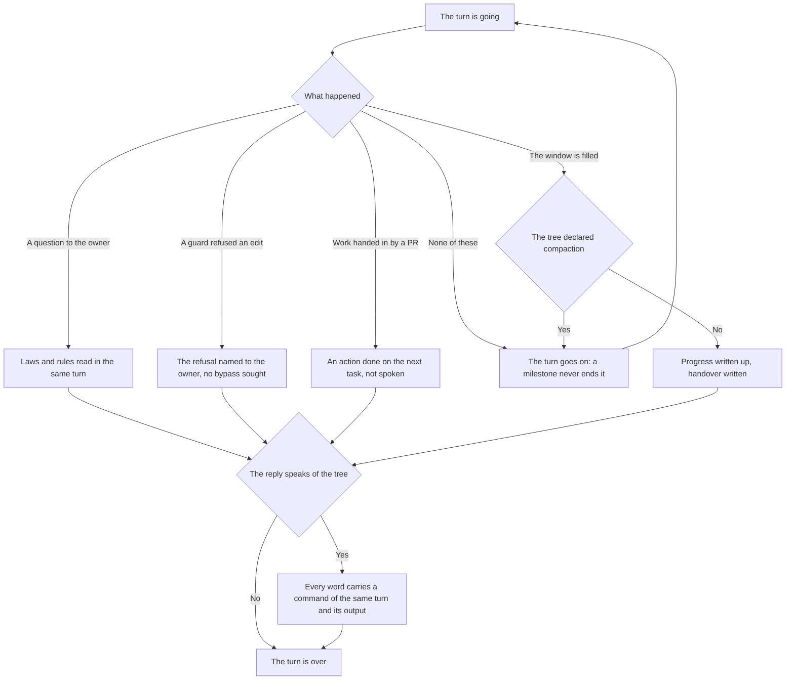

<!-- rt-kit v0.26.0 · rules/turn-conduct.md · 66e9427fc420 · правится надстройкой, не здесь -->

# Turn conduct — how it works here

Rule under the law `docs/constitution/work-conduct.md` — the part about one turn. The law says what
must be true; here — what keeps it in this tree. The course of work from request to merge, the
states and the task folder — rule `task-flow` under the same law.

**Cold part:** `pitfalls.md` next to it — cases and numbers from incident analyses. Loaded on
demand, not with the rule.

## What it is called here

| In the law | Here |
| --- | --- |
| turn | one pass of the agent: from the owner's message to the reply |
| a turn exit | one of the four ways to end a turn; what confirms each — the turn map |
| the guard of turn exits | a guard at the turn's end: reads the declared work state and what the turn did in the tree |
| a statement about the state of the tree | a word in the reply to the owner backed by a command of the same turn and its output |
| the session handover | a record outside the tree retelling the progress for a new session |
| the compaction threshold and the stop threshold | two window-fill numbers the tree sets itself; the first stands below the second |

## Turn exits

A turn ends in four ways and no others: a question to the owner the rules do not answer; a guard's
refusal; a filled window where there is no compaction; work handed in, with the next begun. What
confirms each, the turn map lists where the tree laid it out.

Everything else is the turn going on, not its end. A milestone does not end a turn: not a commit,
not a read agreement, not the boundary "read — now editing", not a green check.
A transition from state to state — least of all: the mandatory action is done, and the next is
done in the same turn; a state boundary looks like a finished piece better than any milestone, and
the report lands exactly
where the next action should have stood.

Four ways to end a turn look like work and are not: a summary of someone else's step, a menu under
an assigned order, a declaration of intent, and a command named but not run.

A turn ending while an epic runs shows the owner their position by the table the handover carries:
the order is written down, and the one it is followed for cannot otherwise see the queue's state.

## Where it lives

In this tree — the table in `implementation.md` next to it. Paths live there, not here: the rule
travels between repositories, the layout does not.

## Flow

One turn: what it ends with, what is checked before its end and what the owner is told then.

## How the law applies here

- **A summary of someone else's step.** A run, the owner's review and a merge go on without the
  executor and are not sped up by watching. Such a summary the owner reads as work: full, with
  numbers and states, the emptiness behind it unseen. Someone else's step is named with one's own
  begun step, not instead of it.
- **Someone else's step is of two kinds, and the second never ends by itself.** A run and a review
  end without the executor; a refused permission never ends — it is waited for. Work that hit a
  permission is finished without the part it opens; what was not passed is named in the PR body,
  where the reviewer reads it: a message lives until the next one, the PR body until the merge.
- **One's own unclosed step is not handed to the owner.** A neat list of leftovers reads as an
  account of work, and the owner sorts out what the executor could have finished. A question's form
  does not fix this: a question is lawful only where neither the rules nor the tree answer it. The
  list is written after everything the executor could close is struck out.
- **A menu under an assigned order.** A choice offered to the owner before the epic is over asks to
  assign the order anew. No work left in the epic — say so: the epic is over — not "what next".
- **A declaration of intent.** "Taking the next task" is not taking it: the phrase lives to the end
  of the turn, and the work does not move. Only the done is named: the created task's number, the
  branch's name, the moved column.
- **Work named as a command is run in the turn that names it.** The line "running it now" does not
  end a turn: either the run happened, or the turn is not over. A named command looks like begun
  work better than any promise — exact, visible, and done cannot be told from composed. The reply is
  written after the call, not instead of it: a message mid-turn is answered along with the begun
  action.
- **A word about one's own work is judged by what the same turn did.** "Not stopping — going on" is
  confirmed by the turn's end with work, not intent: otherwise the owner reads "promised — did not"
  as a lie. It is the requirement on a word about the tree, turned on oneself.
- **An option offered to the owner is named with its cost to a person.** How many steps, where the
  person ends up and what they need — without that the options look equal, and the choice goes by
  arguments from the code. What makes an option unfit is written into it.
- **A tree state the owner named is cleared by a call before an explanation.** "Conflicts", "the run
  is red", "the branch fell behind" point at what to clear, not a topic to discuss. The cause is
  named after the fix, and only if asked: an explanation looks like work and touches no branch. A
  "why" in the same message comes second.
- **A retelling of the current order without an appraisal reads as approval.** To a direct "how does
  this work" an answer in facts is true and not enough: a setup named calmly sounds accepted.
  Whether the order is fit for whoever uses it is named along with it.
- **A file path is never an assignment.** A line with an address names a file, not an action: read
  as an instruction, it gives the session a task the owner did not give. The same for any message
  without a verb — asking costs less than writing fifty files past the request.
- **An interruption of work by the owner is named aloud.** A task arrives that stops what was begun
  — the executor says they stop, where, and what happens to the old work, then takes up the new.
  Silence here the owner reads as "the old is finished".
- **A stop is named in a message of its own.** Not in a line at the end of a report: there it drowns
  — the owner reads a report as an account of the done. Three things are named: what stands, what it
  waits for and what the owner can decide.
- **Turn exits are watched by a guard, not by the executor's memory.** It reads the declared work
  state and what the turn did on it: a file edit or a tree-changing command. A turn with neither
  returns to the executor with the next step from the progress. Handed-in and merged work the guard
  does not judge: it has already waited out someone else's step.
- **A removed task folder lifts the state requirement and does not end the turn.** The progress
  leaves with the folder, taken apart before the PR opens: from then to the merge there is no state
  line. A turn is not released by this sign — a removed folder means the middle of handing in, not
  its end. From there the turn is judged by the second sign; a turn that opened the PR passes it by
  itself.
- **Work without a branch and without a task folder is judged by the same guard by the second
  sign.** It has no state, and the first sign has nowhere to come from — but a turn with no edit of
  the tree does not end here either.
- **A taken task is not yet begun work, and the turn does not end on it.** Creating the branch,
  moving the column and naming the number are preparation: the mandatory action of `задача-взята` is
  not done by a single line, yet the turn holds much work, and the sign "was there work" releases
  it. The guard has a tier for this; a branch without a task number is not under it, an assembled
  folder template lifts it.
- **Exploration does not end a turn, however much of it there is.** Switching branch, pulling,
  browsing history and reading PRs are preparation, not work; a turn of these alone leaves the work
  where it stood. It looks like work better than anything else: commands, exact numbers, checkable
  answers. Parts of a compound command are judged one by one: a read joined to an edit remains work.
- **A reply to the owner is not an action and does not stand last in a turn.** The order inside a
  turn is one: work, the first step of the next, then text. The reverse — work, report, end — stands
  behind every analysed stop: a report is a form of completeness, and an appended summary reads as
  the turn's end the more convincingly the more was done. Saying what was done is always allowed;
  its place is after the next action, not instead.
- **The last action of a turn is only ever work.** One sign for every kind of stop: a file edit or a
  changing command — last among what the turn did. The guard's tiers — exploration, waiting, handing
  in without starting the next — only derive a readable refusal from it.
- **Waiting for someone else's step is never the last action of a turn.** While they are waited for,
  the work stays where it stood. The last action is judged: waiting mid-turn is lawful, background
  work remains work, and a turn ended by a loop until the run is ready, or by watching it, is not
  released.
- **The handover is written even where the branch has no name.** All of it lies in the tree and is
  reachable on a detached head; one file needs a name, and a short snapshot of the head gives it.
  The hook's silence costs more here than elsewhere: compaction comes without a handover, and the
  next session starts from a blank.
- **A plan stage is declared closed only after its check command has passed.** The "Checked by"
  (`Чем проверяется`) line carries the command in backticks and what in its output means "matches".
  The guard reads the previous stage number from the branch history and holds a turn where the
  number grew and the command did not run: a session later, marked from memory cannot be told from
  checked.
- **The end of an epic is a stop, and it is the one lawful waiting for a word.** Every task of the
  epic is merged or handed over, so there is no next task to take: a guard refuses taking one, and
  the two guards that judge the end of a turn let the stop through by the same reading. The turn
  shows the table of the epic's tasks, says what was done on each and what confirms it, and says
  outright that the session waits for orders.
  <!-- rt-when: ответ владельцу о состоянии работы -->

- **The word about a stop the guard reads from the owner, not from the executor.** Otherwise the
  stop is declared by whoever finds it convenient, and the ban holds until the first inconvenience.
- **The phrase "waiting for your word" is a stop declared by the executor, and the guard refuses it
  by name.** Without the owner's word about a stop in the turn and without a question put to them by
  the tool, waiting for their word is a report, not work; the instruction holds until they cancel
  it.
- **A statement about the tree's state is watched by the statement guard, not by the executor's
  memory.** Everything the reply says about the tree carries a command and its output; said without
  one, it is no statement — not "checked", not "cleared", not "done". The guard reads the turn's
  text to the owner and looks for a command of the same turn; each word has its own kind of command,
  since a general sign "there was a command" would confirm one thing by another. The previous turn
  does not count: the tree's state changes, and yesterday's output says nothing of today's.
- **The statement guard waits for the reply text rather than judging the record as it found it.**
  The text lands in the turn record no earlier than the host calls the hook. Not having waited, the
  guard returns the turn: an empty record means not "nothing to say" but "nothing to read".
- **The guard catches a statement word, not a wrong conclusion.** About a sample judged by one file,
  or a path a person will not take, there is nothing to judge by: no word and no command to compare
  with. This is the guard's known boundary; the articles below hold it, not the guard.
- **A turn about someone else's step is watched by the waiting guard, not by the executor's
  memory.** It refuses a turn's end where someone else's step was spoken of and nothing was done on
  the next task — no task created, no branch, no folder, no column moved. Someone else's step it
  knows by two signs: a PR opened or a red run read in the turn. The words "taking the next task"
  are not an action: they are said instead of one.
- **A turn that handed work in carries it to a lifted draft.** A draft's merge button is locked by
  the host, and in the PR list ready cannot be told from unfinished. The next task is taken on top
  of that, not instead. The waiting guard watches this: a turn that opened a PR does not end until a
  command of the same turn asked the state of the handed-in work.
- **The waiting guard's refusal is lifted by both actions at once.** The taken next task carries the
  open-PR sign away, and the demand to ask the handed-in work's state never sounds after it.
- **Work left in the working tree does not end the turn.** A branch ahead of the remote ref with no
  open PR is done work nobody sees; the guard reads this without the network.
- **"Waiting for the run" is a statement about someone else's step, not a work state.** A run may be
  green in an hour, or may never have started — and the second does not fix itself. The word demands
  a command of the same turn that shows the run; said bare, the owner reads it as "the work is still
  going" and waits in vain.
- **The end of a run is learned from the return of a background command, not from a look at the
  page.** A background wait brings the executor back to the PR by itself; a look at the page is
  repeated idly or not at all — the work does not move.
- **Waiting for one's own measurement is done with one wait, not a notification on every step.** A
  notification is for where every event is acted on; where the outcome matters — one wait.
- **A guard's refusal ends the turn.** No other road to the refused edit is sought: not a shell
  command, not a neighbouring tool, not an edit of the guard itself. The edit is done once the
  refusal's condition is met, or not at all — then the owner is told the refusal, not a result. A
  bypass costs more than a refusal: a guard refuses one file, a bypassed guard lifts the requirement
  from the whole tree and says nothing. Not memory alone holds this — the guards also judge the
  shell command that writes the file.
- **A command refused by a gate is repeated whole, not by its tail.** A gate refuses the call before
  it runs, so none of its links worked — those before the refused one included. A repeated tail does
  work where it was not expected:
- **A writing call is not appended to an exploration line.** A line assembled from questions reads
  as a question whole — by its author too; the edit goes in a call of its own, where it is visible.
  For a call with a reading twin, the kind is chosen by the action, not the command's name.
- **A turn in which a question was put to the owner does not end until laws and rules were read in
  that same turn.** Reading is any of three roads: loading a rule, reading a file of laws or rules,
  a search over them. The conversation guard refuses at the turn's end, not on the question tool:
  questions are asked in prose more often than by menu. What was found lands in the grill section
  "What the rules already say".
- **The owner's answer is sought in their own messages before the rules.** The law says a question
  with a written answer is not put to the owner, and the most reachable record lies not in the tree
  but in the conversation: the owner's first message and their answers to past rounds. The
  conversation guard does not see this: it counts loading a rule and searching it as reading, and a
  message leaves no trace. A question that answers itself in the owner's words devalues those asked
  next to it.
- **The size of work is never a reason to cut its boundaries.** The owner who named the result did
  not dispute the size: an offer to drop a part is a request to reassign the goal, served as a
  clarification. What is costly is done at cost, or called costly outright, with the price named.
- **The actions the executor does not do without the owner's word are listed in the rule's
  companion.** Each tree has its own list; the package knows only the demand that it be named.
  Unnamed, it is derived from general words, and "do what the plan needs" becomes permission to push
  and edit shared documents along with the commit. The appraisal "this is safe" does not replace the
  list: whoever finds it convenient this minute assigns it, and it drifts.
- **A refusal of an irreversible action has a safe part, and it is done.** The demand to ask the
  owner applies to the action, not the turn: work with a separable harmless part is split, not
  postponed whole. A list of options instead of work reads as work — the more neatly drawn up, the
  more fully: numbered, with figures, the emptiness of the turn behind it unseen. The owner is told
  what is done and what remained for their word.
- **The sign of irreversibility is taken from the list, not derived by argument.** The list was
  drawn up by someone who already weighed reversibility. The argument "it goes outside and cannot be
  rolled back" always comes, the list only when read, and an argument on top of the list cancels it
  silently: from outside it looks like caution, not a skipped step. Actions outside the list the
  executor does not gate.
- **A turn in which the executor admitted a miss does not end until the incident record exists.**
  The incident guard refuses at the turn's end: by the time of admission the miss has already
  happened. The records directory is named by the rule's companion, the file name is the date and
  the miss, the form — the layout template. The admission is caught by a set of samples: a miss
  admitted in words outside the set the guard lets through.
- **A session begun from a handover enters the work by the same rule as any other.** The handover
  lies outside the tree, no check reads it, and it was written yesterday: everything in it is
  checked against the tree. The entry order is four steps in the resume pattern; a guard watches it,
  not memory.
- **The state of unfinished work comes into the context at session start.** The plan and the
  progress are given whole, the grill by path. A branch of the form `<KEY>-*` without a folder warns
  with a ready command but does not break the session.
- **A filled window ends a turn only where there is no compaction.** Where it is declared, the
  window is the turn going on: the session compacts and works on, and the stop threshold fires only
  when compaction did not come. A turn closed below the threshold loses the rest of the window the
  tree paid for, and only the owner catches this.
- **The session's window fill is watched by a guard, not by the executor's memory.** At the first
  threshold it reminds to pick a stopping point, at the second it refuses everything but the
  handover, delivery commands and the task folder — the folder whole: at closing, both the decision
  along the way and the stage revision are edited. The window size and both thresholds the tree sets
  itself; a tree that set no size gets no guard.
- **The context compaction threshold the tree sets itself, and it stands BELOW the stop threshold.**
  Equal thresholds are a race, and the guard wins it: it stands on the call, and compaction comes
  between turns. The distance is declared as a number, not derived as a difference; whether the
  thresholds stand apart the layout audit tells.
- **A session closes with a handover, and it lies as a section of the progress.** It is committed
  and goes into the branch, so the handover survives a move to another machine, and no second record
  of the same is started. In it: the tree, the branch, what was done, the next step and what was
  special about the session; for work without a task folder it leaves as a file outside the tree.

- **An option that silences a check is not put in the menu at all.** A disabled linter rule, a line
  in the known list, a file taken out from under the check — all fix the reading, not what it
  pointed at, and this option is the cheapest in the menu. The menu is assembled after it is struck
  out.

## What of the law is not here

Nothing checks the completeness of what is said to the owner: the statement guard catches a
statement word and looks for a command of the same turn; a wrong conclusion from a right command it
cannot judge — there is nothing to compare with.

An admission of a miss is caught by samples, not by understanding: words outside the set the
incident guard lets through. That is its known boundary, not a promise.

## Patterns

- `task-flow-handoff` — closing a session on window fill: the stopping point and the handover.
