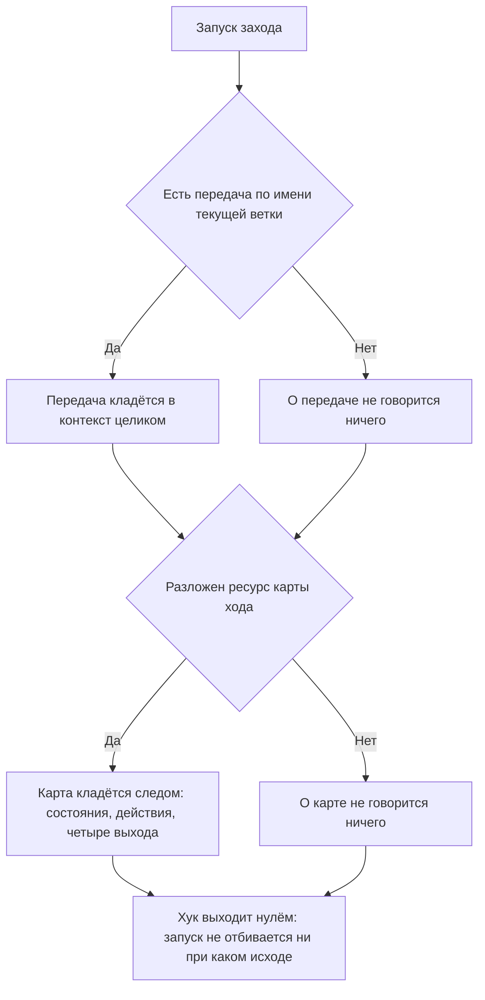

<!-- rt-kit v0.13.0 · rules/turn-entry.md · 404b30d8c8fa · правится надстройкой, не здесь -->

# Вход в заход — как это устроено здесь

Правило под закон `docs/constitution/work-conduct.md`. Закон говорит, что переданное прошлым
заходом приходит в новый заход само и что порядок ведения работы приходит вместе с работой;
здесь — чем это сделано в этом дереве. Сам ход работы — правило `task-flow` под тем же законом:
там про состояния и их обязательные действия, здесь — про то, как они попадают в заход.

## Как это называется здесь

| В законе                   | Здесь                                                                         |
| -------------------------- | ----------------------------------------------------------------------------- |
| вход в заход               | то, что хук старта кладёт в контекст до первой реплики                        |
| переданное прошлым заходом | файл по имени ветки в каталоге передач; пишет его хук перед сжатием контекста |
| порядок ведения работы     | карта хода — состояния с обязательными действиями и четыре выхода хода        |
| запуск                     | первый запуск, возобновление, сжатие контекста, очистка                       |

## Где это лежит

В этом дереве — таблица в `implementation.md` рядом. Пути живут там, а не здесь: правило
переносится между репозиториями, раскладка — нет.

## Ход

Ход подачи: что кладётся в контекст, в каком порядке и что делается с недостающим.

## Как закон применяется здесь

- **Передача прошлого захода приходит в контекст тем же запуском, что и состояние работы.**
  Написанная и не прочитанная, она равна ненаписанной: следующий заход о ней не знает и
  начинает с пустого места — с того самого, ради чего её и писали.
- **Передача берётся по имени текущей ветки.** Передач в каталоге столько, сколько было веток;
  чужая, поданная как своя, описывает работу, которой в этом дереве нет.
- **Передачи нет — вход об этом молчит.** Ветка, по которой заход ещё не закрывался, это
  обычное начало работы, а не поломка: отказ на ней превращал бы каждый первый заход в разбор
  хука.
- **Карта хода приходит тем же запуском и лежит своим файлом, а не вынимается из правила.**
  Разобранная на месте из таблицы правила, она ломается молча при первой правке разметки;
  зашитая в хук — расходится с правилом без единой правки.
- **Карта короче правила, и предел ей назначает проверка дерева.** Этим она и полезна:
  выросшая до правила, она съедает то самое окно, ради которого её кладут в контекст, — и
  заметить это нечем, потому что она продолжает приходить и продолжает быть верной.
- **Состояние, объявленное правилом и забытое в карте, — расхождение.** Заход получает карту,
  не находит в ней своего состояния и идёт читать правило: карта работает ровно до первого
  нового состояния.
- **Вход подаётся на всех четырёх запусках, а не только после сжатия.** Заход после обрыва и
  заход после очистки начинают с того же пустого места, и разница между ними исполнителю не
  видна вовсе.
- **Хук входа запуск не отбивает.** Отказ любой его части — нечитаемый файл, отсутствующий
  ресурс, чужие права — оставляет заход без части входа, но не без захода.

## Чего из закона здесь нет

Полноту самой передачи не проверяет ничто: хук подаёт то, что лежит, и о том, дописал ли
исполнитель к черновику своё, судить машине нечем. Держится это паттерном закрытия захода.

Не проверяется и то, прочитал ли заход поданное. Вход кладётся в контекст, а что с ним делают
дальше — свойство хода, а не файла.

## Паттерны

- `turn-entry-map` — что входит в карту, порядок подачи и живая проба хука.
- `task-flow-handoff` — закрытие захода: точка остановки и форма передачи; паттерн соседнего
  правила, но читается в паре с этим.

## Ловушки

- **Хук, подающий пустоту, неотличим от работающего.** Вход, у которого нет ни передачи, ни
  карты, печатает ноль байт и возвращает ноль — ровно так же выглядит хук, который не запустился
  вовсе. Проверяется это не глазами по контексту, а вызовом хука руками на дереве, где обе части
  лежат.
- **Передача пишется для машины, а не для владельца.** Обращение в ней — «спроси у него, чем
  кончилась проба» — уходит в пустоту: к минуте, когда передачу читают, владельца в разговоре
  ещё нет.
