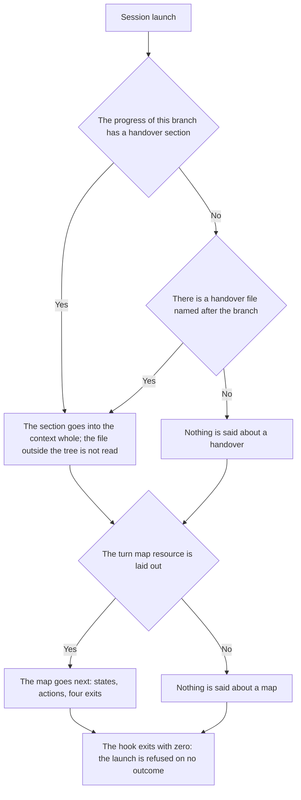

<!-- rt-kit v0.28.0 · rules/turn-entry.md · 3467db6c02c0 · правится надстройкой, не здесь -->

# Session entry — how it works here

Rule under the law `docs/constitution/work-conduct.md`. The law says that what the past session
handed over comes into the new session by itself, and that the order of conducting work comes
together with the work; here — how this is done in this tree. The course of work itself — rule
`task-flow` under the same law: there, the states and their mandatory actions; here, how they get
into the session.

## What it is called here

| In the law | Here |
| --- | --- |
| session entry | what the startup hook puts into the context before the first reply |
| what the past session handed over | the "Session handover" section in the progress of this branch; for work without a task folder — a file named after the branch in the handovers directory. The hook writes it before context compaction |
| the order of conducting work | the turn map — the states with their mandatory actions and the four turn exits |
| a launch | first launch, resume, context compaction, clear |

## Where it lives

In this tree — the table in `implementation.md` next to it. Paths live there, not here: the rule
travels between repositories, the layout does not.

## Flow

The flow of the feed: what is put into the context, in what order, and what is done about what is
missing.

## How the law applies here

- **The past session's handover comes into the context by the same launch as the work state.**
  Written and not read, it equals unwritten: the next session knows nothing of it and starts from a
  blank — the very blank it was written against.
- **The handover is taken by the name of the current branch.** There are as many handovers in the
  directory as there were branches; someone else's, served as one's own, describes work this tree
  does not have.
- **No handover — the entry is silent about it.** A branch on which no session has closed yet is an
  ordinary start of work, not a breakage: a refusal there would turn every first session into an
  investigation of the hook.
- **The turn map comes by the same launch and lies as a file of its own, not pulled out of the
  rule.** Parsed on the spot from the rule's table, it breaks silently at the first markup edit;
  hard-wired into the hook, it drifts from the rule without a single edit.
- **The map is shorter than the rule, and its limit is set by the tree's check.** That is what makes
  it useful: grown to the size of the rule, it eats the very window it is put into the context for —
  and there is nothing to notice this by, because it keeps arriving and keeps being right.
- **Text that travels into the context is written as a list, not a table.** The formatter pads table
  columns with spaces to a common width, and those spaces travel into every session meaning nothing:
  in the glossary they made a third of the file, and with the separator rows — forty percent.
  Turning the same entries into a list "- **term** — what it is" cut the entry by nine thousand
  characters without touching a word. A table stays lawful where there are more than two columns and
  they are compared by eye; the checks that read such text know both forms.
- **A state declared by the rule and forgotten in the map is a divergence.** The session gets the
  map, does not find its state in it and goes to read the rule: the map works exactly until the
  first new state.
- **The entry is served on all four launches, not only after compaction.** A session after a break
  and a session after a clear start from the same blank, and the executor cannot see the difference
  between them at all.
- **The entry hook does not refuse the launch.** A failure of any part of it — an unreadable file, a
  missing resource, someone else's permissions — leaves the session without part of the entry, but
  not without the session.

## What of the law is not here

Nothing checks the completeness of the handover itself: the hook serves what lies there, and whether
the executor added their own to the draft the machine has nothing to judge by. This is held by the
session-closing pattern.

Whether the session read what was served is not checked either. The entry is put into the context,
and what is done with it next is a trait of the turn, not of the file.

## Patterns

- `turn-entry-map` — what goes into the map, the order of serving and a live trial of the hook.
- `task-flow-handoff` — closing a session: the stopping point and the form of the handover; a
  pattern of the neighbouring rule, but read in pair with this one.

## Pitfalls

- **A hook that serves emptiness cannot be told from a working one.** An entry with neither a
  handover nor a map prints zero bytes and returns zero — exactly what a hook that never ran looks
  like. This is checked not by eye over the context but by calling the hook by hand on a tree where
  both parts lie.
- **The handover is written for the machine, not for the owner.** An address in it — "ask him how
  the trial ended" — goes into the void: by the minute the handover is read, the owner is not yet in
  the conversation.
- **A question recorded by a handover does not become a question to the owner.** It is addressed to
  its author — the same session that postponed it — and reaches the owner only after a check against
  the progress: some such questions are closed by its step, and asking them means asking about what
  is already assigned. An inherited question is dangerous precisely because it looks asked earlier
  and therefore settled: the menu "commit, keep or roll back" went to the owner twice, although
  marking a done stage and committing it in the branch is an ordinary work step.
