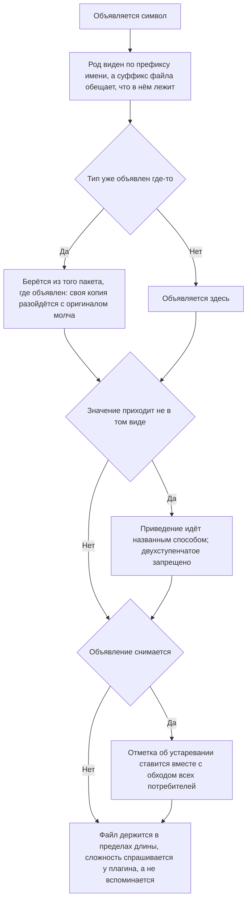

<!-- rt-kit v0.8.2 · rules/typescript-conventions.md · b52e02c822fc · правится надстройкой, не здесь -->

# Устройство кода — как это устроено здесь

Правило под закон `docs/constitution/code-structure.md`. Закон говорит, что должно быть верно
про объявления; здесь — как это записано в этом дереве.

## Как это называется здесь

| В законе                    | Здесь                                                     |
| --------------------------- | --------------------------------------------------------- |
| признак рода в имени        | префикс: `I` у интерфейса, `E` у перечисления, `T` у типа |
| источник, за которым следят | суффикс `$` у наблюдаемого и `Source` у субъекта          |
| приватное поле              | `#field`, а не `private field`                            |
| процедура бэкенда           | класс с меткой `@ConnectProcedure()`, один на процедуру   |

## Где это лежит

В этом дереве — таблица в `implementation.md` рядом. Пути живут там, а не здесь: правило
переносится между репозиториями, раскладка — нет, и путь, названный в правиле, врёт в первом
же дереве, которое держит код иначе.

## Ход

Ход объявления символа: чем задаётся имя, откуда берётся тип и что делается со снятым
объявлением.



## Как закон применяется здесь

- **Род объявления виден по префиксу имени, и это держат три правила линтера.** У интерфейса,
  у типа и у перечисления свои; все три подняты для всех `.ts`.
- **Источник, за которым следят, назван суффиксом.** Субъект и наблюдаемое, поднятое из него,
  различаются в месте использования, а не переходом к объявлению.
- **Суффикс имени файла находит в нём обещанное объявление.** Список суффиксов закрыт: слово,
  которого в нём нет, суффиксом не считается, и такой файл правило не судит.
- **Файл не длиннее 500 строк, и считаются все строки — пустые и комментарии тоже.** Файл,
  который не влезает на экран целиком, читают по частям, и правку в нём делают, не увидев
  остального. Для `.ts` это держит правило линтера; файлы обвязки — сценарии и скрипты — до
  него не доходят и судятся отдельной проверкой дерева. Накопленное к дню включения
  перечислено поимённо, и строка оттуда снимается вместе с делением своего файла.
- **Тип берётся из того пакета, где объявлен.** Своя копия чужого типа расходится с оригиналом
  молча, а компилируется из них только одна.
- **Двухступенчатое приведение `as unknown as` запрещено правилом линтера.** Вместо него —
  честный тип, сужение проверкой или чтение поля формой (`Reflect.get`); место, где иначе
  нельзя, помечается точечным отключением с причиной в той же строке.
- **Отметка об устаревании ставится вместе с обходом потребителей.** Все правила
  `eslint-plugin-sonarjs` подняты до отказа разом, и пометка на типе красит каждое место, где
  его ещё зовут: один `@deprecated` на файл дал семнадцать замечаний в чужих доменах.

## Чего из закона здесь нет

Одноступенчатое приведение остаётся непроверенным — это `Q-CS-4` в законе: из семидесяти
шести приведений восемь обязательны, и общий запрет отбивал бы их.

Тесты из-под запрета выведены целиком: рукописный двойник базы — принятый здесь приём, и
запрет пришлось бы обходить в каждом из тридцати пяти.

Правило имён файлов судит обещание, а не его отсутствие: `menu.items.ts` и `sign-in.ts` под
него не подпадают вовсе — это `Q-CS-3` в законе. Из двух принятых здесь форм перевода
сущности — класс на фронте и чистые функции на бэкенде — правило принимает обе: оно судит
имя, а не устройство, и что форм две, остаётся вопросом `Q-S-1` в законе об общем коде.

На `libs/api/**` и `apps/api/**` правило действует целиком, а вот сигнальный API и `inject`
туда не относятся: там NestJS с конструкторным DI.

## Паттерны

- `ts-procedure` — завести процедуру Connect на бэкенде: класс, метка, право, регистрация.

## Ловушки

- **Пределы сложности функции спрашивают у плагина, а не вспоминают.** Там, где дерево подняло
  правила `sonarjs` разом, до отказа, числа ветвлений и вложенности приходят умолчаниями
  плагина и своей строкой в конфиге не записаны: они меняются вместе с его версией, а выглядят
  как договорённость дерева. За одну задачу их спрашивали трижды, каждый раз заново, и дважды
  называли по памяти — оба раза мимо.

    ```bash
    node -e 'const s = require("eslint-plugin-sonarjs");
        for (const n of ["cyclomatic-complexity", "cognitive-complexity", "nested-control-flow"])
            console.log(n, JSON.stringify(s.rules[n].meta.defaultOptions));'
    ```

- Приведение через `as Type` в маппере запрещено, но не стережётся ничем: оно принимает любое
  значение и компилируется. Вместо него — `this.typeCast`.
- Неиспользуемый параметр убирается, а не переименовывается: подчёркивание перед именем прячет
  замечание, но параметр остаётся в сигнатуре.
- Агрегат Prisma своим типом не аннотируется: сгенерированный тип у него шире, чем результат
  выборки, и аннотация врёт.
- Своё правило линтера включается вместе с переводом всех, кого оно ловит: включённое поверх
  накопленного даёт красный прогон на файлах, которых правка не касалась.
- `#field` виден только внутри класса и не принимается `viewChild` — там поле объявляется
  `protected`.
